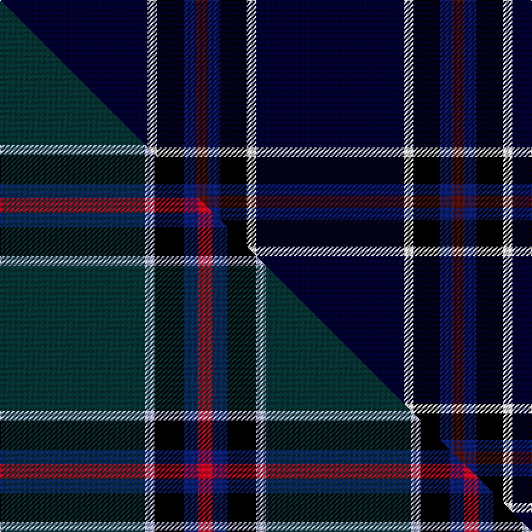

This page is one **sett** — a single exact thread-count. It belongs to the [tartan](/setts/ki61w4k11db5dr5/)
(the same proportion at any scale), whose colour order is pattern [BBKWK](/stripes/bbkwk/).

Part of the [Edinburgh Crystal](/tartans/edinburgh-crystal/) tartan — the named design grouping this sett with its other cloths.

Sourced from weddslist.  It is a [5 stripe tartan](/stripes/stripes5/).

Original link [http://www.weddslist.com/cgi-bin/tartans/pg.pl?source=sts](http://www.weddslist.com/cgi-bin/tartans/pg.pl?source=sts)

Dataset <small>— provenance for this record, inherited from the source manifest</small>

<dl class="dataset-prov">
<dt>source</dt><dd><a href="/sources/weddslist/">Weddslist</a></dd>
<dt>data captured from</dt><dd><a href="https://github.com/thetartan/tartan-database/blob/master/data/weddslist/data.csv">https://github.com/thetartan/tartan-database/blob/master/data/weddslist/data.csv</a></dd>
<dt>data date</dt><dd>2016-11-17 <small>(dataset default)</small></dd>
<dt>licence</dt><dd><a href="https://creativecommons.org/licenses/by-nc-nd/4.0/">CC BY-NC-ND 4.0</a></dd>
</dl>

Capture chain <small>— the hands this data passed through, oldest first; each capture carries its own licence</small>

<ol class="capture-chain">
<li><a href="https://www.weddslist.com/tartans/">Weddslist</a> <small>the living privately compiled reference</small></li>
<li><a href="https://github.com/thetartan/tartan-database">thetartan/tartan-database</a> <small>2016-2017</small> · <a href="https://creativecommons.org/licenses/by-nc-nd/4.0/">CC BY-NC-ND 4.0</a> <small>Levko Kravets's frozen compilation — the capture we vendored, and where its CC licence text came from</small></li>
<li>this dictionary <small>captured 2026-06-10 · commit 5bf86c7566</small> <small>each re-capture is a git commit to data/sources</small></li>
</ol>

## Thread count
Ki/122 W8 K22 DB10 DR/10

One full sett is **212 threads**.

## Palette
<table><thead><tr><th>Colour</th><th>Shade</th><th>OKLCh</th></tr></thead><tbody><tr><td>DB</td><td><code style="background-color:#082077;">#082077</code> <small style="color:#888">#082077</small></td><td><small style="color:#888">oklch(30.0% 0.149 265.1)</small></td></tr><tr><td>K</td><td><code style="background-color:#000030;">#000030</code> <small style="color:#888">#000030</small></td><td><small style="color:#888">oklch(14.0% 0.097 264.1)</small></td></tr><tr><td>DR</td><td><code style="background-color:#55120C;">#55120C</code> <small style="color:#888">#55120C</small></td><td><small style="color:#888">oklch(30.0% 0.099 29.3)</small></td></tr><tr><td>K</td><td><code style="background-color:#000000;">#000000</code> <small style="color:#888">#000000</small></td><td><small style="color:#888">oklch(0.0% 0.000 0.0)</small></td></tr><tr><td>W</td><td><code style="background-color:#F7F7F7;">#F7F7F7</code> <small style="color:#888">#F7F7F7</small></td><td><small style="color:#888">oklch(97.6% 0.000 89.9)</small></td></tr></tbody></table>

# Sample pattern

## Compared to the master

This cloth is one sett of its design; the master sett (the exemplar the design is anchored on) is below for comparison.

Its **ΔTartan distance** from the master is **1.83** — the same measure the nearest-tartans table ranks by (0 is identical; a re-scale of the same cloth is near 0, a recolour or a different proportion further).

<figure class="master-compare" style="margin:0">

this sett
master sett ★

<figcaption style="color:#888;font-size:smaller">One weave of this sett against the <a href="/setts/dt30lb2k6db3r3/">master sett ★</a>, split on the diagonal: a shared proportion runs seamlessly across it with only the shades shifting; a different proportion breaks on it.</figcaption>
</figure>

## Nearest tartan variants

The nearest existing variants by ΔTartan distance, with this cloth at the top so the swatches line up against it.

ΔTartan

Threads

Variant

Sett

—

212

<a href="/variants/s5/ki61w4k11db5dr5~x2~ki0604259/">Edinburgh Crystal</a>

<a href="/ttd/edit/#slug=r1db9k4lb1~x4&amp;base=ki61w4k11db5dr5~x2~ki0604259" title="compare in the TTD">0.94</a>

112

<a href="/variants/s4/r1db9k4lb1~x4/">Scottish Nuclear (Corporate)</a>

<a href="/ttd/edit/#slug=r2k6db33w2~x4&amp;base=ki61w4k11db5dr5~x2~ki0604259" title="compare in the TTD">1.01</a>

328

<a href="/variants/s4/r2k6db33w2~x4/">McCallie</a>

<a href="/ttd/edit/#slug=db14k3dr3w1~x2&amp;base=ki61w4k11db5dr5~x2~ki0604259" title="compare in the TTD">1.02</a>

54

<a href="/variants/s4/db14k3dr3w1~x2/">Bacon, Blue</a>

<a href="/ttd/edit/#slug=r5db58lb4t6y4k4~x2~lb3103284-t2503227&amp;base=ki61w4k11db5dr5~x2~ki0604259" title="compare in the TTD">1.09</a>

306

<a href="/variants/s6/r5db58lb4t6y4k4~x2~lb3103284-t2503227/">Kendle (2013)</a>

<a href="/ttd/edit/#slug=r5db58lb4n6y4k4~x2~db1406275-n2203265&amp;base=ki61w4k11db5dr5~x2~ki0604259" title="compare in the TTD">1.09</a>

306

<a href="/variants/s6/r5db58lb4n6y4k4~x2~db1406275-n2203265/">Kendle (2013)</a>

<a href="/ttd/edit/#slug=db31k8dp4w2~x4&amp;base=ki61w4k11db5dr5~x2~ki0604259" title="compare in the TTD">1.10</a>

228

<a href="/variants/s4/db31k8dp4w2~x4/">Osborne, Luke Alexander (Personal)</a>

<a href="/ttd/edit/#slug=r4db32k15w2~x2&amp;base=ki61w4k11db5dr5~x2~ki0604259" title="compare in the TTD">1.12</a>

200

<a href="/variants/s4/r4db32k15w2~x2/">Scottish Nuclear</a>

<a href="/ttd/edit/#slug=db46k6g9dy9r4&amp;base=ki61w4k11db5dr5~x2~ki0604259" title="compare in the TTD">1.20</a>

98

<a href="/variants/s5/db46k6g9dy9r4/">Ayllu Thuban</a>

<a href="/ttd/edit/#slug=db19r2w2r2k2~x4&amp;base=ki61w4k11db5dr5~x2~ki0604259" title="compare in the TTD">1.32</a>

132

<a href="/variants/s5/db19r2w2r2k2~x4/">Laing of Archiestown</a>

<a href="/ttd/edit/#slug=w2dp2db25r3y3g1~x4&amp;base=ki61w4k11db5dr5~x2~ki0604259" title="compare in the TTD">1.33</a>

276

<a href="/variants/s6/w2dp2db25r3y3g1~x4/">Pool, Robert David (Personal)</a>

## Neighbour map

Every grey dot is one of 13621 variants placed by the first two principal components of the ΔTartan feature space (42% of its variance). Red is this tartan; blue dots are its nearest — click one to open its page.

<svg viewBox="0 0 640 380" role="img" style="max-width:100%;height:auto;border:1px solid #e0e0e0;border-radius:4px;display:block" xmlns="http://www.w3.org/2000/svg"><image href="/nn/cloud.v1.png" width="640" height="380"/><a href="/variants/s4/r1db9k4lb1~x4/"><circle cx="308.5" cy="211.2" r="4" fill="#3465a4"><title>Scottish Nuclear (Corporate)</title></circle></a><a href="/variants/s4/r2k6db33w2~x4/"><circle cx="458.3" cy="161.9" r="4" fill="#3465a4"><title>McCallie</title></circle></a><a href="/variants/s4/db14k3dr3w1~x2/"><circle cx="384.2" cy="193.2" r="4" fill="#3465a4"><title>Bacon, Blue</title></circle></a><a href="/variants/s6/r5db58lb4t6y4k4~x2~lb3103284-t2503227/"><circle cx="395.0" cy="116.0" r="4" fill="#3465a4"><title>Kendle (2013)</title></circle></a><a href="/variants/s6/r5db58lb4n6y4k4~x2~db1406275-n2203265/"><circle cx="411.6" cy="119.3" r="4" fill="#3465a4"><title>Kendle (2013)</title></circle></a><a href="/variants/s4/db31k8dp4w2~x4/"><circle cx="409.8" cy="186.1" r="4" fill="#3465a4"><title>Osborne, Luke Alexander (Personal)</title></circle></a><a href="/variants/s4/r4db32k15w2~x2/"><circle cx="330.3" cy="186.7" r="4" fill="#3465a4"><title>Scottish Nuclear</title></circle></a><a href="/variants/s5/db46k6g9dy9r4/"><circle cx="337.7" cy="177.2" r="4" fill="#3465a4"><title>Ayllu Thuban</title></circle></a><a href="/variants/s5/db19r2w2r2k2~x4/"><circle cx="374.8" cy="165.0" r="4" fill="#3465a4"><title>Laing of Archiestown</title></circle></a><a href="/variants/s6/w2dp2db25r3y3g1~x4/"><circle cx="403.6" cy="109.6" r="4" fill="#3465a4"><title>Pool, Robert David (Personal)</title></circle></a><circle cx="417.3" cy="150.2" r="5" fill="#c00000"/><text x="320" y="376" text-anchor="middle" font-size="11" fill="#999">ground</text><text x="11" y="190" text-anchor="middle" font-size="11" fill="#999" transform="rotate(-90 11 190)">complexity</text></svg>

ID: /variants/s5/ki61w4k11db5dr5~x2~ki0604259/
