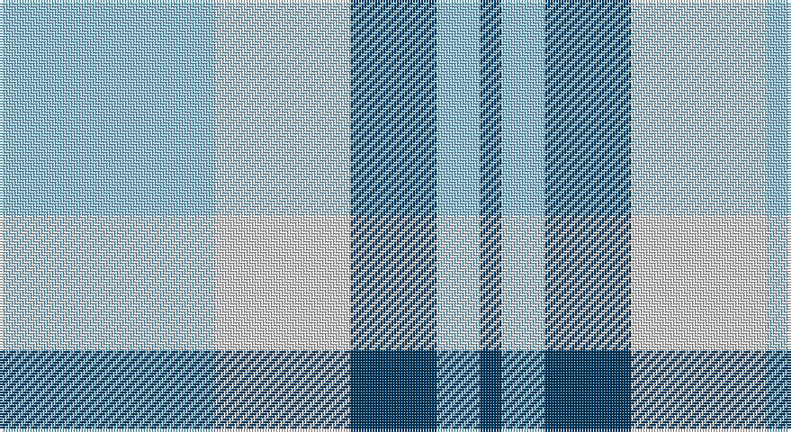

This page is one **sett** — a single exact thread-count. It belongs to the [tartan](/setts/lb40w25dt16lb8dt4/)
(the same proportion at any scale), whose colour order is pattern [BWBWW](/stripes/bwbww/).

Sourced from tartans-authority.  It is a [5 stripe tartan](/stripes/stripes5/).

Original link http://www.tartansauthority.com/tartan-ferret/display/8501/

## Register references

External register numbers recorded for this tartan.

- Scottish Register of Tartans: [8501](https://www.tartanregister.gov.uk/tartanDetails?ref=8501)
- Scottish Tartans Authority (ITI): 8501

## Thread count
LB/80 LN50 DB32 LB16 DB/8

One full sett is **284 threads**.

## Palette

Palette: <strong>Tartan Register</strong>
<table><thead><tr><th>Colour</th><th>Threads</th><th>Shade</th><th>Base</th><th>OKLCh</th></tr></thead><tbody><tr><td>LB/</td><td style="text-align:right;font-variant-numeric:tabular-nums">80</td><td><code style="background-color:#98C8E8;">#98C8E8</code> <small style="color:#888">#98C8E8</small></td><td>W <code style="background-color:#F7F7F7;">#F7F7F7</code></td><td><small style="color:#888">oklch(81.0% 0.068 237.9)</small></td></tr><tr><td>LN</td><td style="text-align:right;font-variant-numeric:tabular-nums">50</td><td><code style="background-color:#E0E0E0;">#E0E0E0</code> <small style="color:#888">#E0E0E0</small></td><td>W <code style="background-color:#F7F7F7;">#F7F7F7</code></td><td><small style="color:#888">oklch(90.7% 0.000 89.9)</small></td></tr><tr><td>DB</td><td style="text-align:right;font-variant-numeric:tabular-nums">32</td><td><code style="background-color:#003C64;">#003C64</code> <small style="color:#888">#003C64</small></td><td>B <code style="background-color:#2A418A;">#2A418A</code></td><td><small style="color:#888">oklch(34.5% 0.089 246.0)</small></td></tr><tr><td>LB</td><td style="text-align:right;font-variant-numeric:tabular-nums">16</td><td><code style="background-color:#98C8E8;">#98C8E8</code> <small style="color:#888">#98C8E8</small></td><td>W <code style="background-color:#F7F7F7;">#F7F7F7</code></td><td><small style="color:#888">oklch(81.0% 0.068 237.9)</small></td></tr><tr><td>DB/</td><td style="text-align:right;font-variant-numeric:tabular-nums">8</td><td><code style="background-color:#003C64;">#003C64</code> <small style="color:#888">#003C64</small></td><td>B <code style="background-color:#2A418A;">#2A418A</code></td><td><small style="color:#888">oklch(34.5% 0.089 246.0)</small></td></tr></tbody></table>

# Sample pattern

## Nearest tartans

The nearest existing variants by ΔTartan distance, with this tartan at the top so the swatches line up against it.

ΔTartan

Tartan

Sett

—

<a href="/ttd/edit/#slug=lb40w25dt16lb8dt4~x2">Louise Beveridge (Personal)</a> <a class="nn-out" href="/variants/s5/lb40w25dt16lb8dt4~x2/" title="open its dictionary page">↗</a>

1.39

<a href="/ttd/edit/#slug=k3w29m9lb19k3~x2&amp;base=lb40w25dt16lb8dt4~x2">Islander Dress</a> <a class="nn-out" href="/variants/s5/k3w29m9lb19k3~x2/" title="open its dictionary page">↗</a>

1.45

<a href="/ttd/edit/#slug=b18w4b3lo12~x2&amp;base=lb40w25dt16lb8dt4~x2">Genesee Community College</a> <a class="nn-out" href="/variants/s4/b18w4b3lo12~x2/" title="open its dictionary page">↗</a>

1.48

<a href="/ttd/edit/#slug=t8db2t24db5w26k2w8~x2&amp;base=lb40w25dt16lb8dt4~x2">Lennox Turquoise Dress District Tartan</a> <a class="nn-out" href="/variants/s7/t8db2t24db5w26k2w8~x2/" title="open its dictionary page">↗</a>

1.62

<a href="/ttd/edit/#slug=w7db16w20db3w3ly3~x2&amp;base=lb40w25dt16lb8dt4~x2">Unidentified (Shirt)</a> <a class="nn-out" href="/variants/s6/w7db16w20db3w3ly3~x2/" title="open its dictionary page">↗</a>

1.62

<a href="/ttd/edit/#slug=w4k2w26t23w3t8p3~x2&amp;base=lb40w25dt16lb8dt4~x2">MacPherson Turquoise Dress Tartan</a> <a class="nn-out" href="/variants/s7/w4k2w26t23w3t8p3~x2/" title="open its dictionary page">↗</a>

1.69

<a href="/ttd/edit/#slug=dt2t2w11t5o5w2dt1t2~x2&amp;base=lb40w25dt16lb8dt4~x2">Conquergood Family Tartan</a> <a class="nn-out" href="/variants/s8/dt2t2w11t5o5w2dt1t2~x2/" title="open its dictionary page">↗</a>

1.72

<a href="/ttd/edit/#slug=dy5r5lb11r1dy1~x4&amp;base=lb40w25dt16lb8dt4~x2">O'Connor Dress</a> <a class="nn-out" href="/variants/s5/dy5r5lb11r1dy1~x4/" title="open its dictionary page">↗</a>

1.85

<a href="/ttd/edit/#slug=w2db1w15t12w1ly3db1~x6&amp;base=lb40w25dt16lb8dt4~x2">St. John's (Corporate)</a> <a class="nn-out" href="/variants/s7/w2db1w15t12w1ly3db1~x6/" title="open its dictionary page">↗</a>

1.88

<a href="/ttd/edit/#slug=t2lb4w1lb4t6lb2t2~x4&amp;base=lb40w25dt16lb8dt4~x2">Langdons (Corporate)</a> <a class="nn-out" href="/variants/s7/t2lb4w1lb4t6lb2t2~x4/" title="open its dictionary page">↗</a>

1.91

<a href="/ttd/edit/#slug=w5r3w26db21w3db8ly3~x2&amp;base=lb40w25dt16lb8dt4~x2">MacPherson, Blue &amp; White</a> <a class="nn-out" href="/variants/s7/w5r3w26db21w3db8ly3~x2/" title="open its dictionary page">↗</a>

## Neighbour map

Every grey dot is one of 14360 variants placed by the first two principal components of the ΔTartan feature space (44% of its variance). Red is this tartan; blue dots are its nearest — click one to open its page.

<svg viewBox="0 0 640 380" role="img" style="max-width:100%;height:auto;border:1px solid #e0e0e0;border-radius:4px;display:block" xmlns="http://www.w3.org/2000/svg"><image href="/nn/cloud.v1.png" width="640" height="380"/><a href="/variants/s5/k3w29m9lb19k3~x2/"><circle cx="215.1" cy="200.8" r="4" fill="#3465a4"><title>Islander Dress</title></circle></a><a href="/variants/s4/b18w4b3lo12~x2/"><circle cx="288.0" cy="268.7" r="4" fill="#3465a4"><title>Genesee Community College</title></circle></a><a href="/variants/s7/t8db2t24db5w26k2w8~x2/"><circle cx="248.9" cy="177.7" r="4" fill="#3465a4"><title>Lennox Turquoise Dress District Tartan</title></circle></a><a href="/variants/s6/w7db16w20db3w3ly3~x2/"><circle cx="285.1" cy="219.6" r="4" fill="#3465a4"><title>Unidentified (Shirt)</title></circle></a><a href="/variants/s7/w4k2w26t23w3t8p3~x2/"><circle cx="277.7" cy="173.1" r="4" fill="#3465a4"><title>MacPherson Turquoise Dress Tartan</title></circle></a><a href="/variants/s8/dt2t2w11t5o5w2dt1t2~x2/"><circle cx="207.3" cy="185.8" r="4" fill="#3465a4"><title>Conquergood Family Tartan</title></circle></a><a href="/variants/s5/dy5r5lb11r1dy1~x4/"><circle cx="272.2" cy="218.6" r="4" fill="#3465a4"><title>O'Connor Dress</title></circle></a><a href="/variants/s7/w2db1w15t12w1ly3db1~x6/"><circle cx="286.3" cy="154.5" r="4" fill="#3465a4"><title>St. John's (Corporate)</title></circle></a><a href="/variants/s7/t2lb4w1lb4t6lb2t2~x4/"><circle cx="259.0" cy="276.0" r="4" fill="#3465a4"><title>Langdons (Corporate)</title></circle></a><a href="/variants/s7/w5r3w26db21w3db8ly3~x2/"><circle cx="240.9" cy="178.8" r="4" fill="#3465a4"><title>MacPherson, Blue &amp; White</title></circle></a><circle cx="261.2" cy="233.2" r="5" fill="#c00000"/></svg>

ID: /variants/s5/lb40w25dt16lb8dt4~x2/
