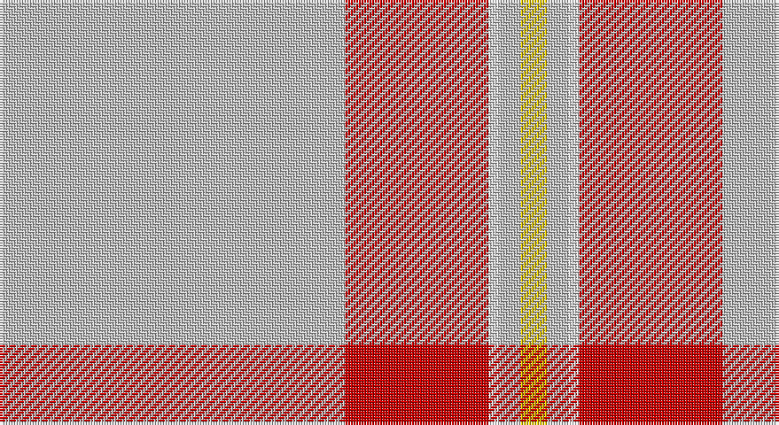

This page is one **sett** — a single exact thread-count. It belongs to the [tartan](/setts/lb65r27w2lb4ly5/)
(the same proportion at any scale), whose colour order is pattern [WRWWY](/stripes/wrwwy/).

Part of the [Perry Arisaid](/tartans/perry-arisaid/) tartan — the named design grouping this sett with its other cloths.

Sourced from register-of-tartans.  It is a [5 stripe tartan](/stripes/stripes5/).

Original link https://www.tartanregister.gov.uk/tartanDetails.aspx?ref=3320

## Also known as

This cloth is also recorded under:

- Perry, Arisaid

2 attestations — the source records this cloth was collapsed from (oldest owns this page)

<ul>
<li>01/01/1982 — Perry Arisaid (Personal) (register-of-tartans, <a href="https://www.tartanregister.gov.uk/tartanDetails.aspx?ref=3320">record</a>)</li>
<li>1982 — Perry Arisaid (Personal) (tartans-authority, <a href="http://www.tartansauthority.com/tartan-ferret/display/1304/">record</a>)</li>
</ul>

## Register references

External register numbers recorded for this tartan.

- Scottish Register of Tartans: [3320](https://www.tartanregister.gov.uk/tartanDetails.aspx?ref=3320)
- Scottish Tartans Authority (ITI): 1304
- Scottish Tartans World Register: 1304

## Thread count
N/130 R54 W4 N8 Y/10

One full sett is **272 threads**.

## Palette

Palette: <strong>Tartan Register</strong>
<table><thead><tr><th>Colour</th><th>Threads</th><th>Shade</th><th>Base</th><th>OKLCh</th></tr></thead><tbody><tr><td>N/</td><td style="text-align:right;font-variant-numeric:tabular-nums">130</td><td><code style="background-color:#C0C0C0;">#C0C0C0</code> <small style="color:#888">#C0C0C0</small></td><td>W <code style="background-color:#F7F7F7;">#F7F7F7</code></td><td><small style="color:#888">oklch(80.8% 0.000 89.9)</small></td></tr><tr><td>R</td><td style="text-align:right;font-variant-numeric:tabular-nums">54</td><td><code style="background-color:#C80000;">#C80000</code> <small style="color:#888">#C80000</small></td><td>R <code style="background-color:#CC0000;">#CC0000</code></td><td><small style="color:#888">oklch(52.3% 0.215 29.2)</small></td></tr><tr><td>W</td><td style="text-align:right;font-variant-numeric:tabular-nums">4</td><td><code style="background-color:#FCFCFC;">#FCFCFC</code> <small style="color:#888">#FCFCFC</small></td><td>W <code style="background-color:#F7F7F7;">#F7F7F7</code></td><td><small style="color:#888">oklch(99.1% 0.000 89.9)</small></td></tr><tr><td>N</td><td style="text-align:right;font-variant-numeric:tabular-nums">8</td><td><code style="background-color:#C0C0C0;">#C0C0C0</code> <small style="color:#888">#C0C0C0</small></td><td>W <code style="background-color:#F7F7F7;">#F7F7F7</code></td><td><small style="color:#888">oklch(80.8% 0.000 89.9)</small></td></tr><tr><td>Y/</td><td style="text-align:right;font-variant-numeric:tabular-nums">10</td><td><code style="background-color:#E8C000;">#E8C000</code> <small style="color:#888">#E8C000</small></td><td>Y <code style="background-color:#F2BF00;">#F2BF00</code></td><td><small style="color:#888">oklch(81.9% 0.168 93.7)</small></td></tr></tbody></table>

# Sample pattern

## Nearest tartans

The nearest existing variants by ΔTartan distance, with this tartan at the top so the swatches line up against it.

ΔTartan

Tartan

Sett

—

<a href="/ttd/edit/#slug=lb65r27w2lb4ly5~x2">Perry Arisaid (Personal)</a> <a class="nn-out" href="/variants/s5/lb65r27w2lb4ly5~x2/" title="open its dictionary page">↗</a>

1.75

<a href="/ttd/edit/#slug=w80t1r14t9r24w2r4~x2&amp;base=lb65r27w2lb4ly5~x2">Unidentified Fisherwife's Plaid</a> <a class="nn-out" href="/variants/s7/w80t1r14t9r24w2r4~x2/" title="open its dictionary page">↗</a>

1.90

<a href="/ttd/edit/#slug=lb48dy15lo2dy3lb2dy3loi12lb8dy2lb6~x2&amp;base=lb65r27w2lb4ly5~x2">Loch Skene (Fashion)</a> <a class="nn-out" href="/variants/s10/lb48dy15lo2dy3lb2dy3loi12lb8dy2lb6~x2/" title="open its dictionary page">↗</a>

1.90

<a href="/ttd/edit/#slug=y65r27w2y4ly5~x2&amp;base=lb65r27w2lb4ly5~x2">Perry, Arisaid</a> <a class="nn-out" href="/variants/s5/y65r27w2y4ly5~x2/" title="open its dictionary page">↗</a>

1.94

<a href="/ttd/edit/#slug=ly8k2r23k1r17k1g4w3~x2&amp;base=lb65r27w2lb4ly5~x2">Hoa Sen</a> <a class="nn-out" href="/variants/s8/ly8k2r23k1r17k1g4w3~x2/" title="open its dictionary page">↗</a>

1.94

<a href="/ttd/edit/#slug=w52r22w6r8k1db3~x2&amp;base=lb65r27w2lb4ly5~x2">MacGregor Dress Red (Dance)</a> <a class="nn-out" href="/variants/s6/w52r22w6r8k1db3~x2/" title="open its dictionary page">↗</a>

2.00

<a href="/ttd/edit/#slug=w24w1y9w1w9w2y2k2~x2&amp;base=lb65r27w2lb4ly5~x2">Gairloch (Fashion)</a> <a class="nn-out" href="/variants/s8/w24w1y9w1w9w2y2k2~x2/" title="open its dictionary page">↗</a>

2.00

<a href="/ttd/edit/#slug=w54k7r7lo6ly4r1~x2&amp;base=lb65r27w2lb4ly5~x2">Young, Christina</a> <a class="nn-out" href="/variants/s6/w54k7r7lo6ly4r1~x2/" title="open its dictionary page">↗</a>

2.02

<a href="/ttd/edit/#slug=w57k1r12w1g12r14w1r2~x2&amp;base=lb65r27w2lb4ly5~x2">McBrayer Dress</a> <a class="nn-out" href="/variants/s8/w57k1r12w1g12r14w1r2~x2/" title="open its dictionary page">↗</a>

2.09

<a href="/ttd/edit/#slug=w75o1r18g9o1r27w2r5~x2&amp;base=lb65r27w2lb4ly5~x2">Unidentified, Ross-shire</a> <a class="nn-out" href="/variants/s8/w75o1r18g9o1r27w2r5~x2/" title="open its dictionary page">↗</a>

2.12

<a href="/ttd/edit/#slug=w75dy1r18dg9dy1r27w2r5~x2&amp;base=lb65r27w2lb4ly5~x2">Unidentified Ross-shire</a> <a class="nn-out" href="/variants/s8/w75dy1r18dg9dy1r27w2r5~x2/" title="open its dictionary page">↗</a>

## Neighbour map

Every grey dot is one of 14360 variants placed by the first two principal components of the ΔTartan feature space (44% of its variance). Red is this tartan; blue dots are its nearest — click one to open its page.

<svg viewBox="0 0 640 380" role="img" style="max-width:100%;height:auto;border:1px solid #e0e0e0;border-radius:4px;display:block" xmlns="http://www.w3.org/2000/svg"><image href="/nn/cloud.v1.png" width="640" height="380"/><a href="/variants/s7/w80t1r14t9r24w2r4~x2/"><circle cx="435.1" cy="100.9" r="4" fill="#3465a4"><title>Unidentified Fisherwife's Plaid</title></circle></a><a href="/variants/s10/lb48dy15lo2dy3lb2dy3loi12lb8dy2lb6~x2/"><circle cx="388.1" cy="107.8" r="4" fill="#3465a4"><title>Loch Skene (Fashion)</title></circle></a><a href="/variants/s5/y65r27w2y4ly5~x2/"><circle cx="507.0" cy="174.4" r="4" fill="#3465a4"><title>Perry, Arisaid</title></circle></a><a href="/variants/s8/ly8k2r23k1r17k1g4w3~x2/"><circle cx="382.4" cy="111.9" r="4" fill="#3465a4"><title>Hoa Sen</title></circle></a><a href="/variants/s6/w52r22w6r8k1db3~x2/"><circle cx="403.0" cy="91.3" r="4" fill="#3465a4"><title>MacGregor Dress Red (Dance)</title></circle></a><a href="/variants/s8/w24w1y9w1w9w2y2k2~x2/"><circle cx="461.8" cy="131.0" r="4" fill="#3465a4"><title>Gairloch (Fashion)</title></circle></a><a href="/variants/s6/w54k7r7lo6ly4r1~x2/"><circle cx="414.3" cy="72.0" r="4" fill="#3465a4"><title>Young, Christina</title></circle></a><a href="/variants/s8/w57k1r12w1g12r14w1r2~x2/"><circle cx="390.2" cy="73.9" r="4" fill="#3465a4"><title>McBrayer Dress</title></circle></a><a href="/variants/s8/w75o1r18g9o1r27w2r5~x2/"><circle cx="377.7" cy="75.9" r="4" fill="#3465a4"><title>Unidentified, Ross-shire</title></circle></a><a href="/variants/s8/w75dy1r18dg9dy1r27w2r5~x2/"><circle cx="379.0" cy="74.3" r="4" fill="#3465a4"><title>Unidentified Ross-shire</title></circle></a><circle cx="459.3" cy="143.2" r="5" fill="#c00000"/></svg>

ID: /variants/s5/lb65r27w2lb4ly5~x2/
