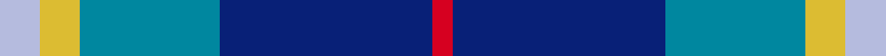

This is one **variant** — a specific cloth: this exact thread count and colourway, with its own
provenance below. It is one weaving of the [sett](/tartans/j/ja/jamieson-robert/) (the scale-free proportion — the
same cloth at any scale or shade), whose colour order is pattern [RBBYW](/stripes/rbbyw/).

Part of the [Jamieson, Robert](/tartans/j/ja/jamieson-robert/) tartan — the named design grouping this sett with its other cloths.

Sourced from tartans-authority.  It is a [5 stripe tartan](/stripes/stripes5/).

Original link <code>http://www.tartansauthority.com/tartan-ferret/display/8549/</code> — retired · [Internet Archive copy](https://web.archive.org/web/*/http://www.tartansauthority.com/tartan-ferret/display/8549/*)

Dataset <small>— provenance for this record, inherited from the source manifest</small>

<dl class="dataset-prov">
<dt>source</dt><dd><a href="/sources/tartans-authority/">Scottish Tartans Authority</a></dd>
<dt>data captured from</dt><dd><a href="https://github.com/thetartan/tartan-database/blob/master/data/tartans-authority/data.csv">https://github.com/thetartan/tartan-database/blob/master/data/tartans-authority/data.csv</a></dd>
<dt>data date</dt><dd>6th Jan. 2011 <small>(this record)</small></dd>
<dt>licence</dt><dd><a href="https://creativecommons.org/licenses/by-nc-nd/4.0/">CC BY-NC-ND 4.0</a></dd>
</dl>

Capture chain <small>— the hands this data passed through, oldest first; each capture carries its own licence</small>

<ol class="capture-chain">
<li><a href="https://www.tartansauthority.com/">Scottish Tartans Authority</a> <small>the heritage body’s archive — its tartan-ferret record browser is retired; dead record links are shown unlinked, with an Internet Archive copy (ITI numbers are not SRT references)</small></li>
<li><a href="https://github.com/thetartan/tartan-database">thetartan/tartan-database</a> <small>2016-2017</small> · <a href="https://creativecommons.org/licenses/by-nc-nd/4.0/">CC BY-NC-ND 4.0</a> <small>Levko Kravets's frozen compilation — the capture we vendored, and where its CC licence text came from</small></li>
<li>this dictionary <small>captured 2026-06-10 · commit 5bf86c7566</small> <small>each re-capture is a git commit to data/sources</small></li>
</ol>

## Register references

External register numbers recorded for this tartan.

- Scottish Register of Tartans: [8549](https://www.tartanregister.gov.uk/tartanDetails?ref=8549)
- Scottish Tartans Authority (ITI): 8549

## Thread count
LB/12 LY12 T42 DB64 R/6

One full sett is **254 threads**.

## Palette
<table><thead><tr><th>Colour</th><th>Shade</th><th>OKLCh</th></tr></thead><tbody><tr><td>T</td><td><code style="background-color:#00879F;">#00879F</code> <small style="color:#888">#00879F</small></td><td><small style="color:#888">oklch(57.4% 0.102 216.1)</small></td></tr><tr><td>DB</td><td><code style="background-color:#082077;">#082077</code> <small style="color:#888">#082077</small></td><td><small style="color:#888">oklch(30.0% 0.149 265.1)</small></td></tr><tr><td>LY</td><td><code style="background-color:#DCBC32;">#DCBC32</code> <small style="color:#888">#DCBC32</small></td><td><small style="color:#888">oklch(80.0% 0.150 95.2)</small></td></tr><tr><td>LB</td><td><code style="background-color:#B5BBDE;">#B5BBDE</code> <small style="color:#888">#B5BBDE</small></td><td><small style="color:#888">oklch(79.9% 0.050 277.6)</small></td></tr><tr><td>R</td><td><code style="background-color:#D60020;">#D60020</code> <small style="color:#888">#D60020</small></td><td><small style="color:#888">oklch(55.2% 0.224 25.5)</small></td></tr></tbody></table>

# Sample pattern

[Sample sheet (PDF)](swatch.pdf) — the woven sample, thread count and palette on one printable A4, rendered on demand (the same sheet the TTD print page downloads).

## Nearest tartan variants

The nearest existing variants by ΔTartan distance, with this cloth at the top so the swatches line up against it.

ΔTartan

Threads

Variant

Sett

—

254

<a href="/variants/s5/lb6ly6t21db32r3~x2/">Jamieson, Robert (Personal)</a>

<a href="/ttd/edit/#slug=dy16r8t57db56lb8&amp;base=lb6ly6t21db32r3~x2" title="compare in the TTD">1.10</a>

266

<a href="/variants/s5/dy16r8t57db56lb8/">Bryson (1988)</a>

<a href="/ttd/edit/#slug=w2dbi15n2db20r9w2~x2~dbi3911270-db1913264&amp;base=lb6ly6t21db32r3~x2" title="compare in the TTD">1.24</a>

192

<a href="/variants/s6/w2dbi15n2db20r9w2~x2~dbi3911270-db1913264/">The Open Championship</a>

<a href="/ttd/edit/#slug=r21b43dt86w10~b3826264-dt2907282&amp;base=lb6ly6t21db32r3~x2" title="compare in the TTD">1.36</a>

289

<a href="/variants/s4/r21b43dt86w10~b3826264-dt2907282/">Fong Wedding (Personal)</a>

<a href="/ttd/edit/#slug=w4lb44dbi19db44r2~x2~dbi3510255-db2508270&amp;base=lb6ly6t21db32r3~x2" title="compare in the TTD">1.44</a>

440

<a href="/variants/s5/w4lb44dbi19db44r2~x2~dbi3510255-db2508270/">World Federation of Building Contractors</a>

<a href="/ttd/edit/#slug=r21db43dbi86w10~db2616276-dbi3409246&amp;base=lb6ly6t21db32r3~x2" title="compare in the TTD">1.45</a>

289

<a href="/variants/s4/r21db43dbi86w10~db2616276-dbi3409246/">Fong (Personal)</a>

<a href="/ttd/edit/#slug=w3db2dbi15lb15r2~x4~db3409246-dbi3514276&amp;base=lb6ly6t21db32r3~x2" title="compare in the TTD">1.54</a>

276

<a href="/variants/s5/w3db2dbi15lb15r2~x4~db3409246-dbi3514276/">SABA</a>

<a href="/ttd/edit/#slug=k4n4db32r4b17w2~x2~db3409246-b6306264&amp;base=lb6ly6t21db32r3~x2" title="compare in the TTD">1.64</a>

240

<a href="/variants/s6/k4n4db32r4b17w2~x2~db3409246-b6306264/">Shearer (2016)</a>

<a href="/ttd/edit/#slug=y2b9r2db6y1r1~x4~b4726264-db2719264&amp;base=lb6ly6t21db32r3~x2" title="compare in the TTD">1.65</a>

156

<a href="/variants/s6/y2b9r2db6y1r1~x4~b4726264-db2719264/">Lauder Primary School</a>

<a href="/ttd/edit/#slug=db13y2r4g2lb8w2~x6&amp;base=lb6ly6t21db32r3~x2" title="compare in the TTD">1.67</a>

282

<a href="/variants/s6/db13y2r4g2lb8w2~x6/">Meh Dundee</a>

<a href="/ttd/edit/#slug=lb8r3dbi29db29lb4~x2~dbi3912267-db2508270&amp;base=lb6ly6t21db32r3~x2" title="compare in the TTD">1.75</a>

268

<a href="/variants/s5/lb8r3dbi29db29lb4~x2~dbi3912267-db2508270/">Bryson</a>

## Neighbour map

Every grey dot is one of 13662 variants placed by the first two principal components of the ΔTartan feature space (42% of its variance). Red is this tartan; blue dots are its nearest — click one to open its page. The map is a flat projection of a many-dimensional space — [how to read it](/posts/neighbourhood-maps/).

<svg viewBox="0 0 640 380" role="img" style="max-width:100%;height:auto;border:1px solid #e0e0e0;border-radius:4px;display:block" xmlns="http://www.w3.org/2000/svg"><image href="/nn/cloud.v1.png" width="640" height="380"/><a href="/variants/s5/dy16r8t57db56lb8/"><circle cx="224.5" cy="240.4" r="4" fill="#3465a4"><title>Bryson (1988)</title></circle></a><a href="/variants/s6/w2dbi15n2db20r9w2~x2~dbi3911270-db1913264/"><circle cx="192.7" cy="196.6" r="4" fill="#3465a4"><title>The Open Championship</title></circle></a><a href="/variants/s4/r21b43dt86w10~b3826264-dt2907282/"><circle cx="291.5" cy="244.1" r="4" fill="#3465a4"><title>Fong Wedding (Personal)</title></circle></a><a href="/variants/s5/w4lb44dbi19db44r2~x2~dbi3510255-db2508270/"><circle cx="217.4" cy="178.5" r="4" fill="#3465a4"><title>World Federation of Building Contractors</title></circle></a><a href="/variants/s4/r21db43dbi86w10~db2616276-dbi3409246/"><circle cx="304.9" cy="250.8" r="4" fill="#3465a4"><title>Fong (Personal)</title></circle></a><a href="/variants/s5/w3db2dbi15lb15r2~x4~db3409246-dbi3514276/"><circle cx="208.6" cy="221.2" r="4" fill="#3465a4"><title>SABA</title></circle></a><a href="/variants/s6/k4n4db32r4b17w2~x2~db3409246-b6306264/"><circle cx="251.0" cy="147.4" r="4" fill="#3465a4"><title>Shearer (2016)</title></circle></a><a href="/variants/s6/y2b9r2db6y1r1~x4~b4726264-db2719264/"><circle cx="239.3" cy="221.5" r="4" fill="#3465a4"><title>Lauder Primary School</title></circle></a><a href="/variants/s6/db13y2r4g2lb8w2~x6/"><circle cx="143.4" cy="200.5" r="4" fill="#3465a4"><title>Meh Dundee</title></circle></a><a href="/variants/s5/lb8r3dbi29db29lb4~x2~dbi3912267-db2508270/"><circle cx="260.6" cy="236.3" r="4" fill="#3465a4"><title>Bryson</title></circle></a><circle cx="241.4" cy="212.4" r="5" fill="#c00000"/><text x="320" y="376" text-anchor="middle" font-size="11" fill="#999">ground</text><text x="11" y="190" text-anchor="middle" font-size="11" fill="#999" transform="rotate(-90 11 190)">complexity</text></svg>

ID: /variants/s5/lb6ly6t21db32r3~x2/
