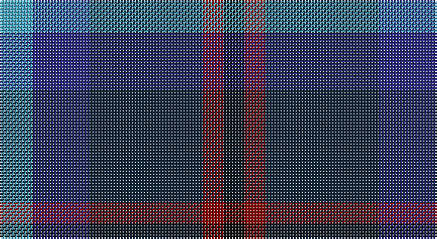

This page is one **sett** — a single exact thread-count. It belongs to the [tartan](/setts/lg11db19dt38r7k7/)
(the same proportion at any scale), whose colour order is pattern [KRBBY](/stripes/krbby/).

Sourced from tartans-authority.  It is a [5 stripe tartan](/stripes/stripes5/).

Original link http://www.tartansauthority.com/tartan-ferret/display/11219/

## Register references

External register numbers recorded for this tartan.

- Scottish Register of Tartans: [11219](https://www.tartanregister.gov.uk/tartanDetails?ref=11219)
- Scottish Tartans Authority (ITI): 11219

## Thread count
B/22 DB38 DN76 DR14 K/14

One full sett is **292 threads**.

## Palette

Palette: <strong>Tartan Register</strong>
<table><thead><tr><th>Colour</th><th>Threads</th><th>Shade</th><th>Base</th><th>OKLCh</th></tr></thead><tbody><tr><td>B/</td><td style="text-align:right;font-variant-numeric:tabular-nums">22</td><td><code style="background-color:#48A4C0;">#48A4C0</code> <small style="color:#888">#48A4C0</small></td><td>Y <code style="background-color:#F2BF00;">#F2BF00</code></td><td><small style="color:#888">oklch(67.5% 0.096 221.0)</small></td></tr><tr><td>DB</td><td style="text-align:right;font-variant-numeric:tabular-nums">38</td><td><code style="background-color:#2C2C80;">#2C2C80</code> <small style="color:#888">#2C2C80</small></td><td>B <code style="background-color:#2A418A;">#2A418A</code></td><td><small style="color:#888">oklch(35.0% 0.138 276.6)</small></td></tr><tr><td>DN</td><td style="text-align:right;font-variant-numeric:tabular-nums">76</td><td><code style="background-color:#14283C;">#14283C</code> <small style="color:#888">#14283C</small></td><td>B <code style="background-color:#2A418A;">#2A418A</code></td><td><small style="color:#888">oklch(27.1% 0.046 249.9)</small></td></tr><tr><td>DR</td><td style="text-align:right;font-variant-numeric:tabular-nums">14</td><td><code style="background-color:#880000;">#880000</code> <small style="color:#888">#880000</small></td><td>R <code style="background-color:#CC0000;">#CC0000</code></td><td><small style="color:#888">oklch(39.4% 0.162 29.2)</small></td></tr><tr><td>K/</td><td style="text-align:right;font-variant-numeric:tabular-nums">14</td><td><code style="background-color:#101010;">#101010</code> <small style="color:#888">#101010</small></td><td>K <code style="background-color:#000000;">#000000</code></td><td><small style="color:#888">oklch(17.3% 0.000 89.9)</small></td></tr></tbody></table>

# Sample pattern

## Nearest tartans

The nearest existing variants by ΔTartan distance, with this tartan at the top so the swatches line up against it.

ΔTartan

Tartan

Sett

—

<a href="/ttd/edit/#slug=lg11db19dt38r7k7~x2">Rose, Danny and Hanna (Personal)</a> <a class="nn-out" href="/variants/s5/lg11db19dt38r7k7~x2/" title="open its dictionary page">↗</a>

1.24

<a href="/ttd/edit/#slug=r2db12k7g8t2~x4&amp;base=lg11db19dt38r7k7~x2">Forbo Nairn</a> <a class="nn-out" href="/variants/s5/r2db12k7g8t2~x4/" title="open its dictionary page">↗</a>

1.34

<a href="/ttd/edit/#slug=k2dg8db2k9dp7k2~x2&amp;base=lg11db19dt38r7k7~x2">Campbell, Sir Walter Scott</a> <a class="nn-out" href="/variants/s6/k2dg8db2k9dp7k2~x2/" title="open its dictionary page">↗</a>

1.36

<a href="/ttd/edit/#slug=r5db8k5db24k24yi24y5~x2&amp;base=lg11db19dt38r7k7~x2">Heritage (Corporate)</a> <a class="nn-out" href="/variants/s7/r5db8k5db24k24yi24y5~x2/" title="open its dictionary page">↗</a>

1.39

<a href="/ttd/edit/#slug=db2k2db12k8dg11r2~x2&amp;base=lg11db19dt38r7k7~x2">Murray #3</a> <a class="nn-out" href="/variants/s6/db2k2db12k8dg11r2~x2/" title="open its dictionary page">↗</a>

1.40

<a href="/ttd/edit/#slug=n6k6n21k16db36ly4&amp;base=lg11db19dt38r7k7~x2">Bareback (Corporate)</a> <a class="nn-out" href="/variants/s6/n6k6n21k16db36ly4/" title="open its dictionary page">↗</a>

1.44

<a href="/ttd/edit/#slug=db31b4db5k19g20lo4~x2&amp;base=lg11db19dt38r7k7~x2">Midlothian</a> <a class="nn-out" href="/variants/s6/db31b4db5k19g20lo4~x2/" title="open its dictionary page">↗</a>

1.44

<a href="/ttd/edit/#slug=db15dp3db30k22dg18dp3dg3w3~x2&amp;base=lg11db19dt38r7k7~x2">Moray (Corporate)</a> <a class="nn-out" href="/variants/s8/db15dp3db30k22dg18dp3dg3w3~x2/" title="open its dictionary page">↗</a>

1.46

<a href="/ttd/edit/#slug=dg5b2dg9dt19r9ly2~x2&amp;base=lg11db19dt38r7k7~x2">Lyle and Scott</a> <a class="nn-out" href="/variants/s6/dg5b2dg9dt19r9ly2~x2/" title="open its dictionary page">↗</a>

1.46

<a href="/ttd/edit/#slug=k6dg11w2db22r2k4~x2&amp;base=lg11db19dt38r7k7~x2">Leslie Hebridean Artifact Tartan</a> <a class="nn-out" href="/variants/s6/k6dg11w2db22r2k4~x2/" title="open its dictionary page">↗</a>

1.47

<a href="/ttd/edit/#slug=db16gi8dbi8gi8db16r3dy3g3~x2&amp;base=lg11db19dt38r7k7~x2">Glen Erin Canadian Tartan</a> <a class="nn-out" href="/variants/s8/db16gi8dbi8gi8db16r3dy3g3~x2/" title="open its dictionary page">↗</a>

## Neighbour map

Every grey dot is one of 14360 variants placed by the first two principal components of the ΔTartan feature space (44% of its variance). Red is this tartan; blue dots are its nearest — click one to open its page.

<svg viewBox="0 0 640 380" role="img" style="max-width:100%;height:auto;border:1px solid #e0e0e0;border-radius:4px;display:block" xmlns="http://www.w3.org/2000/svg"><image href="/nn/cloud.v1.png" width="640" height="380"/><a href="/variants/s5/r2db12k7g8t2~x4/"><circle cx="159.8" cy="258.2" r="4" fill="#3465a4"><title>Forbo Nairn</title></circle></a><a href="/variants/s6/k2dg8db2k9dp7k2~x2/"><circle cx="224.1" cy="294.6" r="4" fill="#3465a4"><title>Campbell, Sir Walter Scott</title></circle></a><a href="/variants/s7/r5db8k5db24k24yi24y5~x2/"><circle cx="154.6" cy="256.1" r="4" fill="#3465a4"><title>Heritage (Corporate)</title></circle></a><a href="/variants/s6/db2k2db12k8dg11r2~x2/"><circle cx="217.5" cy="273.5" r="4" fill="#3465a4"><title>Murray #3</title></circle></a><a href="/variants/s6/n6k6n21k16db36ly4/"><circle cx="233.0" cy="241.5" r="4" fill="#3465a4"><title>Bareback (Corporate)</title></circle></a><a href="/variants/s6/db31b4db5k19g20lo4~x2/"><circle cx="191.0" cy="227.8" r="4" fill="#3465a4"><title>Midlothian</title></circle></a><a href="/variants/s8/db15dp3db30k22dg18dp3dg3w3~x2/"><circle cx="255.2" cy="218.0" r="4" fill="#3465a4"><title>Moray (Corporate)</title></circle></a><a href="/variants/s6/dg5b2dg9dt19r9ly2~x2/"><circle cx="220.3" cy="226.4" r="4" fill="#3465a4"><title>Lyle and Scott</title></circle></a><a href="/variants/s6/k6dg11w2db22r2k4~x2/"><circle cx="261.4" cy="208.8" r="4" fill="#3465a4"><title>Leslie Hebridean Artifact Tartan</title></circle></a><a href="/variants/s8/db16gi8dbi8gi8db16r3dy3g3~x2/"><circle cx="200.6" cy="240.5" r="4" fill="#3465a4"><title>Glen Erin Canadian Tartan</title></circle></a><circle cx="219.2" cy="264.1" r="5" fill="#c00000"/></svg>

ID: /variants/s5/lg11db19dt38r7k7~x2/
