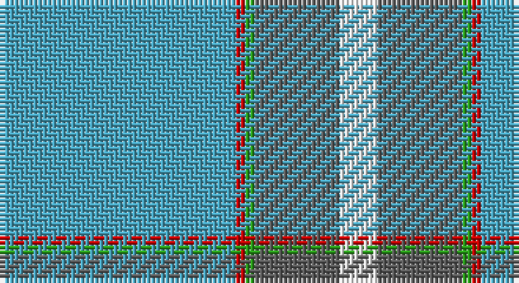

This page is one **sett** — a single exact thread-count. It belongs to the [tartan](/setts/lg25r1g1n9w4/)
(the same proportion at any scale), whose colour order is pattern [WBGRY](/stripes/wbgry/).

Part of the [Tailor Ishida, Kobe](/tartans/tailor-ishida-kobe/) tartan — the named design grouping this sett with its other cloths.

Sourced from tartans-authority.  It is a [5 stripe tartan](/stripes/stripes5/).

Original link http://www.tartansauthority.com/tartan-ferret/display/11042/

## Register references

External register numbers recorded for this tartan.

- Scottish Register of Tartans: [11042](https://www.tartanregister.gov.uk/tartanDetails?ref=11042)
- Scottish Tartans Authority (ITI): 11042

## Thread count
B/50 R2 G2 N18 W/8

One full sett is **102 threads**.

## Palette

Palette: <strong>Tartan Register</strong> <small style="color:#888">(4 of 5 colours)</small>
<table><thead><tr><th>Colour</th><th>Threads</th><th>Shade</th><th>Base</th><th>OKLCh</th></tr></thead><tbody><tr><td>B/</td><td style="text-align:right;font-variant-numeric:tabular-nums">50</td><td><code style="background-color:#48A4C0;">#48A4C0</code> <small style="color:#888">#48A4C0</small></td><td>Y <code style="background-color:#F2BF00;">#F2BF00</code></td><td><small style="color:#888">oklch(67.5% 0.096 221.0)</small></td></tr><tr><td>R</td><td style="text-align:right;font-variant-numeric:tabular-nums">2</td><td><code style="background-color:#C80000;">#C80000</code> <small style="color:#888">#C80000</small></td><td>R <code style="background-color:#CC0000;">#CC0000</code></td><td><small style="color:#888">oklch(52.3% 0.215 29.2)</small></td></tr><tr><td>G</td><td style="text-align:right;font-variant-numeric:tabular-nums">2</td><td><code style="background-color:#289C18;">#289C18</code> <small style="color:#888">#289C18</small></td><td>G <code style="background-color:#006100;">#006100</code></td><td><small style="color:#888">oklch(60.6% 0.191 141.6)</small></td></tr><tr><td>N</td><td style="text-align:right;font-variant-numeric:tabular-nums">18</td><td><code style="background-color:#5C5C5C;">#5C5C5C</code> <small style="color:#888">#5C5C5C</small></td><td>B <code style="background-color:#2A418A;">#2A418A</code></td><td><small style="color:#888">oklch(47.5% 0.000 89.9)</small></td></tr><tr><td>W/</td><td style="text-align:right;font-variant-numeric:tabular-nums">8</td><td><code style="background-color:#FCFCFC;">#FCFCFC</code> <small style="color:#888">#FCFCFC</small></td><td>W <code style="background-color:#F7F7F7;">#F7F7F7</code></td><td><small style="color:#888">oklch(99.1% 0.000 89.9)</small></td></tr></tbody></table>

# Sample pattern

## Compared to the master

This cloth is one sett of its design; the master sett (the exemplar the design is anchored on) is below for comparison.

<figure style="margin:0"><figcaption style="color:#888;font-size:smaller">this sett</figcaption></figure>
<figure style="margin:0"><figcaption style="color:#888;font-size:smaller"><a href="/setts/lg25r1ly1n9w4/">master sett →</a></figcaption></figure>

## Nearest tartans

The nearest existing variants by ΔTartan distance, with this tartan at the top so the swatches line up against it.

ΔTartan

Tartan

Sett

—

<a href="/ttd/edit/#slug=lg25r1g1n9w4~x2">Tailor Ishida, Kobe</a> <a class="nn-out" href="/variants/s5/lg25r1g1n9w4~x2/" title="open its dictionary page">↗</a>

0.11

<a href="/ttd/edit/#slug=lg25r1ly1n9w4~x2&amp;base=lg25r1g1n9w4~x2">Tailor Ishida, Kobe</a> <a class="nn-out" href="/variants/s5/lg25r1ly1n9w4~x2/" title="open its dictionary page">↗</a>

1.25

<a href="/ttd/edit/#slug=k2t28g7w3r2~x2&amp;base=lg25r1g1n9w4~x2">Cleland Corporate Tartan</a> <a class="nn-out" href="/variants/s5/k2t28g7w3r2~x2/" title="open its dictionary page">↗</a>

1.27

<a href="/ttd/edit/#slug=k2t36dg12w3r2~x2&amp;base=lg25r1g1n9w4~x2">Cleland (Name)</a> <a class="nn-out" href="/variants/s5/k2t36dg12w3r2~x2/" title="open its dictionary page">↗</a>

1.39

<a href="/ttd/edit/#slug=k2w1g5r1t18r2~x2&amp;base=lg25r1g1n9w4~x2">Norris (1998) (Name)</a> <a class="nn-out" href="/variants/s6/k2w1g5r1t18r2~x2/" title="open its dictionary page">↗</a>

1.40

<a href="/ttd/edit/#slug=lb5dy6w2g7w2b44w2~x2&amp;base=lg25r1g1n9w4~x2">Leblant-Macqueron (Personal)</a> <a class="nn-out" href="/variants/s7/lb5dy6w2g7w2b44w2~x2/" title="open its dictionary page">↗</a>

1.40

<a href="/ttd/edit/#slug=k2n36g12w3r2~x2&amp;base=lg25r1g1n9w4~x2">Cleland</a> <a class="nn-out" href="/variants/s5/k2n36g12w3r2~x2/" title="open its dictionary page">↗</a>

1.46

<a href="/ttd/edit/#slug=k2w1o8r1t28r2~x2&amp;base=lg25r1g1n9w4~x2">Norris Hunting</a> <a class="nn-out" href="/variants/s6/k2w1o8r1t28r2~x2/" title="open its dictionary page">↗</a>

1.56

<a href="/ttd/edit/#slug=w8r6lo2g34b3~x2&amp;base=lg25r1g1n9w4~x2">Milling-Kristensen (Personal)</a> <a class="nn-out" href="/variants/s5/w8r6lo2g34b3~x2/" title="open its dictionary page">↗</a>

1.57

<a href="/ttd/edit/#slug=t72r16k5ly2dt16~x2&amp;base=lg25r1g1n9w4~x2">Thomas, Jean Marc (Personal)</a> <a class="nn-out" href="/variants/s5/t72r16k5ly2dt16~x2/" title="open its dictionary page">↗</a>

1.60

<a href="/ttd/edit/#slug=w15ly2dt5lr3t40dt10&amp;base=lg25r1g1n9w4~x2">Herriot (New Zealand) (Name)</a> <a class="nn-out" href="/variants/s6/w15ly2dt5lr3t40dt10/" title="open its dictionary page">↗</a>

## Neighbour map

Every grey dot is one of 14360 variants placed by the first two principal components of the ΔTartan feature space (44% of its variance). Red is this tartan; blue dots are its nearest — click one to open its page.

<svg viewBox="0 0 640 380" role="img" style="max-width:100%;height:auto;border:1px solid #e0e0e0;border-radius:4px;display:block" xmlns="http://www.w3.org/2000/svg"><image href="/nn/cloud.v1.png" width="640" height="380"/><a href="/variants/s5/lg25r1ly1n9w4~x2/"><circle cx="390.2" cy="161.7" r="4" fill="#3465a4"><title>Tailor Ishida, Kobe</title></circle></a><a href="/variants/s5/k2t28g7w3r2~x2/"><circle cx="395.0" cy="179.5" r="4" fill="#3465a4"><title>Cleland Corporate Tartan</title></circle></a><a href="/variants/s5/k2t36dg12w3r2~x2/"><circle cx="399.3" cy="169.9" r="4" fill="#3465a4"><title>Cleland (Name)</title></circle></a><a href="/variants/s6/k2w1g5r1t18r2~x2/"><circle cx="367.5" cy="156.5" r="4" fill="#3465a4"><title>Norris (1998) (Name)</title></circle></a><a href="/variants/s7/lb5dy6w2g7w2b44w2~x2/"><circle cx="398.8" cy="138.3" r="4" fill="#3465a4"><title>Leblant-Macqueron (Personal)</title></circle></a><a href="/variants/s5/k2n36g12w3r2~x2/"><circle cx="406.0" cy="177.8" r="4" fill="#3465a4"><title>Cleland</title></circle></a><a href="/variants/s6/k2w1o8r1t28r2~x2/"><circle cx="453.3" cy="152.0" r="4" fill="#3465a4"><title>Norris Hunting</title></circle></a><a href="/variants/s5/w8r6lo2g34b3~x2/"><circle cx="367.9" cy="169.8" r="4" fill="#3465a4"><title>Milling-Kristensen (Personal)</title></circle></a><a href="/variants/s5/t72r16k5ly2dt16~x2/"><circle cx="410.6" cy="146.2" r="4" fill="#3465a4"><title>Thomas, Jean Marc (Personal)</title></circle></a><a href="/variants/s6/w15ly2dt5lr3t40dt10/"><circle cx="294.2" cy="153.3" r="4" fill="#3465a4"><title>Herriot (New Zealand) (Name)</title></circle></a><circle cx="391.7" cy="163.4" r="5" fill="#c00000"/></svg>

ID: /variants/s5/lg25r1g1n9w4~x2/
