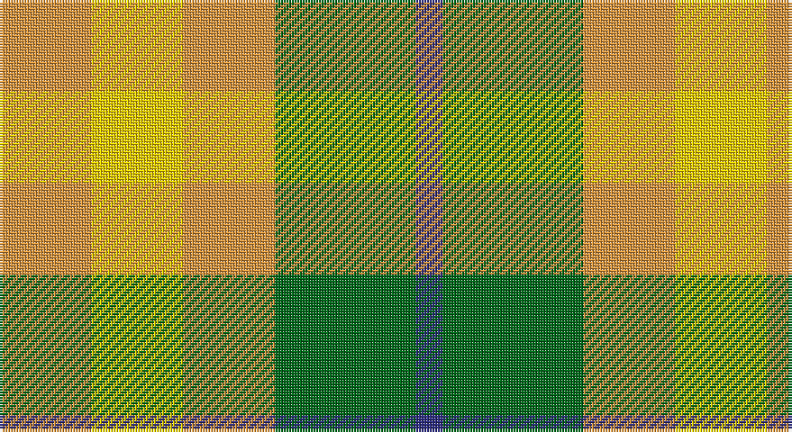

This page is one **sett** — a single exact thread-count. It belongs to the [tartan](/setts/lo17ly17lo17g26db5/)
(the same proportion at any scale), whose colour order is pattern [BGYYY](/stripes/bgyyy/).

Sourced from tartans-authority.  It is a [5 stripe tartan](/stripes/stripes5/).

Original link http://www.tartansauthority.com/tartan-ferret/display/10933/

## Register references

External register numbers recorded for this tartan.

- Scottish Register of Tartans: [10933](https://www.tartanregister.gov.uk/tartanDetails?ref=10933)
- Scottish Tartans Authority (ITI): 10933

## Thread count
O/34 Y34 O34 G52 DB/10

One full sett is **284 threads**.

## Palette

Palette: <strong>Tartan Register</strong>
<table><thead><tr><th>Colour</th><th>Threads</th><th>Shade</th><th>Base</th><th>OKLCh</th></tr></thead><tbody><tr><td>O/</td><td style="text-align:right;font-variant-numeric:tabular-nums">34</td><td><code style="background-color:#DC943C;">#DC943C</code> <small style="color:#888">#DC943C</small></td><td>Y <code style="background-color:#F2BF00;">#F2BF00</code></td><td><small style="color:#888">oklch(72.3% 0.133 67.9)</small></td></tr><tr><td>Y</td><td style="text-align:right;font-variant-numeric:tabular-nums">34</td><td><code style="background-color:#FCCC00;">#FCCC00</code> <small style="color:#888">#FCCC00</small></td><td>Y <code style="background-color:#F2BF00;">#F2BF00</code></td><td><small style="color:#888">oklch(86.2% 0.176 91.5)</small></td></tr><tr><td>O</td><td style="text-align:right;font-variant-numeric:tabular-nums">34</td><td><code style="background-color:#DC943C;">#DC943C</code> <small style="color:#888">#DC943C</small></td><td>Y <code style="background-color:#F2BF00;">#F2BF00</code></td><td><small style="color:#888">oklch(72.3% 0.133 67.9)</small></td></tr><tr><td>G</td><td style="text-align:right;font-variant-numeric:tabular-nums">52</td><td><code style="background-color:#006818;">#006818</code> <small style="color:#888">#006818</small></td><td>G <code style="background-color:#006100;">#006100</code></td><td><small style="color:#888">oklch(45.0% 0.142 145.0)</small></td></tr><tr><td>DB/</td><td style="text-align:right;font-variant-numeric:tabular-nums">10</td><td><code style="background-color:#2C2C80;">#2C2C80</code> <small style="color:#888">#2C2C80</small></td><td>B <code style="background-color:#2A418A;">#2A418A</code></td><td><small style="color:#888">oklch(35.0% 0.138 276.6)</small></td></tr></tbody></table>

# Sample pattern

## Nearest tartans

The nearest existing variants by ΔTartan distance, with this tartan at the top so the swatches line up against it.

ΔTartan

Tartan

Sett

—

<a href="/ttd/edit/#slug=lo17ly17lo17g26db5~x2">Wild Mustard Dreams</a> <a class="nn-out" href="/variants/s5/lo17ly17lo17g26db5~x2/" title="open its dictionary page">↗</a>

1.42

<a href="/ttd/edit/#slug=db7o8g15ly6y3~x10&amp;base=lo17ly17lo17g26db5~x2">Unidentified, Silk Plaid</a> <a class="nn-out" href="/variants/s5/db7o8g15ly6y3~x10/" title="open its dictionary page">↗</a>

1.55

<a href="/ttd/edit/#slug=lo17ly17o17g26b5~x2&amp;base=lo17ly17lo17g26db5~x2">Wild Mustard Dreams</a> <a class="nn-out" href="/variants/s5/lo17ly17o17g26b5~x2/" title="open its dictionary page">↗</a>

1.56

<a href="/ttd/edit/#slug=g9o7w7r1~x4&amp;base=lo17ly17lo17g26db5~x2">MacKinnon, dress</a> <a class="nn-out" href="/variants/s4/g9o7w7r1~x4/" title="open its dictionary page">↗</a>

1.56

<a href="/ttd/edit/#slug=t2r4g5ly1~x4&amp;base=lo17ly17lo17g26db5~x2">Wilson's No.203</a> <a class="nn-out" href="/variants/s4/t2r4g5ly1~x4/" title="open its dictionary page">↗</a>

1.60

<a href="/ttd/edit/#slug=o20w13ly24k3~x2&amp;base=lo17ly17lo17g26db5~x2">Spirit of Riverside (Corporate)</a> <a class="nn-out" href="/variants/s4/o20w13ly24k3~x2/" title="open its dictionary page">↗</a>

1.80

<a href="/ttd/edit/#slug=db7o8dg15ly6lo3~x10&amp;base=lo17ly17lo17g26db5~x2">Unidentified Silk Plaid</a> <a class="nn-out" href="/variants/s5/db7o8dg15ly6lo3~x10/" title="open its dictionary page">↗</a>

1.81

<a href="/ttd/edit/#slug=g23r23w9r23g23w9~x2&amp;base=lo17ly17lo17g26db5~x2">Omani Regiment 2nd Pipe Sqn.</a> <a class="nn-out" href="/variants/s6/g23r23w9r23g23w9~x2/" title="open its dictionary page">↗</a>

1.88

<a href="/ttd/edit/#slug=r14k3r14g13db8g13~x2&amp;base=lo17ly17lo17g26db5~x2">Tulsa</a> <a class="nn-out" href="/variants/s6/r14k3r14g13db8g13~x2/" title="open its dictionary page">↗</a>

1.96

<a href="/ttd/edit/#slug=r6k2g12lo8r5k2g3~x4&amp;base=lo17ly17lo17g26db5~x2">Londonderry</a> <a class="nn-out" href="/variants/s7/r6k2g12lo8r5k2g3~x4/" title="open its dictionary page">↗</a>

1.98

<a href="/ttd/edit/#slug=g3ly6dg4g2~x2&amp;base=lo17ly17lo17g26db5~x2">Pilgrims (Bedford)</a> <a class="nn-out" href="/variants/s4/g3ly6dg4g2~x2/" title="open its dictionary page">↗</a>

## Neighbour map

Every grey dot is one of 14360 variants placed by the first two principal components of the ΔTartan feature space (44% of its variance). Red is this tartan; blue dots are its nearest — click one to open its page.

<svg viewBox="0 0 640 380" role="img" style="max-width:100%;height:auto;border:1px solid #e0e0e0;border-radius:4px;display:block" xmlns="http://www.w3.org/2000/svg"><image href="/nn/cloud.v1.png" width="640" height="380"/><a href="/variants/s5/db7o8g15ly6y3~x10/"><circle cx="97.6" cy="247.0" r="4" fill="#3465a4"><title>Unidentified, Silk Plaid</title></circle></a><a href="/variants/s5/lo17ly17o17g26b5~x2/"><circle cx="66.1" cy="254.6" r="4" fill="#3465a4"><title>Wild Mustard Dreams</title></circle></a><a href="/variants/s4/g9o7w7r1~x4/"><circle cx="148.9" cy="247.9" r="4" fill="#3465a4"><title>MacKinnon, dress</title></circle></a><a href="/variants/s4/t2r4g5ly1~x4/"><circle cx="176.9" cy="278.3" r="4" fill="#3465a4"><title>Wilson's No.203</title></circle></a><a href="/variants/s4/o20w13ly24k3~x2/"><circle cx="182.3" cy="250.8" r="4" fill="#3465a4"><title>Spirit of Riverside (Corporate)</title></circle></a><a href="/variants/s5/db7o8dg15ly6lo3~x10/"><circle cx="91.5" cy="243.5" r="4" fill="#3465a4"><title>Unidentified Silk Plaid</title></circle></a><a href="/variants/s6/g23r23w9r23g23w9~x2/"><circle cx="136.7" cy="304.3" r="4" fill="#3465a4"><title>Omani Regiment 2nd Pipe Sqn.</title></circle></a><a href="/variants/s6/r14k3r14g13db8g13~x2/"><circle cx="164.7" cy="283.0" r="4" fill="#3465a4"><title>Tulsa</title></circle></a><a href="/variants/s7/r6k2g12lo8r5k2g3~x4/"><circle cx="148.3" cy="225.5" r="4" fill="#3465a4"><title>Londonderry</title></circle></a><a href="/variants/s4/g3ly6dg4g2~x2/"><circle cx="121.1" cy="317.9" r="4" fill="#3465a4"><title>Pilgrims (Bedford)</title></circle></a><circle cx="145.2" cy="274.2" r="5" fill="#c00000"/></svg>

ID: /variants/s5/lo17ly17lo17g26db5~x2/
