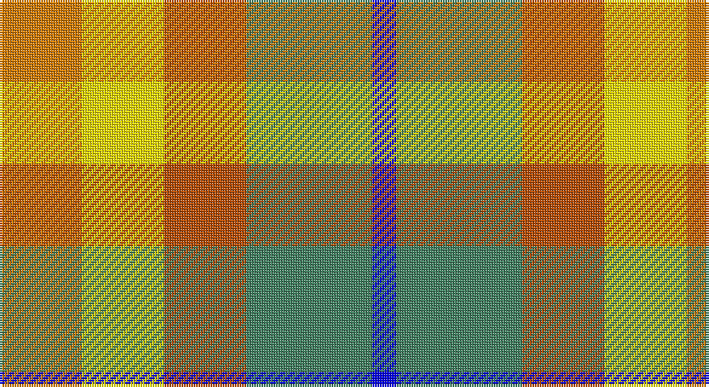

This page is one **sett** — a single exact thread-count. It belongs to the [tartan](/setts/lo17ly17o17g26b5/)
(the same proportion at any scale), whose colour order is pattern [BGRYY](/stripes/bgryy/).

Sourced from register-of-tartans.  It is a [5 stripe tartan](/stripes/stripes5/).

Original link https://www.tartanregister.gov.uk/tartanDetails.aspx?ref=10933

## Register references

External register numbers recorded for this tartan.

- Scottish Register of Tartans: [10933](https://www.tartanregister.gov.uk/tartanDetails.aspx?ref=10933)

## Thread count
O/34 Y34 DO34 G52 B/10

One full sett is **284 threads**.

## Palette

Palette: <strong>Tartan Register</strong> <small style="color:#888">(4 of 5 colours)</small>
<table><thead><tr><th>Colour</th><th>Threads</th><th>Shade</th><th>Base</th><th>OKLCh</th></tr></thead><tbody><tr><td>O/</td><td style="text-align:right;font-variant-numeric:tabular-nums">34</td><td><code style="background-color:#D87C00;">#D87C00</code> <small style="color:#888">#D87C00</small></td><td>Y <code style="background-color:#F2BF00;">#F2BF00</code></td><td><small style="color:#888">oklch(67.3% 0.155 61.8)</small></td></tr><tr><td>Y</td><td style="text-align:right;font-variant-numeric:tabular-nums">34</td><td><code style="background-color:#FFE600;">#FFE600</code> <small style="color:#888">#FFE600</small></td><td>Y <code style="background-color:#F2BF00;">#F2BF00</code></td><td><small style="color:#888">oklch(91.7% 0.192 101.4)</small></td></tr><tr><td>DO</td><td style="text-align:right;font-variant-numeric:tabular-nums">34</td><td><code style="background-color:#B84C00;">#B84C00</code> <small style="color:#888">#B84C00</small></td><td>R <code style="background-color:#CC0000;">#CC0000</code></td><td><small style="color:#888">oklch(55.1% 0.156 45.5)</small></td></tr><tr><td>G</td><td style="text-align:right;font-variant-numeric:tabular-nums">52</td><td><code style="background-color:#408060;">#408060</code> <small style="color:#888">#408060</small></td><td>G <code style="background-color:#006100;">#006100</code></td><td><small style="color:#888">oklch(54.8% 0.084 160.1)</small></td></tr><tr><td>B/</td><td style="text-align:right;font-variant-numeric:tabular-nums">10</td><td><code style="background-color:#0000FF;">#0000FF</code> <small style="color:#888">#0000FF</small></td><td>B <code style="background-color:#2A418A;">#2A418A</code></td><td><small style="color:#888">oklch(45.2% 0.313 264.1)</small></td></tr></tbody></table>

# Sample pattern

## Nearest tartans

The nearest existing variants by ΔTartan distance, with this tartan at the top so the swatches line up against it.

ΔTartan

Tartan

Sett

—

<a href="/ttd/edit/#slug=lo17ly17o17g26b5~x2">Wild Mustard Dreams</a> <a class="nn-out" href="/variants/s5/lo17ly17o17g26b5~x2/" title="open its dictionary page">↗</a>

1.21

<a href="/ttd/edit/#slug=db7o8g15ly6y3~x10&amp;base=lo17ly17o17g26b5~x2">Unidentified, Silk Plaid</a> <a class="nn-out" href="/variants/s5/db7o8g15ly6y3~x10/" title="open its dictionary page">↗</a>

1.39

<a href="/ttd/edit/#slug=db7o8dg15ly6lo3~x10&amp;base=lo17ly17o17g26b5~x2">Unidentified Silk Plaid</a> <a class="nn-out" href="/variants/s5/db7o8dg15ly6lo3~x10/" title="open its dictionary page">↗</a>

1.48

<a href="/ttd/edit/#slug=lr5g4w1g4o4dg4ly1~x4&amp;base=lo17ly17o17g26b5~x2">Devon Original District Tartan</a> <a class="nn-out" href="/variants/s7/lr5g4w1g4o4dg4ly1~x4/" title="open its dictionary page">↗</a>

1.55

<a href="/ttd/edit/#slug=lo17ly17lo17g26db5~x2&amp;base=lo17ly17o17g26b5~x2">Wild Mustard Dreams</a> <a class="nn-out" href="/variants/s5/lo17ly17lo17g26db5~x2/" title="open its dictionary page">↗</a>

1.61

<a href="/ttd/edit/#slug=r8lo4ly3g6t6dp1~x5&amp;base=lo17ly17o17g26b5~x2">Pride, The Tartan of</a> <a class="nn-out" href="/variants/s6/r8lo4ly3g6t6dp1~x5/" title="open its dictionary page">↗</a>

1.68

<a href="/ttd/edit/#slug=db2m3g3o6ly2~x2&amp;base=lo17ly17o17g26b5~x2">Dunoon Burgh Hall Trust</a> <a class="nn-out" href="/variants/s5/db2m3g3o6ly2~x2/" title="open its dictionary page">↗</a>

1.69

<a href="/ttd/edit/#slug=w5y4b1y4r4b1dg4ly1~x2&amp;base=lo17ly17o17g26b5~x2">Devon Rural Skills Trust</a> <a class="nn-out" href="/variants/s8/w5y4b1y4r4b1dg4ly1~x2/" title="open its dictionary page">↗</a>

1.74

<a href="/ttd/edit/#slug=r5db12lyi11n21ly5~x2&amp;base=lo17ly17o17g26b5~x2">Inspiration</a> <a class="nn-out" href="/variants/s5/r5db12lyi11n21ly5~x2/" title="open its dictionary page">↗</a>

1.74

<a href="/ttd/edit/#slug=w5y4t1y4r4t1dg4ly1~x6&amp;base=lo17ly17o17g26b5~x2">Devon Rural Skills Trust</a> <a class="nn-out" href="/variants/s8/w5y4t1y4r4t1dg4ly1~x6/" title="open its dictionary page">↗</a>

1.80

<a href="/ttd/edit/#slug=r13ly13g13b22w4~x2&amp;base=lo17ly17o17g26b5~x2">Clan Haggis World (Corporate)</a> <a class="nn-out" href="/variants/s5/r13ly13g13b22w4~x2/" title="open its dictionary page">↗</a>

## Neighbour map

Every grey dot is one of 14360 variants placed by the first two principal components of the ΔTartan feature space (44% of its variance). Red is this tartan; blue dots are its nearest — click one to open its page.

<svg viewBox="0 0 640 380" role="img" style="max-width:100%;height:auto;border:1px solid #e0e0e0;border-radius:4px;display:block" xmlns="http://www.w3.org/2000/svg"><image href="/nn/cloud.v1.png" width="640" height="380"/><a href="/variants/s5/db7o8g15ly6y3~x10/"><circle cx="97.6" cy="247.0" r="4" fill="#3465a4"><title>Unidentified, Silk Plaid</title></circle></a><a href="/variants/s5/db7o8dg15ly6lo3~x10/"><circle cx="91.5" cy="243.5" r="4" fill="#3465a4"><title>Unidentified Silk Plaid</title></circle></a><a href="/variants/s7/lr5g4w1g4o4dg4ly1~x4/"><circle cx="70.8" cy="235.7" r="4" fill="#3465a4"><title>Devon Original District Tartan</title></circle></a><a href="/variants/s5/lo17ly17lo17g26db5~x2/"><circle cx="145.2" cy="274.2" r="4" fill="#3465a4"><title>Wild Mustard Dreams</title></circle></a><a href="/variants/s6/r8lo4ly3g6t6dp1~x5/"><circle cx="64.3" cy="209.5" r="4" fill="#3465a4"><title>Pride, The Tartan of</title></circle></a><a href="/variants/s5/db2m3g3o6ly2~x2/"><circle cx="63.3" cy="268.2" r="4" fill="#3465a4"><title>Dunoon Burgh Hall Trust</title></circle></a><a href="/variants/s8/w5y4b1y4r4b1dg4ly1~x2/"><circle cx="44.4" cy="204.1" r="4" fill="#3465a4"><title>Devon Rural Skills Trust</title></circle></a><a href="/variants/s5/r5db12lyi11n21ly5~x2/"><circle cx="94.6" cy="241.3" r="4" fill="#3465a4"><title>Inspiration</title></circle></a><a href="/variants/s8/w5y4t1y4r4t1dg4ly1~x6/"><circle cx="36.2" cy="200.2" r="4" fill="#3465a4"><title>Devon Rural Skills Trust</title></circle></a><a href="/variants/s5/r13ly13g13b22w4~x2/"><circle cx="51.1" cy="238.0" r="4" fill="#3465a4"><title>Clan Haggis World (Corporate)</title></circle></a><circle cx="66.1" cy="254.6" r="5" fill="#c00000"/></svg>

ID: /variants/s5/lo17ly17o17g26b5~x2/
