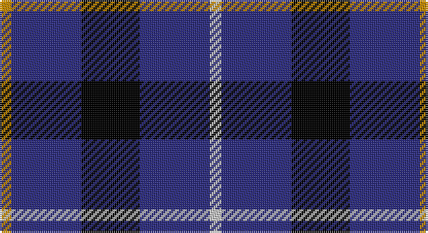

This page is one **sett** — a single exact thread-count. It belongs to the [tartan](/setts/lo1db6k5db6lb1/)
(the same proportion at any scale), whose colour order is pattern [WBKBY](/stripes/wbkby/).

Part of the [Bank of Scotland](/tartans/bank-of-scotland/) tartan — the named design grouping this sett with its other cloths.

Sourced from register-of-tartans.  It is a [5 stripe tartan](/stripes/stripes5/).

Original link https://www.tartanregister.gov.uk/tartanDetails.aspx?ref=191

## Also known as

This cloth is also recorded under:

- Bank of Scotland 2000

2 attestations — the source records this cloth was collapsed from (oldest owns this page)

<ul>
<li>01/01/1994 — Bank of Scotland (1995) (register-of-tartans, <a href="https://www.tartanregister.gov.uk/tartanDetails.aspx?ref=191">record</a>)</li>
<li>Jun. 1995 — Bank of Scotland (1995) (Corporate) (tartans-authority, <a href="http://www.tartansauthority.com/tartan-ferret/display/2462/">record</a>)</li>
</ul>

## Register references

External register numbers recorded for this tartan.

- Scottish Register of Tartans: [191](https://www.tartanregister.gov.uk/tartanDetails.aspx?ref=191)
- Scottish Tartans Authority (ITI): 2462
- Scottish Tartans World Register: 2462

## Thread count
DY/6 DBa36 K30 DBa36 N/6

One full sett is **216 threads**.

## Palette

Palette: <strong>Tartan Register</strong> <small style="color:#888">(8 of 9 colours)</small>
<table><thead><tr><th>Colour</th><th>Threads</th><th>Shade</th><th>Base</th><th>OKLCh</th></tr></thead><tbody><tr><td>DY/</td><td style="text-align:right;font-variant-numeric:tabular-nums">6</td><td><code style="background-color:#C88C00;">#C88C00</code> <small style="color:#888">#C88C00</small></td><td>Y <code style="background-color:#F2BF00;">#F2BF00</code></td><td><small style="color:#888">oklch(68.2% 0.142 78.2)</small></td></tr><tr><td>DBa</td><td style="text-align:right;font-variant-numeric:tabular-nums">36</td><td><code style="background-color:#2C2C80;">#2C2C80</code> <small style="color:#888">#2C2C80</small></td><td>B <code style="background-color:#2A418A;">#2A418A</code></td><td><small style="color:#888">oklch(35.0% 0.138 276.6)</small></td></tr><tr><td>K</td><td style="text-align:right;font-variant-numeric:tabular-nums">30</td><td><code style="background-color:#000000;">#000000</code> <small style="color:#888">#000000</small></td><td>K <code style="background-color:#000000;">#000000</code></td><td><small style="color:#888">oklch(0.0% 0.000 0.0)</small></td></tr><tr><td>DBa</td><td style="text-align:right;font-variant-numeric:tabular-nums">36</td><td><code style="background-color:#2C2C80;">#2C2C80</code> <small style="color:#888">#2C2C80</small></td><td>B <code style="background-color:#2A418A;">#2A418A</code></td><td><small style="color:#888">oklch(35.0% 0.138 276.6)</small></td></tr><tr><td>N/</td><td style="text-align:right;font-variant-numeric:tabular-nums">6</td><td><code style="background-color:#C8C8C8;">#C8C8C8</code> <small style="color:#888">#C8C8C8</small></td><td>W <code style="background-color:#F7F7F7;">#F7F7F7</code></td><td><small style="color:#888">oklch(83.3% 0.000 89.9)</small></td></tr></tbody></table>

# Sample pattern

## Compared to the master

This cloth is one sett of its design; the master sett (the exemplar the design is anchored on) is below for comparison.

<figure style="margin:0"><figcaption style="color:#888;font-size:smaller">this sett</figcaption></figure>
<figure style="margin:0"><figcaption style="color:#888;font-size:smaller"><a href="/setts/b64db3dt4r5dt8dti12b3dti4b2lo1/">master sett →</a></figcaption></figure>

## Nearest tartans

The nearest existing variants by ΔTartan distance, with this tartan at the top so the swatches line up against it.

ΔTartan

Tartan

Sett

—

<a href="/ttd/edit/#slug=lo1db6k5db6lb1~x6">Bank of Scotland (1995)</a> <a class="nn-out" href="/variants/s5/lo1db6k5db6lb1~x6/" title="open its dictionary page">↗</a>

1.01

<a href="/ttd/edit/#slug=w4db30k23db24ly4~x2&amp;base=lo1db6k5db6lb1~x6">Bank of Scotland</a> <a class="nn-out" href="/variants/s5/w4db30k23db24ly4~x2/" title="open its dictionary page">↗</a>

1.12

<a href="/ttd/edit/#slug=r6db35k36db36w6&amp;base=lo1db6k5db6lb1~x6">Davidson of Tulloch Clan Tartan</a> <a class="nn-out" href="/variants/s5/r6db35k36db36w6/" title="open its dictionary page">↗</a>

1.36

<a href="/ttd/edit/#slug=o3k15r2k15n15p3~x2&amp;base=lo1db6k5db6lb1~x6">H.M.S. DUNCAN</a> <a class="nn-out" href="/variants/s6/o3k15r2k15n15p3~x2/" title="open its dictionary page">↗</a>

1.39

<a href="/ttd/edit/#slug=lo4db23k4g16db23lb4&amp;base=lo1db6k5db6lb1~x6">Baptist Union of Scotland</a> <a class="nn-out" href="/variants/s6/lo4db23k4g16db23lb4/" title="open its dictionary page">↗</a>

1.41

<a href="/ttd/edit/#slug=k15lo2k10db18lb3~x2&amp;base=lo1db6k5db6lb1~x6">College of Radiographers</a> <a class="nn-out" href="/variants/s5/k15lo2k10db18lb3~x2/" title="open its dictionary page">↗</a>

1.45

<a href="/ttd/edit/#slug=k15ly2k10db18w3~x2&amp;base=lo1db6k5db6lb1~x6">College of Radiographers Corporate Tartan</a> <a class="nn-out" href="/variants/s5/k15ly2k10db18w3~x2/" title="open its dictionary page">↗</a>

1.58

<a href="/ttd/edit/#slug=lr3k3lr3k10r1~x6&amp;base=lo1db6k5db6lb1~x6">Burberry Blue</a> <a class="nn-out" href="/variants/s5/lr3k3lr3k10r1~x6/" title="open its dictionary page">↗</a>

1.61

<a href="/ttd/edit/#slug=r8k24db10k5db10k5~x2&amp;base=lo1db6k5db6lb1~x6">Allen, Nicholas (Personal)</a> <a class="nn-out" href="/variants/s6/r8k24db10k5db10k5~x2/" title="open its dictionary page">↗</a>

1.66

<a href="/ttd/edit/#slug=w1db6dy5k1db6ly1~x4&amp;base=lo1db6k5db6lb1~x6">Ancient Atlantic</a> <a class="nn-out" href="/variants/s6/w1db6dy5k1db6ly1~x4/" title="open its dictionary page">↗</a>

1.67

<a href="/ttd/edit/#slug=db3t3db16t16db16w3~x2&amp;base=lo1db6k5db6lb1~x6">Murray Taylor</a> <a class="nn-out" href="/variants/s6/db3t3db16t16db16w3~x2/" title="open its dictionary page">↗</a>

## Neighbour map

Every grey dot is one of 14360 variants placed by the first two principal components of the ΔTartan feature space (44% of its variance). Red is this tartan; blue dots are its nearest — click one to open its page.

<svg viewBox="0 0 640 380" role="img" style="max-width:100%;height:auto;border:1px solid #e0e0e0;border-radius:4px;display:block" xmlns="http://www.w3.org/2000/svg"><image href="/nn/cloud.v1.png" width="640" height="380"/><a href="/variants/s5/w4db30k23db24ly4~x2/"><circle cx="311.1" cy="261.7" r="4" fill="#3465a4"><title>Bank of Scotland</title></circle></a><a href="/variants/s5/r6db35k36db36w6/"><circle cx="305.4" cy="275.2" r="4" fill="#3465a4"><title>Davidson of Tulloch Clan Tartan</title></circle></a><a href="/variants/s6/o3k15r2k15n15p3~x2/"><circle cx="251.7" cy="222.3" r="4" fill="#3465a4"><title>H.M.S. DUNCAN</title></circle></a><a href="/variants/s6/lo4db23k4g16db23lb4/"><circle cx="274.4" cy="236.1" r="4" fill="#3465a4"><title>Baptist Union of Scotland</title></circle></a><a href="/variants/s5/k15lo2k10db18lb3~x2/"><circle cx="273.6" cy="254.0" r="4" fill="#3465a4"><title>College of Radiographers</title></circle></a><a href="/variants/s5/k15ly2k10db18w3~x2/"><circle cx="267.1" cy="245.9" r="4" fill="#3465a4"><title>College of Radiographers Corporate Tartan</title></circle></a><a href="/variants/s5/lr3k3lr3k10r1~x6/"><circle cx="351.1" cy="237.5" r="4" fill="#3465a4"><title>Burberry Blue</title></circle></a><a href="/variants/s6/r8k24db10k5db10k5~x2/"><circle cx="252.4" cy="278.1" r="4" fill="#3465a4"><title>Allen, Nicholas (Personal)</title></circle></a><a href="/variants/s6/w1db6dy5k1db6ly1~x4/"><circle cx="271.4" cy="230.4" r="4" fill="#3465a4"><title>Ancient Atlantic</title></circle></a><a href="/variants/s6/db3t3db16t16db16w3~x2/"><circle cx="323.2" cy="273.0" r="4" fill="#3465a4"><title>Murray Taylor</title></circle></a><circle cx="295.8" cy="264.2" r="5" fill="#c00000"/></svg>

ID: /variants/s5/lo1db6k5db6lb1~x6/
