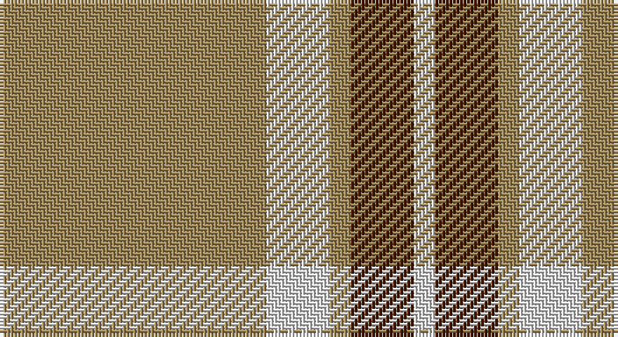

This page is one **sett** — a single exact thread-count. It belongs to the [tartan](/setts/lo38w9lo3do9w3/)
(the same proportion at any scale), whose colour order is pattern [WBYWY](/stripes/wbywy/).

Part of the [Loch Tummel](/tartans/loch-tummel/) tartan — the named design grouping this sett with its other cloths.

Sourced from house-of-tartan.  It is a [5 stripe tartan](/stripes/stripes5/).

Original link http://www.house-of-tartan.scotland.net/house/TartanViewjs.asp?colr=Def&tnam=1751

## Provenance

Earliest known date: pre 2003 Nothing

## Thread count
LT/76 LN18 LT6 DR18 LN/6

One full sett is **166 threads**.

## Palette

Palette: <strong>Tartan Register</strong>
<table><thead><tr><th>Colour</th><th>Threads</th><th>Shade</th><th>Base</th><th>OKLCh</th></tr></thead><tbody><tr><td>LT/</td><td style="text-align:right;font-variant-numeric:tabular-nums">76</td><td><code style="background-color:#A08858;">#A08858</code> <small style="color:#888">#A08858</small></td><td>Y <code style="background-color:#F2BF00;">#F2BF00</code></td><td><small style="color:#888">oklch(63.7% 0.071 84.0)</small></td></tr><tr><td>LN</td><td style="text-align:right;font-variant-numeric:tabular-nums">18</td><td><code style="background-color:#E0E0E0;">#E0E0E0</code> <small style="color:#888">#E0E0E0</small></td><td>W <code style="background-color:#F7F7F7;">#F7F7F7</code></td><td><small style="color:#888">oklch(90.7% 0.000 89.9)</small></td></tr><tr><td>LT</td><td style="text-align:right;font-variant-numeric:tabular-nums">6</td><td><code style="background-color:#A08858;">#A08858</code> <small style="color:#888">#A08858</small></td><td>Y <code style="background-color:#F2BF00;">#F2BF00</code></td><td><small style="color:#888">oklch(63.7% 0.071 84.0)</small></td></tr><tr><td>DR</td><td style="text-align:right;font-variant-numeric:tabular-nums">18</td><td><code style="background-color:#441800;">#441800</code> <small style="color:#888">#441800</small></td><td>B <code style="background-color:#2A418A;">#2A418A</code></td><td><small style="color:#888">oklch(27.3% 0.076 46.3)</small></td></tr><tr><td>LN/</td><td style="text-align:right;font-variant-numeric:tabular-nums">6</td><td><code style="background-color:#E0E0E0;">#E0E0E0</code> <small style="color:#888">#E0E0E0</small></td><td>W <code style="background-color:#F7F7F7;">#F7F7F7</code></td><td><small style="color:#888">oklch(90.7% 0.000 89.9)</small></td></tr></tbody></table>

# Sample pattern

## Compared to the master

This cloth is one sett of its design; the master sett (the exemplar the design is anchored on) is below for comparison.

<figure style="margin:0"><figcaption style="color:#888;font-size:smaller">this sett</figcaption></figure>
<figure style="margin:0"><figcaption style="color:#888;font-size:smaller"><a href="/setts/dy38w9dy3k9w3/">master sett →</a></figcaption></figure>

## Nearest tartans

The nearest existing variants by ΔTartan distance, with this tartan at the top so the swatches line up against it.

ΔTartan

Tartan

Sett

—

<a href="/ttd/edit/#slug=lo38w9lo3do9w3~x2">Loch Tummel Trade Tartan</a> <a class="nn-out" href="/variants/s5/lo38w9lo3do9w3~x2/" title="open its dictionary page">↗</a>

0.84

<a href="/ttd/edit/#slug=o38w9o3dr9w3~x2&amp;base=lo38w9lo3do9w3~x2">Loch Tummel</a> <a class="nn-out" href="/variants/s5/o38w9o3dr9w3~x2/" title="open its dictionary page">↗</a>

1.23

<a href="/ttd/edit/#slug=ly5n1ly1n12r1~x8&amp;base=lo38w9lo3do9w3~x2">Ceredigion (Personal)</a> <a class="nn-out" href="/variants/s5/ly5n1ly1n12r1~x8/" title="open its dictionary page">↗</a>

1.29

<a href="/ttd/edit/#slug=t11ly2r1ly2r1~x4&amp;base=lo38w9lo3do9w3~x2">Carlisle, Ancient</a> <a class="nn-out" href="/variants/s5/t11ly2r1ly2r1~x4/" title="open its dictionary page">↗</a>

1.40

<a href="/ttd/edit/#slug=lo72dt16w9dt4w5dt16~x2&amp;base=lo38w9lo3do9w3~x2">Machair</a> <a class="nn-out" href="/variants/s6/lo72dt16w9dt4w5dt16~x2/" title="open its dictionary page">↗</a>

1.53

<a href="/ttd/edit/#slug=dy8lr29dy8lo3dy8lr8lo3~x2&amp;base=lo38w9lo3do9w3~x2">Lister (Misty Mountain)</a> <a class="nn-out" href="/variants/s7/dy8lr29dy8lo3dy8lr8lo3~x2/" title="open its dictionary page">↗</a>

1.57

<a href="/ttd/edit/#slug=w15dy15w15dy80r6&amp;base=lo38w9lo3do9w3~x2">Coca Cola (Corporate)</a> <a class="nn-out" href="/variants/s5/w15dy15w15dy80r6/" title="open its dictionary page">↗</a>

1.64

<a href="/ttd/edit/#slug=o31w5o2w5o4w3o2w7~x2&amp;base=lo38w9lo3do9w3~x2">Menzies, Brown &amp; White</a> <a class="nn-out" href="/variants/s8/o31w5o2w5o4w3o2w7~x2/" title="open its dictionary page">↗</a>

1.64

<a href="/ttd/edit/#slug=w7dy7w7dy40r3~x2&amp;base=lo38w9lo3do9w3~x2">Coca Cola</a> <a class="nn-out" href="/variants/s5/w7dy7w7dy40r3~x2/" title="open its dictionary page">↗</a>

1.76

<a href="/ttd/edit/#slug=lg60r7w10dg16lg15w3lg15~x2&amp;base=lo38w9lo3do9w3~x2">Deer Park (Loton) (Personal)</a> <a class="nn-out" href="/variants/s7/lg60r7w10dg16lg15w3lg15~x2/" title="open its dictionary page">↗</a>

1.78

<a href="/ttd/edit/#slug=ly5k9ly2k7lo35r4lo35k4~x2&amp;base=lo38w9lo3do9w3~x2">Wilbers</a> <a class="nn-out" href="/variants/s8/ly5k9ly2k7lo35r4lo35k4~x2/" title="open its dictionary page">↗</a>

## Neighbour map

Every grey dot is one of 14360 variants placed by the first two principal components of the ΔTartan feature space (44% of its variance). Red is this tartan; blue dots are its nearest — click one to open its page.

<svg viewBox="0 0 640 380" role="img" style="max-width:100%;height:auto;border:1px solid #e0e0e0;border-radius:4px;display:block" xmlns="http://www.w3.org/2000/svg"><image href="/nn/cloud.v1.png" width="640" height="380"/><a href="/variants/s5/o38w9o3dr9w3~x2/"><circle cx="406.8" cy="198.6" r="4" fill="#3465a4"><title>Loch Tummel</title></circle></a><a href="/variants/s5/ly5n1ly1n12r1~x8/"><circle cx="432.6" cy="219.4" r="4" fill="#3465a4"><title>Ceredigion (Personal)</title></circle></a><a href="/variants/s5/t11ly2r1ly2r1~x4/"><circle cx="407.1" cy="208.9" r="4" fill="#3465a4"><title>Carlisle, Ancient</title></circle></a><a href="/variants/s6/lo72dt16w9dt4w5dt16~x2/"><circle cx="381.1" cy="179.0" r="4" fill="#3465a4"><title>Machair</title></circle></a><a href="/variants/s7/dy8lr29dy8lo3dy8lr8lo3~x2/"><circle cx="311.1" cy="200.8" r="4" fill="#3465a4"><title>Lister (Misty Mountain)</title></circle></a><a href="/variants/s5/w15dy15w15dy80r6/"><circle cx="444.0" cy="198.1" r="4" fill="#3465a4"><title>Coca Cola (Corporate)</title></circle></a><a href="/variants/s8/o31w5o2w5o4w3o2w7~x2/"><circle cx="451.3" cy="177.5" r="4" fill="#3465a4"><title>Menzies, Brown &amp; White</title></circle></a><a href="/variants/s5/w7dy7w7dy40r3~x2/"><circle cx="454.2" cy="197.0" r="4" fill="#3465a4"><title>Coca Cola</title></circle></a><a href="/variants/s7/lg60r7w10dg16lg15w3lg15~x2/"><circle cx="428.4" cy="168.6" r="4" fill="#3465a4"><title>Deer Park (Loton) (Personal)</title></circle></a><a href="/variants/s8/ly5k9ly2k7lo35r4lo35k4~x2/"><circle cx="398.5" cy="150.5" r="4" fill="#3465a4"><title>Wilbers</title></circle></a><circle cx="407.9" cy="200.5" r="5" fill="#c00000"/></svg>

ID: /variants/s5/lo38w9lo3do9w3~x2/
