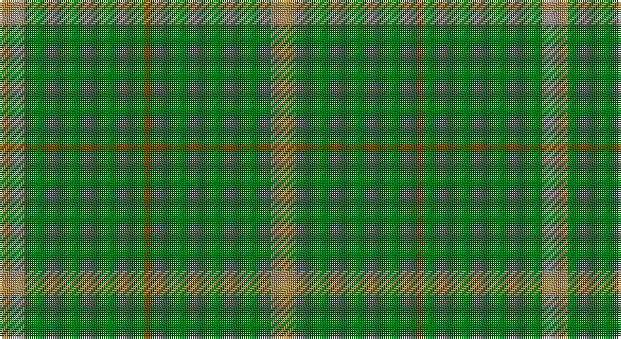

This page is one **sett** — a single exact thread-count. It belongs to the [tartan](/setts/lo3g14dy1g14lo3/)
(the same proportion at any scale), whose colour order is pattern [YGGGY](/stripes/ygggy/).

Part of the [Pearson](/tartans/pearson/) tartan — the named design grouping this sett with its other cloths.

Sourced from house-of-tartan.  It is a [5 stripe tartan](/stripes/stripes5/).

Original link http://www.house-of-tartan.scotland.net/house/TartanViewjs.asp?colr=Def&tnam=1734

## Provenance

Earliest known date: 1951 Nothing

## Thread count
LT/12 G56 T4 G56 LT/12

One full sett is **256 threads**.

## Palette

Palette: <strong>Tartan Register</strong>
<table><thead><tr><th>Colour</th><th>Threads</th><th>Shade</th><th>Base</th><th>OKLCh</th></tr></thead><tbody><tr><td>LT/</td><td style="text-align:right;font-variant-numeric:tabular-nums">12</td><td><code style="background-color:#A08858;">#A08858</code> <small style="color:#888">#A08858</small></td><td>Y <code style="background-color:#F2BF00;">#F2BF00</code></td><td><small style="color:#888">oklch(63.7% 0.071 84.0)</small></td></tr><tr><td>G</td><td style="text-align:right;font-variant-numeric:tabular-nums">56</td><td><code style="background-color:#006818;">#006818</code> <small style="color:#888">#006818</small></td><td>G <code style="background-color:#006100;">#006100</code></td><td><small style="color:#888">oklch(45.0% 0.142 145.0)</small></td></tr><tr><td>T</td><td style="text-align:right;font-variant-numeric:tabular-nums">4</td><td><code style="background-color:#604000;">#604000</code> <small style="color:#888">#604000</small></td><td>G <code style="background-color:#006100;">#006100</code></td><td><small style="color:#888">oklch(39.8% 0.083 76.8)</small></td></tr><tr><td>G</td><td style="text-align:right;font-variant-numeric:tabular-nums">56</td><td><code style="background-color:#006818;">#006818</code> <small style="color:#888">#006818</small></td><td>G <code style="background-color:#006100;">#006100</code></td><td><small style="color:#888">oklch(45.0% 0.142 145.0)</small></td></tr><tr><td>LT/</td><td style="text-align:right;font-variant-numeric:tabular-nums">12</td><td><code style="background-color:#A08858;">#A08858</code> <small style="color:#888">#A08858</small></td><td>Y <code style="background-color:#F2BF00;">#F2BF00</code></td><td><small style="color:#888">oklch(63.7% 0.071 84.0)</small></td></tr></tbody></table>

# Sample pattern

## Compared to the master

This cloth is one sett of its design; the master sett (the exemplar the design is anchored on) is below for comparison.

<figure style="margin:0"><figcaption style="color:#888;font-size:smaller">this sett</figcaption></figure>
<figure style="margin:0"><figcaption style="color:#888;font-size:smaller"><a href="/setts/ly6db28do2db28y1/">master sett →</a></figcaption></figure>

## Nearest tartans

The nearest existing variants by ΔTartan distance, with this tartan at the top so the swatches line up against it.

ΔTartan

Tartan

Sett

—

<a href="/ttd/edit/#slug=lo3g14dy1g14lo3~x4">Pearson Family Tartan</a> <a class="nn-out" href="/variants/s5/lo3g14dy1g14lo3~x4/" title="open its dictionary page">↗</a>

1.51

<a href="/ttd/edit/#slug=o3g14oi1g14o3~x4&amp;base=lo3g14dy1g14lo3~x4">Pearson</a> <a class="nn-out" href="/variants/s5/o3g14oi1g14o3~x4/" title="open its dictionary page">↗</a>

1.59

<a href="/ttd/edit/#slug=g2dy2g15dy1w1g15dy2g2~x2&amp;base=lo3g14dy1g14lo3~x4">Bannockbane Hunting Trade Tartan</a> <a class="nn-out" href="/variants/s8/g2dy2g15dy1w1g15dy2g2~x2/" title="open its dictionary page">↗</a>

1.78

<a href="/ttd/edit/#slug=g2o2g15o1w1g15o2g2~x2&amp;base=lo3g14dy1g14lo3~x4">Bannockbane, hunting</a> <a class="nn-out" href="/variants/s8/g2o2g15o1w1g15o2g2~x2/" title="open its dictionary page">↗</a>

2.25

<a href="/ttd/edit/#slug=dg22k3dg25k4~x2&amp;base=lo3g14dy1g14lo3~x4">Campbell Simpson</a> <a class="nn-out" href="/variants/s4/dg22k3dg25k4~x2/" title="open its dictionary page">↗</a>

2.41

<a href="/ttd/edit/#slug=g18r6g75db6g13dy35g12db6&amp;base=lo3g14dy1g14lo3~x4">Glenlivet Corporate Tartan</a> <a class="nn-out" href="/variants/s8/g18r6g75db6g13dy35g12db6/" title="open its dictionary page">↗</a>

2.44

<a href="/ttd/edit/#slug=g18r6g75db6g13o35g12db6&amp;base=lo3g14dy1g14lo3~x4">Glenlivet</a> <a class="nn-out" href="/variants/s8/g18r6g75db6g13o35g12db6/" title="open its dictionary page">↗</a>

2.46

<a href="/ttd/edit/#slug=g46o20g9o20g46lg5~x2&amp;base=lo3g14dy1g14lo3~x4">O'Neill, Red</a> <a class="nn-out" href="/variants/s6/g46o20g9o20g46lg5~x2/" title="open its dictionary page">↗</a>

2.54

<a href="/ttd/edit/#slug=g37o9g3dr9o3~x2&amp;base=lo3g14dy1g14lo3~x4">Glen Boig</a> <a class="nn-out" href="/variants/s5/g37o9g3dr9o3~x2/" title="open its dictionary page">↗</a>

2.54

<a href="/ttd/edit/#slug=g9o20g46lg5~x2&amp;base=lo3g14dy1g14lo3~x4">O'Neill, Red (Corporate?)</a> <a class="nn-out" href="/variants/s4/g9o20g46lg5~x2/" title="open its dictionary page">↗</a>

2.63

<a href="/ttd/edit/#slug=g56dy13lo13lo5~x2&amp;base=lo3g14dy1g14lo3~x4">Colonial Marine (Corporate)</a> <a class="nn-out" href="/variants/s4/g56dy13lo13lo5~x2/" title="open its dictionary page">↗</a>

## Neighbour map

Every grey dot is one of 14360 variants placed by the first two principal components of the ΔTartan feature space (44% of its variance). Red is this tartan; blue dots are its nearest — click one to open its page.

<svg viewBox="0 0 640 380" role="img" style="max-width:100%;height:auto;border:1px solid #e0e0e0;border-radius:4px;display:block" xmlns="http://www.w3.org/2000/svg"><image href="/nn/cloud.v1.png" width="640" height="380"/><a href="/variants/s5/o3g14oi1g14o3~x4/"><circle cx="626.0" cy="316.5" r="4" fill="#3465a4"><title>Pearson</title></circle></a><a href="/variants/s8/g2dy2g15dy1w1g15dy2g2~x2/"><circle cx="626.0" cy="258.4" r="4" fill="#3465a4"><title>Bannockbane Hunting Trade Tartan</title></circle></a><a href="/variants/s8/g2o2g15o1w1g15o2g2~x2/"><circle cx="626.0" cy="248.8" r="4" fill="#3465a4"><title>Bannockbane, hunting</title></circle></a><a href="/variants/s4/dg22k3dg25k4~x2/"><circle cx="626.0" cy="363.0" r="4" fill="#3465a4"><title>Campbell Simpson</title></circle></a><a href="/variants/s8/g18r6g75db6g13dy35g12db6/"><circle cx="498.1" cy="244.0" r="4" fill="#3465a4"><title>Glenlivet Corporate Tartan</title></circle></a><a href="/variants/s8/g18r6g75db6g13o35g12db6/"><circle cx="472.1" cy="228.6" r="4" fill="#3465a4"><title>Glenlivet</title></circle></a><a href="/variants/s6/g46o20g9o20g46lg5~x2/"><circle cx="454.9" cy="286.6" r="4" fill="#3465a4"><title>O'Neill, Red</title></circle></a><a href="/variants/s5/g37o9g3dr9o3~x2/"><circle cx="492.4" cy="271.6" r="4" fill="#3465a4"><title>Glen Boig</title></circle></a><a href="/variants/s4/g9o20g46lg5~x2/"><circle cx="463.0" cy="289.0" r="4" fill="#3465a4"><title>O'Neill, Red (Corporate?)</title></circle></a><a href="/variants/s4/g56dy13lo13lo5~x2/"><circle cx="458.9" cy="281.3" r="4" fill="#3465a4"><title>Colonial Marine (Corporate)</title></circle></a><circle cx="608.6" cy="298.3" r="5" fill="#c00000"/></svg>

ID: /variants/s5/lo3g14dy1g14lo3~x4/
