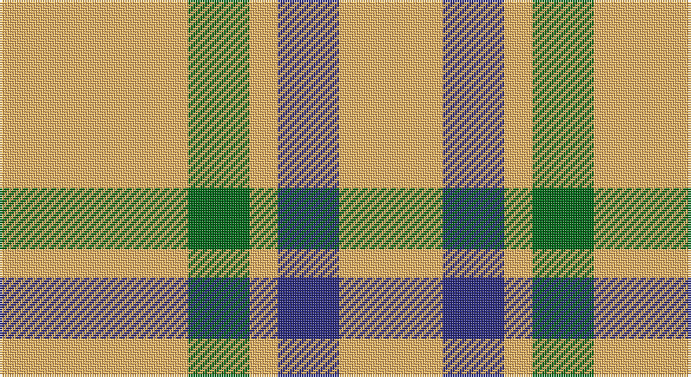

This page is one **sett** — a single exact thread-count. It belongs to the [tartan](/setts/lo40g13lo6db13lo22/)
(the same proportion at any scale), whose colour order is pattern [YBYGY](/stripes/ybygy/).

Sourced from tartans-authority.  It is a [5 stripe tartan](/stripes/stripes5/).

Original link http://www.tartansauthority.com/tartan-ferret/display/8908/

## Register references

External register numbers recorded for this tartan.

- Scottish Register of Tartans: [8908](https://www.tartanregister.gov.uk/tartanDetails?ref=8908)
- Scottish Tartans Authority (ITI): 8908

## Thread count
LG/80 G26 LG12 DB26 LG/44

One full sett is **252 threads**.

## Palette

Palette: <strong>Tartan Register</strong> <small style="color:#888">(2 of 3 colours)</small>
<table><thead><tr><th>Colour</th><th>Threads</th><th>Shade</th><th>Base</th><th>OKLCh</th></tr></thead><tbody><tr><td>LG/</td><td style="text-align:right;font-variant-numeric:tabular-nums">80</td><td><code style="background-color:#FCB464;">#FCB464</code> <small style="color:#888">#FCB464</small></td><td>Y <code style="background-color:#F2BF00;">#F2BF00</code></td><td><small style="color:#888">oklch(82.2% 0.128 67.3)</small></td></tr><tr><td>G</td><td style="text-align:right;font-variant-numeric:tabular-nums">26</td><td><code style="background-color:#006818;">#006818</code> <small style="color:#888">#006818</small></td><td>G <code style="background-color:#006100;">#006100</code></td><td><small style="color:#888">oklch(45.0% 0.142 145.0)</small></td></tr><tr><td>LG</td><td style="text-align:right;font-variant-numeric:tabular-nums">12</td><td><code style="background-color:#FCB464;">#FCB464</code> <small style="color:#888">#FCB464</small></td><td>Y <code style="background-color:#F2BF00;">#F2BF00</code></td><td><small style="color:#888">oklch(82.2% 0.128 67.3)</small></td></tr><tr><td>DB</td><td style="text-align:right;font-variant-numeric:tabular-nums">26</td><td><code style="background-color:#2C2C80;">#2C2C80</code> <small style="color:#888">#2C2C80</small></td><td>B <code style="background-color:#2A418A;">#2A418A</code></td><td><small style="color:#888">oklch(35.0% 0.138 276.6)</small></td></tr><tr><td>LG/</td><td style="text-align:right;font-variant-numeric:tabular-nums">44</td><td><code style="background-color:#FCB464;">#FCB464</code> <small style="color:#888">#FCB464</small></td><td>Y <code style="background-color:#F2BF00;">#F2BF00</code></td><td><small style="color:#888">oklch(82.2% 0.128 67.3)</small></td></tr></tbody></table>

# Sample pattern

## Nearest tartans

The nearest existing variants by ΔTartan distance, with this tartan at the top so the swatches line up against it.

ΔTartan

Tartan

Sett

—

<a href="/ttd/edit/#slug=lo40g13lo6db13lo22~x2">Burt's Highlanders (Fashion)</a> <a class="nn-out" href="/variants/s5/lo40g13lo6db13lo22~x2/" title="open its dictionary page">↗</a>

1.61

<a href="/ttd/edit/#slug=ly20k15ly20w3~x2&amp;base=lo40g13lo6db13lo22~x2">Silvicola</a> <a class="nn-out" href="/variants/s4/ly20k15ly20w3~x2/" title="open its dictionary page">↗</a>

1.72

<a href="/ttd/edit/#slug=ly49r16k11~x2&amp;base=lo40g13lo6db13lo22~x2">Quenouille (2011)</a> <a class="nn-out" href="/variants/s3/ly49r16k11~x2/" title="open its dictionary page">↗</a>

1.98

<a href="/ttd/edit/#slug=ly6r1ly4r4db2~x5&amp;base=lo40g13lo6db13lo22~x2">Sands-Pingot Family, Alabama (Personal)</a> <a class="nn-out" href="/variants/s5/ly6r1ly4r4db2~x5/" title="open its dictionary page">↗</a>

2.02

<a href="/ttd/edit/#slug=w8r14w8r14w35k4~x2&amp;base=lo40g13lo6db13lo22~x2">Clayton Dress (Dance)</a> <a class="nn-out" href="/variants/s6/w8r14w8r14w35k4~x2/" title="open its dictionary page">↗</a>

2.02

<a href="/ttd/edit/#slug=r14w35k4w35r14w8r14w8~x2&amp;base=lo40g13lo6db13lo22~x2">Clayton Dress (Dance)</a> <a class="nn-out" href="/variants/s8/r14w35k4w35r14w8r14w8~x2/" title="open its dictionary page">↗</a>

2.07

<a href="/ttd/edit/#slug=lb2r4lb2r4lb9k1~x2&amp;base=lo40g13lo6db13lo22~x2">Buchanan VS</a> <a class="nn-out" href="/variants/s6/lb2r4lb2r4lb9k1~x2/" title="open its dictionary page">↗</a>

2.13

<a href="/ttd/edit/#slug=db1lo5db1lo5db2w1~x4&amp;base=lo40g13lo6db13lo22~x2">Tokharion</a> <a class="nn-out" href="/variants/s6/db1lo5db1lo5db2w1~x4/" title="open its dictionary page">↗</a>

2.15

<a href="/ttd/edit/#slug=ly20db10k3~x2&amp;base=lo40g13lo6db13lo22~x2">Masai Shuka 04 (Artefact)</a> <a class="nn-out" href="/variants/s3/ly20db10k3~x2/" title="open its dictionary page">↗</a>

2.18

<a href="/ttd/edit/#slug=w12lo12w12k5lo45k5lb5lo10~x2&amp;base=lo40g13lo6db13lo22~x2">Tennessee Volunteer</a> <a class="nn-out" href="/variants/s8/w12lo12w12k5lo45k5lb5lo10~x2/" title="open its dictionary page">↗</a>

2.18

<a href="/ttd/edit/#slug=lo38w9lo3do9w3~x2&amp;base=lo40g13lo6db13lo22~x2">Loch Tummel Trade Tartan</a> <a class="nn-out" href="/variants/s5/lo38w9lo3do9w3~x2/" title="open its dictionary page">↗</a>

## Neighbour map

Every grey dot is one of 14360 variants placed by the first two principal components of the ΔTartan feature space (44% of its variance). Red is this tartan; blue dots are its nearest — click one to open its page.

<svg viewBox="0 0 640 380" role="img" style="max-width:100%;height:auto;border:1px solid #e0e0e0;border-radius:4px;display:block" xmlns="http://www.w3.org/2000/svg"><image href="/nn/cloud.v1.png" width="640" height="380"/><a href="/variants/s4/ly20k15ly20w3~x2/"><circle cx="320.8" cy="266.7" r="4" fill="#3465a4"><title>Silvicola</title></circle></a><a href="/variants/s3/ly49r16k11~x2/"><circle cx="299.7" cy="262.4" r="4" fill="#3465a4"><title>Quenouille (2011)</title></circle></a><a href="/variants/s5/ly6r1ly4r4db2~x5/"><circle cx="255.5" cy="243.3" r="4" fill="#3465a4"><title>Sands-Pingot Family, Alabama (Personal)</title></circle></a><a href="/variants/s6/w8r14w8r14w35k4~x2/"><circle cx="301.9" cy="199.1" r="4" fill="#3465a4"><title>Clayton Dress (Dance)</title></circle></a><a href="/variants/s8/r14w35k4w35r14w8r14w8~x2/"><circle cx="315.9" cy="192.8" r="4" fill="#3465a4"><title>Clayton Dress (Dance)</title></circle></a><a href="/variants/s6/lb2r4lb2r4lb9k1~x2/"><circle cx="320.3" cy="206.4" r="4" fill="#3465a4"><title>Buchanan VS</title></circle></a><a href="/variants/s6/db1lo5db1lo5db2w1~x4/"><circle cx="359.6" cy="260.5" r="4" fill="#3465a4"><title>Tokharion</title></circle></a><a href="/variants/s3/ly20db10k3~x2/"><circle cx="286.9" cy="261.2" r="4" fill="#3465a4"><title>Masai Shuka 04 (Artefact)</title></circle></a><a href="/variants/s8/w12lo12w12k5lo45k5lb5lo10~x2/"><circle cx="319.7" cy="165.6" r="4" fill="#3465a4"><title>Tennessee Volunteer</title></circle></a><a href="/variants/s5/lo38w9lo3do9w3~x2/"><circle cx="407.9" cy="200.5" r="4" fill="#3465a4"><title>Loch Tummel Trade Tartan</title></circle></a><circle cx="373.0" cy="245.5" r="5" fill="#c00000"/></svg>

ID: /variants/s5/lo40g13lo6db13lo22~x2/
