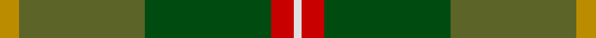
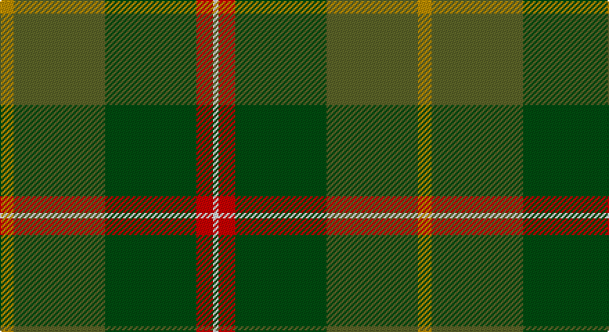

This page is one **sett** — a single exact thread-count. It belongs to the [tartan](/setts/lo5y33dg33r6w2/)
(the same proportion at any scale), whose colour order is pattern [WRGGY](/stripes/wrggy/).

Sourced from register-of-tartans.  It is a [5 stripe tartan](/stripes/stripes5/).

Original link https://www.tartanregister.gov.uk/tartanDetails.aspx?ref=4060

2 attestations — the source records this cloth was collapsed from (oldest owns this page)

<ul>
<li>01/04/2007 — Symington (register-of-tartans, <a href="https://www.tartanregister.gov.uk/tartanDetails.aspx?ref=4060">record</a>)</li>
<li>April 2007 — Symington (Name) (tartans-authority, <a href="http://www.tartansauthority.com/tartan-ferret/display/7178/">record</a>)</li>
</ul>

## Register references

External register numbers recorded for this tartan.

- Scottish Register of Tartans: [4060](https://www.tartanregister.gov.uk/tartanDetails.aspx?ref=4060)
- Scottish Tartans Authority (ITI): 7178

## Thread count
DY/10 Ga66 G66 R12 LN/4

One full sett is **302 threads**.

## Palette

Palette: <strong>Tartan Register</strong> <small style="color:#888">(5 of 6 colours)</small>
<table><thead><tr><th>Colour</th><th>Threads</th><th>Shade</th><th>Base</th><th>OKLCh</th></tr></thead><tbody><tr><td>DY/</td><td style="text-align:right;font-variant-numeric:tabular-nums">10</td><td><code style="background-color:#BC8C00;">#BC8C00</code> <small style="color:#888">#BC8C00</small></td><td>Y <code style="background-color:#F2BF00;">#F2BF00</code></td><td><small style="color:#888">oklch(66.8% 0.137 84.1)</small></td></tr><tr><td>Ga</td><td style="text-align:right;font-variant-numeric:tabular-nums">66</td><td><code style="background-color:#5C6428;">#5C6428</code> <small style="color:#888">#5C6428</small></td><td>G <code style="background-color:#006100;">#006100</code></td><td><small style="color:#888">oklch(48.3% 0.084 116.0)</small></td></tr><tr><td>G</td><td style="text-align:right;font-variant-numeric:tabular-nums">66</td><td><code style="background-color:#004C10;">#004C10</code> <small style="color:#888">#004C10</small></td><td>G <code style="background-color:#006100;">#006100</code></td><td><small style="color:#888">oklch(36.2% 0.113 145.2)</small></td></tr><tr><td>R</td><td style="text-align:right;font-variant-numeric:tabular-nums">12</td><td><code style="background-color:#C80000;">#C80000</code> <small style="color:#888">#C80000</small></td><td>R <code style="background-color:#CC0000;">#CC0000</code></td><td><small style="color:#888">oklch(52.3% 0.215 29.2)</small></td></tr><tr><td>LN/</td><td style="text-align:right;font-variant-numeric:tabular-nums">4</td><td><code style="background-color:#E0E0E0;">#E0E0E0</code> <small style="color:#888">#E0E0E0</small></td><td>W <code style="background-color:#F7F7F7;">#F7F7F7</code></td><td><small style="color:#888">oklch(90.7% 0.000 89.9)</small></td></tr></tbody></table>

# Sample pattern

## Nearest tartans

The nearest existing variants by ΔTartan distance, with this tartan at the top so the swatches line up against it.

ΔTartan

Tartan

Sett

—

<a href="/ttd/edit/#slug=lo5y33dg33r6w2~x2">Symington</a> <a class="nn-out" href="/variants/s5/lo5y33dg33r6w2~x2/" title="open its dictionary page">↗</a>

1.26

<a href="/ttd/edit/#slug=dy46g23b23r4ly4~x2&amp;base=lo5y33dg33r6w2~x2">McMoosie Htg (Fashion)</a> <a class="nn-out" href="/variants/s5/dy46g23b23r4ly4~x2/" title="open its dictionary page">↗</a>

1.36

<a href="/ttd/edit/#slug=g1r7g7n2r1dg15lb1~x4&amp;base=lo5y33dg33r6w2~x2">Ramsay (Green Fashion)</a> <a class="nn-out" href="/variants/s7/g1r7g7n2r1dg15lb1~x4/" title="open its dictionary page">↗</a>

1.42

<a href="/ttd/edit/#slug=g5k2g28k10dy26db4g4~x2&amp;base=lo5y33dg33r6w2~x2">John Telfar Dunbar/Hunting Tartan</a> <a class="nn-out" href="/variants/s7/g5k2g28k10dy26db4g4~x2/" title="open its dictionary page">↗</a>

1.45

<a href="/ttd/edit/#slug=r4g46r10db10dy33db5dy4lo3~x2&amp;base=lo5y33dg33r6w2~x2">State Seal of Minnesota (Fashion)</a> <a class="nn-out" href="/variants/s8/r4g46r10db10dy33db5dy4lo3~x2/" title="open its dictionary page">↗</a>

1.46

<a href="/ttd/edit/#slug=r3n34db4g47lb3~x2&amp;base=lo5y33dg33r6w2~x2">Exabyte</a> <a class="nn-out" href="/variants/s5/r3n34db4g47lb3~x2/" title="open its dictionary page">↗</a>

1.50

<a href="/ttd/edit/#slug=gi2lo1gi12lb6g12r1~x4&amp;base=lo5y33dg33r6w2~x2">City of Vancouver (Commemorative)</a> <a class="nn-out" href="/variants/s6/gi2lo1gi12lb6g12r1~x4/" title="open its dictionary page">↗</a>

1.54

<a href="/ttd/edit/#slug=lo9g18t9r1w1db1~x4&amp;base=lo5y33dg33r6w2~x2">T.H.E. C.O.G. USA (Corporate)</a> <a class="nn-out" href="/variants/s6/lo9g18t9r1w1db1~x4/" title="open its dictionary page">↗</a>

1.58

<a href="/ttd/edit/#slug=dy10r5dy62dg40dy5g44r10&amp;base=lo5y33dg33r6w2~x2">Ballintrae Trade Tartan</a> <a class="nn-out" href="/variants/s7/dy10r5dy62dg40dy5g44r10/" title="open its dictionary page">↗</a>

1.59

<a href="/ttd/edit/#slug=g18ly1dp5ly1dg18r1~x4&amp;base=lo5y33dg33r6w2~x2">Symonds (2016)</a> <a class="nn-out" href="/variants/s6/g18ly1dp5ly1dg18r1~x4/" title="open its dictionary page">↗</a>

1.60

<a href="/ttd/edit/#slug=dg6ly3dg26k10n30lb3~x2&amp;base=lo5y33dg33r6w2~x2">Montrose (1983)</a> <a class="nn-out" href="/variants/s6/dg6ly3dg26k10n30lb3~x2/" title="open its dictionary page">↗</a>

## Neighbour map

Every grey dot is one of 14360 variants placed by the first two principal components of the ΔTartan feature space (44% of its variance). Red is this tartan; blue dots are its nearest — click one to open its page.

<svg viewBox="0 0 640 380" role="img" style="max-width:100%;height:auto;border:1px solid #e0e0e0;border-radius:4px;display:block" xmlns="http://www.w3.org/2000/svg"><image href="/nn/cloud.v1.png" width="640" height="380"/><a href="/variants/s5/dy46g23b23r4ly4~x2/"><circle cx="283.4" cy="239.5" r="4" fill="#3465a4"><title>McMoosie Htg (Fashion)</title></circle></a><a href="/variants/s7/g1r7g7n2r1dg15lb1~x4/"><circle cx="314.2" cy="212.4" r="4" fill="#3465a4"><title>Ramsay (Green Fashion)</title></circle></a><a href="/variants/s7/g5k2g28k10dy26db4g4~x2/"><circle cx="333.4" cy="234.6" r="4" fill="#3465a4"><title>John Telfar Dunbar/Hunting Tartan</title></circle></a><a href="/variants/s8/r4g46r10db10dy33db5dy4lo3~x2/"><circle cx="289.3" cy="195.3" r="4" fill="#3465a4"><title>State Seal of Minnesota (Fashion)</title></circle></a><a href="/variants/s5/r3n34db4g47lb3~x2/"><circle cx="380.5" cy="226.2" r="4" fill="#3465a4"><title>Exabyte</title></circle></a><a href="/variants/s6/gi2lo1gi12lb6g12r1~x4/"><circle cx="246.1" cy="215.0" r="4" fill="#3465a4"><title>City of Vancouver (Commemorative)</title></circle></a><a href="/variants/s6/lo9g18t9r1w1db1~x4/"><circle cx="268.5" cy="172.2" r="4" fill="#3465a4"><title>T.H.E. C.O.G. USA (Corporate)</title></circle></a><a href="/variants/s7/dy10r5dy62dg40dy5g44r10/"><circle cx="270.0" cy="218.7" r="4" fill="#3465a4"><title>Ballintrae Trade Tartan</title></circle></a><a href="/variants/s6/g18ly1dp5ly1dg18r1~x4/"><circle cx="278.9" cy="186.4" r="4" fill="#3465a4"><title>Symonds (2016)</title></circle></a><a href="/variants/s6/dg6ly3dg26k10n30lb3~x2/"><circle cx="254.3" cy="228.9" r="4" fill="#3465a4"><title>Montrose (1983)</title></circle></a><circle cx="305.7" cy="219.4" r="5" fill="#c00000"/></svg>

ID: /variants/s5/lo5y33dg33r6w2~x2/
