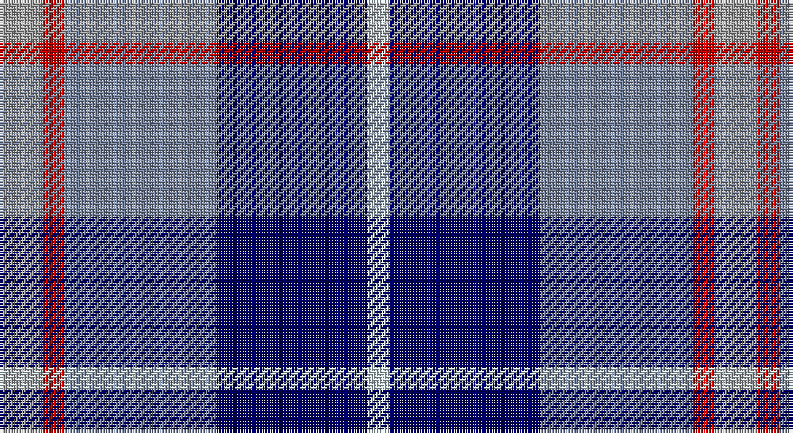

This page is one **sett** — a single exact thread-count. It belongs to the [tartan](/setts/lr2r1t7db7lb1/)
(the same proportion at any scale), whose colour order is pattern [WBBRY](/stripes/wbbry/).

Part of the [Bryson](/tartans/bryson/) tartan — the named design grouping this sett with its other cloths.

Sourced from tartans-authority.  It is a [5 stripe tartan](/stripes/stripes5/).

Original link http://www.tartansauthority.com/tartan-ferret/display/3746/

## Also known as

This cloth is also recorded under:

- Bryson Check

## Register references

External register numbers recorded for this tartan.

- Scottish Tartans Authority (ITI): 3746

## Thread count
N/16 R8 B56 DB56 LN/8

One full sett is **264 threads**.

## Palette

Palette: <strong>Tartan Register</strong> <small style="color:#888">(3 of 5 colours)</small>
<table><thead><tr><th>Colour</th><th>Threads</th><th>Shade</th><th>Base</th><th>OKLCh</th></tr></thead><tbody><tr><td>N/</td><td style="text-align:right;font-variant-numeric:tabular-nums">16</td><td><code style="background-color:#A0A0A0;">#A0A0A0</code> <small style="color:#888">#A0A0A0</small></td><td>Y <code style="background-color:#F2BF00;">#F2BF00</code></td><td><small style="color:#888">oklch(70.6% 0.000 89.9)</small></td></tr><tr><td>R</td><td style="text-align:right;font-variant-numeric:tabular-nums">8</td><td><code style="background-color:#C80000;">#C80000</code> <small style="color:#888">#C80000</small></td><td>R <code style="background-color:#CC0000;">#CC0000</code></td><td><small style="color:#888">oklch(52.3% 0.215 29.2)</small></td></tr><tr><td>B</td><td style="text-align:right;font-variant-numeric:tabular-nums">56</td><td><code style="background-color:#78849C;">#78849C</code> <small style="color:#888">#78849C</small></td><td>B <code style="background-color:#2A418A;">#2A418A</code></td><td><small style="color:#888">oklch(61.2% 0.039 264.2)</small></td></tr><tr><td>DB</td><td style="text-align:right;font-variant-numeric:tabular-nums">56</td><td><code style="background-color:#000064;">#000064</code> <small style="color:#888">#000064</small></td><td>B <code style="background-color:#2A418A;">#2A418A</code></td><td><small style="color:#888">oklch(22.7% 0.158 264.1)</small></td></tr><tr><td>LN/</td><td style="text-align:right;font-variant-numeric:tabular-nums">8</td><td><code style="background-color:#C8D8DC;">#C8D8DC</code> <small style="color:#888">#C8D8DC</small></td><td>W <code style="background-color:#F7F7F7;">#F7F7F7</code></td><td><small style="color:#888">oklch(87.1% 0.018 214.4)</small></td></tr></tbody></table>

# Sample pattern

## Compared to the master

This cloth is one sett of its design; the master sett (the exemplar the design is anchored on) is below for comparison.

<figure style="margin:0"><figcaption style="color:#888;font-size:smaller">this sett</figcaption></figure>
<figure style="margin:0"><figcaption style="color:#888;font-size:smaller"><a href="/setts/g5dp2db5dp10ly2/">master sett →</a></figcaption></figure>

## Nearest tartans

The nearest existing variants by ΔTartan distance, with this tartan at the top so the swatches line up against it.

ΔTartan

Tartan

Sett

—

<a href="/ttd/edit/#slug=lr2r1t7db7lb1~x8">Bryson (1988) (Name)</a> <a class="nn-out" href="/variants/s5/lr2r1t7db7lb1~x8/" title="open its dictionary page">↗</a>

0.64

<a href="/ttd/edit/#slug=r2db12k5t16w2~x4&amp;base=lr2r1t7db7lb1~x8">RSCDS Australia? (Corporate)</a> <a class="nn-out" href="/variants/s5/r2db12k5t16w2~x4/" title="open its dictionary page">↗</a>

1.12

<a href="/ttd/edit/#slug=r15w10db48t32r6~x2&amp;base=lr2r1t7db7lb1~x8">Lands of Liberty (Fashion)</a> <a class="nn-out" href="/variants/s5/r15w10db48t32r6~x2/" title="open its dictionary page">↗</a>

1.13

<a href="/ttd/edit/#slug=w3dt2db15t15r2~x4&amp;base=lr2r1t7db7lb1~x8">SABA</a> <a class="nn-out" href="/variants/s5/w3dt2db15t15r2~x4/" title="open its dictionary page">↗</a>

1.15

<a href="/ttd/edit/#slug=t16db3t3o3t3db10r12w4~x2&amp;base=lr2r1t7db7lb1~x8">Greer (Name?)</a> <a class="nn-out" href="/variants/s8/t16db3t3o3t3db10r12w4~x2/" title="open its dictionary page">↗</a>

1.16

<a href="/ttd/edit/#slug=db13ly2r4g2t8w2~x6&amp;base=lr2r1t7db7lb1~x8">Meh Dundee</a> <a class="nn-out" href="/variants/s6/db13ly2r4g2t8w2~x6/" title="open its dictionary page">↗</a>

1.18

<a href="/ttd/edit/#slug=y16r8b57db56lb8&amp;base=lr2r1t7db7lb1~x8">Bryson (1988)</a> <a class="nn-out" href="/variants/s5/y16r8b57db56lb8/" title="open its dictionary page">↗</a>

1.19

<a href="/ttd/edit/#slug=db2b9m1db9dg9w2~x4&amp;base=lr2r1t7db7lb1~x8">American Express</a> <a class="nn-out" href="/variants/s6/db2b9m1db9dg9w2~x4/" title="open its dictionary page">↗</a>

1.22

<a href="/ttd/edit/#slug=w2k1m10k6b12lo2~x2&amp;base=lr2r1t7db7lb1~x8">Soroptimist International (Corporate</a> <a class="nn-out" href="/variants/s6/w2k1m10k6b12lo2~x2/" title="open its dictionary page">↗</a>

1.23

<a href="/ttd/edit/#slug=k4t3dp11dg14w2~x2&amp;base=lr2r1t7db7lb1~x8">Wellington No 229</a> <a class="nn-out" href="/variants/s5/k4t3dp11dg14w2~x2/" title="open its dictionary page">↗</a>

1.23

<a href="/ttd/edit/#slug=r2t2r2t21lg11k17lb2~x2&amp;base=lr2r1t7db7lb1~x8">Loch Ness (Fashion)</a> <a class="nn-out" href="/variants/s7/r2t2r2t21lg11k17lb2~x2/" title="open its dictionary page">↗</a>

## Neighbour map

Every grey dot is one of 14360 variants placed by the first two principal components of the ΔTartan feature space (44% of its variance). Red is this tartan; blue dots are its nearest — click one to open its page.

<svg viewBox="0 0 640 380" role="img" style="max-width:100%;height:auto;border:1px solid #e0e0e0;border-radius:4px;display:block" xmlns="http://www.w3.org/2000/svg"><image href="/nn/cloud.v1.png" width="640" height="380"/><a href="/variants/s5/r2db12k5t16w2~x4/"><circle cx="182.0" cy="215.7" r="4" fill="#3465a4"><title>RSCDS Australia? (Corporate)</title></circle></a><a href="/variants/s5/r15w10db48t32r6~x2/"><circle cx="185.6" cy="224.2" r="4" fill="#3465a4"><title>Lands of Liberty (Fashion)</title></circle></a><a href="/variants/s5/w3dt2db15t15r2~x4/"><circle cx="202.9" cy="219.6" r="4" fill="#3465a4"><title>SABA</title></circle></a><a href="/variants/s8/t16db3t3o3t3db10r12w4~x2/"><circle cx="124.3" cy="204.8" r="4" fill="#3465a4"><title>Greer (Name?)</title></circle></a><a href="/variants/s6/db13ly2r4g2t8w2~x6/"><circle cx="136.5" cy="190.0" r="4" fill="#3465a4"><title>Meh Dundee</title></circle></a><a href="/variants/s5/y16r8b57db56lb8/"><circle cx="177.0" cy="221.4" r="4" fill="#3465a4"><title>Bryson (1988)</title></circle></a><a href="/variants/s6/db2b9m1db9dg9w2~x4/"><circle cx="126.7" cy="208.9" r="4" fill="#3465a4"><title>American Express</title></circle></a><a href="/variants/s6/w2k1m10k6b12lo2~x2/"><circle cx="163.9" cy="189.5" r="4" fill="#3465a4"><title>Soroptimist International (Corporate</title></circle></a><a href="/variants/s5/k4t3dp11dg14w2~x2/"><circle cx="172.9" cy="232.2" r="4" fill="#3465a4"><title>Wellington No 229</title></circle></a><a href="/variants/s7/r2t2r2t21lg11k17lb2~x2/"><circle cx="169.2" cy="171.4" r="4" fill="#3465a4"><title>Loch Ness (Fashion)</title></circle></a><circle cx="160.8" cy="213.0" r="5" fill="#c00000"/></svg>

ID: /variants/s5/lr2r1t7db7lb1~x8/
