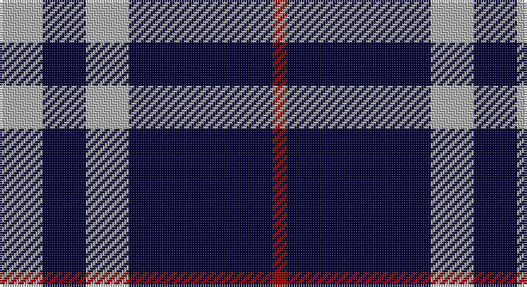

This page is one **sett** — a single exact thread-count. It belongs to the [tartan](/setts/lr3k3lr3k10r1/)
(the same proportion at any scale), whose colour order is pattern [RKYKY](/stripes/rkyky/).

Part of the [Burberry](/tartans/burberry/) tartan — the named design grouping this sett with its other cloths.

Sourced from register-of-tartans.  It is a [5 stripe tartan](/stripes/stripes5/).

Original link https://www.tartanregister.gov.uk/tartanDetails.aspx?ref=5382

## Also known as

This cloth is also recorded under:

- Burberry Black
- Burberry Blue
- Burberry Grey
- Burberry, Black
- Burberry, Grey

3 attestations — the source records this cloth was collapsed from (oldest owns this page)

<ul>
<li>01/01/1985 — Burberry Blue (register-of-tartans, <a href="https://www.tartanregister.gov.uk/tartanDetails.aspx?ref=5382">record</a>)</li>
<li>01/01/1986 — Burberry Black (register-of-tartans, <a href="https://www.tartanregister.gov.uk/tartanDetails.aspx?ref=5039">record</a>)</li>
<li>1986 — Burberry, Black (Original) (Fashion) (tartans-authority, <a href="http://www.tartansauthority.com/tartan-ferret/display/3768/">record</a>)</li>
</ul>

## Register references

External register numbers recorded for this tartan.

- Scottish Register of Tartans: [5382](https://www.tartanregister.gov.uk/tartanDetails.aspx?ref=5382)
- Scottish Tartans Authority (ITI): 3768

## Thread count
N/18 DB18 N18 DB60 DR/6

One full sett is **216 threads**.

## Palette

Palette: <strong>Tartan Register</strong> <small style="color:#888">(1 of 3 colours)</small>
<table><thead><tr><th>Colour</th><th>Threads</th><th>Shade</th><th>Base</th><th>OKLCh</th></tr></thead><tbody><tr><td>N/</td><td style="text-align:right;font-variant-numeric:tabular-nums">18</td><td><code style="background-color:#B0B0B0;">#B0B0B0</code> <small style="color:#888">#B0B0B0</small></td><td>Y <code style="background-color:#F2BF00;">#F2BF00</code></td><td><small style="color:#888">oklch(75.7% 0.000 89.9)</small></td></tr><tr><td>DB</td><td style="text-align:right;font-variant-numeric:tabular-nums">18</td><td><code style="background-color:#000034;">#000034</code> <small style="color:#888">#000034</small></td><td>K <code style="background-color:#000000;">#000000</code></td><td><small style="color:#888">oklch(14.7% 0.102 264.1)</small></td></tr><tr><td>N</td><td style="text-align:right;font-variant-numeric:tabular-nums">18</td><td><code style="background-color:#B0B0B0;">#B0B0B0</code> <small style="color:#888">#B0B0B0</small></td><td>Y <code style="background-color:#F2BF00;">#F2BF00</code></td><td><small style="color:#888">oklch(75.7% 0.000 89.9)</small></td></tr><tr><td>DB</td><td style="text-align:right;font-variant-numeric:tabular-nums">60</td><td><code style="background-color:#000034;">#000034</code> <small style="color:#888">#000034</small></td><td>K <code style="background-color:#000000;">#000000</code></td><td><small style="color:#888">oklch(14.7% 0.102 264.1)</small></td></tr><tr><td>DR/</td><td style="text-align:right;font-variant-numeric:tabular-nums">6</td><td><code style="background-color:#8C0000;">#8C0000</code> <small style="color:#888">#8C0000</small></td><td>R <code style="background-color:#CC0000;">#CC0000</code></td><td><small style="color:#888">oklch(40.2% 0.165 29.2)</small></td></tr></tbody></table>

# Sample pattern

## Compared to the master

This cloth is one sett of its design; the master sett (the exemplar the design is anchored on) is below for comparison.

<figure style="margin:0"><figcaption style="color:#888;font-size:smaller">this sett</figcaption></figure>
<figure style="margin:0"><figcaption style="color:#888;font-size:smaller"><a href="/setts/k10w10k10o32k2w2k2w2r5/">master sett →</a></figcaption></figure>

## Nearest tartans

The nearest existing variants by ΔTartan distance, with this tartan at the top so the swatches line up against it.

ΔTartan

Tartan

Sett

—

<a href="/ttd/edit/#slug=lr3k3lr3k10r1~x6">Burberry Blue</a> <a class="nn-out" href="/variants/s5/lr3k3lr3k10r1~x6/" title="open its dictionary page">↗</a>

1.08

<a href="/ttd/edit/#slug=db37w9db3r9w3~x2&amp;base=lr3k3lr3k10r1~x6">Glen Moy</a> <a class="nn-out" href="/variants/s5/db37w9db3r9w3~x2/" title="open its dictionary page">↗</a>

1.26

<a href="/ttd/edit/#slug=dt30w7dt18w11dt6ly3~x2&amp;base=lr3k3lr3k10r1~x6">Ochterlonie</a> <a class="nn-out" href="/variants/s6/dt30w7dt18w11dt6ly3~x2/" title="open its dictionary page">↗</a>

1.37

<a href="/ttd/edit/#slug=t50k4t12k23lo4k4~x2&amp;base=lr3k3lr3k10r1~x6">Sligo Irish County Tartan</a> <a class="nn-out" href="/variants/s6/t50k4t12k23lo4k4~x2/" title="open its dictionary page">↗</a>

1.39

<a href="/variants/s6/r3lo2k10w1~x6/">St. Eloi</a>

1.46

<a href="/ttd/edit/#slug=db35lr8db21lr13db6lo4~x2&amp;base=lr3k3lr3k10r1~x6">Ochterlonie</a> <a class="nn-out" href="/variants/s6/db35lr8db21lr13db6lo4~x2/" title="open its dictionary page">↗</a>

1.49

<a href="/ttd/edit/#slug=db12w1r3w1r3w1db6~x4&amp;base=lr3k3lr3k10r1~x6">BC Corps of Commissionaires</a> <a class="nn-out" href="/variants/s7/db12w1r3w1r3w1db6~x4/" title="open its dictionary page">↗</a>

1.58

<a href="/ttd/edit/#slug=lo1db6k5db6lb1~x6&amp;base=lr3k3lr3k10r1~x6">Bank of Scotland (1995)</a> <a class="nn-out" href="/variants/s5/lo1db6k5db6lb1~x6/" title="open its dictionary page">↗</a>

1.58

<a href="/ttd/edit/#slug=r3lo2k10w1~x6&amp;base=lr3k3lr3k10r1~x6">St. Eloi (Corporate)</a> <a class="nn-out" href="/variants/s4/r3lo2k10w1~x6/" title="open its dictionary page">↗</a>

1.58

<a href="/ttd/edit/#slug=r4db32k15w2~x2&amp;base=lr3k3lr3k10r1~x6">Scottish Nuclear</a> <a class="nn-out" href="/variants/s4/r4db32k15w2~x2/" title="open its dictionary page">↗</a>

1.60

<a href="/ttd/edit/#slug=db13lb3db1r3lb1~x6&amp;base=lr3k3lr3k10r1~x6">Glen Moy</a> <a class="nn-out" href="/variants/s5/db13lb3db1r3lb1~x6/" title="open its dictionary page">↗</a>

## Neighbour map

Every grey dot is one of 14360 variants placed by the first two principal components of the ΔTartan feature space (44% of its variance). Red is this tartan; blue dots are its nearest — click one to open its page.

<svg viewBox="0 0 640 380" role="img" style="max-width:100%;height:auto;border:1px solid #e0e0e0;border-radius:4px;display:block" xmlns="http://www.w3.org/2000/svg"><image href="/nn/cloud.v1.png" width="640" height="380"/><a href="/variants/s5/db37w9db3r9w3~x2/"><circle cx="368.2" cy="202.6" r="4" fill="#3465a4"><title>Glen Moy</title></circle></a><a href="/variants/s6/dt30w7dt18w11dt6ly3~x2/"><circle cx="383.1" cy="229.4" r="4" fill="#3465a4"><title>Ochterlonie</title></circle></a><a href="/variants/s6/t50k4t12k23lo4k4~x2/"><circle cx="369.2" cy="198.3" r="4" fill="#3465a4"><title>Sligo Irish County Tartan</title></circle></a><a href="/variants/s6/r3lo2k10w1~x6/"><circle cx="376.0" cy="216.7" r="4" fill="#3465a4"><title>St. Eloi</title></circle></a><a href="/variants/s6/db35lr8db21lr13db6lo4~x2/"><circle cx="387.2" cy="240.0" r="4" fill="#3465a4"><title>Ochterlonie</title></circle></a><a href="/variants/s7/db12w1r3w1r3w1db6~x4/"><circle cx="395.0" cy="207.1" r="4" fill="#3465a4"><title>BC Corps of Commissionaires</title></circle></a><a href="/variants/s5/lo1db6k5db6lb1~x6/"><circle cx="295.8" cy="264.2" r="4" fill="#3465a4"><title>Bank of Scotland (1995)</title></circle></a><a href="/variants/s4/r3lo2k10w1~x6/"><circle cx="321.9" cy="219.5" r="4" fill="#3465a4"><title>St. Eloi (Corporate)</title></circle></a><a href="/variants/s4/r4db32k15w2~x2/"><circle cx="345.8" cy="209.9" r="4" fill="#3465a4"><title>Scottish Nuclear</title></circle></a><a href="/variants/s5/db13lb3db1r3lb1~x6/"><circle cx="394.6" cy="201.9" r="4" fill="#3465a4"><title>Glen Moy</title></circle></a><circle cx="351.1" cy="237.5" r="5" fill="#c00000"/></svg>

ID: /variants/s5/lr3k3lr3k10r1~x6/
