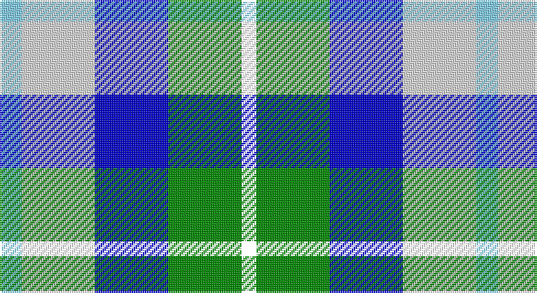

This page is one **sett** — a single exact thread-count. It belongs to the [tartan](/setts/lt3w10db10g10k2/)
(the same proportion at any scale), whose colour order is pattern [KGBWW](/stripes/kgbww/).

Part of the [MacTeddy](/tartans/macteddy/) tartan — the named design grouping this sett with its other cloths.

Sourced from register-of-tartans.  It is a [5 stripe tartan](/stripes/stripes5/).

Original link https://www.tartanregister.gov.uk/tartanDetails.aspx?ref=2771

## Register references

External register numbers recorded for this tartan.

- Scottish Register of Tartans: [2771](https://www.tartanregister.gov.uk/tartanDetails.aspx?ref=2771)
- Scottish Tartans Authority (ITI): 3985
- Scottish Tartans World Register: 2705

## Thread count
LB/12 LN40 B40 G40 R/8

One full sett is **260 threads**.

## Palette

Palette: <strong>Tartan Register</strong>
<table><thead><tr><th>Colour</th><th>Threads</th><th>Shade</th><th>Base</th><th>OKLCh</th></tr></thead><tbody><tr><td>LB/</td><td style="text-align:right;font-variant-numeric:tabular-nums">12</td><td><code style="background-color:#82CFFD;">#82CFFD</code> <small style="color:#888">#82CFFD</small></td><td>W <code style="background-color:#F7F7F7;">#F7F7F7</code></td><td><small style="color:#888">oklch(82.2% 0.100 236.0)</small></td></tr><tr><td>LN</td><td style="text-align:right;font-variant-numeric:tabular-nums">40</td><td><code style="background-color:#E0E0E0;">#E0E0E0</code> <small style="color:#888">#E0E0E0</small></td><td>W <code style="background-color:#F7F7F7;">#F7F7F7</code></td><td><small style="color:#888">oklch(90.7% 0.000 89.9)</small></td></tr><tr><td>B</td><td style="text-align:right;font-variant-numeric:tabular-nums">40</td><td><code style="background-color:#0000CD;">#0000CD</code> <small style="color:#888">#0000CD</small></td><td>B <code style="background-color:#2A418A;">#2A418A</code></td><td><small style="color:#888">oklch(38.3% 0.266 264.1)</small></td></tr><tr><td>G</td><td style="text-align:right;font-variant-numeric:tabular-nums">40</td><td><code style="background-color:#008B00;">#008B00</code> <small style="color:#888">#008B00</small></td><td>G <code style="background-color:#006100;">#006100</code></td><td><small style="color:#888">oklch(55.2% 0.188 142.5)</small></td></tr><tr><td>/</td><td style="text-align:right;font-variant-numeric:tabular-nums">8</td><td><code style="background-color:;"></code> <small style="color:#888"></small></td><td> <code style="background-color:;"></code></td><td><small style="color:#888"></small></td></tr></tbody></table>

# Sample pattern

## Nearest tartans

The nearest existing variants by ΔTartan distance, with this tartan at the top so the swatches line up against it.

ΔTartan

Tartan

Sett

—

<a href="/ttd/edit/#slug=lt3w10db10g10k2~x4">MacTeddy</a> <a class="nn-out" href="/variants/s5/lt3w10db10g10k2~x4/" title="open its dictionary page">↗</a>

1.19

<a href="/ttd/edit/#slug=t3w10db10g10r2~x4&amp;base=lt3w10db10g10k2~x4">MacTeddy</a> <a class="nn-out" href="/variants/s5/t3w10db10g10r2~x4/" title="open its dictionary page">↗</a>

1.63

<a href="/ttd/edit/#slug=b3k1lb3p4lg3~x4&amp;base=lt3w10db10g10k2~x4">Crinnion (Middlesbrough) (Personal)</a> <a class="nn-out" href="/variants/s5/b3k1lb3p4lg3~x4/" title="open its dictionary page">↗</a>

1.68

<a href="/ttd/edit/#slug=db2g13db11t4w9db2~x2&amp;base=lt3w10db10g10k2~x4">Loch Leven Check Trade Tartan</a> <a class="nn-out" href="/variants/s6/db2g13db11t4w9db2~x2/" title="open its dictionary page">↗</a>

1.72

<a href="/ttd/edit/#slug=db13w13db4ly2g8r3~x2&amp;base=lt3w10db10g10k2~x4">Unidentified (Winterbottom)</a> <a class="nn-out" href="/variants/s6/db13w13db4ly2g8r3~x2/" title="open its dictionary page">↗</a>

1.75

<a href="/ttd/edit/#slug=b2g13b11y4w9b2~x2&amp;base=lt3w10db10g10k2~x4">Loch Leven</a> <a class="nn-out" href="/variants/s6/b2g13b11y4w9b2~x2/" title="open its dictionary page">↗</a>

1.81

<a href="/ttd/edit/#slug=t19w20dt18r2k7lb15~x2&amp;base=lt3w10db10g10k2~x4">Sirrell (2014)</a> <a class="nn-out" href="/variants/s6/t19w20dt18r2k7lb15~x2/" title="open its dictionary page">↗</a>

1.82

<a href="/ttd/edit/#slug=b4ly2b16db15g16w3g3w4~x2&amp;base=lt3w10db10g10k2~x4">Business Air</a> <a class="nn-out" href="/variants/s8/b4ly2b16db15g16w3g3w4~x2/" title="open its dictionary page">↗</a>

1.84

<a href="/ttd/edit/#slug=dbi1g7dbi7db2w6dbi1w1~x4&amp;base=lt3w10db10g10k2~x4">Blue Boy, The (Fashion)</a> <a class="nn-out" href="/variants/s7/dbi1g7dbi7db2w6dbi1w1~x4/" title="open its dictionary page">↗</a>

1.85

<a href="/ttd/edit/#slug=w3b14k12g12k2ly3~x4&amp;base=lt3w10db10g10k2~x4">MacNeil of Barra (Clan)</a> <a class="nn-out" href="/variants/s6/w3b14k12g12k2ly3~x4/" title="open its dictionary page">↗</a>

1.85

<a href="/ttd/edit/#slug=r13ly13g13b22w4~x2&amp;base=lt3w10db10g10k2~x4">Clan Haggis World (Corporate)</a> <a class="nn-out" href="/variants/s5/r13ly13g13b22w4~x2/" title="open its dictionary page">↗</a>

## Neighbour map

Every grey dot is one of 14360 variants placed by the first two principal components of the ΔTartan feature space (44% of its variance). Red is this tartan; blue dots are its nearest — click one to open its page.

<svg viewBox="0 0 640 380" role="img" style="max-width:100%;height:auto;border:1px solid #e0e0e0;border-radius:4px;display:block" xmlns="http://www.w3.org/2000/svg"><image href="/nn/cloud.v1.png" width="640" height="380"/><a href="/variants/s5/t3w10db10g10r2~x4/"><circle cx="52.4" cy="239.3" r="4" fill="#3465a4"><title>MacTeddy</title></circle></a><a href="/variants/s5/b3k1lb3p4lg3~x4/"><circle cx="14.0" cy="270.6" r="4" fill="#3465a4"><title>Crinnion (Middlesbrough) (Personal)</title></circle></a><a href="/variants/s6/db2g13db11t4w9db2~x2/"><circle cx="131.0" cy="233.8" r="4" fill="#3465a4"><title>Loch Leven Check Trade Tartan</title></circle></a><a href="/variants/s6/db13w13db4ly2g8r3~x2/"><circle cx="113.0" cy="207.2" r="4" fill="#3465a4"><title>Unidentified (Winterbottom)</title></circle></a><a href="/variants/s6/b2g13b11y4w9b2~x2/"><circle cx="131.2" cy="234.4" r="4" fill="#3465a4"><title>Loch Leven</title></circle></a><a href="/variants/s6/t19w20dt18r2k7lb15~x2/"><circle cx="14.0" cy="185.8" r="4" fill="#3465a4"><title>Sirrell (2014)</title></circle></a><a href="/variants/s8/b4ly2b16db15g16w3g3w4~x2/"><circle cx="95.1" cy="182.7" r="4" fill="#3465a4"><title>Business Air</title></circle></a><a href="/variants/s7/dbi1g7dbi7db2w6dbi1w1~x4/"><circle cx="115.9" cy="203.8" r="4" fill="#3465a4"><title>Blue Boy, The (Fashion)</title></circle></a><a href="/variants/s6/w3b14k12g12k2ly3~x4/"><circle cx="86.3" cy="216.7" r="4" fill="#3465a4"><title>MacNeil of Barra (Clan)</title></circle></a><a href="/variants/s5/r13ly13g13b22w4~x2/"><circle cx="51.1" cy="238.0" r="4" fill="#3465a4"><title>Clan Haggis World (Corporate)</title></circle></a><circle cx="32.7" cy="237.1" r="5" fill="#c00000"/></svg>

ID: /variants/s5/lt3w10db10g10k2~x4/
