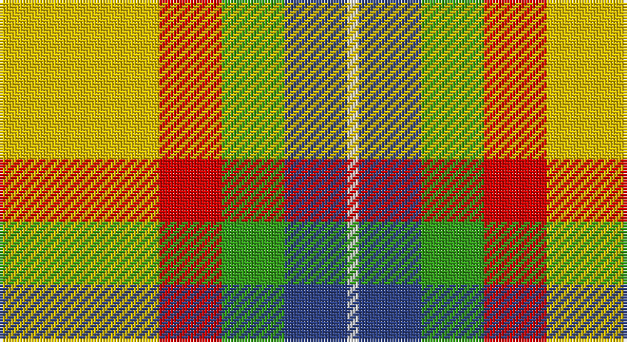

This page is one **sett** — a single exact thread-count. It belongs to the [tartan](/setts/ly28r11g11db11w2/)
(the same proportion at any scale), whose colour order is pattern [WBGRY](/stripes/wbgry/).

Part of the [Samye](/tartans/samye/) tartan — the named design grouping this sett with its other cloths.

Sourced from register-of-tartans.  It is a [5 stripe tartan](/stripes/stripes5/).

Original link https://www.tartanregister.gov.uk/tartanDetails.aspx?ref=5888

## Also known as

This cloth is also recorded under:

- Samye #2

## Register references

External register numbers recorded for this tartan.

- Scottish Register of Tartans: [5888](https://www.tartanregister.gov.uk/tartanDetails.aspx?ref=5888)
- Scottish Tartans World Register: 3169

## Thread count
Y/56 R22 G22 B22 LN/4

One full sett is **192 threads**.

## Palette

Palette: <strong>Tartan Register</strong> <small style="color:#888">(4 of 5 colours)</small>
<table><thead><tr><th>Colour</th><th>Threads</th><th>Shade</th><th>Base</th><th>OKLCh</th></tr></thead><tbody><tr><td>Y/</td><td style="text-align:right;font-variant-numeric:tabular-nums">56</td><td><code style="background-color:#E8C000;">#E8C000</code> <small style="color:#888">#E8C000</small></td><td>Y <code style="background-color:#F2BF00;">#F2BF00</code></td><td><small style="color:#888">oklch(81.9% 0.168 93.7)</small></td></tr><tr><td>R</td><td style="text-align:right;font-variant-numeric:tabular-nums">22</td><td><code style="background-color:#DC0000;">#DC0000</code> <small style="color:#888">#DC0000</small></td><td>R <code style="background-color:#CC0000;">#CC0000</code></td><td><small style="color:#888">oklch(56.2% 0.230 29.2)</small></td></tr><tr><td>G</td><td style="text-align:right;font-variant-numeric:tabular-nums">22</td><td><code style="background-color:#309C18;">#309C18</code> <small style="color:#888">#309C18</small></td><td>G <code style="background-color:#006100;">#006100</code></td><td><small style="color:#888">oklch(60.8% 0.188 140.8)</small></td></tr><tr><td>B</td><td style="text-align:right;font-variant-numeric:tabular-nums">22</td><td><code style="background-color:#2C4084;">#2C4084</code> <small style="color:#888">#2C4084</small></td><td>B <code style="background-color:#2A418A;">#2A418A</code></td><td><small style="color:#888">oklch(39.4% 0.117 268.3)</small></td></tr><tr><td>LN/</td><td style="text-align:right;font-variant-numeric:tabular-nums">4</td><td><code style="background-color:#E0E0E0;">#E0E0E0</code> <small style="color:#888">#E0E0E0</small></td><td>W <code style="background-color:#F7F7F7;">#F7F7F7</code></td><td><small style="color:#888">oklch(90.7% 0.000 89.9)</small></td></tr></tbody></table>

# Sample pattern

## Compared to the master

This cloth is one sett of its design; the master sett (the exemplar the design is anchored on) is below for comparison.

<figure style="margin:0"><figcaption style="color:#888;font-size:smaller">this sett</figcaption></figure>
<figure style="margin:0"><figcaption style="color:#888;font-size:smaller"><a href="/setts/ly25r10g10db11w2/">master sett →</a></figcaption></figure>

## Nearest tartans

The nearest existing variants by ΔTartan distance, with this tartan at the top so the swatches line up against it.

ΔTartan

Tartan

Sett

—

<a href="/ttd/edit/#slug=ly28r11g11db11w2~x2">Samye #2</a> <a class="nn-out" href="/variants/s5/ly28r11g11db11w2~x2/" title="open its dictionary page">↗</a>

0.71

<a href="/ttd/edit/#slug=ly25r10g10db11w2~x2&amp;base=ly28r11g11db11w2~x2">Samye</a> <a class="nn-out" href="/variants/s5/ly25r10g10db11w2~x2/" title="open its dictionary page">↗</a>

1.29

<a href="/ttd/edit/#slug=r1w12g6r8t3ly1~x4&amp;base=ly28r11g11db11w2~x2">MacLean, dress</a> <a class="nn-out" href="/variants/s6/r1w12g6r8t3ly1~x4/" title="open its dictionary page">↗</a>

1.33

<a href="/ttd/edit/#slug=o3w3k3lo10r1~x6&amp;base=ly28r11g11db11w2~x2">Burberry Counterfeit</a> <a class="nn-out" href="/variants/s5/o3w3k3lo10r1~x6/" title="open its dictionary page">↗</a>

1.41

<a href="/ttd/edit/#slug=lo13g8k5lb3w2r1~x4&amp;base=ly28r11g11db11w2~x2">Ball Hunting</a> <a class="nn-out" href="/variants/s6/lo13g8k5lb3w2r1~x4/" title="open its dictionary page">↗</a>

1.45

<a href="/ttd/edit/#slug=r1w12g6r8lb3lo1~x4&amp;base=ly28r11g11db11w2~x2">MacLean Dress (Lumsden)</a> <a class="nn-out" href="/variants/s6/r1w12g6r8lb3lo1~x4/" title="open its dictionary page">↗</a>

1.57

<a href="/ttd/edit/#slug=k5lyi2dy7ly18dy2w2~x4&amp;base=ly28r11g11db11w2~x2">Shepherd Piping (Personal)</a> <a class="nn-out" href="/variants/s6/k5lyi2dy7ly18dy2w2~x4/" title="open its dictionary page">↗</a>

1.59

<a href="/ttd/edit/#slug=r34w3dg4g23w24k3dg4~x2&amp;base=ly28r11g11db11w2~x2">MacLachlan, dress</a> <a class="nn-out" href="/variants/s7/r34w3dg4g23w24k3dg4~x2/" title="open its dictionary page">↗</a>

1.63

<a href="/ttd/edit/#slug=r2w2ly27g14ly2db14ly2~x2&amp;base=ly28r11g11db11w2~x2">Fraser, Yellow</a> <a class="nn-out" href="/variants/s7/r2w2ly27g14ly2db14ly2~x2/" title="open its dictionary page">↗</a>

1.66

<a href="/ttd/edit/#slug=ly4r2ly21dt11w2o21lyi4~x2&amp;base=ly28r11g11db11w2~x2">Barbour - Muted</a> <a class="nn-out" href="/variants/s7/ly4r2ly21dt11w2o21lyi4~x2/" title="open its dictionary page">↗</a>

1.66

<a href="/ttd/edit/#slug=ly32k21r16lr6dt4~x2&amp;base=ly28r11g11db11w2~x2">Scottish American Athletic Assoc</a> <a class="nn-out" href="/variants/s5/ly32k21r16lr6dt4~x2/" title="open its dictionary page">↗</a>

## Neighbour map

Every grey dot is one of 14360 variants placed by the first two principal components of the ΔTartan feature space (44% of its variance). Red is this tartan; blue dots are its nearest — click one to open its page.

<svg viewBox="0 0 640 380" role="img" style="max-width:100%;height:auto;border:1px solid #e0e0e0;border-radius:4px;display:block" xmlns="http://www.w3.org/2000/svg"><image href="/nn/cloud.v1.png" width="640" height="380"/><a href="/variants/s5/ly25r10g10db11w2~x2/"><circle cx="158.9" cy="184.5" r="4" fill="#3465a4"><title>Samye</title></circle></a><a href="/variants/s6/r1w12g6r8t3ly1~x4/"><circle cx="157.9" cy="165.6" r="4" fill="#3465a4"><title>MacLean, dress</title></circle></a><a href="/variants/s5/o3w3k3lo10r1~x6/"><circle cx="211.7" cy="187.0" r="4" fill="#3465a4"><title>Burberry Counterfeit</title></circle></a><a href="/variants/s6/lo13g8k5lb3w2r1~x4/"><circle cx="140.7" cy="153.5" r="4" fill="#3465a4"><title>Ball Hunting</title></circle></a><a href="/variants/s6/r1w12g6r8lb3lo1~x4/"><circle cx="148.4" cy="159.7" r="4" fill="#3465a4"><title>MacLean Dress (Lumsden)</title></circle></a><a href="/variants/s6/k5lyi2dy7ly18dy2w2~x4/"><circle cx="207.0" cy="162.7" r="4" fill="#3465a4"><title>Shepherd Piping (Personal)</title></circle></a><a href="/variants/s7/r34w3dg4g23w24k3dg4~x2/"><circle cx="148.0" cy="151.7" r="4" fill="#3465a4"><title>MacLachlan, dress</title></circle></a><a href="/variants/s7/r2w2ly27g14ly2db14ly2~x2/"><circle cx="227.8" cy="143.9" r="4" fill="#3465a4"><title>Fraser, Yellow</title></circle></a><a href="/variants/s7/ly4r2ly21dt11w2o21lyi4~x2/"><circle cx="147.8" cy="145.2" r="4" fill="#3465a4"><title>Barbour - Muted</title></circle></a><a href="/variants/s5/ly32k21r16lr6dt4~x2/"><circle cx="129.9" cy="197.9" r="4" fill="#3465a4"><title>Scottish American Athletic Assoc</title></circle></a><circle cx="182.5" cy="181.0" r="5" fill="#c00000"/></svg>

ID: /variants/s5/ly28r11g11db11w2~x2/
