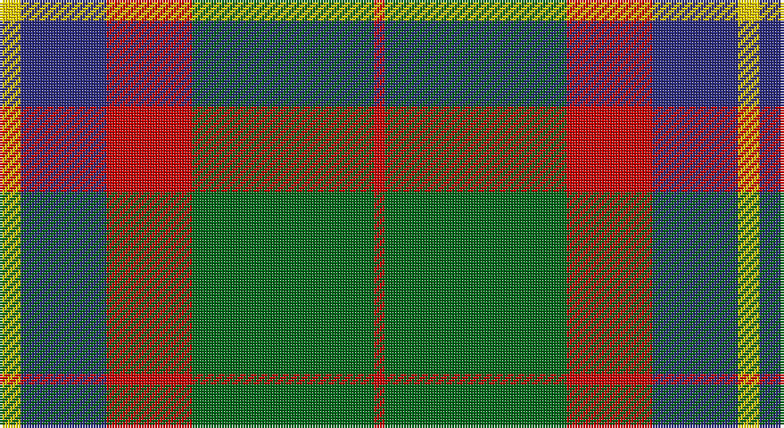

This page is one **sett** — a single exact thread-count. It belongs to the [tartan](/setts/ly2db8r8g17r1/)
(the same proportion at any scale), whose colour order is pattern [RGRBY](/stripes/rgrby/).

Part of the [British Hills](/tartans/british-hills/) tartan — the named design grouping this sett with its other cloths.

Sourced from tartans-authority.  It is a [5 stripe tartan](/stripes/stripes5/).

Original link http://www.tartansauthority.com/tartan-ferret/display/11235/

## Register references

External register numbers recorded for this tartan.

- Scottish Register of Tartans: [11235](https://www.tartanregister.gov.uk/tartanDetails?ref=11235)
- Scottish Tartans Authority (ITI): 11235

## Thread count
Y/8 DB32 R32 G68 R/4

One full sett is **276 threads**.

## Palette

Palette: <strong>Tartan Register</strong>
<table><thead><tr><th>Colour</th><th>Threads</th><th>Shade</th><th>Base</th><th>OKLCh</th></tr></thead><tbody><tr><td>Y/</td><td style="text-align:right;font-variant-numeric:tabular-nums">8</td><td><code style="background-color:#FCCC00;">#FCCC00</code> <small style="color:#888">#FCCC00</small></td><td>Y <code style="background-color:#F2BF00;">#F2BF00</code></td><td><small style="color:#888">oklch(86.2% 0.176 91.5)</small></td></tr><tr><td>DB</td><td style="text-align:right;font-variant-numeric:tabular-nums">32</td><td><code style="background-color:#2C2C80;">#2C2C80</code> <small style="color:#888">#2C2C80</small></td><td>B <code style="background-color:#2A418A;">#2A418A</code></td><td><small style="color:#888">oklch(35.0% 0.138 276.6)</small></td></tr><tr><td>R</td><td style="text-align:right;font-variant-numeric:tabular-nums">32</td><td><code style="background-color:#C80000;">#C80000</code> <small style="color:#888">#C80000</small></td><td>R <code style="background-color:#CC0000;">#CC0000</code></td><td><small style="color:#888">oklch(52.3% 0.215 29.2)</small></td></tr><tr><td>G</td><td style="text-align:right;font-variant-numeric:tabular-nums">68</td><td><code style="background-color:#006818;">#006818</code> <small style="color:#888">#006818</small></td><td>G <code style="background-color:#006100;">#006100</code></td><td><small style="color:#888">oklch(45.0% 0.142 145.0)</small></td></tr><tr><td>R/</td><td style="text-align:right;font-variant-numeric:tabular-nums">4</td><td><code style="background-color:#C80000;">#C80000</code> <small style="color:#888">#C80000</small></td><td>R <code style="background-color:#CC0000;">#CC0000</code></td><td><small style="color:#888">oklch(52.3% 0.215 29.2)</small></td></tr></tbody></table>

# Sample pattern

## Compared to the master

This cloth is one sett of its design; the master sett (the exemplar the design is anchored on) is below for comparison.

<figure style="margin:0"><figcaption style="color:#888;font-size:smaller">this sett</figcaption></figure>
<figure style="margin:0"><figcaption style="color:#888;font-size:smaller"><a href="/setts/r2dg17r8db8ly2/">master sett →</a></figcaption></figure>

## Nearest tartans

The nearest existing variants by ΔTartan distance, with this tartan at the top so the swatches line up against it.

ΔTartan

Tartan

Sett

—

<a href="/ttd/edit/#slug=ly2db8r8g17r1~x4">British Hills</a> <a class="nn-out" href="/variants/s5/ly2db8r8g17r1~x4/" title="open its dictionary page">↗</a>

0.98

<a href="/ttd/edit/#slug=g12t6g6r15k1r1k2~x4&amp;base=ly2db8r8g17r1~x4">McCook/Cook (Name)</a> <a class="nn-out" href="/variants/s7/g12t6g6r15k1r1k2~x4/" title="open its dictionary page">↗</a>

1.04

<a href="/ttd/edit/#slug=r4k2lb10k10y28k3~x2&amp;base=ly2db8r8g17r1~x4">Thomson Camel (Jedburgh Mill)</a> <a class="nn-out" href="/variants/s6/r4k2lb10k10y28k3~x2/" title="open its dictionary page">↗</a>

1.13

<a href="/ttd/edit/#slug=ly2dg17g4r15dg1~x2&amp;base=ly2db8r8g17r1~x4">Christmas</a> <a class="nn-out" href="/variants/s5/ly2dg17g4r15dg1~x2/" title="open its dictionary page">↗</a>

1.14

<a href="/ttd/edit/#slug=db1r5g18r4db9r10w1~x4&amp;base=ly2db8r8g17r1~x4">MacKintosh, Geddes</a> <a class="nn-out" href="/variants/s7/db1r5g18r4db9r10w1~x4/" title="open its dictionary page">↗</a>

1.14

<a href="/ttd/edit/#slug=t3dy26g4t13k13t2~x2&amp;base=ly2db8r8g17r1~x4">MacTavish Hunting Clan Tartan</a> <a class="nn-out" href="/variants/s6/t3dy26g4t13k13t2~x2/" title="open its dictionary page">↗</a>

1.19

<a href="/ttd/edit/#slug=n11k4r4lo4n1~x4&amp;base=ly2db8r8g17r1~x4">Ikelman #2 (Personal)</a> <a class="nn-out" href="/variants/s5/n11k4r4lo4n1~x4/" title="open its dictionary page">↗</a>

1.22

<a href="/ttd/edit/#slug=dp9lr4dp1lr4g15r4dp1~x4&amp;base=ly2db8r8g17r1~x4">Logan #3</a> <a class="nn-out" href="/variants/s7/dp9lr4dp1lr4g15r4dp1~x4/" title="open its dictionary page">↗</a>

1.23

<a href="/ttd/edit/#slug=dg12g6dg6r15k1r1k2~x2&amp;base=ly2db8r8g17r1~x4">Cook (Name)</a> <a class="nn-out" href="/variants/s7/dg12g6dg6r15k1r1k2~x2/" title="open its dictionary page">↗</a>

1.25

<a href="/ttd/edit/#slug=g30ly3db8r25~x2&amp;base=ly2db8r8g17r1~x4">Dohmen (Personal)</a> <a class="nn-out" href="/variants/s4/g30ly3db8r25~x2/" title="open its dictionary page">↗</a>

1.25

<a href="/ttd/edit/#slug=k2o20k8dg18o3w2~x2&amp;base=ly2db8r8g17r1~x4">Celtic Combat</a> <a class="nn-out" href="/variants/s6/k2o20k8dg18o3w2~x2/" title="open its dictionary page">↗</a>

## Neighbour map

Every grey dot is one of 14360 variants placed by the first two principal components of the ΔTartan feature space (44% of its variance). Red is this tartan; blue dots are its nearest — click one to open its page.

<svg viewBox="0 0 640 380" role="img" style="max-width:100%;height:auto;border:1px solid #e0e0e0;border-radius:4px;display:block" xmlns="http://www.w3.org/2000/svg"><image href="/nn/cloud.v1.png" width="640" height="380"/><a href="/variants/s7/g12t6g6r15k1r1k2~x4/"><circle cx="248.7" cy="189.5" r="4" fill="#3465a4"><title>McCook/Cook (Name)</title></circle></a><a href="/variants/s6/r4k2lb10k10y28k3~x2/"><circle cx="260.4" cy="177.6" r="4" fill="#3465a4"><title>Thomson Camel (Jedburgh Mill)</title></circle></a><a href="/variants/s5/ly2dg17g4r15dg1~x2/"><circle cx="301.4" cy="200.9" r="4" fill="#3465a4"><title>Christmas</title></circle></a><a href="/variants/s7/db1r5g18r4db9r10w1~x4/"><circle cx="248.6" cy="182.9" r="4" fill="#3465a4"><title>MacKintosh, Geddes</title></circle></a><a href="/variants/s6/t3dy26g4t13k13t2~x2/"><circle cx="251.6" cy="215.6" r="4" fill="#3465a4"><title>MacTavish Hunting Clan Tartan</title></circle></a><a href="/variants/s5/n11k4r4lo4n1~x4/"><circle cx="266.0" cy="232.6" r="4" fill="#3465a4"><title>Ikelman #2 (Personal)</title></circle></a><a href="/variants/s7/dp9lr4dp1lr4g15r4dp1~x4/"><circle cx="210.4" cy="177.3" r="4" fill="#3465a4"><title>Logan #3</title></circle></a><a href="/variants/s7/dg12g6dg6r15k1r1k2~x2/"><circle cx="252.7" cy="191.8" r="4" fill="#3465a4"><title>Cook (Name)</title></circle></a><a href="/variants/s4/g30ly3db8r25~x2/"><circle cx="262.4" cy="247.4" r="4" fill="#3465a4"><title>Dohmen (Personal)</title></circle></a><a href="/variants/s6/k2o20k8dg18o3w2~x2/"><circle cx="236.7" cy="205.1" r="4" fill="#3465a4"><title>Celtic Combat</title></circle></a><circle cx="265.2" cy="202.6" r="5" fill="#c00000"/></svg>

ID: /variants/s5/ly2db8r8g17r1~x4/
