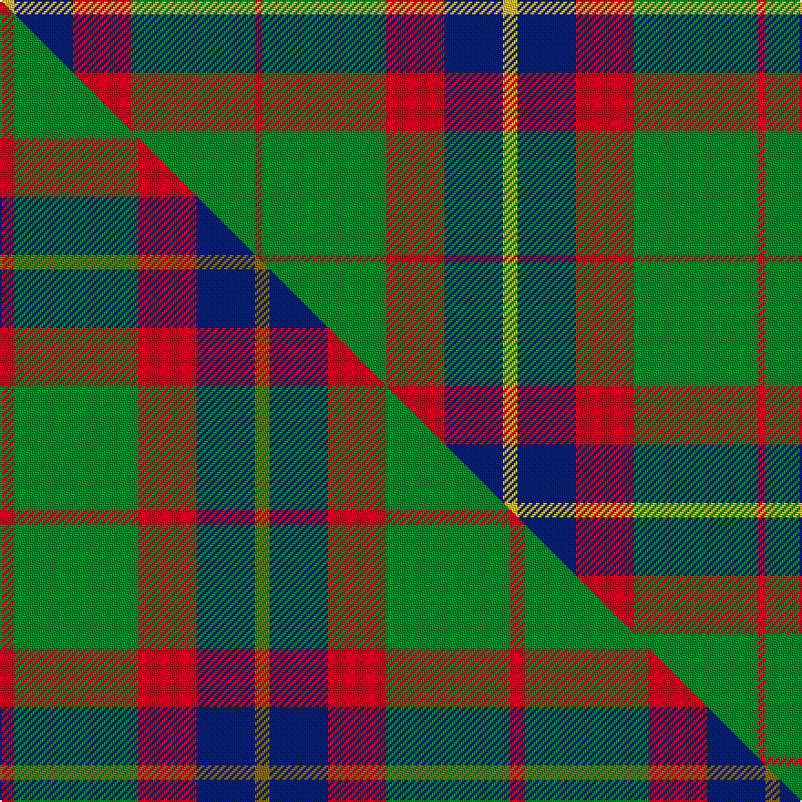

This page is one **sett** — a single exact thread-count. It belongs to the [tartan](/setts/ly2db8r8g17r1/)
(the same proportion at any scale), whose colour order is pattern [RGRBY](/stripes/rgrby/).

Part of the [British Hills](/tartans/british-hills/) tartan — the named design grouping this sett with its other cloths.

Sourced from tartans-authority.  It is a [5 stripe tartan](/stripes/stripes5/).

Original link http://www.tartansauthority.com/tartan-ferret/display/11235/

## Register references

External register numbers recorded for this tartan.

- Scottish Register of Tartans: [11235](https://www.tartanregister.gov.uk/tartanDetails?ref=11235)
- Scottish Tartans Authority (ITI): 11235

## Thread count
LY/8 DB32 R32 G68 R/4

One full sett is **276 threads**.

## Palette
<table><thead><tr><th>Colour</th><th>Shade</th><th>OKLCh</th></tr></thead><tbody><tr><td>DB</td><td><code style="background-color:#082077;">#082077</code> <small style="color:#888">#082077</small></td><td><small style="color:#888">oklch(30.0% 0.149 265.1)</small></td></tr><tr><td>G</td><td><code style="background-color:#008B2A;">#008B2A</code> <small style="color:#888">#008B2A</small></td><td><small style="color:#888">oklch(55.4% 0.170 145.9)</small></td></tr><tr><td>R</td><td><code style="background-color:#D60020;">#D60020</code> <small style="color:#888">#D60020</small></td><td><small style="color:#888">oklch(55.2% 0.224 25.5)</small></td></tr><tr><td>LY</td><td><code style="background-color:#DCBC32;">#DCBC32</code> <small style="color:#888">#DCBC32</small></td><td><small style="color:#888">oklch(80.0% 0.150 95.2)</small></td></tr></tbody></table>

# Sample pattern

## Compared to the master

This cloth is one sett of its design; the master sett (the exemplar the design is anchored on) is below for comparison.

Its **ΔTartan distance** from the master is **1.11** — the same measure the nearest-tartans table ranks by (0 is identical; a re-scale of the same cloth is near 0, a recolour or a different proportion further).

<figure class="master-compare" style="margin:0">

this sett
master sett ★

<figcaption style="color:#888;font-size:smaller">One weave of this sett against the <a href="/setts/r2g17r8db8y2/">master sett ★</a>, split on the diagonal: a shared proportion runs seamlessly across it with only the shades shifting; a different proportion breaks on it.</figcaption>
</figure>

## Nearest tartan variants

The nearest existing variants by ΔTartan distance, with this cloth at the top so the swatches line up against it.

ΔTartan

Threads

Variant

Sett

—

276

<a href="/variants/s5/ly2db8r8g17r1~x4/">British Hills</a>

<a href="/ttd/edit/#slug=r2g17r8db8y2~x4&amp;base=ly2db8r8g17r1~x4" title="compare in the TTD">0.54</a>

280

<a href="/variants/s5/r2g17r8db8y2~x4/">British Hills</a>

<a href="/ttd/edit/#slug=g30ly3db8r25~x2&amp;base=ly2db8r8g17r1~x4" title="compare in the TTD">1.68</a>

154

<a href="/variants/s4/g30ly3db8r25~x2/">Dohmen (Personal)</a>

<a href="/ttd/edit/#slug=g30y3db8r25~x2&amp;base=ly2db8r8g17r1~x4" title="compare in the TTD">1.68</a>

154

<a href="/variants/s4/g30y3db8r25~x2/">Dohmen Family (Zuid-Nederland)</a>

<a href="/ttd/edit/#slug=r15w1db4y1g15~x4&amp;base=ly2db8r8g17r1~x4" title="compare in the TTD">2.00</a>

168

<a href="/variants/s5/r15w1db4y1g15~x4/">Eglinton, Duke of (Artefact)</a>

<a href="/ttd/edit/#slug=y28r11g11db11w2~x2&amp;base=ly2db8r8g17r1~x4" title="compare in the TTD">2.17</a>

192

<a href="/variants/s5/y28r11g11db11w2~x2/">Samye #2</a>

<a href="/ttd/edit/#slug=y25r10g10db11w2~x2&amp;base=ly2db8r8g17r1~x4" title="compare in the TTD">2.17</a>

178

<a href="/variants/s5/y25r10g10db11w2~x2/">Samye</a>

<a href="/ttd/edit/#slug=db24r27g20y6g20r2lb3~x2&amp;base=ly2db8r8g17r1~x4" title="compare in the TTD">2.18</a>

354

<a href="/variants/s7/db24r27g20y6g20r2lb3~x2/">Buchanhaven Heritage</a>

<a href="/ttd/edit/#slug=w3g15db18r15g1r2~x2&amp;base=ly2db8r8g17r1~x4" title="compare in the TTD">2.24</a>

206

<a href="/variants/s6/w3g15db18r15g1r2~x2/">Nibley</a>

<a href="/ttd/edit/#slug=g15r3dr11lb2~x2&amp;base=ly2db8r8g17r1~x4" title="compare in the TTD">2.34</a>

90

<a href="/variants/s4/g15r3dr11lb2~x2/">MacNab WI 2</a>

<a href="/ttd/edit/#slug=g15r3dr11lb2&amp;base=ly2db8r8g17r1~x4" title="compare in the TTD">2.34</a>

45

<a href="/variants/s4/g15r3dr11lb2/">MacNab WI2</a>

## Neighbour map

Every grey dot is one of 13620 variants placed by the first two principal components of the ΔTartan feature space (42% of its variance). Red is this tartan; blue dots are its nearest — click one to open its page.

<svg viewBox="0 0 640 380" role="img" style="max-width:100%;height:auto;border:1px solid #e0e0e0;border-radius:4px;display:block" xmlns="http://www.w3.org/2000/svg"><image href="/nn/cloud.v1.png" width="640" height="380"/><a href="/variants/s5/r2g17r8db8y2~x4/"><circle cx="248.5" cy="240.1" r="4" fill="#3465a4"><title>British Hills</title></circle></a><a href="/variants/s4/g30ly3db8r25~x2/"><circle cx="265.7" cy="247.2" r="4" fill="#3465a4"><title>Dohmen (Personal)</title></circle></a><a href="/variants/s4/g30y3db8r25~x2/"><circle cx="272.9" cy="249.2" r="4" fill="#3465a4"><title>Dohmen Family (Zuid-Nederland)</title></circle></a><a href="/variants/s5/r15w1db4y1g15~x4/"><circle cx="257.2" cy="189.5" r="4" fill="#3465a4"><title>Eglinton, Duke of (Artefact)</title></circle></a><a href="/variants/s5/y28r11g11db11w2~x2/"><circle cx="243.0" cy="221.9" r="4" fill="#3465a4"><title>Samye #2</title></circle></a><a href="/variants/s5/y25r10g10db11w2~x2/"><circle cx="226.2" cy="228.0" r="4" fill="#3465a4"><title>Samye</title></circle></a><a href="/variants/s7/db24r27g20y6g20r2lb3~x2/"><circle cx="195.7" cy="203.5" r="4" fill="#3465a4"><title>Buchanhaven Heritage</title></circle></a><a href="/variants/s6/w3g15db18r15g1r2~x2/"><circle cx="200.1" cy="193.8" r="4" fill="#3465a4"><title>Nibley</title></circle></a><a href="/variants/s4/g15r3dr11lb2~x2/"><circle cx="272.8" cy="259.2" r="4" fill="#3465a4"><title>MacNab WI 2</title></circle></a><a href="/variants/s4/g15r3dr11lb2/"><circle cx="272.8" cy="259.2" r="4" fill="#3465a4"><title>MacNab WI2</title></circle></a><circle cx="268.7" cy="207.5" r="5" fill="#c00000"/><text x="320" y="376" text-anchor="middle" font-size="11" fill="#999">ground</text><text x="11" y="190" text-anchor="middle" font-size="11" fill="#999" transform="rotate(-90 11 190)">complexity</text></svg>

ID: /variants/s5/ly2db8r8g17r1~x4/
