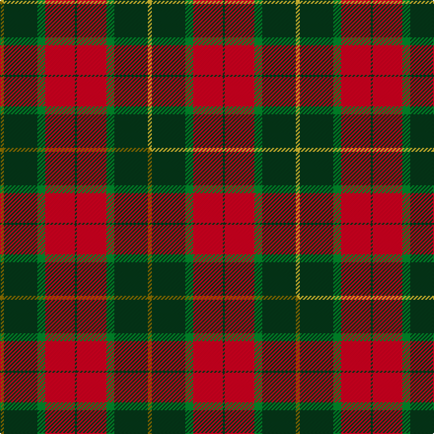

This page is one **sett** — a single exact thread-count. It belongs to the [tartan](/setts/ly2dg17g4r15dg1/)
(the same proportion at any scale), whose colour order is pattern [GRGGY](/stripes/grggy/).

Part of the [Christmas](/tartans/christmas/) tartan — the named design grouping this sett with its other cloths.

Sourced from tartans-authority.  It is a [5 stripe tartan](/stripes/stripes5/).

Original link http://www.tartansauthority.com/tartan-ferret/display/10554/

## Register references

External register numbers recorded for this tartan.

- Scottish Register of Tartans: [10554](https://www.tartanregister.gov.uk/tartanDetails?ref=10554)
- Scottish Tartans Authority (ITI): 10554

## Thread count
LY/4 DG34 G8 R30 DG/2

One full sett is **150 threads**.

## Palette
<table><thead><tr><th>Colour</th><th>Shade</th><th>OKLCh</th></tr></thead><tbody><tr><td>DG</td><td><code style="background-color:#053819;">#053819</code> <small style="color:#888">#053819</small></td><td><small style="color:#888">oklch(30.0% 0.075 151.3)</small></td></tr><tr><td>G</td><td><code style="background-color:#008B2A;">#008B2A</code> <small style="color:#888">#008B2A</small></td><td><small style="color:#888">oklch(55.4% 0.170 145.9)</small></td></tr><tr><td>R</td><td><code style="background-color:#D60020;">#D60020</code> <small style="color:#888">#D60020</small></td><td><small style="color:#888">oklch(55.2% 0.224 25.5)</small></td></tr><tr><td>LY</td><td><code style="background-color:#DCBC32;">#DCBC32</code> <small style="color:#888">#DCBC32</small></td><td><small style="color:#888">oklch(80.0% 0.150 95.2)</small></td></tr></tbody></table>

# Sample pattern

## Compared to the master

This cloth is one sett of its design; the master sett (the exemplar the design is anchored on) is below for comparison.

Its **ΔTartan distance** from the master is **0.41** — the same measure the nearest-tartans table ranks by (0 is identical; a re-scale of the same cloth is near 0, a recolour or a different proportion further).

<figure class="master-compare" style="margin:0">

this sett
master sett ★

<figcaption style="color:#888;font-size:smaller">One weave of this sett against the <a href="/setts/y2dg17g4r15dg1/">master sett ★</a>, split on the diagonal: a shared proportion runs seamlessly across it with only the shades shifting; a different proportion breaks on it.</figcaption>
</figure>

## Nearest variants

The nearest existing variants by ΔTartan distance, with this cloth at the top so the swatches line up against it.

ΔTartan

Threads

Variant

Sett

—

150

<a href="/variants/s5/ly2dg17g4r15dg1~x2/">Christmas (Fashion)</a>

<a href="/ttd/edit/#slug=y2dg17g4r15dg1~x2&amp;base=ly2dg17g4r15dg1~x2" title="compare in the TTD">0.00</a>

150

<a href="/variants/s5/y2dg17g4r15dg1~x2/">Christmas</a>

<a href="/ttd/edit/#slug=db1r12g6y1g6db1~x4&amp;base=ly2dg17g4r15dg1~x2" title="compare in the TTD">1.18</a>

208

<a href="/variants/s6/db1r12g6y1g6db1~x4/">Cetoloni (Personal)</a>

<a href="/ttd/edit/#slug=dt12w2dt13dg3g2r24g3~x2&amp;base=ly2dg17g4r15dg1~x2" title="compare in the TTD">1.46</a>

206

<a href="/variants/s7/dt12w2dt13dg3g2r24g3~x2/">Wellmont Foundation (Corporate)</a>

<a href="/ttd/edit/#slug=db8y4r30dg30lo3dg4~x2&amp;base=ly2dg17g4r15dg1~x2" title="compare in the TTD">1.52</a>

292

<a href="/variants/s6/db8y4r30dg30lo3dg4~x2/">Hutcheson (Name)</a>

<a href="/ttd/edit/#slug=r15w1db4y1g15~x4&amp;base=ly2dg17g4r15dg1~x2" title="compare in the TTD">1.65</a>

168

<a href="/variants/s5/r15w1db4y1g15~x4/">Eglinton, Duke of (Artefact)</a>

<a href="/ttd/edit/#slug=g30y3db8r25~x2&amp;base=ly2dg17g4r15dg1~x2" title="compare in the TTD">1.79</a>

154

<a href="/variants/s4/g30y3db8r25~x2/">Dohmen Family (Zuid-Nederland)</a>

<a href="/ttd/edit/#slug=g30ly3db8r25~x2&amp;base=ly2dg17g4r15dg1~x2" title="compare in the TTD">1.79</a>

154

<a href="/variants/s4/g30ly3db8r25~x2/">Dohmen (Personal)</a>

<a href="/ttd/edit/#slug=dg24r3dg16r33w4&amp;base=ly2dg17g4r15dg1~x2" title="compare in the TTD">1.80</a>

132

<a href="/variants/s5/dg24r3dg16r33w4/">Unidentified Plaid #3</a>

<a href="/ttd/edit/#slug=dg7w1dg18db6r18dg2~x2&amp;base=ly2dg17g4r15dg1~x2" title="compare in the TTD">1.88</a>

190

<a href="/variants/s6/dg7w1dg18db6r18dg2~x2/">Finlaggan</a>

<a href="/ttd/edit/#slug=g5w2r27g27r5w2~x2&amp;base=ly2dg17g4r15dg1~x2" title="compare in the TTD">2.25</a>

258

<a href="/variants/s6/g5w2r27g27r5w2~x2/">MacDonald of Glenaladale (symmetrical)</a>

## Neighbour map

Every grey dot is one of 13620 variants placed by the first two principal components of the ΔTartan feature space (42% of its variance). Red is this tartan; blue dots are its nearest — click one to open its page.

<svg viewBox="0 0 640 380" role="img" style="max-width:100%;height:auto;border:1px solid #e0e0e0;border-radius:4px;display:block" xmlns="http://www.w3.org/2000/svg"><image href="/nn/cloud.v1.png" width="640" height="380"/><a href="/variants/s5/y2dg17g4r15dg1~x2/"><circle cx="309.0" cy="202.4" r="4" fill="#3465a4"><title>Christmas</title></circle></a><a href="/variants/s6/db1r12g6y1g6db1~x4/"><circle cx="300.0" cy="208.2" r="4" fill="#3465a4"><title>Cetoloni (Personal)</title></circle></a><a href="/variants/s7/dt12w2dt13dg3g2r24g3~x2/"><circle cx="242.8" cy="179.2" r="4" fill="#3465a4"><title>Wellmont Foundation (Corporate)</title></circle></a><a href="/variants/s6/db8y4r30dg30lo3dg4~x2/"><circle cx="247.8" cy="194.7" r="4" fill="#3465a4"><title>Hutcheson (Name)</title></circle></a><a href="/variants/s5/r15w1db4y1g15~x4/"><circle cx="257.2" cy="189.5" r="4" fill="#3465a4"><title>Eglinton, Duke of (Artefact)</title></circle></a><a href="/variants/s4/g30y3db8r25~x2/"><circle cx="272.9" cy="249.2" r="4" fill="#3465a4"><title>Dohmen Family (Zuid-Nederland)</title></circle></a><a href="/variants/s4/g30ly3db8r25~x2/"><circle cx="265.7" cy="247.2" r="4" fill="#3465a4"><title>Dohmen (Personal)</title></circle></a><a href="/variants/s5/dg24r3dg16r33w4/"><circle cx="316.7" cy="233.1" r="4" fill="#3465a4"><title>Unidentified Plaid #3</title></circle></a><a href="/variants/s6/dg7w1dg18db6r18dg2~x2/"><circle cx="316.8" cy="193.9" r="4" fill="#3465a4"><title>Finlaggan</title></circle></a><a href="/variants/s6/g5w2r27g27r5w2~x2/"><circle cx="338.3" cy="206.3" r="4" fill="#3465a4"><title>MacDonald of Glenaladale (symmetrical)</title></circle></a><circle cx="295.2" cy="198.0" r="5" fill="#c00000"/><text x="320" y="376" text-anchor="middle" font-size="11" fill="#999">ground</text><text x="11" y="190" text-anchor="middle" font-size="11" fill="#999" transform="rotate(-90 11 190)">complexity</text></svg>

ID: /variants/s5/ly2dg17g4r15dg1~x2/
