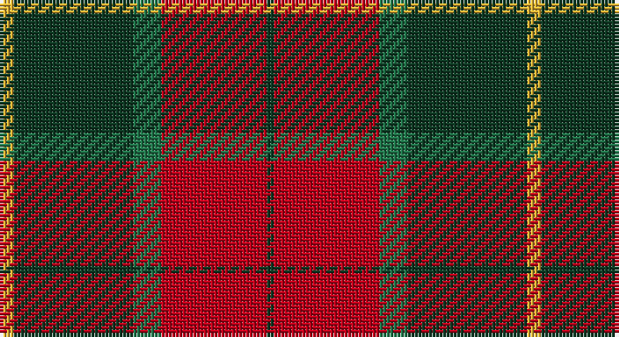

This page is one **sett** — a single exact thread-count. It belongs to the [tartan](/setts/ly2dg17g4r15dg1/)
(the same proportion at any scale), whose colour order is pattern [GRGGY](/stripes/grggy/).

Sourced from register-of-tartans.  It is a [5 stripe tartan](/stripes/stripes5/).

Original link https://www.tartanregister.gov.uk/tartanDetails.aspx?ref=10554

2 attestations — the source records this cloth was collapsed from (oldest owns this page)

<ul>
<li>25/12/2011 — Christmas (register-of-tartans, <a href="https://www.tartanregister.gov.uk/tartanDetails.aspx?ref=10554">record</a>)</li>
<li>25th Dec. 2011 — Christmas (Fashion) (tartans-authority, <a href="http://www.tartansauthority.com/tartan-ferret/display/10554/">record</a>)</li>
</ul>

## Register references

External register numbers recorded for this tartan.

- Scottish Register of Tartans: [10554](https://www.tartanregister.gov.uk/tartanDetails?ref=10554)
- Scottish Tartans Authority (ITI): 10554

## Thread count
Y/4 DG34 G8 R30 DG/2

One full sett is **150 threads**.

## Palette

Palette: <strong>custom</strong>
<table><thead><tr><th>Colour</th><th>Threads</th><th>Shade</th><th>Base</th><th>OKLCh</th></tr></thead><tbody><tr><td>Y/</td><td style="text-align:right;font-variant-numeric:tabular-nums">4</td><td><code style="background-color:#E3B235;">#E3B235</code> <small style="color:#888">#E3B235</small></td><td>Y <code style="background-color:#F2BF00;">#F2BF00</code></td><td><small style="color:#888">oklch(78.8% 0.145 86.0)</small></td></tr><tr><td>DG</td><td style="text-align:right;font-variant-numeric:tabular-nums">34</td><td><code style="background-color:#0E3923;">#0E3923</code> <small style="color:#888">#0E3923</small></td><td>G <code style="background-color:#006100;">#006100</code></td><td><small style="color:#888">oklch(30.8% 0.062 157.1)</small></td></tr><tr><td>G</td><td style="text-align:right;font-variant-numeric:tabular-nums">8</td><td><code style="background-color:#207449;">#207449</code> <small style="color:#888">#207449</small></td><td>G <code style="background-color:#006100;">#006100</code></td><td><small style="color:#888">oklch(49.8% 0.105 156.4)</small></td></tr><tr><td>R</td><td style="text-align:right;font-variant-numeric:tabular-nums">30</td><td><code style="background-color:#BB001A;">#BB001A</code> <small style="color:#888">#BB001A</small></td><td>R <code style="background-color:#CC0000;">#CC0000</code></td><td><small style="color:#888">oklch(49.9% 0.202 25.6)</small></td></tr><tr><td>DG/</td><td style="text-align:right;font-variant-numeric:tabular-nums">2</td><td><code style="background-color:#0E3923;">#0E3923</code> <small style="color:#888">#0E3923</small></td><td>G <code style="background-color:#006100;">#006100</code></td><td><small style="color:#888">oklch(30.8% 0.062 157.1)</small></td></tr></tbody></table>

# Sample pattern

## Nearest tartans

The nearest existing variants by ΔTartan distance, with this tartan at the top so the swatches line up against it.

ΔTartan

Tartan

Sett

—

<a href="/ttd/edit/#slug=ly2dg17g4r15dg1~x2">Christmas</a> <a class="nn-out" href="/variants/s5/ly2dg17g4r15dg1~x2/" title="open its dictionary page">↗</a>

0.63

<a href="/ttd/edit/#slug=r30k8dg30b4r3b2~x2&amp;base=ly2dg17g4r15dg1~x2">Plummer Family Personal Tartan</a> <a class="nn-out" href="/variants/s6/r30k8dg30b4r3b2~x2/" title="open its dictionary page">↗</a>

0.88

<a href="/ttd/edit/#slug=k6r2dg17r16k1t2~x2&amp;base=ly2dg17g4r15dg1~x2">Unidentified #15</a> <a class="nn-out" href="/variants/s6/k6r2dg17r16k1t2~x2/" title="open its dictionary page">↗</a>

0.90

<a href="/ttd/edit/#slug=lb2dr12g6dr1n6dr1~x4&amp;base=ly2dg17g4r15dg1~x2">Fraser Green</a> <a class="nn-out" href="/variants/s6/lb2dr12g6dr1n6dr1~x4/" title="open its dictionary page">↗</a>

0.91

<a href="/ttd/edit/#slug=dg7w1dg18db6r18dg2~x2&amp;base=ly2dg17g4r15dg1~x2">Finlaggan</a> <a class="nn-out" href="/variants/s6/dg7w1dg18db6r18dg2~x2/" title="open its dictionary page">↗</a>

0.93

<a href="/ttd/edit/#slug=dg12g6dg6r15k1r1k2~x2&amp;base=ly2dg17g4r15dg1~x2">Cook (Name)</a> <a class="nn-out" href="/variants/s7/dg12g6dg6r15k1r1k2~x2/" title="open its dictionary page">↗</a>

1.00

<a href="/ttd/edit/#slug=db6lo25dy16k2db3~x2&amp;base=ly2dg17g4r15dg1~x2">Prince of Orange #2</a> <a class="nn-out" href="/variants/s5/db6lo25dy16k2db3~x2/" title="open its dictionary page">↗</a>

1.01

<a href="/ttd/edit/#slug=db1r12g6ly1g6db1~x4&amp;base=ly2dg17g4r15dg1~x2">Cetoloni (Personal)</a> <a class="nn-out" href="/variants/s6/db1r12g6ly1g6db1~x4/" title="open its dictionary page">↗</a>

1.04

<a href="/ttd/edit/#slug=dp8r3ly1r3dg14r3ly1~x4&amp;base=ly2dg17g4r15dg1~x2">Logan - 1819 (with yellow)</a> <a class="nn-out" href="/variants/s7/dp8r3ly1r3dg14r3ly1~x4/" title="open its dictionary page">↗</a>

1.06

<a href="/ttd/edit/#slug=k2r16dg6r3dg8lr1~x2&amp;base=ly2dg17g4r15dg1~x2">MacAulay</a> <a class="nn-out" href="/variants/s6/k2r16dg6r3dg8lr1~x2/" title="open its dictionary page">↗</a>

1.06

<a href="/ttd/edit/#slug=k2r16dg6r3dg8lr1&amp;base=ly2dg17g4r15dg1~x2">MacAulay</a> <a class="nn-out" href="/variants/s6/k2r16dg6r3dg8lr1/" title="open its dictionary page">↗</a>

## Neighbour map

Every grey dot is one of 14360 variants placed by the first two principal components of the ΔTartan feature space (44% of its variance). Red is this tartan; blue dots are its nearest — click one to open its page.

<svg viewBox="0 0 640 380" role="img" style="max-width:100%;height:auto;border:1px solid #e0e0e0;border-radius:4px;display:block" xmlns="http://www.w3.org/2000/svg"><image href="/nn/cloud.v1.png" width="640" height="380"/><a href="/variants/s6/r30k8dg30b4r3b2~x2/"><circle cx="280.0" cy="188.3" r="4" fill="#3465a4"><title>Plummer Family Personal Tartan</title></circle></a><a href="/variants/s6/k6r2dg17r16k1t2~x2/"><circle cx="258.0" cy="179.2" r="4" fill="#3465a4"><title>Unidentified #15</title></circle></a><a href="/variants/s6/lb2dr12g6dr1n6dr1~x4/"><circle cx="287.9" cy="212.9" r="4" fill="#3465a4"><title>Fraser Green</title></circle></a><a href="/variants/s6/dg7w1dg18db6r18dg2~x2/"><circle cx="316.9" cy="197.8" r="4" fill="#3465a4"><title>Finlaggan</title></circle></a><a href="/variants/s7/dg12g6dg6r15k1r1k2~x2/"><circle cx="252.7" cy="191.8" r="4" fill="#3465a4"><title>Cook (Name)</title></circle></a><a href="/variants/s5/db6lo25dy16k2db3~x2/"><circle cx="276.5" cy="201.1" r="4" fill="#3465a4"><title>Prince of Orange #2</title></circle></a><a href="/variants/s6/db1r12g6ly1g6db1~x4/"><circle cx="287.5" cy="198.5" r="4" fill="#3465a4"><title>Cetoloni (Personal)</title></circle></a><a href="/variants/s7/dp8r3ly1r3dg14r3ly1~x4/"><circle cx="248.0" cy="181.0" r="4" fill="#3465a4"><title>Logan - 1819 (with yellow)</title></circle></a><a href="/variants/s6/k2r16dg6r3dg8lr1~x2/"><circle cx="342.2" cy="198.2" r="4" fill="#3465a4"><title>MacAulay</title></circle></a><a href="/variants/s6/k2r16dg6r3dg8lr1/"><circle cx="342.2" cy="198.2" r="4" fill="#3465a4"><title>MacAulay</title></circle></a><circle cx="301.4" cy="200.9" r="5" fill="#c00000"/></svg>

ID: /variants/s5/ly2dg17g4r15dg1~x2/
