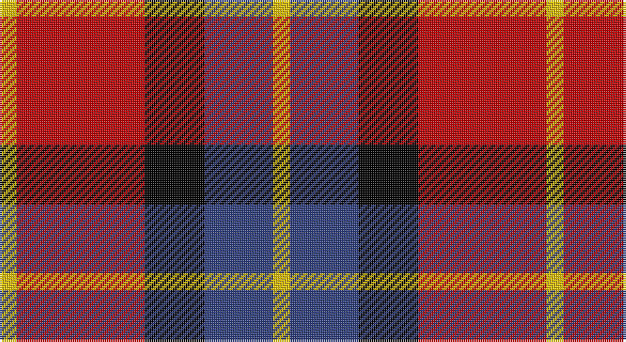

This page is one **sett** — a single exact thread-count. It belongs to the [tartan](/setts/ly2r15k7db8ly2/)
(the same proportion at any scale), whose colour order is pattern [YBKRY](/stripes/ybkry/).

Part of the [Aberdeen University](/tartans/aberdeen-university/) tartan — the named design grouping this sett with its other cloths.

Sourced from weddslist.  It is a [5 stripe tartan](/stripes/stripes5/).

Original link http://www.weddslist.com/cgi-bin/tartans/pg.pl?source=sts

## Provenance

Earliest known date: 1993 Aberdeen Unversity tartan was designed by the Weaver Incorporation of Aberdeen and Harry Lindley, to commemorate the Quincentennial of the University. The colours of the armourial bearings of the University were used as the starting point of the design, which was approved by the Principal in August 1992.

2 attestations — the source records this cloth was collapsed from (oldest owns this page)

<ul>
<li>undated — Aberdeen University (weddslist, <a href="http://www.weddslist.com/cgi-bin/tartans/pg.pl?source=sts">record</a>)</li>
<li>undated — Aberdeen University Corporate Tartan (house-of-tartan, <a href="http://www.house-of-tartan.scotland.net/house/TartanViewjs.asp?colr=Def&tnam=2152">record</a>)</li>
</ul>

## Thread count
Y/8 R60 K28 B32 Y/8

One full sett is **256 threads**.

## Palette

Palette: <strong>Ingles Buchan</strong> <small style="color:#888">(1 of 4 colours)</small>
<table><thead><tr><th>Colour</th><th>Threads</th><th>Shade</th><th>Base</th><th>OKLCh</th></tr></thead><tbody><tr><td>Y/</td><td style="text-align:right;font-variant-numeric:tabular-nums">8</td><td><code style="background-color:#F0C000;">#F0C000</code> <small style="color:#888">#F0C000</small></td><td>Y <code style="background-color:#F2BF00;">#F2BF00</code></td><td><small style="color:#888">oklch(82.7% 0.169 90.5)</small></td></tr><tr><td>R</td><td style="text-align:right;font-variant-numeric:tabular-nums">60</td><td><code style="background-color:#C00000;">#C00000</code> <small style="color:#888">#C00000</small></td><td>R <code style="background-color:#CC0000;">#CC0000</code></td><td><small style="color:#888">oklch(50.7% 0.208 29.2)</small></td></tr><tr><td>K</td><td style="text-align:right;font-variant-numeric:tabular-nums">28</td><td><code style="background-color:#000000;">#000000</code> <small style="color:#888">#000000</small></td><td>K <code style="background-color:#000000;">#000000</code></td><td><small style="color:#888">oklch(0.0% 0.000 0.0)</small></td></tr><tr><td>B</td><td style="text-align:right;font-variant-numeric:tabular-nums">32</td><td><code style="background-color:#304080;">#304080</code> <small style="color:#888">#304080</small></td><td>B <code style="background-color:#2A418A;">#2A418A</code></td><td><small style="color:#888">oklch(39.4% 0.109 270.2)</small></td></tr><tr><td>Y/</td><td style="text-align:right;font-variant-numeric:tabular-nums">8</td><td><code style="background-color:#F0C000;">#F0C000</code> <small style="color:#888">#F0C000</small></td><td>Y <code style="background-color:#F2BF00;">#F2BF00</code></td><td><small style="color:#888">oklch(82.7% 0.169 90.5)</small></td></tr></tbody></table>

# Sample pattern

## Compared to the master

This cloth is one sett of its design; the master sett (the exemplar the design is anchored on) is below for comparison.

<figure style="margin:0"><figcaption style="color:#888;font-size:smaller">this sett</figcaption></figure>
<figure style="margin:0"><figcaption style="color:#888;font-size:smaller"><a href="/setts/ly4r27k12db15ly4/">master sett →</a></figcaption></figure>

## Nearest tartans

The nearest existing variants by ΔTartan distance, with this tartan at the top so the swatches line up against it.

ΔTartan

Tartan

Sett

—

<a href="/ttd/edit/#slug=ly2r15k7db8ly2~x4">Aberdeen University</a> <a class="nn-out" href="/variants/s5/ly2r15k7db8ly2~x4/" title="open its dictionary page">↗</a>

0.65

<a href="/ttd/edit/#slug=lb5r34k22r4o24r4~x2&amp;base=ly2r15k7db8ly2~x4">Wcwm 759-2</a> <a class="nn-out" href="/variants/s6/lb5r34k22r4o24r4~x2/" title="open its dictionary page">↗</a>

0.68

<a href="/ttd/edit/#slug=ly4r27k12db15ly4~x2&amp;base=ly2r15k7db8ly2~x4">Aberdeen University (1992)</a> <a class="nn-out" href="/variants/s5/ly4r27k12db15ly4~x2/" title="open its dictionary page">↗</a>

0.75

<a href="/ttd/edit/#slug=r15g3w2k10w5~x2&amp;base=ly2r15k7db8ly2~x4">SAL Cubiska Stenen</a> <a class="nn-out" href="/variants/s5/r15g3w2k10w5~x2/" title="open its dictionary page">↗</a>

0.98

<a href="/ttd/edit/#slug=r26t3r4k16db16k4~x2&amp;base=ly2r15k7db8ly2~x4">Graham of Menteith, (Red)</a> <a class="nn-out" href="/variants/s6/r26t3r4k16db16k4~x2/" title="open its dictionary page">↗</a>

1.06

<a href="/ttd/edit/#slug=r4k25o25w4~x2&amp;base=ly2r15k7db8ly2~x4">Bonhill Primary School</a> <a class="nn-out" href="/variants/s4/r4k25o25w4~x2/" title="open its dictionary page">↗</a>

1.10

<a href="/ttd/edit/#slug=w1r8k8ly1~x4&amp;base=ly2r15k7db8ly2~x4">Connel (Clan)</a> <a class="nn-out" href="/variants/s4/w1r8k8ly1~x4/" title="open its dictionary page">↗</a>

1.14

<a href="/ttd/edit/#slug=w3db12k12r20g2~x2&amp;base=ly2r15k7db8ly2~x4">Baillie of Polkemett</a> <a class="nn-out" href="/variants/s5/w3db12k12r20g2~x2/" title="open its dictionary page">↗</a>

1.14

<a href="/ttd/edit/#slug=lb5o34k24o4r24o4~x2&amp;base=ly2r15k7db8ly2~x4">Wcwm 759-3</a> <a class="nn-out" href="/variants/s6/lb5o34k24o4r24o4~x2/" title="open its dictionary page">↗</a>

1.18

<a href="/ttd/edit/#slug=lb2r12db2lb6k6lb1&amp;base=ly2r15k7db8ly2~x4">MacTavish</a> <a class="nn-out" href="/variants/s6/lb2r12db2lb6k6lb1/" title="open its dictionary page">↗</a>

1.20

<a href="/ttd/edit/#slug=w3r24db12dg8lo3~x2&amp;base=ly2r15k7db8ly2~x4">McGill University (Corporate)</a> <a class="nn-out" href="/variants/s5/w3r24db12dg8lo3~x2/" title="open its dictionary page">↗</a>

## Neighbour map

Every grey dot is one of 14360 variants placed by the first two principal components of the ΔTartan feature space (44% of its variance). Red is this tartan; blue dots are its nearest — click one to open its page.

<svg viewBox="0 0 640 380" role="img" style="max-width:100%;height:auto;border:1px solid #e0e0e0;border-radius:4px;display:block" xmlns="http://www.w3.org/2000/svg"><image href="/nn/cloud.v1.png" width="640" height="380"/><a href="/variants/s6/lb5r34k22r4o24r4~x2/"><circle cx="205.7" cy="203.8" r="4" fill="#3465a4"><title>Wcwm 759-2</title></circle></a><a href="/variants/s5/ly4r27k12db15ly4~x2/"><circle cx="187.3" cy="223.5" r="4" fill="#3465a4"><title>Aberdeen University (1992)</title></circle></a><a href="/variants/s5/r15g3w2k10w5~x2/"><circle cx="165.2" cy="207.1" r="4" fill="#3465a4"><title>SAL Cubiska Stenen</title></circle></a><a href="/variants/s6/r26t3r4k16db16k4~x2/"><circle cx="205.3" cy="208.7" r="4" fill="#3465a4"><title>Graham of Menteith, (Red)</title></circle></a><a href="/variants/s4/r4k25o25w4~x2/"><circle cx="213.9" cy="236.2" r="4" fill="#3465a4"><title>Bonhill Primary School</title></circle></a><a href="/variants/s4/w1r8k8ly1~x4/"><circle cx="238.7" cy="218.8" r="4" fill="#3465a4"><title>Connel (Clan)</title></circle></a><a href="/variants/s5/w3db12k12r20g2~x2/"><circle cx="160.0" cy="196.2" r="4" fill="#3465a4"><title>Baillie of Polkemett</title></circle></a><a href="/variants/s6/lb5o34k24o4r24o4~x2/"><circle cx="190.3" cy="203.2" r="4" fill="#3465a4"><title>Wcwm 759-3</title></circle></a><a href="/variants/s6/lb2r12db2lb6k6lb1/"><circle cx="185.0" cy="174.4" r="4" fill="#3465a4"><title>MacTavish</title></circle></a><a href="/variants/s5/w3r24db12dg8lo3~x2/"><circle cx="209.2" cy="196.0" r="4" fill="#3465a4"><title>McGill University (Corporate)</title></circle></a><circle cx="185.1" cy="214.9" r="5" fill="#c00000"/></svg>

ID: /variants/s5/ly2r15k7db8ly2~x4/
