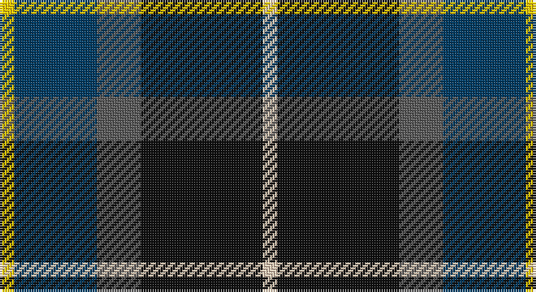

This page is one **sett** — a single exact thread-count. It belongs to the [tartan](/setts/ly3dt17n9k25lb3/)
(the same proportion at any scale), whose colour order is pattern [WKBBY](/stripes/wkbby/).

Part of the [Teylu Coleman](/tartans/teylu-coleman/) tartan — the named design grouping this sett with its other cloths.

Sourced from tartans-authority.  It is a [5 stripe tartan](/stripes/stripes5/).

Original link http://www.tartansauthority.com/tartan-ferret/display/10792/

## Register references

External register numbers recorded for this tartan.

- Scottish Register of Tartans: [10792](https://www.tartanregister.gov.uk/tartanDetails?ref=10792)
- Scottish Tartans Authority (ITI): 10792

## Thread count
Y/6 DB34 N18 K50 LR/6

One full sett is **216 threads**.

## Palette

Palette: <strong>Tartan Register</strong> <small style="color:#888">(4 of 5 colours)</small>
<table><thead><tr><th>Colour</th><th>Threads</th><th>Shade</th><th>Base</th><th>OKLCh</th></tr></thead><tbody><tr><td>Y/</td><td style="text-align:right;font-variant-numeric:tabular-nums">6</td><td><code style="background-color:#FCCC00;">#FCCC00</code> <small style="color:#888">#FCCC00</small></td><td>Y <code style="background-color:#F2BF00;">#F2BF00</code></td><td><small style="color:#888">oklch(86.2% 0.176 91.5)</small></td></tr><tr><td>DB</td><td style="text-align:right;font-variant-numeric:tabular-nums">34</td><td><code style="background-color:#003C64;">#003C64</code> <small style="color:#888">#003C64</small></td><td>B <code style="background-color:#2A418A;">#2A418A</code></td><td><small style="color:#888">oklch(34.5% 0.089 246.0)</small></td></tr><tr><td>N</td><td style="text-align:right;font-variant-numeric:tabular-nums">18</td><td><code style="background-color:#5C5C5C;">#5C5C5C</code> <small style="color:#888">#5C5C5C</small></td><td>B <code style="background-color:#2A418A;">#2A418A</code></td><td><small style="color:#888">oklch(47.5% 0.000 89.9)</small></td></tr><tr><td>K</td><td style="text-align:right;font-variant-numeric:tabular-nums">50</td><td><code style="background-color:#101010;">#101010</code> <small style="color:#888">#101010</small></td><td>K <code style="background-color:#000000;">#000000</code></td><td><small style="color:#888">oklch(17.3% 0.000 89.9)</small></td></tr><tr><td>LR/</td><td style="text-align:right;font-variant-numeric:tabular-nums">6</td><td><code style="background-color:#E8CCB8;">#E8CCB8</code> <small style="color:#888">#E8CCB8</small></td><td>W <code style="background-color:#F7F7F7;">#F7F7F7</code></td><td><small style="color:#888">oklch(86.3% 0.042 57.7)</small></td></tr></tbody></table>

# Sample pattern

## Compared to the master

This cloth is one sett of its design; the master sett (the exemplar the design is anchored on) is below for comparison.

<figure style="margin:0"><figcaption style="color:#888;font-size:smaller">this sett</figcaption></figure>
<figure style="margin:0"><figcaption style="color:#888;font-size:smaller"><a href="/setts/w3k25do9dp17ly3/">master sett →</a></figcaption></figure>

## Nearest tartans

The nearest existing variants by ΔTartan distance, with this tartan at the top so the swatches line up against it.

ΔTartan

Tartan

Sett

—

<a href="/ttd/edit/#slug=ly3dt17n9k25lb3~x2">Teylu Coleman (Name)</a> <a class="nn-out" href="/variants/s5/ly3dt17n9k25lb3~x2/" title="open its dictionary page">↗</a>

0.61

<a href="/ttd/edit/#slug=w3k25do9dp17ly3~x2&amp;base=ly3dt17n9k25lb3~x2">Teylu Coleman (Cornwall)</a> <a class="nn-out" href="/variants/s5/w3k25do9dp17ly3~x2/" title="open its dictionary page">↗</a>

0.73

<a href="/ttd/edit/#slug=db15r6dg8k2w2k2~x6&amp;base=ly3dt17n9k25lb3~x2">Stovell (2015)</a> <a class="nn-out" href="/variants/s6/db15r6dg8k2w2k2~x6/" title="open its dictionary page">↗</a>

0.81

<a href="/ttd/edit/#slug=r4db24k12g14k4lb3~x2&amp;base=ly3dt17n9k25lb3~x2">MacPhail Hunting #2</a> <a class="nn-out" href="/variants/s6/r4db24k12g14k4lb3~x2/" title="open its dictionary page">↗</a>

0.81

<a href="/ttd/edit/#slug=k4t3dp11dg14w2~x2&amp;base=ly3dt17n9k25lb3~x2">Wellington No 229</a> <a class="nn-out" href="/variants/s5/k4t3dp11dg14w2~x2/" title="open its dictionary page">↗</a>

0.84

<a href="/ttd/edit/#slug=k7t3o30dt30w3~x2&amp;base=ly3dt17n9k25lb3~x2">Douglas, brown</a> <a class="nn-out" href="/variants/s5/k7t3o30dt30w3~x2/" title="open its dictionary page">↗</a>

0.85

<a href="/ttd/edit/#slug=db22w2k10g11r3g4~x2&amp;base=ly3dt17n9k25lb3~x2">Paterson Blue (Personal)</a> <a class="nn-out" href="/variants/s6/db22w2k10g11r3g4~x2/" title="open its dictionary page">↗</a>

0.88

<a href="/ttd/edit/#slug=k4w1g10k10db10r2~x4&amp;base=ly3dt17n9k25lb3~x2">Rose Hunting</a> <a class="nn-out" href="/variants/s6/k4w1g10k10db10r2~x4/" title="open its dictionary page">↗</a>

0.92

<a href="/ttd/edit/#slug=dg5db2dg9dbi19dr9ly2~x2&amp;base=ly3dt17n9k25lb3~x2">Lyle and Scott</a> <a class="nn-out" href="/variants/s6/dg5db2dg9dbi19dr9ly2~x2/" title="open its dictionary page">↗</a>

0.93

<a href="/ttd/edit/#slug=db31b4db5k19g20ly4~x2&amp;base=ly3dt17n9k25lb3~x2">Midlothian</a> <a class="nn-out" href="/variants/s6/db31b4db5k19g20ly4~x2/" title="open its dictionary page">↗</a>

0.94

<a href="/ttd/edit/#slug=k4w1g10k10db10r2~x2&amp;base=ly3dt17n9k25lb3~x2">Rose Hunting Clan Tartan</a> <a class="nn-out" href="/variants/s6/k4w1g10k10db10r2~x2/" title="open its dictionary page">↗</a>

## Neighbour map

Every grey dot is one of 14360 variants placed by the first two principal components of the ΔTartan feature space (44% of its variance). Red is this tartan; blue dots are its nearest — click one to open its page.

<svg viewBox="0 0 640 380" role="img" style="max-width:100%;height:auto;border:1px solid #e0e0e0;border-radius:4px;display:block" xmlns="http://www.w3.org/2000/svg"><image href="/nn/cloud.v1.png" width="640" height="380"/><a href="/variants/s5/w3k25do9dp17ly3~x2/"><circle cx="198.2" cy="222.9" r="4" fill="#3465a4"><title>Teylu Coleman (Cornwall)</title></circle></a><a href="/variants/s6/db15r6dg8k2w2k2~x6/"><circle cx="182.0" cy="211.7" r="4" fill="#3465a4"><title>Stovell (2015)</title></circle></a><a href="/variants/s6/r4db24k12g14k4lb3~x2/"><circle cx="172.4" cy="221.9" r="4" fill="#3465a4"><title>MacPhail Hunting #2</title></circle></a><a href="/variants/s5/k4t3dp11dg14w2~x2/"><circle cx="172.9" cy="232.2" r="4" fill="#3465a4"><title>Wellington No 229</title></circle></a><a href="/variants/s5/k7t3o30dt30w3~x2/"><circle cx="216.1" cy="202.7" r="4" fill="#3465a4"><title>Douglas, brown</title></circle></a><a href="/variants/s6/db22w2k10g11r3g4~x2/"><circle cx="203.8" cy="205.8" r="4" fill="#3465a4"><title>Paterson Blue (Personal)</title></circle></a><a href="/variants/s6/k4w1g10k10db10r2~x4/"><circle cx="166.4" cy="224.3" r="4" fill="#3465a4"><title>Rose Hunting</title></circle></a><a href="/variants/s6/dg5db2dg9dbi19dr9ly2~x2/"><circle cx="202.9" cy="222.8" r="4" fill="#3465a4"><title>Lyle and Scott</title></circle></a><a href="/variants/s6/db31b4db5k19g20ly4~x2/"><circle cx="158.7" cy="210.0" r="4" fill="#3465a4"><title>Midlothian</title></circle></a><a href="/variants/s6/k4w1g10k10db10r2~x2/"><circle cx="170.5" cy="226.5" r="4" fill="#3465a4"><title>Rose Hunting Clan Tartan</title></circle></a><circle cx="192.0" cy="222.9" r="5" fill="#c00000"/></svg>

ID: /variants/s5/ly3dt17n9k25lb3~x2/
