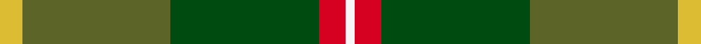

This page is one **sett** — a single exact thread-count. It belongs to the [tartan](/setts/ly5g33dg33r6w2/)
(the same proportion at any scale), whose colour order is pattern [WRGGY](/stripes/wrggy/).

Sourced from register-of-tartans.  It is a [5 stripe tartan](/stripes/stripes5/).

Original link https://www.tartanregister.gov.uk/tartanDetails.aspx?ref=4060

2 attestations — the source records this cloth was collapsed from (oldest owns this page)

<ul>
<li>01/04/2007 — Symington (register-of-tartans, <a href="https://www.tartanregister.gov.uk/tartanDetails.aspx?ref=4060">record</a>)  <em>The result of a design competition held after the August 2006 International Symington reunion. 'Thomas Dickson was granted the lands of Symington in Lanarkshire for services to Lord Douglas. Thomas Dickson was then called Thomas of Symonstown hence Symington.' Tartan is based on the Douglas with overchecks of red, white and gold taken from the Simontown coat of arms. Can be worn by all of the name and spelling variations. Weaving restricted (April 2007) to D C Dalgliesh. Woven sample.</em></li>
<li>April 2007 — Symington (Name) (tartans-authority, <a href="http://www.tartansauthority.com/tartan-ferret/display/7178/">record</a>)  <em>The result of a design competition held after the August 2006 International Symington reunion."Thomas Dickson was granted the lands of Symington in Lanarkshire for services to Lord Douglas. Thomas Dickson was then called Thomas of Symonstown hence Symington." Tartan is based on the Douglas with overchecks of red, white and gold taken from the Simontown coat of arms. Can be worn by all of the name and spelling variations. Weaving restricted (April 2007) to D C Dalgliesh. Woven sample.</em></li>
</ul>

## Register references

External register numbers recorded for this tartan.

- Scottish Register of Tartans: [4060](https://www.tartanregister.gov.uk/tartanDetails.aspx?ref=4060)
- Scottish Tartans Authority (ITI): 7178

## Thread count
LY/10 G66 DG66 R12 W/4

One full sett is **302 threads**.

## Palette
<table><thead><tr><th>Colour</th><th>Shade</th><th>OKLCh</th></tr></thead><tbody><tr><td>LY</td><td><code style="background-color:#DCBC32;">#DCBC32</code> <small style="color:#888">#DCBC32</small></td><td><small style="color:#888">oklch(80.0% 0.150 95.2)</small></td></tr><tr><td>DG</td><td><code style="background-color:#004C10;">#004C10</code> <small style="color:#888">#004C10</small></td><td><small style="color:#888">oklch(36.2% 0.113 145.2)</small></td></tr><tr><td>G</td><td><code style="background-color:#5C6428;">#5C6428</code> <small style="color:#888">#5C6428</small></td><td><small style="color:#888">oklch(48.3% 0.084 116.0)</small></td></tr><tr><td>W</td><td><code style="background-color:#F7F7F7;">#F7F7F7</code> <small style="color:#888">#F7F7F7</small></td><td><small style="color:#888">oklch(97.6% 0.000 89.9)</small></td></tr><tr><td>R</td><td><code style="background-color:#D60020;">#D60020</code> <small style="color:#888">#D60020</small></td><td><small style="color:#888">oklch(55.2% 0.224 25.5)</small></td></tr><tr><td>Y</td><td><code style="background-color:#8B6E00;">#8B6E00</code> <small style="color:#888">#8B6E00</small></td><td><small style="color:#888">oklch(55.1% 0.113 90.4)</small></td></tr></tbody></table>

# Sample pattern

## Nearest tartan variants

The nearest existing variants by ΔTartan distance, with this cloth at the top so the swatches line up against it.

ΔTartan

Threads

Variant

Sett

—

302

<a href="/variants/s5/ly5g33dg33r6w2~x2~g1903114-dg1405151/">Symington</a>

<a href="/ttd/edit/#slug=g18y1dp5y1dg18r1~x4&amp;base=ly5g33dg33r6w2~x2~g1903114-dg1405151" title="compare in the TTD">1.08</a>

276

<a href="/variants/s6/g18y1dp5y1dg18r1~x4/">Symonds (2016)</a>

<a href="/ttd/edit/#slug=g27r9b2y14~x4&amp;base=ly5g33dg33r6w2~x2~g1903114-dg1405151" title="compare in the TTD">2.03</a>

252

<a href="/variants/s4/g27r9b2y14~x4/">Englehart, City of</a>

<a href="/ttd/edit/#slug=dy22dp1g22r4~x4&amp;base=ly5g33dg33r6w2~x2~g1903114-dg1405151" title="compare in the TTD">2.13</a>

288

<a href="/variants/s4/dy22dp1g22r4~x4/">McWilliams Hunting (2014)</a>

<a href="/ttd/edit/#slug=r1g8o8w1~x2&amp;base=ly5g33dg33r6w2~x2~g1903114-dg1405151" title="compare in the TTD">2.21</a>

68

<a href="/variants/s4/r1g8o8w1~x2/">MacKinnon, hunting</a>

<a href="/ttd/edit/#slug=dy4r2dg40g39dg3r4~x2&amp;base=ly5g33dg33r6w2~x2~g1903114-dg1405151" title="compare in the TTD">2.21</a>

352

<a href="/variants/s6/dy4r2dg40g39dg3r4~x2/">McGeorge (Personal)</a>

<a href="/ttd/edit/#slug=g20dg11n6dr2dp3n1~x2&amp;base=ly5g33dg33r6w2~x2~g1903114-dg1405151" title="compare in the TTD">2.22</a>

130

<a href="/variants/s6/g20dg11n6dr2dp3n1~x2/">Chiti, Cristiano (Personal)</a>

<a href="/ttd/edit/#slug=dg42lo2g16db7do16r5~x2&amp;base=ly5g33dg33r6w2~x2~g1903114-dg1405151" title="compare in the TTD">2.41</a>

258

<a href="/variants/s6/dg42lo2g16db7do16r5~x2/">Waterford, County</a>

<a href="/ttd/edit/#slug=y28r11g11db11w2~x2&amp;base=ly5g33dg33r6w2~x2~g1903114-dg1405151" title="compare in the TTD">2.56</a>

192

<a href="/variants/s5/y28r11g11db11w2~x2/">Samye #2</a>

<a href="/ttd/edit/#slug=o5dr8dp13dgi21dg34g55o3~dgi1104144&amp;base=ly5g33dg33r6w2~x2~g1903114-dg1405151" title="compare in the TTD">2.60</a>

270

<a href="/variants/s7/o5dr8dp13dgi21dg34g55o3~dgi1104144/">Lunting Papi (Personal)</a>

<a href="/ttd/edit/#slug=y15g98n72r25n8lb15&amp;base=ly5g33dg33r6w2~x2~g1903114-dg1405151" title="compare in the TTD">2.60</a>

436

<a href="/variants/s6/y15g98n72r25n8lb15/">Afternoon Tea / Afternoon Tea</a>

## Neighbour map

Every grey dot is one of 13620 variants placed by the first two principal components of the ΔTartan feature space (42% of its variance). Red is this tartan; blue dots are its nearest — click one to open its page.

<svg viewBox="0 0 640 380" role="img" style="max-width:100%;height:auto;border:1px solid #e0e0e0;border-radius:4px;display:block" xmlns="http://www.w3.org/2000/svg"><image href="/nn/cloud.v1.png" width="640" height="380"/><a href="/variants/s6/g18y1dp5y1dg18r1~x4/"><circle cx="300.1" cy="188.5" r="4" fill="#3465a4"><title>Symonds (2016)</title></circle></a><a href="/variants/s4/g27r9b2y14~x4/"><circle cx="383.9" cy="269.3" r="4" fill="#3465a4"><title>Englehart, City of</title></circle></a><a href="/variants/s4/dy22dp1g22r4~x4/"><circle cx="340.9" cy="222.1" r="4" fill="#3465a4"><title>McWilliams Hunting (2014)</title></circle></a><a href="/variants/s4/r1g8o8w1~x2/"><circle cx="333.7" cy="271.2" r="4" fill="#3465a4"><title>MacKinnon, hunting</title></circle></a><a href="/variants/s6/dy4r2dg40g39dg3r4~x2/"><circle cx="363.5" cy="194.0" r="4" fill="#3465a4"><title>McGeorge (Personal)</title></circle></a><a href="/variants/s6/g20dg11n6dr2dp3n1~x2/"><circle cx="341.1" cy="214.0" r="4" fill="#3465a4"><title>Chiti, Cristiano (Personal)</title></circle></a><a href="/variants/s6/dg42lo2g16db7do16r5~x2/"><circle cx="298.6" cy="180.3" r="4" fill="#3465a4"><title>Waterford, County</title></circle></a><a href="/variants/s5/y28r11g11db11w2~x2/"><circle cx="243.0" cy="221.9" r="4" fill="#3465a4"><title>Samye #2</title></circle></a><a href="/variants/s7/o5dr8dp13dgi21dg34g55o3~dgi1104144/"><circle cx="236.6" cy="181.7" r="4" fill="#3465a4"><title>Lunting Papi (Personal)</title></circle></a><a href="/variants/s6/y15g98n72r25n8lb15/"><circle cx="318.4" cy="232.3" r="4" fill="#3465a4"><title>Afternoon Tea / Afternoon Tea</title></circle></a><circle cx="316.4" cy="214.6" r="5" fill="#c00000"/><text x="320" y="376" text-anchor="middle" font-size="11" fill="#999">ground</text><text x="11" y="190" text-anchor="middle" font-size="11" fill="#999" transform="rotate(-90 11 190)">complexity</text></svg>

ID: /variants/s5/ly5g33dg33r6w2~x2~g1903114-dg1405151/
