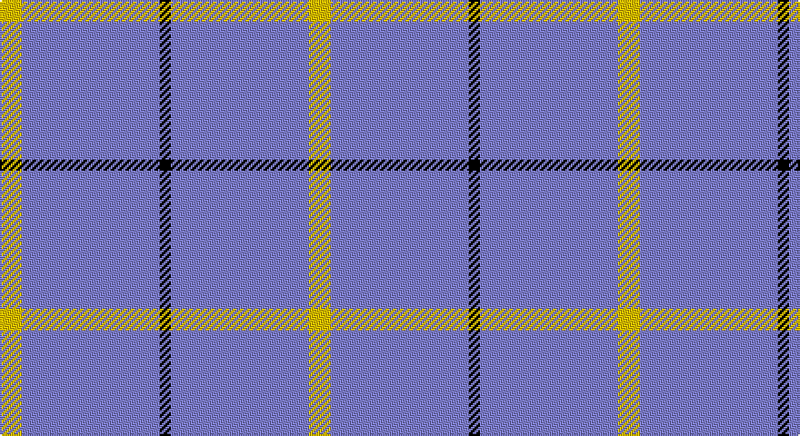

This page is one **sett** — a single exact thread-count. It belongs to the [tartan](/setts/ly6b38k3b38ly6/)
(the same proportion at any scale), whose colour order is pattern [YBKBY](/stripes/ybkby/).

Sourced from weddslist.  It is a [5 stripe tartan](/stripes/stripes5/).

Original link http://www.weddslist.com/cgi-bin/tartans/pg.pl?source=sts

## Thread count
Y/12 B76 K6 B76 Y/12

One full sett is **340 threads**.

## Palette

Palette: <strong>Ingles Buchan</strong> <small style="color:#888">(1 of 3 colours)</small>
<table><thead><tr><th>Colour</th><th>Threads</th><th>Shade</th><th>Base</th><th>OKLCh</th></tr></thead><tbody><tr><td>Y/</td><td style="text-align:right;font-variant-numeric:tabular-nums">12</td><td><code style="background-color:#F0C000;">#F0C000</code> <small style="color:#888">#F0C000</small></td><td>Y <code style="background-color:#F2BF00;">#F2BF00</code></td><td><small style="color:#888">oklch(82.7% 0.169 90.5)</small></td></tr><tr><td>B</td><td style="text-align:right;font-variant-numeric:tabular-nums">76</td><td><code style="background-color:#8080D0;">#8080D0</code> <small style="color:#888">#8080D0</small></td><td>B <code style="background-color:#2A418A;">#2A418A</code></td><td><small style="color:#888">oklch(63.4% 0.119 282.5)</small></td></tr><tr><td>K</td><td style="text-align:right;font-variant-numeric:tabular-nums">6</td><td><code style="background-color:#000000;">#000000</code> <small style="color:#888">#000000</small></td><td>K <code style="background-color:#000000;">#000000</code></td><td><small style="color:#888">oklch(0.0% 0.000 0.0)</small></td></tr><tr><td>B</td><td style="text-align:right;font-variant-numeric:tabular-nums">76</td><td><code style="background-color:#8080D0;">#8080D0</code> <small style="color:#888">#8080D0</small></td><td>B <code style="background-color:#2A418A;">#2A418A</code></td><td><small style="color:#888">oklch(63.4% 0.119 282.5)</small></td></tr><tr><td>Y/</td><td style="text-align:right;font-variant-numeric:tabular-nums">12</td><td><code style="background-color:#F0C000;">#F0C000</code> <small style="color:#888">#F0C000</small></td><td>Y <code style="background-color:#F2BF00;">#F2BF00</code></td><td><small style="color:#888">oklch(82.7% 0.169 90.5)</small></td></tr></tbody></table>

# Sample pattern

## Nearest tartans

The nearest existing variants by ΔTartan distance, with this tartan at the top so the swatches line up against it.

ΔTartan

Tartan

Sett

—

<a href="/ttd/edit/#slug=ly6b38k3b38ly6~x2">The Poulain League</a> <a class="nn-out" href="/variants/s5/ly6b38k3b38ly6~x2/" title="open its dictionary page">↗</a>

1.83

<a href="/ttd/edit/#slug=lr20db1lr4db3~x4&amp;base=ly6b38k3b38ly6~x2">Loevenstein Castle #2</a> <a class="nn-out" href="/variants/s4/lr20db1lr4db3~x4/" title="open its dictionary page">↗</a>

1.97

<a href="/ttd/edit/#slug=ly6t38k3~x2&amp;base=ly6b38k3b38ly6~x2">Poulain League (Corporate)</a> <a class="nn-out" href="/variants/s3/ly6t38k3~x2/" title="open its dictionary page">↗</a>

2.02

<a href="/ttd/edit/#slug=db32r3db4ly3~x2&amp;base=ly6b38k3b38ly6~x2">MacLaine of Lochbuie</a> <a class="nn-out" href="/variants/s4/db32r3db4ly3~x2/" title="open its dictionary page">↗</a>

2.25

<a href="/ttd/edit/#slug=w1y1y4y7p1w1~x4&amp;base=ly6b38k3b38ly6~x2">Lochnagar</a> <a class="nn-out" href="/variants/s6/w1y1y4y7p1w1~x4/" title="open its dictionary page">↗</a>

2.29

<a href="/ttd/edit/#slug=w50db7w7t7w18~x2&amp;base=ly6b38k3b38ly6~x2">Sephardim (Corporate)</a> <a class="nn-out" href="/variants/s5/w50db7w7t7w18~x2/" title="open its dictionary page">↗</a>

2.32

<a href="/ttd/edit/#slug=lg6r1lg17db3lg3db8lg1~x2&amp;base=ly6b38k3b38ly6~x2">Dominion (Fashion)</a> <a class="nn-out" href="/variants/s7/lg6r1lg17db3lg3db8lg1~x2/" title="open its dictionary page">↗</a>

2.33

<a href="/ttd/edit/#slug=dt102lr11dt14w11&amp;base=ly6b38k3b38ly6~x2">Westfield (Corporate?)</a> <a class="nn-out" href="/variants/s4/dt102lr11dt14w11/" title="open its dictionary page">↗</a>

2.33

<a href="/ttd/edit/#slug=t11db1w1ly1~x20&amp;base=ly6b38k3b38ly6~x2">Varrie</a> <a class="nn-out" href="/variants/s4/t11db1w1ly1~x20/" title="open its dictionary page">↗</a>

2.47

<a href="/ttd/edit/#slug=dt72b6dt12b17w6~x2&amp;base=ly6b38k3b38ly6~x2">GulfMark</a> <a class="nn-out" href="/variants/s5/dt72b6dt12b17w6~x2/" title="open its dictionary page">↗</a>

2.47

<a href="/ttd/edit/#slug=t9db1w1ly1~x20&amp;base=ly6b38k3b38ly6~x2">Varrie Commemorative Tartan</a> <a class="nn-out" href="/variants/s4/t9db1w1ly1~x20/" title="open its dictionary page">↗</a>

## Neighbour map

Every grey dot is one of 14360 variants placed by the first two principal components of the ΔTartan feature space (44% of its variance). Red is this tartan; blue dots are its nearest — click one to open its page.

<svg viewBox="0 0 640 380" role="img" style="max-width:100%;height:auto;border:1px solid #e0e0e0;border-radius:4px;display:block" xmlns="http://www.w3.org/2000/svg"><image href="/nn/cloud.v1.png" width="640" height="380"/><a href="/variants/s4/lr20db1lr4db3~x4/"><circle cx="599.3" cy="215.3" r="4" fill="#3465a4"><title>Loevenstein Castle #2</title></circle></a><a href="/variants/s3/ly6t38k3~x2/"><circle cx="528.7" cy="248.9" r="4" fill="#3465a4"><title>Poulain League (Corporate)</title></circle></a><a href="/variants/s4/db32r3db4ly3~x2/"><circle cx="589.6" cy="240.0" r="4" fill="#3465a4"><title>MacLaine of Lochbuie</title></circle></a><a href="/variants/s6/w1y1y4y7p1w1~x4/"><circle cx="523.9" cy="254.0" r="4" fill="#3465a4"><title>Lochnagar</title></circle></a><a href="/variants/s5/w50db7w7t7w18~x2/"><circle cx="511.8" cy="228.8" r="4" fill="#3465a4"><title>Sephardim (Corporate)</title></circle></a><a href="/variants/s7/lg6r1lg17db3lg3db8lg1~x2/"><circle cx="452.9" cy="208.3" r="4" fill="#3465a4"><title>Dominion (Fashion)</title></circle></a><a href="/variants/s4/dt102lr11dt14w11/"><circle cx="539.7" cy="241.2" r="4" fill="#3465a4"><title>Westfield (Corporate?)</title></circle></a><a href="/variants/s4/t11db1w1ly1~x20/"><circle cx="511.0" cy="220.2" r="4" fill="#3465a4"><title>Varrie</title></circle></a><a href="/variants/s5/dt72b6dt12b17w6~x2/"><circle cx="511.4" cy="237.4" r="4" fill="#3465a4"><title>GulfMark</title></circle></a><a href="/variants/s4/t9db1w1ly1~x20/"><circle cx="461.0" cy="226.0" r="4" fill="#3465a4"><title>Varrie Commemorative Tartan</title></circle></a><circle cx="539.5" cy="226.2" r="5" fill="#c00000"/></svg>

ID: /variants/s5/ly6b38k3b38ly6~x2/
