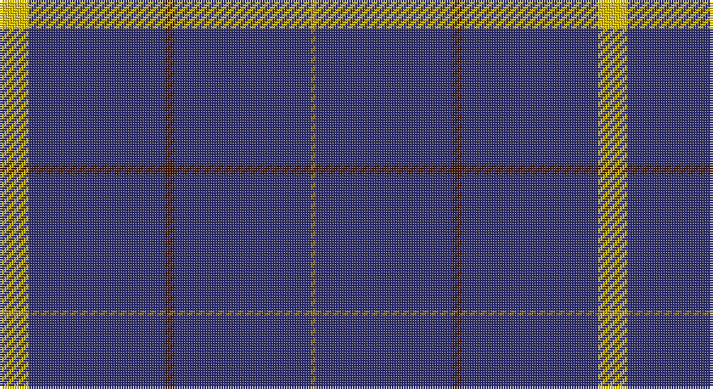

This page is one **sett** — a single exact thread-count. It belongs to the [tartan](/setts/ly6db28do2db28y1/)
(the same proportion at any scale), whose colour order is pattern [GBBBY](/stripes/gbbby/).

Part of the [Pearson](/tartans/pearson/) tartan — the named design grouping this sett with its other cloths.

Sourced from register-of-tartans.  It is a [5 stripe tartan](/stripes/stripes5/).

Original link https://www.tartanregister.gov.uk/tartanDetails.aspx?ref=3310

2 attestations — the source records this cloth was collapsed from (oldest owns this page)

<ul>
<li>01/01/1951 — Pearson (register-of-tartans, <a href="https://www.tartanregister.gov.uk/tartanDetails.aspx?ref=3310">record</a>)</li>
<li>1951 — Pearson (Name) (tartans-authority, <a href="http://www.tartansauthority.com/tartan-ferret/display/1734/">record</a>)</li>
</ul>

## Register references

External register numbers recorded for this tartan.

- Scottish Register of Tartans: [3310](https://www.tartanregister.gov.uk/tartanDetails.aspx?ref=3310)
- Scottish Tartans Authority (ITI): 1734
- Scottish Tartans World Register: 1734

## Thread count
Y/12 DB56 DR4 DB56 LT/2

One full sett is **246 threads**.

## Palette

Palette: <strong>Tartan Register</strong> <small style="color:#888">(3 of 4 colours)</small>
<table><thead><tr><th>Colour</th><th>Threads</th><th>Shade</th><th>Base</th><th>OKLCh</th></tr></thead><tbody><tr><td>Y/</td><td style="text-align:right;font-variant-numeric:tabular-nums">12</td><td><code style="background-color:#E8C000;">#E8C000</code> <small style="color:#888">#E8C000</small></td><td>Y <code style="background-color:#F2BF00;">#F2BF00</code></td><td><small style="color:#888">oklch(81.9% 0.168 93.7)</small></td></tr><tr><td>DB</td><td style="text-align:right;font-variant-numeric:tabular-nums">56</td><td><code style="background-color:#303070;">#303070</code> <small style="color:#888">#303070</small></td><td>B <code style="background-color:#2A418A;">#2A418A</code></td><td><small style="color:#888">oklch(34.7% 0.108 279.2)</small></td></tr><tr><td>DR</td><td style="text-align:right;font-variant-numeric:tabular-nums">4</td><td><code style="background-color:#441800;">#441800</code> <small style="color:#888">#441800</small></td><td>B <code style="background-color:#2A418A;">#2A418A</code></td><td><small style="color:#888">oklch(27.3% 0.076 46.3)</small></td></tr><tr><td>DB</td><td style="text-align:right;font-variant-numeric:tabular-nums">56</td><td><code style="background-color:#303070;">#303070</code> <small style="color:#888">#303070</small></td><td>B <code style="background-color:#2A418A;">#2A418A</code></td><td><small style="color:#888">oklch(34.7% 0.108 279.2)</small></td></tr><tr><td>LT/</td><td style="text-align:right;font-variant-numeric:tabular-nums">2</td><td><code style="background-color:#8C7038;">#8C7038</code> <small style="color:#888">#8C7038</small></td><td>G <code style="background-color:#006100;">#006100</code></td><td><small style="color:#888">oklch(56.0% 0.082 83.0)</small></td></tr></tbody></table>

# Sample pattern

## Nearest tartans

The nearest existing variants by ΔTartan distance, with this tartan at the top so the swatches line up against it.

ΔTartan

Tartan

Sett

—

<a href="/ttd/edit/#slug=ly6db28do2db28y1~x2">Pearson</a> <a class="nn-out" href="/variants/s5/ly6db28do2db28y1~x2/" title="open its dictionary page">↗</a>

1.17

<a href="/ttd/edit/#slug=db32r3db4k1ly3~x2&amp;base=ly6db28do2db28y1~x2">MacLaine of Lochbuie, hunting</a> <a class="nn-out" href="/variants/s5/db32r3db4k1ly3~x2/" title="open its dictionary page">↗</a>

1.74

<a href="/ttd/edit/#slug=db45ly3db10o4k1w2~x2&amp;base=ly6db28do2db28y1~x2">Wylie</a> <a class="nn-out" href="/variants/s6/db45ly3db10o4k1w2~x2/" title="open its dictionary page">↗</a>

1.81

<a href="/ttd/edit/#slug=db140r11db14ly11&amp;base=ly6db28do2db28y1~x2">Gem</a> <a class="nn-out" href="/variants/s4/db140r11db14ly11/" title="open its dictionary page">↗</a>

1.87

<a href="/ttd/edit/#slug=dt40ly10dt8r20dt100w5&amp;base=ly6db28do2db28y1~x2">East of Scotland Tartan Army</a> <a class="nn-out" href="/variants/s6/dt40ly10dt8r20dt100w5/" title="open its dictionary page">↗</a>

1.91

<a href="/ttd/edit/#slug=db32r3db4ly3~x2&amp;base=ly6db28do2db28y1~x2">MacLaine of Lochbuie</a> <a class="nn-out" href="/variants/s4/db32r3db4ly3~x2/" title="open its dictionary page">↗</a>

1.91

<a href="/ttd/edit/#slug=db48w2db7w2db7w2db20t11r2~x2&amp;base=ly6db28do2db28y1~x2">RAAF #4</a> <a class="nn-out" href="/variants/s9/db48w2db7w2db7w2db20t11r2~x2/" title="open its dictionary page">↗</a>

1.92

<a href="/ttd/edit/#slug=db32r3db4k1ly3&amp;base=ly6db28do2db28y1~x2">MacLaine of Lochbuie Hunting</a> <a class="nn-out" href="/variants/s5/db32r3db4k1ly3/" title="open its dictionary page">↗</a>

1.95

<a href="/ttd/edit/#slug=b11db7b3db70lb4db6~x2&amp;base=ly6db28do2db28y1~x2">Auchairne (Corporate)</a> <a class="nn-out" href="/variants/s6/b11db7b3db70lb4db6~x2/" title="open its dictionary page">↗</a>

1.97

<a href="/ttd/edit/#slug=db122r11w4r15ly4db6ly4db30&amp;base=ly6db28do2db28y1~x2">Inverness, Duke of York</a> <a class="nn-out" href="/variants/s8/db122r11w4r15ly4db6ly4db30/" title="open its dictionary page">↗</a>

1.99

<a href="/ttd/edit/#slug=r5w4k4db80w4~x2&amp;base=ly6db28do2db28y1~x2">Volunteer Lifesaving Corps (Corp.)</a> <a class="nn-out" href="/variants/s5/r5w4k4db80w4~x2/" title="open its dictionary page">↗</a>

## Neighbour map

Every grey dot is one of 14360 variants placed by the first two principal components of the ΔTartan feature space (44% of its variance). Red is this tartan; blue dots are its nearest — click one to open its page.

<svg viewBox="0 0 640 380" role="img" style="max-width:100%;height:auto;border:1px solid #e0e0e0;border-radius:4px;display:block" xmlns="http://www.w3.org/2000/svg"><image href="/nn/cloud.v1.png" width="640" height="380"/><a href="/variants/s5/db32r3db4k1ly3~x2/"><circle cx="596.1" cy="164.5" r="4" fill="#3465a4"><title>MacLaine of Lochbuie, hunting</title></circle></a><a href="/variants/s6/db45ly3db10o4k1w2~x2/"><circle cx="592.3" cy="123.9" r="4" fill="#3465a4"><title>Wylie</title></circle></a><a href="/variants/s4/db140r11db14ly11/"><circle cx="614.9" cy="231.6" r="4" fill="#3465a4"><title>Gem</title></circle></a><a href="/variants/s6/dt40ly10dt8r20dt100w5/"><circle cx="517.3" cy="181.3" r="4" fill="#3465a4"><title>East of Scotland Tartan Army</title></circle></a><a href="/variants/s4/db32r3db4ly3~x2/"><circle cx="589.6" cy="240.0" r="4" fill="#3465a4"><title>MacLaine of Lochbuie</title></circle></a><a href="/variants/s9/db48w2db7w2db7w2db20t11r2~x2/"><circle cx="548.7" cy="158.2" r="4" fill="#3465a4"><title>RAAF #4</title></circle></a><a href="/variants/s5/db32r3db4k1ly3/"><circle cx="574.8" cy="166.1" r="4" fill="#3465a4"><title>MacLaine of Lochbuie Hunting</title></circle></a><a href="/variants/s6/b11db7b3db70lb4db6~x2/"><circle cx="612.6" cy="198.8" r="4" fill="#3465a4"><title>Auchairne (Corporate)</title></circle></a><a href="/variants/s8/db122r11w4r15ly4db6ly4db30/"><circle cx="575.0" cy="137.8" r="4" fill="#3465a4"><title>Inverness, Duke of York</title></circle></a><a href="/variants/s5/r5w4k4db80w4~x2/"><circle cx="560.8" cy="163.3" r="4" fill="#3465a4"><title>Volunteer Lifesaving Corps (Corp.)</title></circle></a><circle cx="589.8" cy="196.9" r="5" fill="#c00000"/></svg>

ID: /variants/s5/ly6db28do2db28y1~x2/
