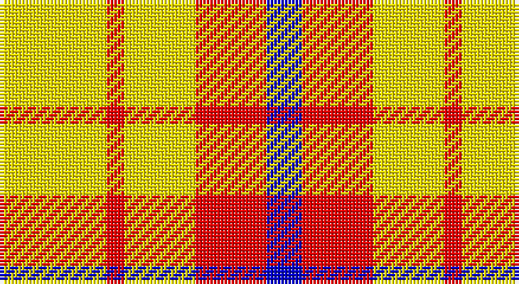

This page is one **sett** — a single exact thread-count. It belongs to the [tartan](/setts/ly6r1ly4r4db2/)
(the same proportion at any scale), whose colour order is pattern [BRYRY](/stripes/bryry/).

Sourced from register-of-tartans.  It is a [5 stripe tartan](/stripes/stripes5/).

Original link https://www.tartanregister.gov.uk/tartanDetails.aspx?ref=10580

## Also known as

This cloth is also recorded under:

- Sands-Pingot Family, Alabama

2 attestations — the source records this cloth was collapsed from (oldest owns this page)

<ul>
<li>01/03/2012 — Sands-Pingot Family, Alabama (Personal) (register-of-tartans, <a href="https://www.tartanregister.gov.uk/tartanDetails.aspx?ref=10580">record</a>)</li>
<li>01/03/2012 — Sands-Pingot (Name?) (tartans-authority, <a href="http://www.tartansauthority.com/tartan-ferret/display/10580/">record</a>)</li>
</ul>

## Register references

External register numbers recorded for this tartan.

- Scottish Register of Tartans: [10580](https://www.tartanregister.gov.uk/tartanDetails?ref=10580)
- Scottish Tartans Authority (ITI): 10580

## Thread count
Y/30 R5 Y20 R20 B/10

One full sett is **130 threads**.

## Palette

Palette: <strong>Tartan Register</strong>
<table><thead><tr><th>Colour</th><th>Threads</th><th>Shade</th><th>Base</th><th>OKLCh</th></tr></thead><tbody><tr><td>Y/</td><td style="text-align:right;font-variant-numeric:tabular-nums">30</td><td><code style="background-color:#FFE600;">#FFE600</code> <small style="color:#888">#FFE600</small></td><td>Y <code style="background-color:#F2BF00;">#F2BF00</code></td><td><small style="color:#888">oklch(91.7% 0.192 101.4)</small></td></tr><tr><td>R</td><td style="text-align:right;font-variant-numeric:tabular-nums">5</td><td><code style="background-color:#FF0000;">#FF0000</code> <small style="color:#888">#FF0000</small></td><td>R <code style="background-color:#CC0000;">#CC0000</code></td><td><small style="color:#888">oklch(62.8% 0.258 29.2)</small></td></tr><tr><td>Y</td><td style="text-align:right;font-variant-numeric:tabular-nums">20</td><td><code style="background-color:#FFE600;">#FFE600</code> <small style="color:#888">#FFE600</small></td><td>Y <code style="background-color:#F2BF00;">#F2BF00</code></td><td><small style="color:#888">oklch(91.7% 0.192 101.4)</small></td></tr><tr><td>R</td><td style="text-align:right;font-variant-numeric:tabular-nums">20</td><td><code style="background-color:#FF0000;">#FF0000</code> <small style="color:#888">#FF0000</small></td><td>R <code style="background-color:#CC0000;">#CC0000</code></td><td><small style="color:#888">oklch(62.8% 0.258 29.2)</small></td></tr><tr><td>B/</td><td style="text-align:right;font-variant-numeric:tabular-nums">10</td><td><code style="background-color:#0000CD;">#0000CD</code> <small style="color:#888">#0000CD</small></td><td>B <code style="background-color:#2A418A;">#2A418A</code></td><td><small style="color:#888">oklch(38.3% 0.266 264.1)</small></td></tr></tbody></table>

# Sample pattern

## Nearest tartans

The nearest existing variants by ΔTartan distance, with this tartan at the top so the swatches line up against it.

ΔTartan

Tartan

Sett

—

<a href="/ttd/edit/#slug=ly6r1ly4r4db2~x5">Sands-Pingot Family, Alabama (Personal)</a> <a class="nn-out" href="/variants/s5/ly6r1ly4r4db2~x5/" title="open its dictionary page">↗</a>

1.57

<a href="/ttd/edit/#slug=ly49r16k11~x2&amp;base=ly6r1ly4r4db2~x5">Quenouille (2011)</a> <a class="nn-out" href="/variants/s3/ly49r16k11~x2/" title="open its dictionary page">↗</a>

1.91

<a href="/ttd/edit/#slug=r18ly3r18ly30k4~x2&amp;base=ly6r1ly4r4db2~x5">Shire of Hornwood (USA)</a> <a class="nn-out" href="/variants/s5/r18ly3r18ly30k4~x2/" title="open its dictionary page">↗</a>

1.95

<a href="/ttd/edit/#slug=ly20k15ly20w3~x2&amp;base=ly6r1ly4r4db2~x5">Silvicola</a> <a class="nn-out" href="/variants/s4/ly20k15ly20w3~x2/" title="open its dictionary page">↗</a>

1.98

<a href="/ttd/edit/#slug=lo40g13lo6db13lo22~x2&amp;base=ly6r1ly4r4db2~x5">Burt's Highlanders (Fashion)</a> <a class="nn-out" href="/variants/s5/lo40g13lo6db13lo22~x2/" title="open its dictionary page">↗</a>

2.04

<a href="/ttd/edit/#slug=ly2k4ly2k2ly5r1~x2&amp;base=ly6r1ly4r4db2~x5">Lauder</a> <a class="nn-out" href="/variants/s6/ly2k4ly2k2ly5r1~x2/" title="open its dictionary page">↗</a>

2.14

<a href="/ttd/edit/#slug=lb2r4lb2r4lb9k1~x2&amp;base=ly6r1ly4r4db2~x5">Buchanan VS</a> <a class="nn-out" href="/variants/s6/lb2r4lb2r4lb9k1~x2/" title="open its dictionary page">↗</a>

2.22

<a href="/ttd/edit/#slug=r4lyi1r3ly1lyi8ly2~x4&amp;base=ly6r1ly4r4db2~x5">Buchele Check (Fashion?)</a> <a class="nn-out" href="/variants/s6/r4lyi1r3ly1lyi8ly2~x4/" title="open its dictionary page">↗</a>

2.24

<a href="/ttd/edit/#slug=w11r32g12r5g12r5~x2&amp;base=ly6r1ly4r4db2~x5">Al-Maktoum</a> <a class="nn-out" href="/variants/s6/w11r32g12r5g12r5~x2/" title="open its dictionary page">↗</a>

2.28

<a href="/ttd/edit/#slug=k5w37r37w5~x2&amp;base=ly6r1ly4r4db2~x5">MacRae of Conchra #2</a> <a class="nn-out" href="/variants/s4/k5w37r37w5~x2/" title="open its dictionary page">↗</a>

2.30

<a href="/ttd/edit/#slug=w8r14w8r14w35k4~x2&amp;base=ly6r1ly4r4db2~x5">Clayton Dress (Dance)</a> <a class="nn-out" href="/variants/s6/w8r14w8r14w35k4~x2/" title="open its dictionary page">↗</a>

## Neighbour map

Every grey dot is one of 14360 variants placed by the first two principal components of the ΔTartan feature space (44% of its variance). Red is this tartan; blue dots are its nearest — click one to open its page.

<svg viewBox="0 0 640 380" role="img" style="max-width:100%;height:auto;border:1px solid #e0e0e0;border-radius:4px;display:block" xmlns="http://www.w3.org/2000/svg"><image href="/nn/cloud.v1.png" width="640" height="380"/><a href="/variants/s3/ly49r16k11~x2/"><circle cx="299.7" cy="262.4" r="4" fill="#3465a4"><title>Quenouille (2011)</title></circle></a><a href="/variants/s5/r18ly3r18ly30k4~x2/"><circle cx="282.7" cy="204.7" r="4" fill="#3465a4"><title>Shire of Hornwood (USA)</title></circle></a><a href="/variants/s4/ly20k15ly20w3~x2/"><circle cx="320.8" cy="266.7" r="4" fill="#3465a4"><title>Silvicola</title></circle></a><a href="/variants/s5/lo40g13lo6db13lo22~x2/"><circle cx="373.0" cy="245.5" r="4" fill="#3465a4"><title>Burt's Highlanders (Fashion)</title></circle></a><a href="/variants/s6/ly2k4ly2k2ly5r1~x2/"><circle cx="236.3" cy="255.6" r="4" fill="#3465a4"><title>Lauder</title></circle></a><a href="/variants/s6/lb2r4lb2r4lb9k1~x2/"><circle cx="320.3" cy="206.4" r="4" fill="#3465a4"><title>Buchanan VS</title></circle></a><a href="/variants/s6/r4lyi1r3ly1lyi8ly2~x4/"><circle cx="259.3" cy="217.0" r="4" fill="#3465a4"><title>Buchele Check (Fashion?)</title></circle></a><a href="/variants/s6/w11r32g12r5g12r5~x2/"><circle cx="274.8" cy="229.0" r="4" fill="#3465a4"><title>Al-Maktoum</title></circle></a><a href="/variants/s4/k5w37r37w5~x2/"><circle cx="279.9" cy="222.5" r="4" fill="#3465a4"><title>MacRae of Conchra #2</title></circle></a><a href="/variants/s6/w8r14w8r14w35k4~x2/"><circle cx="301.9" cy="199.1" r="4" fill="#3465a4"><title>Clayton Dress (Dance)</title></circle></a><circle cx="255.5" cy="243.3" r="5" fill="#c00000"/></svg>

ID: /variants/s5/ly6r1ly4r4db2~x5/
