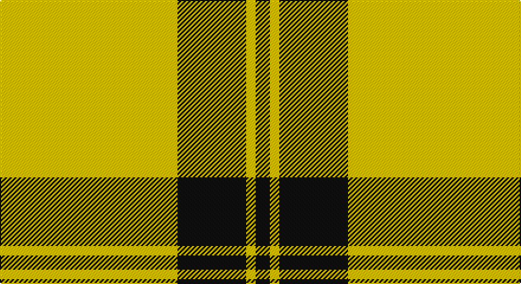

This page is one **sett** — a single exact thread-count. It belongs to the [tartan](/setts/ly75k26k3ly4k6/)
(the same proportion at any scale), whose colour order is pattern [KYKKY](/stripes/kykky/).

Part of the [Perry](/tartans/perry/) tartan — the named design grouping this sett with its other cloths.

Sourced from tartans-authority.  It is a [5 stripe tartan](/stripes/stripes5/).

Original link http://www.tartansauthority.com/tartan-ferret/display/1213/

## Also known as

This cloth is also recorded under:

- Perry / Pirrie
- Perry Ancient
- Perry Pirrie
- Perry, Pirrie

## Register references

External register numbers recorded for this tartan.

- Scottish Tartans Authority (ITI): 1213

## Thread count
Y/150 Ka52 Ka6 Y8 K/12

One full sett is **294 threads**.

## Palette

Palette: <strong>Logan (The Scottish Gael, 1831)</strong>
<table><thead><tr><th>Colour</th><th>Threads</th><th>Shade</th><th>Base</th><th>OKLCh</th></tr></thead><tbody><tr><td>Y/</td><td style="text-align:right;font-variant-numeric:tabular-nums">150</td><td><code style="background-color:#E8C000;">#E8C000</code> <small style="color:#888">#E8C000</small></td><td>Y <code style="background-color:#F2BF00;">#F2BF00</code></td><td><small style="color:#888">oklch(81.9% 0.168 93.7)</small></td></tr><tr><td>Ka</td><td style="text-align:right;font-variant-numeric:tabular-nums">52</td><td><code style="background-color:#101010;">#101010</code> <small style="color:#888">#101010</small></td><td>K <code style="background-color:#000000;">#000000</code></td><td><small style="color:#888">oklch(17.3% 0.000 89.9)</small></td></tr><tr><td>Ka</td><td style="text-align:right;font-variant-numeric:tabular-nums">6</td><td><code style="background-color:#101010;">#101010</code> <small style="color:#888">#101010</small></td><td>K <code style="background-color:#000000;">#000000</code></td><td><small style="color:#888">oklch(17.3% 0.000 89.9)</small></td></tr><tr><td>Y</td><td style="text-align:right;font-variant-numeric:tabular-nums">8</td><td><code style="background-color:#E8C000;">#E8C000</code> <small style="color:#888">#E8C000</small></td><td>Y <code style="background-color:#F2BF00;">#F2BF00</code></td><td><small style="color:#888">oklch(81.9% 0.168 93.7)</small></td></tr><tr><td>K/</td><td style="text-align:right;font-variant-numeric:tabular-nums">12</td><td><code style="background-color:#101010;">#101010</code> <small style="color:#888">#101010</small></td><td>K <code style="background-color:#000000;">#000000</code></td><td><small style="color:#888">oklch(17.3% 0.000 89.9)</small></td></tr></tbody></table>

# Sample pattern

## Compared to the master

This cloth is one sett of its design; the master sett (the exemplar the design is anchored on) is below for comparison.

<figure style="margin:0"><figcaption style="color:#888;font-size:smaller">this sett</figcaption></figure>
<figure style="margin:0"><figcaption style="color:#888;font-size:smaller"><a href="/setts/k31r12ly2n5k2/">master sett →</a></figcaption></figure>

## Nearest tartans

The nearest existing variants by ΔTartan distance, with this tartan at the top so the swatches line up against it.

ΔTartan

Tartan

Sett

—

<a href="/ttd/edit/#slug=ly75k26k3ly4k6~x2">Perry Ancient (Personal)</a> <a class="nn-out" href="/variants/s5/ly75k26k3ly4k6~x2/" title="open its dictionary page">↗</a>

1.53

<a href="/ttd/edit/#slug=lo4k6lo1k1lo16k2~x2&amp;base=ly75k26k3ly4k6~x2">Monoch Airline</a> <a class="nn-out" href="/variants/s6/lo4k6lo1k1lo16k2~x2/" title="open its dictionary page">↗</a>

1.53

<a href="/ttd/edit/#slug=k14w4k8ly45w3k1ly2~x2&amp;base=ly75k26k3ly4k6~x2">Kernow Spirit (Corporate)</a> <a class="nn-out" href="/variants/s7/k14w4k8ly45w3k1ly2~x2/" title="open its dictionary page">↗</a>

1.55

<a href="/ttd/edit/#slug=db6db3ly3db2ly3db4ly48db4&amp;base=ly75k26k3ly4k6~x2">Morris (Welsh Name)</a> <a class="nn-out" href="/variants/s8/db6db3ly3db2ly3db4ly48db4/" title="open its dictionary page">↗</a>

1.76

<a href="/ttd/edit/#slug=ly1k4ly1k4ly11r1ly1~x4&amp;base=ly75k26k3ly4k6~x2">Baileville (Personal)</a> <a class="nn-out" href="/variants/s7/ly1k4ly1k4ly11r1ly1~x4/" title="open its dictionary page">↗</a>

1.84

<a href="/ttd/edit/#slug=ly5k9ly2k7lo35r4lo35k4~x2&amp;base=ly75k26k3ly4k6~x2">Wilbers</a> <a class="nn-out" href="/variants/s8/ly5k9ly2k7lo35r4lo35k4~x2/" title="open its dictionary page">↗</a>

1.92

<a href="/ttd/edit/#slug=r2ly36k12w3g2~x2&amp;base=ly75k26k3ly4k6~x2">Port Moresby City Pipes &amp; Drums</a> <a class="nn-out" href="/variants/s5/r2ly36k12w3g2~x2/" title="open its dictionary page">↗</a>

1.95

<a href="/ttd/edit/#slug=ly1k4ly1k4ly11m1ly1~x4&amp;base=ly75k26k3ly4k6~x2">Baillieville</a> <a class="nn-out" href="/variants/s7/ly1k4ly1k4ly11m1ly1~x4/" title="open its dictionary page">↗</a>

1.97

<a href="/ttd/edit/#slug=dy48ly9dy6ly9dy12ly4dy2ly16~x2&amp;base=ly75k26k3ly4k6~x2">Yellow Pencil</a> <a class="nn-out" href="/variants/s8/dy48ly9dy6ly9dy12ly4dy2ly16~x2/" title="open its dictionary page">↗</a>

2.04

<a href="/ttd/edit/#slug=w15dy15w15dy80r6&amp;base=ly75k26k3ly4k6~x2">Coca Cola (Corporate)</a> <a class="nn-out" href="/variants/s5/w15dy15w15dy80r6/" title="open its dictionary page">↗</a>

2.05

<a href="/ttd/edit/#slug=w3k5lo3r3lo32k2lo3~x2&amp;base=ly75k26k3ly4k6~x2">Bro-Dreger</a> <a class="nn-out" href="/variants/s7/w3k5lo3r3lo32k2lo3~x2/" title="open its dictionary page">↗</a>

## Neighbour map

Every grey dot is one of 14360 variants placed by the first two principal components of the ΔTartan feature space (44% of its variance). Red is this tartan; blue dots are its nearest — click one to open its page.

<svg viewBox="0 0 640 380" role="img" style="max-width:100%;height:auto;border:1px solid #e0e0e0;border-radius:4px;display:block" xmlns="http://www.w3.org/2000/svg"><image href="/nn/cloud.v1.png" width="640" height="380"/><a href="/variants/s6/lo4k6lo1k1lo16k2~x2/"><circle cx="445.2" cy="190.9" r="4" fill="#3465a4"><title>Monoch Airline</title></circle></a><a href="/variants/s7/k14w4k8ly45w3k1ly2~x2/"><circle cx="391.6" cy="105.1" r="4" fill="#3465a4"><title>Kernow Spirit (Corporate)</title></circle></a><a href="/variants/s8/db6db3ly3db2ly3db4ly48db4/"><circle cx="471.7" cy="113.0" r="4" fill="#3465a4"><title>Morris (Welsh Name)</title></circle></a><a href="/variants/s7/ly1k4ly1k4ly11r1ly1~x4/"><circle cx="334.4" cy="174.5" r="4" fill="#3465a4"><title>Baileville (Personal)</title></circle></a><a href="/variants/s8/ly5k9ly2k7lo35r4lo35k4~x2/"><circle cx="398.5" cy="150.5" r="4" fill="#3465a4"><title>Wilbers</title></circle></a><a href="/variants/s5/r2ly36k12w3g2~x2/"><circle cx="346.9" cy="128.4" r="4" fill="#3465a4"><title>Port Moresby City Pipes &amp; Drums</title></circle></a><a href="/variants/s7/ly1k4ly1k4ly11m1ly1~x4/"><circle cx="329.7" cy="174.1" r="4" fill="#3465a4"><title>Baillieville</title></circle></a><a href="/variants/s8/dy48ly9dy6ly9dy12ly4dy2ly16~x2/"><circle cx="437.0" cy="170.3" r="4" fill="#3465a4"><title>Yellow Pencil</title></circle></a><a href="/variants/s5/w15dy15w15dy80r6/"><circle cx="444.0" cy="198.1" r="4" fill="#3465a4"><title>Coca Cola (Corporate)</title></circle></a><a href="/variants/s7/w3k5lo3r3lo32k2lo3~x2/"><circle cx="467.8" cy="144.4" r="4" fill="#3465a4"><title>Bro-Dreger</title></circle></a><circle cx="427.6" cy="149.5" r="5" fill="#c00000"/></svg>

ID: /variants/s5/ly75k26k3ly4k6~x2/
