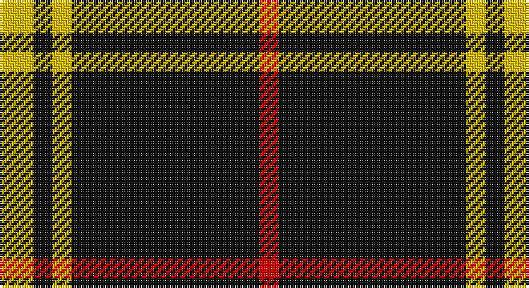

This page is one **sett** — a single exact thread-count. It belongs to the [tartan](/setts/ly7k4ly4k39r4/)
(the same proportion at any scale), whose colour order is pattern [RKYKY](/stripes/rkyky/).

Part of the [Welsh National](/tartans/welsh-national/) tartan — the named design grouping this sett with its other cloths.

Sourced from register-of-tartans.  It is a [5 stripe tartan](/stripes/stripes5/).

Original link https://www.tartanregister.gov.uk/tartanDetails.aspx?ref=4599

## Also known as

This cloth is also recorded under:

- Welsh National #2
- Welsh National #3
- Welsh, National

## Register references

External register numbers recorded for this tartan.

- Scottish Register of Tartans: [4599](https://www.tartanregister.gov.uk/tartanDetails.aspx?ref=4599)
- Scottish Tartans World Register: 2756

## Thread count
Y/14 K8 Y8 K78 R/8

One full sett is **210 threads**.

## Palette

Palette: <strong>Logan (The Scottish Gael, 1831)</strong>
<table><thead><tr><th>Colour</th><th>Threads</th><th>Shade</th><th>Base</th><th>OKLCh</th></tr></thead><tbody><tr><td>Y/</td><td style="text-align:right;font-variant-numeric:tabular-nums">14</td><td><code style="background-color:#E8C000;">#E8C000</code> <small style="color:#888">#E8C000</small></td><td>Y <code style="background-color:#F2BF00;">#F2BF00</code></td><td><small style="color:#888">oklch(81.9% 0.168 93.7)</small></td></tr><tr><td>K</td><td style="text-align:right;font-variant-numeric:tabular-nums">8</td><td><code style="background-color:#101010;">#101010</code> <small style="color:#888">#101010</small></td><td>K <code style="background-color:#000000;">#000000</code></td><td><small style="color:#888">oklch(17.3% 0.000 89.9)</small></td></tr><tr><td>Y</td><td style="text-align:right;font-variant-numeric:tabular-nums">8</td><td><code style="background-color:#E8C000;">#E8C000</code> <small style="color:#888">#E8C000</small></td><td>Y <code style="background-color:#F2BF00;">#F2BF00</code></td><td><small style="color:#888">oklch(81.9% 0.168 93.7)</small></td></tr><tr><td>K</td><td style="text-align:right;font-variant-numeric:tabular-nums">78</td><td><code style="background-color:#101010;">#101010</code> <small style="color:#888">#101010</small></td><td>K <code style="background-color:#000000;">#000000</code></td><td><small style="color:#888">oklch(17.3% 0.000 89.9)</small></td></tr><tr><td>R/</td><td style="text-align:right;font-variant-numeric:tabular-nums">8</td><td><code style="background-color:#DC0000;">#DC0000</code> <small style="color:#888">#DC0000</small></td><td>R <code style="background-color:#CC0000;">#CC0000</code></td><td><small style="color:#888">oklch(56.2% 0.230 29.2)</small></td></tr></tbody></table>

# Sample pattern

## Compared to the master

This cloth is one sett of its design; the master sett (the exemplar the design is anchored on) is below for comparison.

<figure style="margin:0"><figcaption style="color:#888;font-size:smaller">this sett</figcaption></figure>
<figure style="margin:0"><figcaption style="color:#888;font-size:smaller"><a href="/setts/k4dy2r2dy2k2dy15lo2/">master sett →</a></figcaption></figure>

## Nearest tartans

The nearest existing variants by ΔTartan distance, with this tartan at the top so the swatches line up against it.

ΔTartan

Tartan

Sett

—

<a href="/ttd/edit/#slug=ly7k4ly4k39r4~x2">Welsh National #3</a> <a class="nn-out" href="/variants/s5/ly7k4ly4k39r4~x2/" title="open its dictionary page">↗</a>

0.23

<a href="/ttd/edit/#slug=ly9k4ly4k45r4~x2&amp;base=ly7k4ly4k39r4~x2">Gwynn (Name)</a> <a class="nn-out" href="/variants/s5/ly9k4ly4k45r4~x2/" title="open its dictionary page">↗</a>

1.22

<a href="/ttd/edit/#slug=r2k1r2k14w1k1w1~x8&amp;base=ly7k4ly4k39r4~x2">White Stripes Hunting</a> <a class="nn-out" href="/variants/s7/r2k1r2k14w1k1w1~x8/" title="open its dictionary page">↗</a>

1.39

<a href="/ttd/edit/#slug=r1k20lb5r1~x4&amp;base=ly7k4ly4k39r4~x2">Dobelman (Personal)</a> <a class="nn-out" href="/variants/s4/r1k20lb5r1~x4/" title="open its dictionary page">↗</a>

1.39

<a href="/ttd/edit/#slug=k2lb5k1lb1k10r1k1~x4&amp;base=ly7k4ly4k39r4~x2">Lundy Reform</a> <a class="nn-out" href="/variants/s7/k2lb5k1lb1k10r1k1~x4/" title="open its dictionary page">↗</a>

1.40

<a href="/ttd/edit/#slug=w5k3ly6k5w3k30ly2~x2&amp;base=ly7k4ly4k39r4~x2">Northern Kentucky University</a> <a class="nn-out" href="/variants/s7/w5k3ly6k5w3k30ly2~x2/" title="open its dictionary page">↗</a>

1.43

<a href="/ttd/edit/#slug=k35lo3w3g3~x4&amp;base=ly7k4ly4k39r4~x2">Dhillon (Personal)</a> <a class="nn-out" href="/variants/s4/k35lo3w3g3~x4/" title="open its dictionary page">↗</a>

1.45

<a href="/ttd/edit/#slug=n3k31w6k7n3k12w2~x2&amp;base=ly7k4ly4k39r4~x2">Believe - Colette</a> <a class="nn-out" href="/variants/s7/n3k31w6k7n3k12w2~x2/" title="open its dictionary page">↗</a>

1.49

<a href="/ttd/edit/#slug=n3k31w6k8n3k12w2~x2&amp;base=ly7k4ly4k39r4~x2">Believe - Colette</a> <a class="nn-out" href="/variants/s7/n3k31w6k8n3k12w2~x2/" title="open its dictionary page">↗</a>

1.54

<a href="/ttd/edit/#slug=k21w2k5w9k13g2~x4&amp;base=ly7k4ly4k39r4~x2">New Zealand District Tartan</a> <a class="nn-out" href="/variants/s6/k21w2k5w9k13g2~x4/" title="open its dictionary page">↗</a>

1.54

<a href="/ttd/edit/#slug=k37w9k3dg9w3~x2&amp;base=ly7k4ly4k39r4~x2">Glen Coe Trade Tartan</a> <a class="nn-out" href="/variants/s5/k37w9k3dg9w3~x2/" title="open its dictionary page">↗</a>

## Neighbour map

Every grey dot is one of 14360 variants placed by the first two principal components of the ΔTartan feature space (44% of its variance). Red is this tartan; blue dots are its nearest — click one to open its page.

<svg viewBox="0 0 640 380" role="img" style="max-width:100%;height:auto;border:1px solid #e0e0e0;border-radius:4px;display:block" xmlns="http://www.w3.org/2000/svg"><image href="/nn/cloud.v1.png" width="640" height="380"/><a href="/variants/s5/ly9k4ly4k45r4~x2/"><circle cx="452.2" cy="202.0" r="4" fill="#3465a4"><title>Gwynn (Name)</title></circle></a><a href="/variants/s7/r2k1r2k14w1k1w1~x8/"><circle cx="455.3" cy="167.9" r="4" fill="#3465a4"><title>White Stripes Hunting</title></circle></a><a href="/variants/s4/r1k20lb5r1~x4/"><circle cx="478.4" cy="199.1" r="4" fill="#3465a4"><title>Dobelman (Personal)</title></circle></a><a href="/variants/s7/k2lb5k1lb1k10r1k1~x4/"><circle cx="376.1" cy="196.2" r="4" fill="#3465a4"><title>Lundy Reform</title></circle></a><a href="/variants/s7/w5k3ly6k5w3k30ly2~x2/"><circle cx="404.3" cy="168.4" r="4" fill="#3465a4"><title>Northern Kentucky University</title></circle></a><a href="/variants/s4/k35lo3w3g3~x4/"><circle cx="489.0" cy="203.1" r="4" fill="#3465a4"><title>Dhillon (Personal)</title></circle></a><a href="/variants/s7/n3k31w6k7n3k12w2~x2/"><circle cx="471.4" cy="192.5" r="4" fill="#3465a4"><title>Believe - Colette</title></circle></a><a href="/variants/s7/n3k31w6k8n3k12w2~x2/"><circle cx="474.5" cy="195.0" r="4" fill="#3465a4"><title>Believe - Colette</title></circle></a><a href="/variants/s6/k21w2k5w9k13g2~x4/"><circle cx="414.8" cy="228.2" r="4" fill="#3465a4"><title>New Zealand District Tartan</title></circle></a><a href="/variants/s5/k37w9k3dg9w3~x2/"><circle cx="372.6" cy="208.0" r="4" fill="#3465a4"><title>Glen Coe Trade Tartan</title></circle></a><circle cx="444.0" cy="208.1" r="5" fill="#c00000"/></svg>

ID: /variants/s5/ly7k4ly4k39r4~x2/
