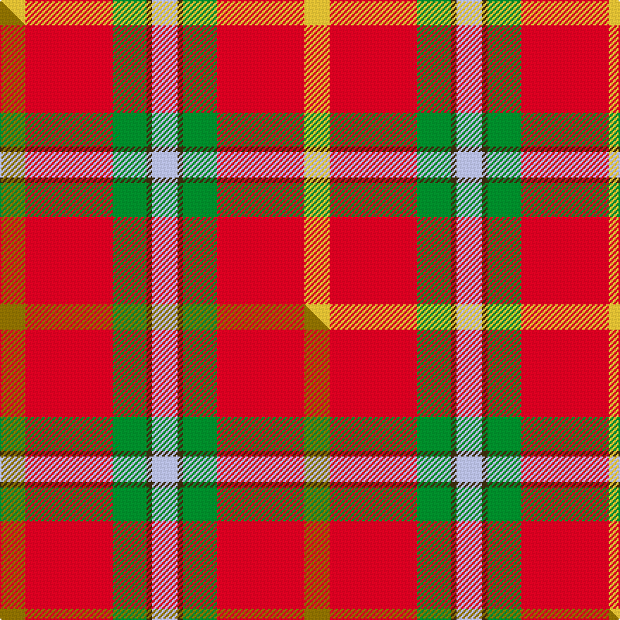

This page is one **sett** — a single exact thread-count. It belongs to the [tartan](/setts/ly9r31g12dy2lb9/)
(the same proportion at any scale), whose colour order is pattern [WGGRY](/stripes/wggry/).

Part of the [Buncle](/tartans/buncle/) tartan — the named design grouping this sett with its other cloths.

Sourced from tartans-authority.  It is a [5 stripe tartan](/stripes/stripes5/).

Original link http://www.tartansauthority.com/tartan-ferret/display/10300/

## Register references

External register numbers recorded for this tartan.

- Scottish Register of Tartans: [10300](https://www.tartanregister.gov.uk/tartanDetails?ref=10300)
- Scottish Tartans Authority (ITI): 10300

## Thread count
LY/18 R62 G24 DY4 LB/18

One full sett is **216 threads**.

## Palette
<table><thead><tr><th>Colour</th><th>Shade</th><th>OKLCh</th></tr></thead><tbody><tr><td>LB</td><td><code style="background-color:#B5BBDE;">#B5BBDE</code> <small style="color:#888">#B5BBDE</small></td><td><small style="color:#888">oklch(79.9% 0.050 277.6)</small></td></tr><tr><td>R</td><td><code style="background-color:#D60020;">#D60020</code> <small style="color:#888">#D60020</small></td><td><small style="color:#888">oklch(55.2% 0.224 25.5)</small></td></tr><tr><td>LY</td><td><code style="background-color:#DCBC32;">#DCBC32</code> <small style="color:#888">#DCBC32</small></td><td><small style="color:#888">oklch(80.0% 0.150 95.2)</small></td></tr><tr><td>G</td><td><code style="background-color:#008B2A;">#008B2A</code> <small style="color:#888">#008B2A</small></td><td><small style="color:#888">oklch(55.4% 0.170 145.9)</small></td></tr><tr><td>DY</td><td><code style="background-color:#3A2B0D;">#3A2B0D</code> <small style="color:#888">#3A2B0D</small></td><td><small style="color:#888">oklch(30.0% 0.049 82.0)</small></td></tr></tbody></table>

# Sample pattern

## Compared to the master

This cloth is one sett of its design; the master sett (the exemplar the design is anchored on) is below for comparison.

Its **ΔTartan distance** from the master is **0.65** — the same measure the nearest-tartans table ranks by (0 is identical; a re-scale of the same cloth is near 0, a recolour or a different proportion further).

<figure class="master-compare" style="margin:0">

this sett
master sett ★

<figcaption style="color:#888;font-size:smaller">One weave of this sett against the <a href="/setts/y9r31g12dy2lb9/">master sett ★</a>, split on the diagonal: a shared proportion runs seamlessly across it with only the shades shifting; a different proportion breaks on it.</figcaption>
</figure>

## Nearest tartan variants

The nearest existing variants by ΔTartan distance, with this cloth at the top so the swatches line up against it.

ΔTartan

Threads

Variant

Sett

—

216

<a href="/variants/s5/ly9r31g12dy2lb9~x2/">Buncle (Name)</a>

<a href="/ttd/edit/#slug=y9r31g12dy2lb9~x2&amp;base=ly9r31g12dy2lb9~x2" title="compare in the TTD">0.00</a>

216

<a href="/variants/s5/y9r31g12dy2lb9~x2/">Buncle (Duns)</a>

<a href="/ttd/edit/#slug=r15w1db4y1g15~x4&amp;base=ly9r31g12dy2lb9~x2" title="compare in the TTD">0.97</a>

168

<a href="/variants/s5/r15w1db4y1g15~x4/">Eglinton, Duke of (Artefact)</a>

<a href="/ttd/edit/#slug=r48t16ly5g17w8dy3~x2&amp;base=ly9r31g12dy2lb9~x2" title="compare in the TTD">1.33</a>

286

<a href="/variants/s6/r48t16ly5g17w8dy3~x2/">Scottish American Soc. of Michigan</a>

<a href="/ttd/edit/#slug=r22g17w2lb6r13~x2&amp;base=ly9r31g12dy2lb9~x2" title="compare in the TTD">1.77</a>

170

<a href="/variants/s5/r22g17w2lb6r13~x2/">Menzies</a>

<a href="/ttd/edit/#slug=db1r12g6y1g6db1~x4&amp;base=ly9r31g12dy2lb9~x2" title="compare in the TTD">2.08</a>

208

<a href="/variants/s6/db1r12g6y1g6db1~x4/">Cetoloni (Personal)</a>

<a href="/ttd/edit/#slug=ly2dg17g4r15dg1~x2&amp;base=ly9r31g12dy2lb9~x2" title="compare in the TTD">2.14</a>

150

<a href="/variants/s5/ly2dg17g4r15dg1~x2/">Christmas (Fashion)</a>

<a href="/ttd/edit/#slug=y2dg17g4r15dg1~x2&amp;base=ly9r31g12dy2lb9~x2" title="compare in the TTD">2.14</a>

150

<a href="/variants/s5/y2dg17g4r15dg1~x2/">Christmas</a>

<a href="/ttd/edit/#slug=r8lg15t12r29w4~x2&amp;base=ly9r31g12dy2lb9~x2" title="compare in the TTD">2.20</a>

248

<a href="/variants/s5/r8lg15t12r29w4~x2/">Snowbird (Corporate)</a>

<a href="/ttd/edit/#slug=dy5r21y21w2db1~x2&amp;base=ly9r31g12dy2lb9~x2" title="compare in the TTD">2.22</a>

188

<a href="/variants/s5/dy5r21y21w2db1~x2/">Haughey (2015)</a>

<a href="/ttd/edit/#slug=ri8r1g4r1db4~x2~ri2209032-r2208029&amp;base=ly9r31g12dy2lb9~x2" title="compare in the TTD">2.29</a>

48

<a href="/variants/s5/ri8r1g4r1db4~x2~ri2209032-r2208029/">Moray of Abercairney #2</a>

## Neighbour map

Every grey dot is one of 13620 variants placed by the first two principal components of the ΔTartan feature space (42% of its variance). Red is this tartan; blue dots are its nearest — click one to open its page.

<svg viewBox="0 0 640 380" role="img" style="max-width:100%;height:auto;border:1px solid #e0e0e0;border-radius:4px;display:block" xmlns="http://www.w3.org/2000/svg"><image href="/nn/cloud.v1.png" width="640" height="380"/><a href="/variants/s5/y9r31g12dy2lb9~x2/"><circle cx="292.5" cy="203.4" r="4" fill="#3465a4"><title>Buncle (Duns)</title></circle></a><a href="/variants/s5/r15w1db4y1g15~x4/"><circle cx="257.2" cy="189.5" r="4" fill="#3465a4"><title>Eglinton, Duke of (Artefact)</title></circle></a><a href="/variants/s6/r48t16ly5g17w8dy3~x2/"><circle cx="252.8" cy="160.1" r="4" fill="#3465a4"><title>Scottish American Soc. of Michigan</title></circle></a><a href="/variants/s5/r22g17w2lb6r13~x2/"><circle cx="327.5" cy="234.8" r="4" fill="#3465a4"><title>Menzies</title></circle></a><a href="/variants/s6/db1r12g6y1g6db1~x4/"><circle cx="300.0" cy="208.2" r="4" fill="#3465a4"><title>Cetoloni (Personal)</title></circle></a><a href="/variants/s5/ly2dg17g4r15dg1~x2/"><circle cx="295.2" cy="198.0" r="4" fill="#3465a4"><title>Christmas (Fashion)</title></circle></a><a href="/variants/s5/y2dg17g4r15dg1~x2/"><circle cx="309.0" cy="202.4" r="4" fill="#3465a4"><title>Christmas</title></circle></a><a href="/variants/s5/r8lg15t12r29w4~x2/"><circle cx="281.9" cy="250.8" r="4" fill="#3465a4"><title>Snowbird (Corporate)</title></circle></a><a href="/variants/s5/dy5r21y21w2db1~x2/"><circle cx="324.7" cy="188.1" r="4" fill="#3465a4"><title>Haughey (2015)</title></circle></a><a href="/variants/s5/ri8r1g4r1db4~x2~ri2209032-r2208029/"><circle cx="236.6" cy="235.9" r="4" fill="#3465a4"><title>Moray of Abercairney #2</title></circle></a><circle cx="272.9" cy="197.0" r="5" fill="#c00000"/><text x="320" y="376" text-anchor="middle" font-size="11" fill="#999">ground</text><text x="11" y="190" text-anchor="middle" font-size="11" fill="#999" transform="rotate(-90 11 190)">complexity</text></svg>

ID: /variants/s5/ly9r31g12dy2lb9~x2/
