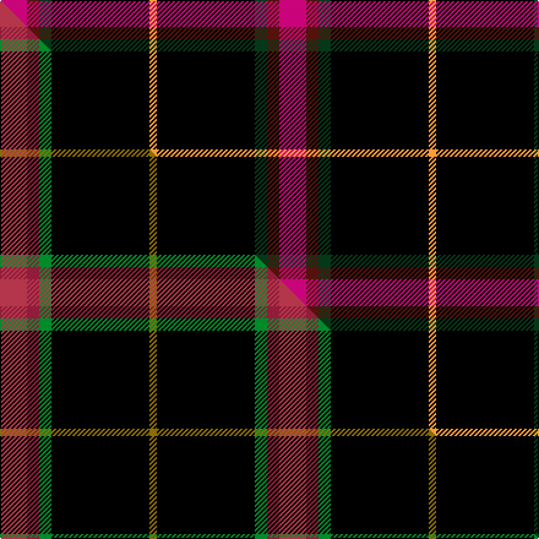

This page is one **sett** — a single exact thread-count. It belongs to the [tartan](/setts/m11dr5dg5k40lo3/)
(the same proportion at any scale), whose colour order is pattern [RBGKY](/stripes/rbgky/).

Part of the [MacShimsi](/tartans/macshimsi/) tartan — the named design grouping this sett with its other cloths.

Sourced from house-of-tartan.  It is a [5 stripe tartan](/stripes/stripes5/).

Original link http://www.house-of-tartan.scotland.net/house/TartanViewjs.asp?colr=Def&tnam=7318

## Provenance

Earliest known date: 2007 Designed for the MacShimsi Clan in Dundee

Dataset <small>— provenance for this record, inherited from the source manifest</small>

<dl class="dataset-prov">
<dt>source</dt><dd><a href="/sources/house-of-tartan/">House of Tartan</a></dd>
<dt>data captured from</dt><dd><a href="https://github.com/thetartan/tartan-database/blob/master/data/house-of-tartan/data.csv">https://github.com/thetartan/tartan-database/blob/master/data/house-of-tartan/data.csv</a></dd>
<dt>data date</dt><dd>2017-01-10 <small>(dataset default)</small></dd>
<dt>licence</dt><dd><a href="https://creativecommons.org/licenses/by-nc-nd/4.0/">CC BY-NC-ND 4.0</a></dd>
</dl>

Capture chain <small>— the hands this data passed through, oldest first; each capture carries its own licence</small>

<ol class="capture-chain">
<li><a href="http://www.house-of-tartan.scotland.net/">House of Tartan</a> <small>the weaver/retailer's database — the site is now offline; the URL is kept as the ultimate source's identity</small></li>
<li><a href="https://github.com/thetartan/tartan-database">thetartan/tartan-database</a> <small>2016-2017</small> · <a href="https://creativecommons.org/licenses/by-nc-nd/4.0/">CC BY-NC-ND 4.0</a> <small>Levko Kravets's frozen compilation — the capture we vendored, and where its CC licence text came from</small></li>
<li>this dictionary <small>captured 2026-06-10 · commit 5bf86c7566</small> <small>each re-capture is a git commit to data/sources</small></li>
</ol>

## Thread count
M/22 DR10 DG10 K80 LO/6

One full sett is **228 threads**.

## Palette
<table><thead><tr><th>Colour</th><th>Shade</th><th>OKLCh</th></tr></thead><tbody><tr><td>DR</td><td><code style="background-color:#55120C;">#55120C</code> <small style="color:#888">#55120C</small></td><td><small style="color:#888">oklch(30.0% 0.099 29.3)</small></td></tr><tr><td>M</td><td><code style="background-color:#CA047B;">#CA047B</code> <small style="color:#888">#CA047B</small></td><td><small style="color:#888">oklch(55.0% 0.225 353.8)</small></td></tr><tr><td>DG</td><td><code style="background-color:#053819;">#053819</code> <small style="color:#888">#053819</small></td><td><small style="color:#888">oklch(30.0% 0.075 151.3)</small></td></tr><tr><td>K</td><td><code style="background-color:#000000;">#000000</code> <small style="color:#888">#000000</small></td><td><small style="color:#888">oklch(0.0% 0.000 0.0)</small></td></tr><tr><td>LO</td><td><code style="background-color:#FF9C34;">#FF9C34</code> <small style="color:#888">#FF9C34</small></td><td><small style="color:#888">oklch(77.9% 0.161 61.8)</small></td></tr></tbody></table>

# Sample pattern

## Compared to the master

This cloth is one sett of its design; the master sett (the exemplar the design is anchored on) is below for comparison.

Its **ΔTartan distance** from the master is **0.37** — the same measure the nearest-tartans table ranks by (0 is identical; a re-scale of the same cloth is near 0, a recolour or a different proportion further).

<figure class="master-compare" style="margin:0">

this sett
master sett ★

<figcaption style="color:#888;font-size:smaller">One weave of this sett against the <a href="/setts/m11r5g5k40y3/">master sett ★</a>, split on the diagonal: a shared proportion runs seamlessly across it with only the shades shifting; a different proportion breaks on it.</figcaption>
</figure>

## Nearest tartan variants

The nearest existing variants by ΔTartan distance, with this cloth at the top so the swatches line up against it.

ΔTartan

Threads

Variant

Sett

—

228

<a href="/variants/s5/m11dr5dg5k40lo3~x2/">MacShimsi Personal Tartan</a>

<a href="/ttd/edit/#slug=ri11r5g5k40y3~x2~ri2107016-r1706009&amp;base=m11dr5dg5k40lo3~x2" title="compare in the TTD">0.37</a>

228

<a href="/variants/s5/m11r5g5k40y3~x2~m2107016-r1706009/">MacShimsi</a>

<a href="/ttd/edit/#slug=k50g6db6r6n6w3~x2&amp;base=m11dr5dg5k40lo3~x2" title="compare in the TTD">2.05</a>

202

<a href="/variants/s6/k50g6db6r6n6w3~x2/">Friends of Nordegg</a>

<a href="/ttd/edit/#slug=k50db6r6n6w3~x2&amp;base=m11dr5dg5k40lo3~x2" title="compare in the TTD">2.05</a>

178

<a href="/variants/s5/k50db6r6n6w3~x2/">Friends of Nordegg (Corporate)</a>

<a href="/ttd/edit/#slug=dr3lo2k10w1~x6&amp;base=m11dr5dg5k40lo3~x2" title="compare in the TTD">2.07</a>

168

<a href="/variants/s4/dr3lo2k10w1~x6/">St. Eloi</a>

<a href="/ttd/edit/#slug=g1r8k13ly1~x6&amp;base=m11dr5dg5k40lo3~x2" title="compare in the TTD">2.46</a>

264

<a href="/variants/s4/g1r8k13ly1~x6/">Billy Apple</a>

<a href="/ttd/edit/#slug=dp46k6g9lo9r4&amp;base=m11dr5dg5k40lo3~x2" title="compare in the TTD">2.47</a>

98

<a href="/variants/s5/dp46k6g9lo9r4/">Ayllu Thuban (Corporate)</a>

<a href="/ttd/edit/#slug=g3y5r14k36w3~x2&amp;base=m11dr5dg5k40lo3~x2" title="compare in the TTD">2.49</a>

232

<a href="/variants/s5/g3y5r14k36w3~x2/">Papua New Guinea</a>

<a href="/ttd/edit/#slug=k62n24ly5w8~x2&amp;base=m11dr5dg5k40lo3~x2" title="compare in the TTD">2.50</a>

256

<a href="/variants/s4/k62n24ly5w8~x2/">Perry, Alex (Personal)</a>

<a href="/ttd/edit/#slug=g3y5r13k33w2~x2&amp;base=m11dr5dg5k40lo3~x2" title="compare in the TTD">2.54</a>

214

<a href="/variants/s5/g3y5r13k33w2~x2/">Papua New Guinea Pipes and Drums</a>

<a href="/ttd/edit/#slug=dr14k3dg3w1~x2&amp;base=m11dr5dg5k40lo3~x2" title="compare in the TTD">2.58</a>

54

<a href="/variants/s4/dr14k3dg3w1~x2/">Bacon, Red (Fashion)</a>

## Neighbour map

Every grey dot is one of 13620 variants placed by the first two principal components of the ΔTartan feature space (42% of its variance). Red is this tartan; blue dots are its nearest — click one to open its page.

<svg viewBox="0 0 640 380" role="img" style="max-width:100%;height:auto;border:1px solid #e0e0e0;border-radius:4px;display:block" xmlns="http://www.w3.org/2000/svg"><image href="/nn/cloud.v1.png" width="640" height="380"/><a href="/variants/s5/m11r5g5k40y3~x2~m2107016-r1706009/"><circle cx="298.9" cy="146.9" r="4" fill="#3465a4"><title>MacShimsi</title></circle></a><a href="/variants/s6/k50g6db6r6n6w3~x2/"><circle cx="298.6" cy="105.3" r="4" fill="#3465a4"><title>Friends of Nordegg</title></circle></a><a href="/variants/s5/k50db6r6n6w3~x2/"><circle cx="366.3" cy="127.9" r="4" fill="#3465a4"><title>Friends of Nordegg (Corporate)</title></circle></a><a href="/variants/s4/dr3lo2k10w1~x6/"><circle cx="343.4" cy="183.6" r="4" fill="#3465a4"><title>St. Eloi</title></circle></a><a href="/variants/s4/g1r8k13ly1~x6/"><circle cx="280.9" cy="177.6" r="4" fill="#3465a4"><title>Billy Apple</title></circle></a><a href="/variants/s5/dp46k6g9lo9r4/"><circle cx="308.0" cy="157.8" r="4" fill="#3465a4"><title>Ayllu Thuban (Corporate)</title></circle></a><a href="/variants/s5/g3y5r14k36w3~x2/"><circle cx="257.3" cy="147.8" r="4" fill="#3465a4"><title>Papua New Guinea</title></circle></a><a href="/variants/s4/k62n24ly5w8~x2/"><circle cx="303.5" cy="185.1" r="4" fill="#3465a4"><title>Perry, Alex (Personal)</title></circle></a><a href="/variants/s5/g3y5r13k33w2~x2/"><circle cx="268.8" cy="136.5" r="4" fill="#3465a4"><title>Papua New Guinea Pipes and Drums</title></circle></a><a href="/variants/s4/dr14k3dg3w1~x2/"><circle cx="395.2" cy="189.6" r="4" fill="#3465a4"><title>Bacon, Red (Fashion)</title></circle></a><circle cx="301.2" cy="146.0" r="5" fill="#c00000"/><text x="320" y="376" text-anchor="middle" font-size="11" fill="#999">ground</text><text x="11" y="190" text-anchor="middle" font-size="11" fill="#999" transform="rotate(-90 11 190)">complexity</text></svg>

ID: /variants/s5/m11dr5dg5k40lo3~x2/
