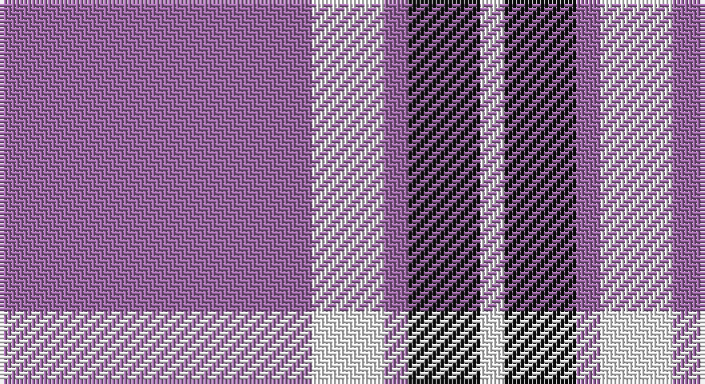

This page is one **sett** — a single exact thread-count. It belongs to the [tartan](/setts/m13w3m1k3w1/)
(the same proportion at any scale), whose colour order is pattern [RWRKW](/stripes/rwrkw/).

Sourced from register-of-tartans.  It is a [5 stripe tartan](/stripes/stripes5/).

Original link https://www.tartanregister.gov.uk/tartanDetails.aspx?ref=1365

2 attestations — the source records this cloth was collapsed from (oldest owns this page)

<ul>
<li>01/01/2002 — Glen App (register-of-tartans, <a href="https://www.tartanregister.gov.uk/tartanDetails.aspx?ref=1365">record</a>)</li>
<li>pre 2002 — Glen App (Fashion) (tartans-authority, <a href="http://www.tartansauthority.com/tartan-ferret/display/636/">record</a>)</li>
</ul>

## Register references

External register numbers recorded for this tartan.

- Scottish Register of Tartans: [1365](https://www.tartanregister.gov.uk/tartanDetails.aspx?ref=1365)
- Scottish Tartans Authority (ITI): 636
- Scottish Tartans World Register: 636

## Thread count
LP/78 W18 LP6 K18 W/6

One full sett is **168 threads**.

## Palette

Palette: <strong>Tartan Register</strong>
<table><thead><tr><th>Colour</th><th>Threads</th><th>Shade</th><th>Base</th><th>OKLCh</th></tr></thead><tbody><tr><td>LP/</td><td style="text-align:right;font-variant-numeric:tabular-nums">78</td><td><code style="background-color:#9C68A4;">#9C68A4</code> <small style="color:#888">#9C68A4</small></td><td>R <code style="background-color:#CC0000;">#CC0000</code></td><td><small style="color:#888">oklch(59.4% 0.107 322.0)</small></td></tr><tr><td>W</td><td style="text-align:right;font-variant-numeric:tabular-nums">18</td><td><code style="background-color:#FCFCFC;">#FCFCFC</code> <small style="color:#888">#FCFCFC</small></td><td>W <code style="background-color:#F7F7F7;">#F7F7F7</code></td><td><small style="color:#888">oklch(99.1% 0.000 89.9)</small></td></tr><tr><td>LP</td><td style="text-align:right;font-variant-numeric:tabular-nums">6</td><td><code style="background-color:#9C68A4;">#9C68A4</code> <small style="color:#888">#9C68A4</small></td><td>R <code style="background-color:#CC0000;">#CC0000</code></td><td><small style="color:#888">oklch(59.4% 0.107 322.0)</small></td></tr><tr><td>K</td><td style="text-align:right;font-variant-numeric:tabular-nums">18</td><td><code style="background-color:#101010;">#101010</code> <small style="color:#888">#101010</small></td><td>K <code style="background-color:#000000;">#000000</code></td><td><small style="color:#888">oklch(17.3% 0.000 89.9)</small></td></tr><tr><td>W/</td><td style="text-align:right;font-variant-numeric:tabular-nums">6</td><td><code style="background-color:#FCFCFC;">#FCFCFC</code> <small style="color:#888">#FCFCFC</small></td><td>W <code style="background-color:#F7F7F7;">#F7F7F7</code></td><td><small style="color:#888">oklch(99.1% 0.000 89.9)</small></td></tr></tbody></table>

# Sample pattern

## Nearest tartans

The nearest existing variants by ΔTartan distance, with this tartan at the top so the swatches line up against it.

ΔTartan

Tartan

Sett

—

<a href="/ttd/edit/#slug=m13w3m1k3w1~x6">Glen App</a> <a class="nn-out" href="/variants/s5/m13w3m1k3w1~x6/" title="open its dictionary page">↗</a>

1.43

<a href="/variants/s6/b30ly5b4r12~x4/">UEFA (Glasgow)</a>

1.63

<a href="/ttd/edit/#slug=db2r7db2r7db22ly2~x2&amp;base=m13w3m1k3w1~x6">MacQueen variant</a> <a class="nn-out" href="/variants/s6/db2r7db2r7db22ly2~x2/" title="open its dictionary page">↗</a>

1.64

<a href="/ttd/edit/#slug=p37w9p3o9w3~x2&amp;base=m13w3m1k3w1~x6">Glen App</a> <a class="nn-out" href="/variants/s5/p37w9p3o9w3~x2/" title="open its dictionary page">↗</a>

1.67

<a href="/variants/s4/dp23w4r4~x4/">Auchmaliddie Samkoma</a>

1.71

<a href="/ttd/edit/#slug=dp37w9dp3dr9w3~x2&amp;base=m13w3m1k3w1~x6">Glen App Trade Tartan</a> <a class="nn-out" href="/variants/s5/dp37w9dp3dr9w3~x2/" title="open its dictionary page">↗</a>

1.74

<a href="/variants/s6/db60ly6db11r25~x2/">South Australian Pipes &amp; Drums (Corp</a>

1.76

<a href="/ttd/edit/#slug=b11lo2r1lo2r1~x4&amp;base=m13w3m1k3w1~x6">Carlisle Ancient</a> <a class="nn-out" href="/variants/s5/b11lo2r1lo2r1~x4/" title="open its dictionary page">↗</a>

1.77

<a href="/ttd/edit/#slug=dp6w2dp29w29dp2w6~x2&amp;base=m13w3m1k3w1~x6">Erskine Purple (Dance) Fashion Tartan</a> <a class="nn-out" href="/variants/s6/dp6w2dp29w29dp2w6~x2/" title="open its dictionary page">↗</a>

1.78

<a href="/ttd/edit/#slug=k2w3dp5lo4w3lo4dp25lo2~x2&amp;base=m13w3m1k3w1~x6">Western Illinois University</a> <a class="nn-out" href="/variants/s8/k2w3dp5lo4w3lo4dp25lo2~x2/" title="open its dictionary page">↗</a>

1.79

<a href="/ttd/edit/#slug=b30ly5b4r12~x4&amp;base=m13w3m1k3w1~x6">UEFA (Corporate)</a> <a class="nn-out" href="/variants/s4/b30ly5b4r12~x4/" title="open its dictionary page">↗</a>

## Neighbour map

Every grey dot is one of 14360 variants placed by the first two principal components of the ΔTartan feature space (44% of its variance). Red is this tartan; blue dots are its nearest — click one to open its page.

<svg viewBox="0 0 640 380" role="img" style="max-width:100%;height:auto;border:1px solid #e0e0e0;border-radius:4px;display:block" xmlns="http://www.w3.org/2000/svg"><image href="/nn/cloud.v1.png" width="640" height="380"/><a href="/variants/s6/b30ly5b4r12~x4/"><circle cx="346.0" cy="218.8" r="4" fill="#3465a4"><title>UEFA (Glasgow)</title></circle></a><a href="/variants/s6/db2r7db2r7db22ly2~x2/"><circle cx="393.5" cy="207.5" r="4" fill="#3465a4"><title>MacQueen variant</title></circle></a><a href="/variants/s5/p37w9p3o9w3~x2/"><circle cx="401.4" cy="193.2" r="4" fill="#3465a4"><title>Glen App</title></circle></a><a href="/variants/s4/dp23w4r4~x4/"><circle cx="349.2" cy="237.8" r="4" fill="#3465a4"><title>Auchmaliddie Samkoma</title></circle></a><a href="/variants/s5/dp37w9dp3dr9w3~x2/"><circle cx="396.0" cy="192.6" r="4" fill="#3465a4"><title>Glen App Trade Tartan</title></circle></a><a href="/variants/s6/db60ly6db11r25~x2/"><circle cx="409.5" cy="215.7" r="4" fill="#3465a4"><title>South Australian Pipes &amp; Drums (Corp</title></circle></a><a href="/variants/s5/b11lo2r1lo2r1~x4/"><circle cx="395.7" cy="210.1" r="4" fill="#3465a4"><title>Carlisle Ancient</title></circle></a><a href="/variants/s6/dp6w2dp29w29dp2w6~x2/"><circle cx="340.2" cy="187.5" r="4" fill="#3465a4"><title>Erskine Purple (Dance) Fashion Tartan</title></circle></a><a href="/variants/s8/k2w3dp5lo4w3lo4dp25lo2~x2/"><circle cx="335.7" cy="141.4" r="4" fill="#3465a4"><title>Western Illinois University</title></circle></a><a href="/variants/s4/b30ly5b4r12~x4/"><circle cx="381.0" cy="251.8" r="4" fill="#3465a4"><title>UEFA (Corporate)</title></circle></a><circle cx="390.8" cy="185.7" r="5" fill="#c00000"/></svg>

ID: /variants/s5/m13w3m1k3w1~x6/
