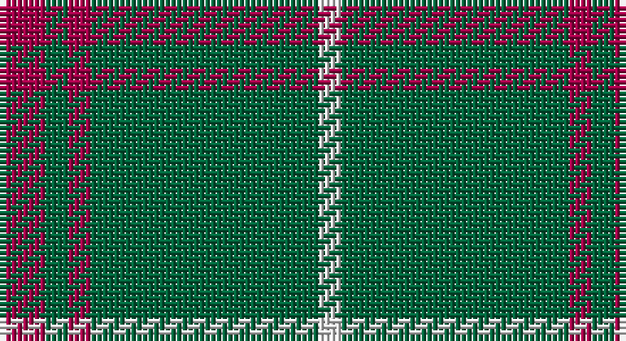

This page is one **sett** — a single exact thread-count. It belongs to the [tartan](/setts/m2g1m1g10w1/)
(the same proportion at any scale), whose colour order is pattern [RGRGW](/stripes/rgrgw/).

Part of the [Welsh National](/tartans/welsh-national/) tartan — the named design grouping this sett with its other cloths.

Sourced from house-of-tartan.  It is a [5 stripe tartan](/stripes/stripes5/).

Original link http://www.house-of-tartan.scotland.net/house/TartanViewjs.asp?colr=Def&tnam=1523

## Provenance

Earliest known date: 1968 The Welsh Tartan owes its origin to a Society formed in Cardiff in 1967. Its aims were cultural and political - to strengthen Celtic ties and give visible signs of being an individual nation in culture, language and dress. The colours are those of the Welsh flag. It is said that the design was based on the Lord of the Isles tartan because the present Lord is also Prince of Wales. However comparison reveals similarity only to MacDonald, MacDonald of the Isles, or perhaps Applecross district.

## Also known as

This cloth is also recorded under:

- Welsh National #2
- Welsh National #3
- Welsh, National

## Thread count
R/8 G4 R4 G40 LN/4

One full sett is **108 threads**.

## Palette

Palette: <strong>Tartan Register</strong>
<table><thead><tr><th>Colour</th><th>Threads</th><th>Shade</th><th>Base</th><th>OKLCh</th></tr></thead><tbody><tr><td>R/</td><td style="text-align:right;font-variant-numeric:tabular-nums">8</td><td><code style="background-color:#A00048;">#A00048</code> <small style="color:#888">#A00048</small></td><td>R <code style="background-color:#CC0000;">#CC0000</code></td><td><small style="color:#888">oklch(45.4% 0.182 5.3)</small></td></tr><tr><td>G</td><td style="text-align:right;font-variant-numeric:tabular-nums">4</td><td><code style="background-color:#00643C;">#00643C</code> <small style="color:#888">#00643C</small></td><td>G <code style="background-color:#006100;">#006100</code></td><td><small style="color:#888">oklch(44.3% 0.104 157.7)</small></td></tr><tr><td>R</td><td style="text-align:right;font-variant-numeric:tabular-nums">4</td><td><code style="background-color:#A00048;">#A00048</code> <small style="color:#888">#A00048</small></td><td>R <code style="background-color:#CC0000;">#CC0000</code></td><td><small style="color:#888">oklch(45.4% 0.182 5.3)</small></td></tr><tr><td>G</td><td style="text-align:right;font-variant-numeric:tabular-nums">40</td><td><code style="background-color:#00643C;">#00643C</code> <small style="color:#888">#00643C</small></td><td>G <code style="background-color:#006100;">#006100</code></td><td><small style="color:#888">oklch(44.3% 0.104 157.7)</small></td></tr><tr><td>LN/</td><td style="text-align:right;font-variant-numeric:tabular-nums">4</td><td><code style="background-color:#E0E0E0;">#E0E0E0</code> <small style="color:#888">#E0E0E0</small></td><td>W <code style="background-color:#F7F7F7;">#F7F7F7</code></td><td><small style="color:#888">oklch(90.7% 0.000 89.9)</small></td></tr></tbody></table>

# Sample pattern

## Compared to the master

This cloth is one sett of its design; the master sett (the exemplar the design is anchored on) is below for comparison.

<figure style="margin:0"><figcaption style="color:#888;font-size:smaller">this sett</figcaption></figure>
<figure style="margin:0"><figcaption style="color:#888;font-size:smaller"><a href="/setts/k4dy2r2dy2k2dy15lo2/">master sett →</a></figcaption></figure>

## Nearest tartans

The nearest existing variants by ΔTartan distance, with this tartan at the top so the swatches line up against it.

ΔTartan

Tartan

Sett

—

<a href="/ttd/edit/#slug=m2g1m1g10w1~x4">Welsh National District Tartan</a> <a class="nn-out" href="/variants/s5/m2g1m1g10w1~x4/" title="open its dictionary page">↗</a>

0.70

<a href="/ttd/edit/#slug=r8g3r4g44w4~x2&amp;base=m2g1m1g10w1~x4">Welsh National (District)</a> <a class="nn-out" href="/variants/s5/r8g3r4g44w4~x2/" title="open its dictionary page">↗</a>

1.34

<a href="/ttd/edit/#slug=dg10o1dg1o1lr2dg1o1~x4&amp;base=m2g1m1g10w1~x4">Green Watch</a> <a class="nn-out" href="/variants/s7/dg10o1dg1o1lr2dg1o1~x4/" title="open its dictionary page">↗</a>

1.35

<a href="/ttd/edit/#slug=g34m4g4m4g4m12g20w5~x2&amp;base=m2g1m1g10w1~x4">Leeds, University of (Dance)</a> <a class="nn-out" href="/variants/s8/g34m4g4m4g4m12g20w5~x2/" title="open its dictionary page">↗</a>

1.42

<a href="/ttd/edit/#slug=r2g2r1g12r3k1~x4&amp;base=m2g1m1g10w1~x4">Connell (Personal?)</a> <a class="nn-out" href="/variants/s6/r2g2r1g12r3k1~x4/" title="open its dictionary page">↗</a>

1.44

<a href="/variants/s4/g12p3g1~x2/">Elphinstone</a>

1.46

<a href="/ttd/edit/#slug=g9n1g2k4g2~x4&amp;base=m2g1m1g10w1~x4">Peterhead (Personal)</a> <a class="nn-out" href="/variants/s5/g9n1g2k4g2~x4/" title="open its dictionary page">↗</a>

1.52

<a href="/ttd/edit/#slug=g2db2g6db4g3db4g18ly2~x4&amp;base=m2g1m1g10w1~x4">Crow (Name)</a> <a class="nn-out" href="/variants/s8/g2db2g6db4g3db4g18ly2~x4/" title="open its dictionary page">↗</a>

1.57

<a href="/ttd/edit/#slug=ly5n1ly1n12r1~x8&amp;base=m2g1m1g10w1~x4">Ceredigion (Personal)</a> <a class="nn-out" href="/variants/s5/ly5n1ly1n12r1~x8/" title="open its dictionary page">↗</a>

1.63

<a href="/ttd/edit/#slug=r1k2dg16k2ly1~x2&amp;base=m2g1m1g10w1~x4">Skene or Tribe of Mar</a> <a class="nn-out" href="/variants/s5/r1k2dg16k2ly1~x2/" title="open its dictionary page">↗</a>

1.67

<a href="/ttd/edit/#slug=dp7g23r3g7~x2&amp;base=m2g1m1g10w1~x4">Highland Spring (1997) (Corporate)</a> <a class="nn-out" href="/variants/s4/dp7g23r3g7~x2/" title="open its dictionary page">↗</a>

## Neighbour map

Every grey dot is one of 14360 variants placed by the first two principal components of the ΔTartan feature space (44% of its variance). Red is this tartan; blue dots are its nearest — click one to open its page.

<svg viewBox="0 0 640 380" role="img" style="max-width:100%;height:auto;border:1px solid #e0e0e0;border-radius:4px;display:block" xmlns="http://www.w3.org/2000/svg"><image href="/nn/cloud.v1.png" width="640" height="380"/><a href="/variants/s5/r8g3r4g44w4~x2/"><circle cx="503.5" cy="208.4" r="4" fill="#3465a4"><title>Welsh National (District)</title></circle></a><a href="/variants/s7/dg10o1dg1o1lr2dg1o1~x4/"><circle cx="458.6" cy="214.8" r="4" fill="#3465a4"><title>Green Watch</title></circle></a><a href="/variants/s8/g34m4g4m4g4m12g20w5~x2/"><circle cx="429.5" cy="226.9" r="4" fill="#3465a4"><title>Leeds, University of (Dance)</title></circle></a><a href="/variants/s6/r2g2r1g12r3k1~x4/"><circle cx="444.9" cy="218.2" r="4" fill="#3465a4"><title>Connell (Personal?)</title></circle></a><a href="/variants/s4/g12p3g1~x2/"><circle cx="451.4" cy="258.3" r="4" fill="#3465a4"><title>Elphinstone</title></circle></a><a href="/variants/s5/g9n1g2k4g2~x4/"><circle cx="461.0" cy="275.1" r="4" fill="#3465a4"><title>Peterhead (Personal)</title></circle></a><a href="/variants/s8/g2db2g6db4g3db4g18ly2~x4/"><circle cx="438.9" cy="235.6" r="4" fill="#3465a4"><title>Crow (Name)</title></circle></a><a href="/variants/s5/ly5n1ly1n12r1~x8/"><circle cx="432.6" cy="219.4" r="4" fill="#3465a4"><title>Ceredigion (Personal)</title></circle></a><a href="/variants/s5/r1k2dg16k2ly1~x2/"><circle cx="488.8" cy="201.6" r="4" fill="#3465a4"><title>Skene or Tribe of Mar</title></circle></a><a href="/variants/s4/dp7g23r3g7~x2/"><circle cx="471.0" cy="290.0" r="4" fill="#3465a4"><title>Highland Spring (1997) (Corporate)</title></circle></a><circle cx="478.5" cy="228.8" r="5" fill="#c00000"/></svg>

ID: /variants/s5/m2g1m1g10w1~x4/
