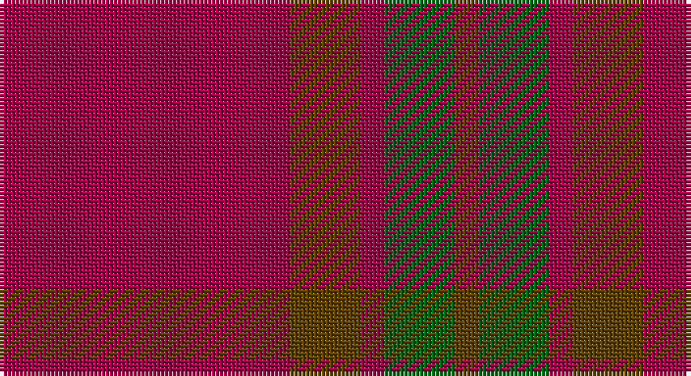

This page is one **sett** — a single exact thread-count. It belongs to the [tartan](/setts/m37dy9m3g9dy3/)
(the same proportion at any scale), whose colour order is pattern [GGRGR](/stripes/ggrgr/).

Part of the [Glen Shee](/tartans/glen-shee/) tartan — the named design grouping this sett with its other cloths.

Sourced from house-of-tartan.  It is a [5 stripe tartan](/stripes/stripes5/).

Original link http://www.house-of-tartan.scotland.net/house/TartanViewjs.asp?colr=Def&tnam=1662

## Provenance

Earliest known date: pre 2003 May have been obtained from a hand made design procured in the Highlands for The Highland Society of London.

## Also known as

This cloth is also recorded under:

- Glen Shee #1
- Glen Shee #3
- Glenshee #2

## Thread count
R/74 T18 R6 G18 T/6

One full sett is **164 threads**.

## Palette

Palette: <strong>Tartan Register</strong>
<table><thead><tr><th>Colour</th><th>Threads</th><th>Shade</th><th>Base</th><th>OKLCh</th></tr></thead><tbody><tr><td>R/</td><td style="text-align:right;font-variant-numeric:tabular-nums">74</td><td><code style="background-color:#A00048;">#A00048</code> <small style="color:#888">#A00048</small></td><td>R <code style="background-color:#CC0000;">#CC0000</code></td><td><small style="color:#888">oklch(45.4% 0.182 5.3)</small></td></tr><tr><td>T</td><td style="text-align:right;font-variant-numeric:tabular-nums">18</td><td><code style="background-color:#604000;">#604000</code> <small style="color:#888">#604000</small></td><td>G <code style="background-color:#006100;">#006100</code></td><td><small style="color:#888">oklch(39.8% 0.083 76.8)</small></td></tr><tr><td>R</td><td style="text-align:right;font-variant-numeric:tabular-nums">6</td><td><code style="background-color:#A00048;">#A00048</code> <small style="color:#888">#A00048</small></td><td>R <code style="background-color:#CC0000;">#CC0000</code></td><td><small style="color:#888">oklch(45.4% 0.182 5.3)</small></td></tr><tr><td>G</td><td style="text-align:right;font-variant-numeric:tabular-nums">18</td><td><code style="background-color:#006818;">#006818</code> <small style="color:#888">#006818</small></td><td>G <code style="background-color:#006100;">#006100</code></td><td><small style="color:#888">oklch(45.0% 0.142 145.0)</small></td></tr><tr><td>T/</td><td style="text-align:right;font-variant-numeric:tabular-nums">6</td><td><code style="background-color:#604000;">#604000</code> <small style="color:#888">#604000</small></td><td>G <code style="background-color:#006100;">#006100</code></td><td><small style="color:#888">oklch(39.8% 0.083 76.8)</small></td></tr></tbody></table>

# Sample pattern

## Nearest tartans

The nearest existing variants by ΔTartan distance, with this tartan at the top so the swatches line up against it.

ΔTartan

Tartan

Sett

—

<a href="/ttd/edit/#slug=m37dy9m3g9dy3~x2">Glen Shee Trade Tartan</a> <a class="nn-out" href="/variants/s5/m37dy9m3g9dy3~x2/" title="open its dictionary page">↗</a>

0.40

<a href="/ttd/edit/#slug=r37o9r3g9o3~x2&amp;base=m37dy9m3g9dy3~x2">Glen Shee</a> <a class="nn-out" href="/variants/s5/r37o9r3g9o3~x2/" title="open its dictionary page">↗</a>

1.23

<a href="/ttd/edit/#slug=r37do9r3g9do3~x2&amp;base=m37dy9m3g9dy3~x2">Glen Shee #1 (Fashion)</a> <a class="nn-out" href="/variants/s5/r37do9r3g9do3~x2/" title="open its dictionary page">↗</a>

1.26

<a href="/ttd/edit/#slug=r37dy9r3dg9dy3~x2&amp;base=m37dy9m3g9dy3~x2">Glenshee #2</a> <a class="nn-out" href="/variants/s5/r37dy9r3dg9dy3~x2/" title="open its dictionary page">↗</a>

1.47

<a href="/ttd/edit/#slug=r58n12r5y28r7lo5~x2&amp;base=m37dy9m3g9dy3~x2">Cairn O'Mount (Personal)</a> <a class="nn-out" href="/variants/s6/r58n12r5y28r7lo5~x2/" title="open its dictionary page">↗</a>

1.59

<a href="/ttd/edit/#slug=r9y2r45y20lo3~x2&amp;base=m37dy9m3g9dy3~x2">Hunt (Personal)</a> <a class="nn-out" href="/variants/s5/r9y2r45y20lo3~x2/" title="open its dictionary page">↗</a>

1.79

<a href="/ttd/edit/#slug=r8g2r2k1r1g2~x10&amp;base=m37dy9m3g9dy3~x2">Waverley Care Aids Trust (Corporate)</a> <a class="nn-out" href="/variants/s6/r8g2r2k1r1g2~x10/" title="open its dictionary page">↗</a>

1.90

<a href="/ttd/edit/#slug=r3o10r3o4r20lb1~x4&amp;base=m37dy9m3g9dy3~x2">Monica</a> <a class="nn-out" href="/variants/s6/r3o10r3o4r20lb1~x4/" title="open its dictionary page">↗</a>

1.91

<a href="/ttd/edit/#slug=m18dg1k5dg1k1dg1m9~x2&amp;base=m37dy9m3g9dy3~x2">Inverness Augustus</a> <a class="nn-out" href="/variants/s7/m18dg1k5dg1k1dg1m9~x2/" title="open its dictionary page">↗</a>

1.92

<a href="/variants/s8/r9y2r45y20lo3~x2/">Hunt (Personal)</a>

1.93

<a href="/ttd/edit/#slug=r29g2r2g2r6lo21~x4&amp;base=m37dy9m3g9dy3~x2">Maguire, Black (Name)</a> <a class="nn-out" href="/variants/s6/r29g2r2g2r6lo21~x4/" title="open its dictionary page">↗</a>

## Neighbour map

Every grey dot is one of 14360 variants placed by the first two principal components of the ΔTartan feature space (44% of its variance). Red is this tartan; blue dots are its nearest — click one to open its page.

<svg viewBox="0 0 640 380" role="img" style="max-width:100%;height:auto;border:1px solid #e0e0e0;border-radius:4px;display:block" xmlns="http://www.w3.org/2000/svg"><image href="/nn/cloud.v1.png" width="640" height="380"/><a href="/variants/s5/r37o9r3g9o3~x2/"><circle cx="487.3" cy="240.2" r="4" fill="#3465a4"><title>Glen Shee</title></circle></a><a href="/variants/s5/r37do9r3g9do3~x2/"><circle cx="514.3" cy="257.5" r="4" fill="#3465a4"><title>Glen Shee #1 (Fashion)</title></circle></a><a href="/variants/s5/r37dy9r3dg9dy3~x2/"><circle cx="525.2" cy="261.8" r="4" fill="#3465a4"><title>Glenshee #2</title></circle></a><a href="/variants/s6/r58n12r5y28r7lo5~x2/"><circle cx="426.8" cy="215.9" r="4" fill="#3465a4"><title>Cairn O'Mount (Personal)</title></circle></a><a href="/variants/s5/r9y2r45y20lo3~x2/"><circle cx="515.3" cy="209.3" r="4" fill="#3465a4"><title>Hunt (Personal)</title></circle></a><a href="/variants/s6/r8g2r2k1r1g2~x10/"><circle cx="470.6" cy="254.5" r="4" fill="#3465a4"><title>Waverley Care Aids Trust (Corporate)</title></circle></a><a href="/variants/s6/r3o10r3o4r20lb1~x4/"><circle cx="460.8" cy="199.5" r="4" fill="#3465a4"><title>Monica</title></circle></a><a href="/variants/s7/m18dg1k5dg1k1dg1m9~x2/"><circle cx="587.3" cy="221.7" r="4" fill="#3465a4"><title>Inverness Augustus</title></circle></a><a href="/variants/s8/r9y2r45y20lo3~x2/"><circle cx="499.3" cy="196.0" r="4" fill="#3465a4"><title>Hunt (Personal)</title></circle></a><a href="/variants/s6/r29g2r2g2r6lo21~x4/"><circle cx="452.8" cy="206.5" r="4" fill="#3465a4"><title>Maguire, Black (Name)</title></circle></a><circle cx="494.1" cy="241.8" r="5" fill="#c00000"/></svg>

ID: /variants/s5/m37dy9m3g9dy3~x2/
