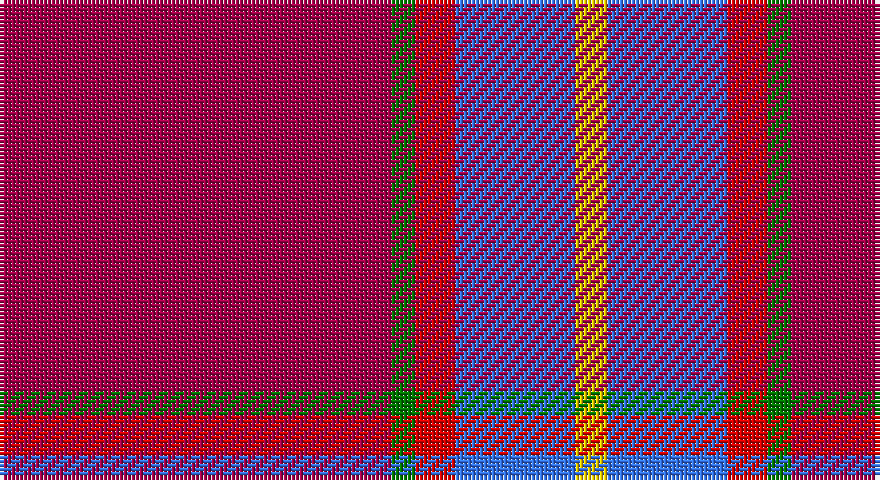

This page is one **sett** — a single exact thread-count. It belongs to the [tartan](/setts/m49g3r5b15ly4/)
(the same proportion at any scale), whose colour order is pattern [RGRBY](/stripes/rgrby/).

Sourced from register-of-tartans.  It is a [5 stripe tartan](/stripes/stripes5/).

Original link https://www.tartanregister.gov.uk/tartanDetails.aspx?ref=10632

## Register references

External register numbers recorded for this tartan.

- Scottish Register of Tartans: [10632](https://www.tartanregister.gov.uk/tartanDetails.aspx?ref=10632)

## Thread count
R/98 G6 Ra10 B30 Y/8

One full sett is **198 threads**.

## Palette

Palette: <strong>Tartan Register</strong> <small style="color:#888">(4 of 5 colours)</small>
<table><thead><tr><th>Colour</th><th>Threads</th><th>Shade</th><th>Base</th><th>OKLCh</th></tr></thead><tbody><tr><td>R/</td><td style="text-align:right;font-variant-numeric:tabular-nums">98</td><td><code style="background-color:#A00048;">#A00048</code> <small style="color:#888">#A00048</small></td><td>R <code style="background-color:#CC0000;">#CC0000</code></td><td><small style="color:#888">oklch(45.4% 0.182 5.3)</small></td></tr><tr><td>G</td><td style="text-align:right;font-variant-numeric:tabular-nums">6</td><td><code style="background-color:#007800;">#007800</code> <small style="color:#888">#007800</small></td><td>G <code style="background-color:#006100;">#006100</code></td><td><small style="color:#888">oklch(49.6% 0.169 142.5)</small></td></tr><tr><td>Ra</td><td style="text-align:right;font-variant-numeric:tabular-nums">10</td><td><code style="background-color:#DC0000;">#DC0000</code> <small style="color:#888">#DC0000</small></td><td>R <code style="background-color:#CC0000;">#CC0000</code></td><td><small style="color:#888">oklch(56.2% 0.230 29.2)</small></td></tr><tr><td>B</td><td style="text-align:right;font-variant-numeric:tabular-nums">30</td><td><code style="background-color:#3474FC;">#3474FC</code> <small style="color:#888">#3474FC</small></td><td>B <code style="background-color:#2A418A;">#2A418A</code></td><td><small style="color:#888">oklch(59.7% 0.214 262.7)</small></td></tr><tr><td>Y/</td><td style="text-align:right;font-variant-numeric:tabular-nums">8</td><td><code style="background-color:#FCCC00;">#FCCC00</code> <small style="color:#888">#FCCC00</small></td><td>Y <code style="background-color:#F2BF00;">#F2BF00</code></td><td><small style="color:#888">oklch(86.2% 0.176 91.5)</small></td></tr></tbody></table>

# Sample pattern

## Nearest tartans

The nearest existing variants by ΔTartan distance, with this tartan at the top so the swatches line up against it.

ΔTartan

Tartan

Sett

—

<a href="/ttd/edit/#slug=m49g3r5b15ly4~x2">Orion Nebula</a> <a class="nn-out" href="/variants/s5/m49g3r5b15ly4~x2/" title="open its dictionary page">↗</a>

1.57

<a href="/ttd/edit/#slug=r155lb16k34db48r18ly6r9&amp;base=m49g3r5b15ly4~x2">Solberg-Wormald (Personal)</a> <a class="nn-out" href="/variants/s7/r155lb16k34db48r18ly6r9/" title="open its dictionary page">↗</a>

1.61

<a href="/ttd/edit/#slug=m8w4m50k12m4k15mi5~x2&amp;base=m49g3r5b15ly4~x2">Instakilt, Pink (Fashion)</a> <a class="nn-out" href="/variants/s7/m8w4m50k12m4k15mi5~x2/" title="open its dictionary page">↗</a>

1.66

<a href="/ttd/edit/#slug=r32lb4dt7ly2t2~x5&amp;base=m49g3r5b15ly4~x2">Sildesalaten</a> <a class="nn-out" href="/variants/s5/r32lb4dt7ly2t2~x5/" title="open its dictionary page">↗</a>

1.67

<a href="/ttd/edit/#slug=r50db14w6db9lo3db4r4~x2&amp;base=m49g3r5b15ly4~x2">Texas Lone Star (Fashion)</a> <a class="nn-out" href="/variants/s7/r50db14w6db9lo3db4r4~x2/" title="open its dictionary page">↗</a>

1.72

<a href="/ttd/edit/#slug=m3dg8m3db8m20w2m2~x4&amp;base=m49g3r5b15ly4~x2">Unnamed C21st (Lady's Jacket) (Fash)</a> <a class="nn-out" href="/variants/s7/m3dg8m3db8m20w2m2~x4/" title="open its dictionary page">↗</a>

1.74

<a href="/ttd/edit/#slug=r6dg14r6db11r31lb2r4ly3~x2&amp;base=m49g3r5b15ly4~x2">Loch Lochy</a> <a class="nn-out" href="/variants/s8/r6dg14r6db11r31lb2r4ly3~x2/" title="open its dictionary page">↗</a>

1.75

<a href="/ttd/edit/#slug=r80lb40k5lo6&amp;base=m49g3r5b15ly4~x2">Broberg (Scania) (Personal)</a> <a class="nn-out" href="/variants/s4/r80lb40k5lo6/" title="open its dictionary page">↗</a>

1.76

<a href="/ttd/edit/#slug=r62db8w20k3g4~x2&amp;base=m49g3r5b15ly4~x2">Nicolson Dress (Clan)</a> <a class="nn-out" href="/variants/s5/r62db8w20k3g4~x2/" title="open its dictionary page">↗</a>

1.78

<a href="/ttd/edit/#slug=m6lb3n6o10m38lb2n4&amp;base=m49g3r5b15ly4~x2">Washington State University Cougar</a> <a class="nn-out" href="/variants/s7/m6lb3n6o10m38lb2n4/" title="open its dictionary page">↗</a>

1.79

<a href="/ttd/edit/#slug=r52lo2db16lo2db3w5~x2&amp;base=m49g3r5b15ly4~x2">Brock University Alumni Association</a> <a class="nn-out" href="/variants/s6/r52lo2db16lo2db3w5~x2/" title="open its dictionary page">↗</a>

## Neighbour map

Every grey dot is one of 14360 variants placed by the first two principal components of the ΔTartan feature space (44% of its variance). Red is this tartan; blue dots are its nearest — click one to open its page.

<svg viewBox="0 0 640 380" role="img" style="max-width:100%;height:auto;border:1px solid #e0e0e0;border-radius:4px;display:block" xmlns="http://www.w3.org/2000/svg"><image href="/nn/cloud.v1.png" width="640" height="380"/><a href="/variants/s7/r155lb16k34db48r18ly6r9/"><circle cx="381.1" cy="111.2" r="4" fill="#3465a4"><title>Solberg-Wormald (Personal)</title></circle></a><a href="/variants/s7/m8w4m50k12m4k15mi5~x2/"><circle cx="364.5" cy="154.3" r="4" fill="#3465a4"><title>Instakilt, Pink (Fashion)</title></circle></a><a href="/variants/s5/r32lb4dt7ly2t2~x5/"><circle cx="415.6" cy="142.8" r="4" fill="#3465a4"><title>Sildesalaten</title></circle></a><a href="/variants/s7/r50db14w6db9lo3db4r4~x2/"><circle cx="371.1" cy="139.4" r="4" fill="#3465a4"><title>Texas Lone Star (Fashion)</title></circle></a><a href="/variants/s7/m3dg8m3db8m20w2m2~x4/"><circle cx="333.4" cy="186.0" r="4" fill="#3465a4"><title>Unnamed C21st (Lady's Jacket) (Fash)</title></circle></a><a href="/variants/s8/r6dg14r6db11r31lb2r4ly3~x2/"><circle cx="331.2" cy="143.9" r="4" fill="#3465a4"><title>Loch Lochy</title></circle></a><a href="/variants/s4/r80lb40k5lo6/"><circle cx="360.4" cy="183.3" r="4" fill="#3465a4"><title>Broberg (Scania) (Personal)</title></circle></a><a href="/variants/s5/r62db8w20k3g4~x2/"><circle cx="374.0" cy="127.5" r="4" fill="#3465a4"><title>Nicolson Dress (Clan)</title></circle></a><a href="/variants/s7/m6lb3n6o10m38lb2n4/"><circle cx="442.5" cy="165.3" r="4" fill="#3465a4"><title>Washington State University Cougar</title></circle></a><a href="/variants/s6/r52lo2db16lo2db3w5~x2/"><circle cx="419.0" cy="119.9" r="4" fill="#3465a4"><title>Brock University Alumni Association</title></circle></a><circle cx="393.8" cy="153.8" r="5" fill="#c00000"/></svg>

ID: /variants/s5/m49g3r5b15ly4~x2/
