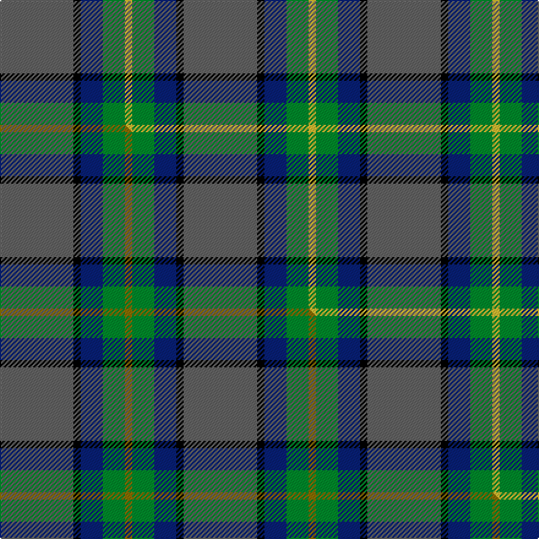

This is one **variant** — a specific cloth: this exact thread count and colourway, with its own
provenance below. It is one weaving of the [sett](/setts/n10k1db3g3ly1/) (the scale-free proportion — the
same cloth at any scale or shade), whose colour order is pattern [BKBGY](/stripes/bkbgy/).

Part of the [Celtic Norse Heritage Society](/tartans/c/ce/celtic-norse-heritage-society/) tartan — the named design grouping this sett with its other cloths.

Sourced from tartans-authority.  It is a [5 stripe tartan](/stripes/stripes5/).

Original link [https://www.tartanregister.gov.uk/tartanDetails.aspx?ref=11093](https://www.tartanregister.gov.uk/tartanDetails.aspx?ref=11093)

Dataset <small>— provenance for this record, inherited from the source manifest</small>

<dl class="dataset-prov">
<dt>source</dt><dd><a href="/sources/tartans-authority/">Scottish Tartans Authority</a></dd>
<dt>data captured from</dt><dd><a href="https://github.com/thetartan/tartan-database/blob/master/data/tartans-authority/data.csv">https://github.com/thetartan/tartan-database/blob/master/data/tartans-authority/data.csv</a></dd>
<dt>data date</dt><dd>2014 <small>(this record)</small></dd>
<dt>licence</dt><dd><a href="https://creativecommons.org/licenses/by-nc-nd/4.0/">CC BY-NC-ND 4.0</a></dd>
</dl>

Capture chain <small>— the hands this data passed through, oldest first; each capture carries its own licence</small>

<ol class="capture-chain">
<li><a href="https://www.tartansauthority.com/">Scottish Tartans Authority</a> <small>the heritage body's archive — its tartan-ferret record browser is retired (links repaired to the SRT, above)</small></li>
<li><a href="https://github.com/thetartan/tartan-database">thetartan/tartan-database</a> <small>2016-2017</small> · <a href="https://creativecommons.org/licenses/by-nc-nd/4.0/">CC BY-NC-ND 4.0</a> <small>Levko Kravets's frozen compilation — the capture we vendored, and where its CC licence text came from</small></li>
<li>this dictionary <small>captured 2026-06-10 · commit 5bf86c7566</small> <small>each re-capture is a git commit to data/sources</small></li>
</ol>

## Register references

External register numbers recorded for this tartan.

- Scottish Register of Tartans: [11093](https://www.tartanregister.gov.uk/tartanDetails?ref=11093)
- Scottish Tartans Authority (ITI): 11093

## Thread count
N/60 K6 DB18 G18 LY/6

One full sett is **150 threads**.

## Palette
<table><thead><tr><th>Colour</th><th>Shade</th><th>OKLCh</th></tr></thead><tbody><tr><td>DB</td><td><code style="background-color:#082077;">#082077</code> <small style="color:#888">#082077</small></td><td><small style="color:#888">oklch(30.0% 0.149 265.1)</small></td></tr><tr><td>G</td><td><code style="background-color:#008B2A;">#008B2A</code> <small style="color:#888">#008B2A</small></td><td><small style="color:#888">oklch(55.4% 0.170 145.9)</small></td></tr><tr><td>K</td><td><code style="background-color:#000000;">#000000</code> <small style="color:#888">#000000</small></td><td><small style="color:#888">oklch(0.0% 0.000 0.0)</small></td></tr><tr><td>N</td><td><code style="background-color:#636363;">#636363</code> <small style="color:#888">#636363</small></td><td><small style="color:#888">oklch(50.0% 0.000 89.9)</small></td></tr><tr><td>LY</td><td><code style="background-color:#DCBC32;">#DCBC32</code> <small style="color:#888">#DCBC32</small></td><td><small style="color:#888">oklch(80.0% 0.150 95.2)</small></td></tr></tbody></table>

# Sample pattern

## Compared to the master

This cloth is one sett of its design; the master sett (the exemplar the design is anchored on) is below for comparison.

Its **ΔTartan distance** from the master is **0.03** — the same measure the nearest-tartans table ranks by (0 is identical; a re-scale of the same cloth is near 0, a recolour or a different proportion further).

<figure class="master-compare" style="margin:0">

this sett
master sett ★

<figcaption style="color:#888;font-size:smaller">One weave of this sett against the <a href="/setts/n10k1db3g3y1/">master sett ★</a>, split on the diagonal: a shared proportion runs seamlessly across it with only the shades shifting; a different proportion breaks on it.</figcaption>
</figure>

## Nearest tartan variants

The nearest existing variants by ΔTartan distance, with this cloth at the top so the swatches line up against it.

ΔTartan

Threads

Variant

Sett

—

150

<a href="/variants/s5/n10k1db3g3ly1~x6/">Celtic Norse Heritage Society</a>

<a href="/ttd/edit/#slug=n10k1db3g3y1~x6&amp;base=n10k1db3g3ly1~x6" title="compare in the TTD">0.03</a>

150

<a href="/variants/s5/n10k1db3g3y1~x6/">Celtic Norse Heritage Society</a>

<a href="/ttd/edit/#slug=k1db1g8dt8w1~x4~db1406275-dt1204274&amp;base=n10k1db3g3ly1~x6" title="compare in the TTD">1.68</a>

144

<a href="/variants/s5/k1dbi1g8db8w1~x4~dbi1406275-db1204274/">Douglas, Green (Wilsons)</a>

<a href="/ttd/edit/#slug=n25k5db5dp3~x2&amp;base=n10k1db3g3ly1~x6" title="compare in the TTD">1.71</a>

96

<a href="/variants/s4/n25k5db5dp3~x2/">Lord Willy's (New York)</a>

<a href="/ttd/edit/#slug=r7y3g28db28w3~x2&amp;base=n10k1db3g3ly1~x6" title="compare in the TTD">1.74</a>

256

<a href="/variants/s5/r7y3g28db28w3~x2/">Turnbull, hunting</a>

<a href="/ttd/edit/#slug=r2y1g10db10w1~x6&amp;base=n10k1db3g3ly1~x6" title="compare in the TTD">1.75</a>

270

<a href="/variants/s5/r2y1g10db10w1~x6/">Turnbull Hunting (Name)</a>

<a href="/ttd/edit/#slug=k3db3g23db21w2~x2~db1406275&amp;base=n10k1db3g3ly1~x6" title="compare in the TTD">1.79</a>

198

<a href="/variants/s5/k3db3g23db21w2~x2~db1406275/">Douglas Clan Tartan</a>

<a href="/ttd/edit/#slug=k3dg44db27y6r10w3~x2&amp;base=n10k1db3g3ly1~x6" title="compare in the TTD">1.81</a>

360

<a href="/variants/s6/k3dg44db27y6r10w3~x2/">Official Glasgow 2014, The</a>

<a href="/ttd/edit/#slug=g27db14k2db2y2~x4&amp;base=n10k1db3g3ly1~x6" title="compare in the TTD">1.88</a>

260

<a href="/variants/s5/g27db14k2db2y2~x4/">Irving of Bonshaw</a>

<a href="/ttd/edit/#slug=r1g9db9k1db1w1~x6&amp;base=n10k1db3g3ly1~x6" title="compare in the TTD">2.12</a>

252

<a href="/variants/s6/r1g9db9k1db1w1~x6/">Irving of Glentulchan Family Tartan</a>

<a href="/ttd/edit/#slug=g12lo1db8k1db1~x4&amp;base=n10k1db3g3ly1~x6" title="compare in the TTD">2.16</a>

132

<a href="/variants/s5/g12lo1db8k1db1~x4/">Rowan (Personal)</a>

## Neighbour map

Every grey dot is one of 13621 variants placed by the first two principal components of the ΔTartan feature space (42% of its variance). Red is this tartan; blue dots are its nearest — click one to open its page. The map is a flat projection of a many-dimensional space — [how to read it](/posts/neighbourhood-maps/).

<svg viewBox="0 0 640 380" role="img" style="max-width:100%;height:auto;border:1px solid #e0e0e0;border-radius:4px;display:block" xmlns="http://www.w3.org/2000/svg"><image href="/nn/cloud.v1.png" width="640" height="380"/><a href="/variants/s5/n10k1db3g3y1~x6/"><circle cx="316.9" cy="209.0" r="4" fill="#3465a4"><title>Celtic Norse Heritage Society</title></circle></a><a href="/variants/s5/k1dbi1g8db8w1~x4~dbi1406275-db1204274/"><circle cx="199.4" cy="202.0" r="4" fill="#3465a4"><title>Douglas, Green (Wilsons)</title></circle></a><a href="/variants/s4/n25k5db5dp3~x2/"><circle cx="375.9" cy="219.9" r="4" fill="#3465a4"><title>Lord Willy's (New York)</title></circle></a><a href="/variants/s5/r7y3g28db28w3~x2/"><circle cx="212.1" cy="213.5" r="4" fill="#3465a4"><title>Turnbull, hunting</title></circle></a><a href="/variants/s5/r2y1g10db10w1~x6/"><circle cx="225.7" cy="208.1" r="4" fill="#3465a4"><title>Turnbull Hunting (Name)</title></circle></a><a href="/variants/s5/k3db3g23db21w2~x2~db1406275/"><circle cx="227.0" cy="190.6" r="4" fill="#3465a4"><title>Douglas Clan Tartan</title></circle></a><a href="/variants/s6/k3dg44db27y6r10w3~x2/"><circle cx="232.5" cy="155.3" r="4" fill="#3465a4"><title>Official Glasgow 2014, The</title></circle></a><a href="/variants/s5/g27db14k2db2y2~x4/"><circle cx="332.6" cy="189.9" r="4" fill="#3465a4"><title>Irving of Bonshaw</title></circle></a><a href="/variants/s6/r1g9db9k1db1w1~x6/"><circle cx="218.8" cy="179.3" r="4" fill="#3465a4"><title>Irving of Glentulchan Family Tartan</title></circle></a><a href="/variants/s5/g12lo1db8k1db1~x4/"><circle cx="292.7" cy="195.4" r="4" fill="#3465a4"><title>Rowan (Personal)</title></circle></a><circle cx="293.4" cy="200.9" r="5" fill="#c00000"/><text x="320" y="376" text-anchor="middle" font-size="11" fill="#999">ground</text><text x="11" y="190" text-anchor="middle" font-size="11" fill="#999" transform="rotate(-90 11 190)">complexity</text></svg>

ID: /variants/s5/n10k1db3g3ly1~x6/
