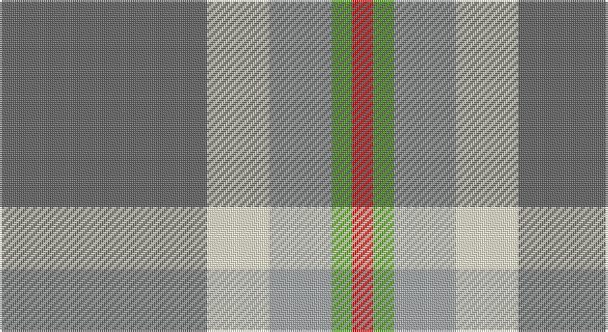

This page is one **sett** — a single exact thread-count. It belongs to the [tartan](/setts/n10w3lr3g1r1/)
(the same proportion at any scale), whose colour order is pattern [BWYGR](/stripes/bwygr/).

Part of the [Bagpipe Shop](/tartans/bagpipe-shop/) tartan — the named design grouping this sett with its other cloths.

Sourced from register-of-tartans.  It is a [5 stripe tartan](/stripes/stripes5/).

Original link https://www.tartanregister.gov.uk/tartanDetails.aspx?ref=10773

## Register references

External register numbers recorded for this tartan.

- Scottish Register of Tartans: [10773](https://www.tartanregister.gov.uk/tartanDetails.aspx?ref=10773)

## Thread count
N/100 LY30 Na30 G10 R/10

One full sett is **250 threads**.

## Palette

Palette: <strong>Tartan Register</strong> <small style="color:#888">(2 of 5 colours)</small>
<table><thead><tr><th>Colour</th><th>Threads</th><th>Shade</th><th>Base</th><th>OKLCh</th></tr></thead><tbody><tr><td>N/</td><td style="text-align:right;font-variant-numeric:tabular-nums">100</td><td><code style="background-color:#646464;">#646464</code> <small style="color:#888">#646464</small></td><td>B <code style="background-color:#2A418A;">#2A418A</code></td><td><small style="color:#888">oklch(50.3% 0.000 89.9)</small></td></tr><tr><td>LY</td><td style="text-align:right;font-variant-numeric:tabular-nums">30</td><td><code style="background-color:#F8F4D0;">#F8F4D0</code> <small style="color:#888">#F8F4D0</small></td><td>W <code style="background-color:#F7F7F7;">#F7F7F7</code></td><td><small style="color:#888">oklch(96.1% 0.047 102.0)</small></td></tr><tr><td>Na</td><td style="text-align:right;font-variant-numeric:tabular-nums">30</td><td><code style="background-color:#A4A8A8;">#A4A8A8</code> <small style="color:#888">#A4A8A8</small></td><td>Y <code style="background-color:#F2BF00;">#F2BF00</code></td><td><small style="color:#888">oklch(72.8% 0.005 197.1)</small></td></tr><tr><td>G</td><td style="text-align:right;font-variant-numeric:tabular-nums">10</td><td><code style="background-color:#4CA412;">#4CA412</code> <small style="color:#888">#4CA412</small></td><td>G <code style="background-color:#006100;">#006100</code></td><td><small style="color:#888">oklch(63.9% 0.188 137.1)</small></td></tr><tr><td>R/</td><td style="text-align:right;font-variant-numeric:tabular-nums">10</td><td><code style="background-color:#FF0000;">#FF0000</code> <small style="color:#888">#FF0000</small></td><td>R <code style="background-color:#CC0000;">#CC0000</code></td><td><small style="color:#888">oklch(62.8% 0.258 29.2)</small></td></tr></tbody></table>

# Sample pattern

## Nearest tartans

The nearest existing variants by ΔTartan distance, with this tartan at the top so the swatches line up against it.

ΔTartan

Tartan

Sett

—

<a href="/ttd/edit/#slug=n10w3lr3g1r1~x10">Bagpipe Shop (Switzerland)</a> <a class="nn-out" href="/variants/s5/n10w3lr3g1r1~x10/" title="open its dictionary page">↗</a>

0.28

<a href="/ttd/edit/#slug=n10w3lb3g1r1~x10&amp;base=n10w3lr3g1r1~x10">Bagpipe Shop (Corporate)</a> <a class="nn-out" href="/variants/s5/n10w3lb3g1r1~x10/" title="open its dictionary page">↗</a>

0.75

<a href="/ttd/edit/#slug=ly15r9t30w3db4~x2&amp;base=n10w3lr3g1r1~x10">S.I.D.E. (Corporate)</a> <a class="nn-out" href="/variants/s5/ly15r9t30w3db4~x2/" title="open its dictionary page">↗</a>

1.19

<a href="/ttd/edit/#slug=o10k1db3g3ly1~x6&amp;base=n10w3lr3g1r1~x10">Celtic Norse Heritage Society</a> <a class="nn-out" href="/variants/s5/o10k1db3g3ly1~x6/" title="open its dictionary page">↗</a>

1.34

<a href="/ttd/edit/#slug=o62t17ly12g8dg8~x2&amp;base=n10w3lr3g1r1~x10">Dundhuin Dress (Personal)</a> <a class="nn-out" href="/variants/s5/o62t17ly12g8dg8~x2/" title="open its dictionary page">↗</a>

1.44

<a href="/ttd/edit/#slug=b4g16ly2p7b28w4~x2&amp;base=n10w3lr3g1r1~x10">Manx Laxey</a> <a class="nn-out" href="/variants/s6/b4g16ly2p7b28w4~x2/" title="open its dictionary page">↗</a>

1.44

<a href="/ttd/edit/#slug=t4dg16ly2dp7t28w4~x2&amp;base=n10w3lr3g1r1~x10">Manx Laxey (Blue)</a> <a class="nn-out" href="/variants/s6/t4dg16ly2dp7t28w4~x2/" title="open its dictionary page">↗</a>

1.47

<a href="/ttd/edit/#slug=r4lbi30y14lb11y4~x2&amp;base=n10w3lr3g1r1~x10">Trinity Bicycles (Corporate)</a> <a class="nn-out" href="/variants/s5/r4lbi30y14lb11y4~x2/" title="open its dictionary page">↗</a>

1.47

<a href="/ttd/edit/#slug=g11lo10dp11t33w3~x2&amp;base=n10w3lr3g1r1~x10">Sterling, Rob (Florida) (Persona Name Tartan</a> <a class="nn-out" href="/variants/s5/g11lo10dp11t33w3~x2/" title="open its dictionary page">↗</a>

1.49

<a href="/ttd/edit/#slug=o3w3k3lo10r1~x6&amp;base=n10w3lr3g1r1~x10">Burberry Counterfeit</a> <a class="nn-out" href="/variants/s5/o3w3k3lo10r1~x6/" title="open its dictionary page">↗</a>

1.53

<a href="/ttd/edit/#slug=lb3k3lb3k3o15r1~x4&amp;base=n10w3lr3g1r1~x10">Tiree Grey</a> <a class="nn-out" href="/variants/s6/lb3k3lb3k3o15r1~x4/" title="open its dictionary page">↗</a>

## Neighbour map

Every grey dot is one of 14360 variants placed by the first two principal components of the ΔTartan feature space (44% of its variance). Red is this tartan; blue dots are its nearest — click one to open its page.

<svg viewBox="0 0 640 380" role="img" style="max-width:100%;height:auto;border:1px solid #e0e0e0;border-radius:4px;display:block" xmlns="http://www.w3.org/2000/svg"><image href="/nn/cloud.v1.png" width="640" height="380"/><a href="/variants/s5/n10w3lb3g1r1~x10/"><circle cx="274.0" cy="188.6" r="4" fill="#3465a4"><title>Bagpipe Shop (Corporate)</title></circle></a><a href="/variants/s5/ly15r9t30w3db4~x2/"><circle cx="230.0" cy="193.7" r="4" fill="#3465a4"><title>S.I.D.E. (Corporate)</title></circle></a><a href="/variants/s5/o10k1db3g3ly1~x6/"><circle cx="260.1" cy="190.9" r="4" fill="#3465a4"><title>Celtic Norse Heritage Society</title></circle></a><a href="/variants/s5/o62t17ly12g8dg8~x2/"><circle cx="314.7" cy="210.1" r="4" fill="#3465a4"><title>Dundhuin Dress (Personal)</title></circle></a><a href="/variants/s6/b4g16ly2p7b28w4~x2/"><circle cx="271.5" cy="176.2" r="4" fill="#3465a4"><title>Manx Laxey</title></circle></a><a href="/variants/s6/t4dg16ly2dp7t28w4~x2/"><circle cx="273.2" cy="182.3" r="4" fill="#3465a4"><title>Manx Laxey (Blue)</title></circle></a><a href="/variants/s5/r4lbi30y14lb11y4~x2/"><circle cx="233.7" cy="221.6" r="4" fill="#3465a4"><title>Trinity Bicycles (Corporate)</title></circle></a><a href="/variants/s5/g11lo10dp11t33w3~x2/"><circle cx="242.2" cy="215.6" r="4" fill="#3465a4"><title>Sterling, Rob (Florida) (Persona Name Tartan</title></circle></a><a href="/variants/s5/o3w3k3lo10r1~x6/"><circle cx="211.7" cy="187.0" r="4" fill="#3465a4"><title>Burberry Counterfeit</title></circle></a><a href="/variants/s6/lb3k3lb3k3o15r1~x4/"><circle cx="290.6" cy="171.5" r="4" fill="#3465a4"><title>Tiree Grey</title></circle></a><circle cx="277.0" cy="188.8" r="5" fill="#c00000"/></svg>

ID: /variants/s5/n10w3lr3g1r1~x10/
