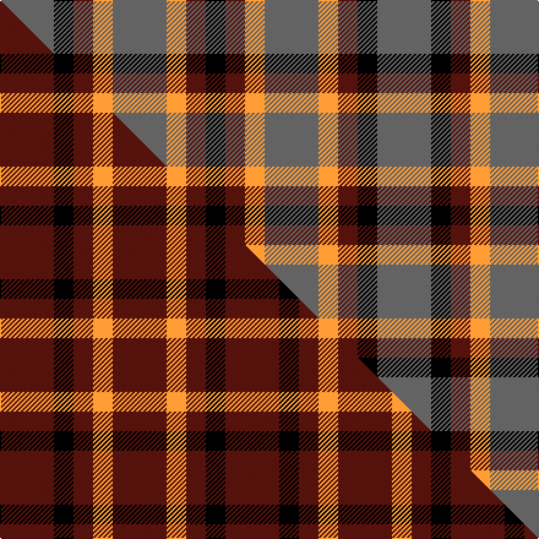

This is one **variant** — a specific cloth: this exact thread count and colourway, with its own
provenance below. It is one weaving of the [sett](/setts/n11k4dr4lo4n11/) (the scale-free proportion — the
same cloth at any scale or shade), whose colour order is pattern [BKBYBYBK](/stripes/bkbybybk/).

Part of the [Ikelman](/tartans/ikelman-4/) tartan — the named design grouping this sett with its other cloths.

Sourced from register-of-tartans.  It is a [8 stripe tartan](/stripes/stripes8/).

Original link [https://www.tartanregister.gov.uk/tartanDetails.aspx?ref=1813](https://www.tartanregister.gov.uk/tartanDetails.aspx?ref=1813)

2 attestations — the source records this cloth was collapsed from (oldest owns this page)

<ul>
<li>01/01/1993 — Ikelman #3 (Personal) (register-of-tartans, <a href="https://www.tartanregister.gov.uk/tartanDetails.aspx?ref=1813">record</a>)  <em>This is the same as 5243 except that grey has been substituted for the red within the black bands. Woven sample. Colours taken from the German flag.</em></li>
<li>1993 January — Ikelman #3a (Personal) (tartans-authority, <a href="https://www.tartanregister.gov.uk/tartanDetails.aspx?ref=2212">record</a>)  <em>This is the same as 5243 except that grey has been substituted for the red within the black bands. Woven sample.</em></li>
</ul>

Dataset <small>— provenance for this record, inherited from the source manifest</small>

<dl class="dataset-prov">
<dt>source</dt><dd><a href="/sources/register-of-tartans/">Scottish Register of Tartans</a></dd>
<dt>data captured from</dt><dd><a href="https://github.com/thetartan/tartan-database/blob/master/data/register-of-tartans/data.csv">https://github.com/thetartan/tartan-database/blob/master/data/register-of-tartans/data.csv</a></dd>
<dt>data date</dt><dd>1993 <small>(this record)</small></dd>
<dt>licence</dt><dd><a href="https://www.tartanregister.gov.uk/copyright">Crown copyright</a></dd>
</dl>

Capture chain <small>— the hands this data passed through, oldest first; each capture carries its own licence</small>

<ol class="capture-chain">
<li><a href="https://www.tartanregister.gov.uk/">Scottish Register of Tartans</a> · <a href="https://www.tartanregister.gov.uk/copyright">Crown copyright</a> <small>the living register — still published by National Records of Scotland</small></li>
<li><a href="https://github.com/thetartan/tartan-database">thetartan/tartan-database</a> <small>2016-2017</small> · <a href="https://creativecommons.org/licenses/by-nc-nd/4.0/">CC BY-NC-ND 4.0</a> <small>Levko Kravets's frozen compilation — the capture we vendored, and where its CC licence text came from</small></li>
<li>this dictionary <small>captured 2026-06-10 · commit 5bf86c7566</small> <small>each re-capture is a git commit to data/sources</small></li>
</ol>

## Register references

External register numbers recorded for this tartan.

- Scottish Register of Tartans: [1813](https://www.tartanregister.gov.uk/tartanDetails.aspx?ref=1813)
- Scottish Tartans Authority (ITI): 2212
- Scottish Tartans World Register: 2212

## Thread count
N/44 K16 DR16 LO16 N44 LO16 DR16 K/16

One full sett is **308 threads**.

## Palette
<table><thead><tr><th>Colour</th><th>Shade</th><th>OKLCh</th></tr></thead><tbody><tr><td>DR</td><td><code style="background-color:#55120C;">#55120C</code> <small style="color:#888">#55120C</small></td><td><small style="color:#888">oklch(30.0% 0.099 29.3)</small></td></tr><tr><td>LO</td><td><code style="background-color:#FF9C34;">#FF9C34</code> <small style="color:#888">#FF9C34</small></td><td><small style="color:#888">oklch(77.9% 0.161 61.8)</small></td></tr><tr><td>K</td><td><code style="background-color:#000000;">#000000</code> <small style="color:#888">#000000</small></td><td><small style="color:#888">oklch(0.0% 0.000 0.0)</small></td></tr><tr><td>N</td><td><code style="background-color:#636363;">#636363</code> <small style="color:#888">#636363</small></td><td><small style="color:#888">oklch(50.0% 0.000 89.9)</small></td></tr></tbody></table>

# Sample pattern

## Compared to the master

This cloth is one sett of its design; the master sett (the exemplar the design is anchored on) is below for comparison.

Its **ΔTartan distance** from the master is **2.00** — the same measure the nearest-tartans table ranks by (0 is identical; a re-scale of the same cloth is near 0, a recolour or a different proportion further).

<figure class="master-compare" style="margin:0">

this sett
master sett ★

<figcaption style="color:#888;font-size:smaller">One weave of this sett against the <a href="/setts/dr11k4dr4lo4dr11/">master sett ★</a>, split on the diagonal: a shared proportion runs seamlessly across it with only the shades shifting; a different proportion breaks on it.</figcaption>
</figure>

## Nearest tartan variants

The nearest existing variants by ΔTartan distance, with this cloth at the top so the swatches line up against it.

ΔTartan

Threads

Variant

Sett

—

308

<a href="/variants/s5/n11k4dr4lo4n11~x4/">Ikelman #3 (Personal)</a>

<a href="/ttd/edit/#slug=w14k30t9r8lo9~x2~w3600000-t2607245&amp;base=n11k4dr4lo4n11~x4" title="compare in the TTD">1.96</a>

234

<a href="/variants/s5/w14k30t9r8lo9~x2~w3600000-t2607245/">Heidrick Family (Personal)</a>

<a href="/ttd/edit/#slug=r2g1w1k1~x20&amp;base=n11k4dr4lo4n11~x4" title="compare in the TTD">1.98</a>

140

<a href="/variants/s4/r2g1w1k1~x20/">Harazeen</a>

<a href="/ttd/edit/#slug=r3g1k3w1~x20&amp;base=n11k4dr4lo4n11~x4" title="compare in the TTD">2.19</a>

240

<a href="/variants/s4/r3g1k3w1~x20/">SAL Glindrande Stiernan</a>

<a href="/ttd/edit/#slug=g6dp3k3dp3k3dp3g6r2~x2~dp1607327-r2109032&amp;base=n11k4dr4lo4n11~x4" title="compare in the TTD">2.44</a>

100

<a href="/variants/s8/g6dp3k3dp3k3dp3g6r2~x2~dp1607327-r2109032/">Wilson's No.137</a>

<a href="/ttd/edit/#slug=dy12k4w2n6r3~x2&amp;base=n11k4dr4lo4n11~x4" title="compare in the TTD">2.59</a>

78

<a href="/variants/s5/dy12k4w2n6r3~x2/">Strathblane (Fashion)</a>

<a href="/ttd/edit/#slug=db5r17dg16k10db10r17db5~x2&amp;base=n11k4dr4lo4n11~x4" title="compare in the TTD">2.84</a>

300

<a href="/variants/s7/db5r17dg16k10db10r17db5~x2/">MacNaughton Clan Tartan</a>

<a href="/ttd/edit/#slug=r10db6k8g10r6g3r6~x2&amp;base=n11k4dr4lo4n11~x4" title="compare in the TTD">2.88</a>

164

<a href="/variants/s7/r10db6k8g10r6g3r6~x2/">MacDuff #3</a>

<a href="/ttd/edit/#slug=r2g4db8r9g9k2r2~x4&amp;base=n11k4dr4lo4n11~x4" title="compare in the TTD">2.92</a>

272

<a href="/variants/s7/r2g4db8r9g9k2r2~x4/">Stewart (Artefact)</a>

<a href="/ttd/edit/#slug=r2g4db8r9g9k2r2~x2&amp;base=n11k4dr4lo4n11~x4" title="compare in the TTD">2.92</a>

136

<a href="/variants/s7/r2g4db8r9g9k2r2~x2/">Stewart, Plaid</a>

<a href="/ttd/edit/#slug=do4o1do5w4k1w1lr1~x4&amp;base=n11k4dr4lo4n11~x4" title="compare in the TTD">2.99</a>

116

<a href="/variants/s7/do4o1do5w4k1w1lr1~x4/">Elgin</a>

## Neighbour map

Every grey dot is one of 13621 variants placed by the first two principal components of the ΔTartan feature space (42% of its variance). Red is this tartan; blue dots are its nearest — click one to open its page.

<svg viewBox="0 0 640 380" role="img" style="max-width:100%;height:auto;border:1px solid #e0e0e0;border-radius:4px;display:block" xmlns="http://www.w3.org/2000/svg"><image href="/nn/cloud.v1.png" width="640" height="380"/><a href="/variants/s5/w14k30t9r8lo9~x2~w3600000-t2607245/"><circle cx="88.1" cy="238.9" r="4" fill="#3465a4"><title>Heidrick Family (Personal)</title></circle></a><a href="/variants/s4/r2g1w1k1~x20/"><circle cx="46.5" cy="287.6" r="4" fill="#3465a4"><title>Harazeen</title></circle></a><a href="/variants/s4/r3g1k3w1~x20/"><circle cx="97.6" cy="277.4" r="4" fill="#3465a4"><title>SAL Glindrande Stiernan</title></circle></a><a href="/variants/s8/g6dp3k3dp3k3dp3g6r2~x2~dp1607327-r2109032/"><circle cx="102.1" cy="279.2" r="4" fill="#3465a4"><title>Wilson's No.137</title></circle></a><a href="/variants/s5/dy12k4w2n6r3~x2/"><circle cx="153.3" cy="223.2" r="4" fill="#3465a4"><title>Strathblane (Fashion)</title></circle></a><a href="/variants/s7/db5r17dg16k10db10r17db5~x2/"><circle cx="127.8" cy="269.6" r="4" fill="#3465a4"><title>MacNaughton Clan Tartan</title></circle></a><a href="/variants/s7/r10db6k8g10r6g3r6~x2/"><circle cx="111.6" cy="282.0" r="4" fill="#3465a4"><title>MacDuff #3</title></circle></a><a href="/variants/s7/r2g4db8r9g9k2r2~x4/"><circle cx="132.0" cy="241.3" r="4" fill="#3465a4"><title>Stewart (Artefact)</title></circle></a><a href="/variants/s7/r2g4db8r9g9k2r2~x2/"><circle cx="132.0" cy="241.3" r="4" fill="#3465a4"><title>Stewart, Plaid</title></circle></a><a href="/variants/s7/do4o1do5w4k1w1lr1~x4/"><circle cx="181.3" cy="210.9" r="4" fill="#3465a4"><title>Elgin</title></circle></a><circle cx="144.0" cy="262.2" r="5" fill="#c00000"/><text x="320" y="376" text-anchor="middle" font-size="11" fill="#999">ground</text><text x="11" y="190" text-anchor="middle" font-size="11" fill="#999" transform="rotate(-90 11 190)">complexity</text></svg>

ID: /variants/s5/n11k4dr4lo4n11~x4/
