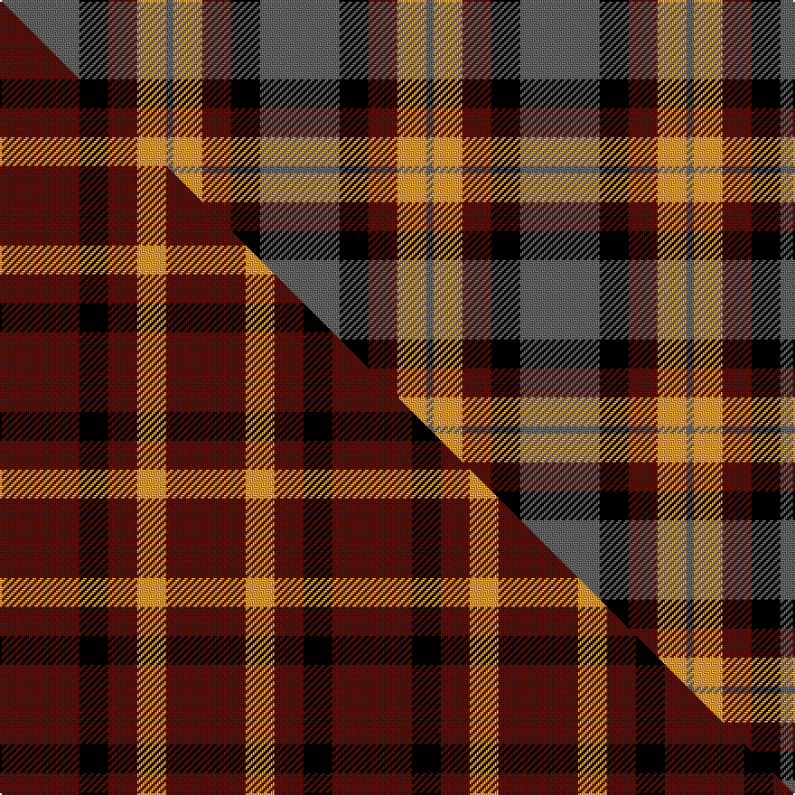

This page is one **sett** — a single exact thread-count. It belongs to the [tartan](/setts/n11k4dr4lo4n1/)
(the same proportion at any scale), whose colour order is pattern [BKBYB](/stripes/bkbyb/).

Part of the [Ikelman](/tartans/ikelman/) tartan — the named design grouping this sett with its other cloths.

Sourced from register-of-tartans.  It is a [5 stripe tartan](/stripes/stripes5/).

Original link https://www.tartanregister.gov.uk/tartanDetails.aspx?ref=1812

2 attestations — the source records this cloth was collapsed from (oldest owns this page)

<ul>
<li>01/01/1993 — Ikelman #2 (Personal) (register-of-tartans, <a href="https://www.tartanregister.gov.uk/tartanDetails.aspx?ref=1812">record</a>)  <em>The colours are taken from the German flag. Handwoven by Peter MacDonald. A previous version had no grey. Sample in Scottish Tartans Authority's Johnston Collection. Sample in Scottish Tartans Authority archives as well.</em></li>
<li>1993 January — Ikelman #2 (Personal) (tartans-authority, <a href="http://www.tartansauthority.com/tartan-ferret/display/2211/">record</a>)  <em>The colours are taken from the German flag. Handwoven by Peter MacDonald. A previous version had no grey. Sample in STA's Johnston Collection. Sample in STA archives as well.</em></li>
</ul>

## Register references

External register numbers recorded for this tartan.

- Scottish Register of Tartans: [1812](https://www.tartanregister.gov.uk/tartanDetails.aspx?ref=1812)
- Scottish Tartans Authority (ITI): 2211
- Scottish Tartans World Register: 2211

## Thread count
N/44 K16 DR16 LO16 N/4

One full sett is **144 threads**.

## Palette
<table><thead><tr><th>Colour</th><th>Shade</th><th>OKLCh</th></tr></thead><tbody><tr><td>DR</td><td><code style="background-color:#55120C;">#55120C</code> <small style="color:#888">#55120C</small></td><td><small style="color:#888">oklch(30.0% 0.099 29.3)</small></td></tr><tr><td>LO</td><td><code style="background-color:#FF9C34;">#FF9C34</code> <small style="color:#888">#FF9C34</small></td><td><small style="color:#888">oklch(77.9% 0.161 61.8)</small></td></tr><tr><td>K</td><td><code style="background-color:#000000;">#000000</code> <small style="color:#888">#000000</small></td><td><small style="color:#888">oklch(0.0% 0.000 0.0)</small></td></tr><tr><td>N</td><td><code style="background-color:#636363;">#636363</code> <small style="color:#888">#636363</small></td><td><small style="color:#888">oklch(50.0% 0.000 89.9)</small></td></tr></tbody></table>

# Sample pattern

## Compared to the master

This cloth is one sett of its design; the master sett (the exemplar the design is anchored on) is below for comparison.

Its **ΔTartan distance** from the master is **4.36** — the same measure the nearest-tartans table ranks by (0 is identical; a re-scale of the same cloth is near 0, a recolour or a different proportion further).

<figure class="master-compare" style="margin:0">

this sett
master sett ★

<figcaption style="color:#888;font-size:smaller">One weave of this sett against the <a href="/setts/dr11k4dr4lo4dr11/">master sett ★</a>, split on the diagonal: a shared proportion runs seamlessly across it with only the shades shifting; a different proportion breaks on it.</figcaption>
</figure>

## Nearest variants

The nearest existing variants by ΔTartan distance, with this cloth at the top so the swatches line up against it.

ΔTartan

Threads

Variant

Sett

—

144

<a href="/variants/s5/n11k4dr4lo4n1~x4/">Ikelman #2 (Personal)</a>

<a href="/ttd/edit/#slug=n26k10r10y10n3~x2&amp;base=n11k4dr4lo4n1~x4" title="compare in the TTD">1.26</a>

178

<a href="/variants/s5/n26k10r10y10n3~x2/">Ikelman No 2</a>

<a href="/ttd/edit/#slug=k6w6k6o21r2~x4&amp;base=n11k4dr4lo4n1~x4" title="compare in the TTD">1.96</a>

296

<a href="/variants/s5/k6w6k6o21r2~x4/">Burberry, Check</a>

<a href="/ttd/edit/#slug=n24r11k6db4~x4&amp;base=n11k4dr4lo4n1~x4" title="compare in the TTD">2.66</a>

248

<a href="/variants/s4/n24r11k6db4~x4/">Nebar (Corporate)</a>

<a href="/ttd/edit/#slug=w3t12k12r20g2~x2&amp;base=n11k4dr4lo4n1~x4" title="compare in the TTD">2.88</a>

186

<a href="/variants/s5/w3t12k12r20g2~x2/">Baillie of Polkemmet Red</a>

<a href="/ttd/edit/#slug=r4o30k6w13k13w3~x2&amp;base=n11k4dr4lo4n1~x4" title="compare in the TTD">2.92</a>

262

<a href="/variants/s6/r4o30k6w13k13w3~x2/">Thom(p)son camel</a>

<a href="/ttd/edit/#slug=k3n28k3r22k8w3~x2&amp;base=n11k4dr4lo4n1~x4" title="compare in the TTD">2.94</a>

256

<a href="/variants/s6/k3n28k3r22k8w3~x2/">Henkel (Corporate)</a>

<a href="/ttd/edit/#slug=k3w3k3y10r1~x6&amp;base=n11k4dr4lo4n1~x4" title="compare in the TTD">2.96</a>

216

<a href="/variants/s5/k3w3k3y10r1~x6/">(6) Burberry</a>

## Neighbour map

Every grey dot is one of 13620 variants placed by the first two principal components of the ΔTartan feature space (42% of its variance). Red is this tartan; blue dots are its nearest — click one to open its page.

<svg viewBox="0 0 640 380" role="img" style="max-width:100%;height:auto;border:1px solid #e0e0e0;border-radius:4px;display:block" xmlns="http://www.w3.org/2000/svg"><image href="/nn/cloud.v1.png" width="640" height="380"/><a href="/variants/s5/n26k10r10y10n3~x2/"><circle cx="225.7" cy="227.9" r="4" fill="#3465a4"><title>Ikelman No 2</title></circle></a><a href="/variants/s5/k6w6k6o21r2~x4/"><circle cx="216.2" cy="186.8" r="4" fill="#3465a4"><title>Burberry, Check</title></circle></a><a href="/variants/s4/n24r11k6db4~x4/"><circle cx="252.5" cy="242.5" r="4" fill="#3465a4"><title>Nebar (Corporate)</title></circle></a><a href="/variants/s5/w3t12k12r20g2~x2/"><circle cx="138.1" cy="190.9" r="4" fill="#3465a4"><title>Baillie of Polkemmet Red</title></circle></a><a href="/variants/s6/r4o30k6w13k13w3~x2/"><circle cx="166.1" cy="183.7" r="4" fill="#3465a4"><title>Thom(p)son camel</title></circle></a><a href="/variants/s6/k3n28k3r22k8w3~x2/"><circle cx="193.8" cy="182.1" r="4" fill="#3465a4"><title>Henkel (Corporate)</title></circle></a><a href="/variants/s5/k3w3k3y10r1~x6/"><circle cx="203.5" cy="194.6" r="4" fill="#3465a4"><title>(6) Burberry</title></circle></a><circle cx="226.8" cy="212.1" r="5" fill="#c00000"/><text x="320" y="376" text-anchor="middle" font-size="11" fill="#999">ground</text><text x="11" y="190" text-anchor="middle" font-size="11" fill="#999" transform="rotate(-90 11 190)">complexity</text></svg>

ID: /variants/s5/n11k4dr4lo4n1~x4/
