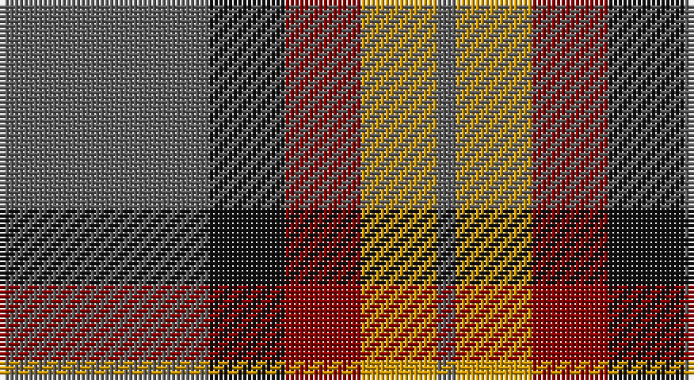

This page is one **sett** — a single exact thread-count. It belongs to the [tartan](/setts/n11k4r4lo4n1/)
(the same proportion at any scale), whose colour order is pattern [BKRYB](/stripes/bkryb/).

Part of the [Ikelman](/tartans/ikelman/) tartan — the named design grouping this sett with its other cloths.

Sourced from register-of-tartans.  It is a [5 stripe tartan](/stripes/stripes5/).

Original link https://www.tartanregister.gov.uk/tartanDetails.aspx?ref=1812

## Also known as

This cloth is also recorded under:

- Ikelman #2
- Ikelman #3
- Ikelman #4
- Ikelman #5
- Ikelman #6

2 attestations — the source records this cloth was collapsed from (oldest owns this page)

<ul>
<li>01/01/1993 — Ikelman #2 (Personal) (register-of-tartans, <a href="https://www.tartanregister.gov.uk/tartanDetails.aspx?ref=1812">record</a>)</li>
<li>1993 January — Ikelman #2 (Personal) (tartans-authority, <a href="http://www.tartansauthority.com/tartan-ferret/display/2211/">record</a>)</li>
</ul>

## Register references

External register numbers recorded for this tartan.

- Scottish Register of Tartans: [1812](https://www.tartanregister.gov.uk/tartanDetails.aspx?ref=1812)
- Scottish Tartans Authority (ITI): 2211
- Scottish Tartans World Register: 2211

## Thread count
N/44 K16 DR16 DY16 N/4

One full sett is **144 threads**.

## Palette

Palette: <strong>Tartan Register</strong> <small style="color:#888">(2 of 4 colours)</small>
<table><thead><tr><th>Colour</th><th>Threads</th><th>Shade</th><th>Base</th><th>OKLCh</th></tr></thead><tbody><tr><td>N/</td><td style="text-align:right;font-variant-numeric:tabular-nums">44</td><td><code style="background-color:#5C5C5C;">#5C5C5C</code> <small style="color:#888">#5C5C5C</small></td><td>B <code style="background-color:#2A418A;">#2A418A</code></td><td><small style="color:#888">oklch(47.5% 0.000 89.9)</small></td></tr><tr><td>K</td><td style="text-align:right;font-variant-numeric:tabular-nums">16</td><td><code style="background-color:#101010;">#101010</code> <small style="color:#888">#101010</small></td><td>K <code style="background-color:#000000;">#000000</code></td><td><small style="color:#888">oklch(17.3% 0.000 89.9)</small></td></tr><tr><td>DR</td><td style="text-align:right;font-variant-numeric:tabular-nums">16</td><td><code style="background-color:#880000;">#880000</code> <small style="color:#888">#880000</small></td><td>R <code style="background-color:#CC0000;">#CC0000</code></td><td><small style="color:#888">oklch(39.4% 0.162 29.2)</small></td></tr><tr><td>DY</td><td style="text-align:right;font-variant-numeric:tabular-nums">16</td><td><code style="background-color:#D09800;">#D09800</code> <small style="color:#888">#D09800</small></td><td>Y <code style="background-color:#F2BF00;">#F2BF00</code></td><td><small style="color:#888">oklch(71.4% 0.147 82.1)</small></td></tr><tr><td>N/</td><td style="text-align:right;font-variant-numeric:tabular-nums">4</td><td><code style="background-color:#5C5C5C;">#5C5C5C</code> <small style="color:#888">#5C5C5C</small></td><td>B <code style="background-color:#2A418A;">#2A418A</code></td><td><small style="color:#888">oklch(47.5% 0.000 89.9)</small></td></tr></tbody></table>

# Sample pattern

## Compared to the master

This cloth is one sett of its design; the master sett (the exemplar the design is anchored on) is below for comparison.

<figure style="margin:0"><figcaption style="color:#888;font-size:smaller">this sett</figcaption></figure>
<figure style="margin:0"><figcaption style="color:#888;font-size:smaller"><a href="/setts/db15g2db2w1db1w1db1w1db2g2db15r10/">master sett →</a></figcaption></figure>

## Nearest tartans

The nearest existing variants by ΔTartan distance, with this tartan at the top so the swatches line up against it.

ΔTartan

Tartan

Sett

—

<a href="/ttd/edit/#slug=n11k4r4lo4n1~x4">Ikelman #2 (Personal)</a> <a class="nn-out" href="/variants/s5/n11k4r4lo4n1~x4/" title="open its dictionary page">↗</a>

0.82

<a href="/ttd/edit/#slug=lb2dr12g6dr1n6dr1~x4&amp;base=n11k4r4lo4n1~x4">Fraser Green</a> <a class="nn-out" href="/variants/s6/lb2dr12g6dr1n6dr1~x4/" title="open its dictionary page">↗</a>

0.94

<a href="/ttd/edit/#slug=g30ly3db8r25~x2&amp;base=n11k4r4lo4n1~x4">Dohmen (Personal)</a> <a class="nn-out" href="/variants/s4/g30ly3db8r25~x2/" title="open its dictionary page">↗</a>

1.04

<a href="/ttd/edit/#slug=m10dy60dt13lo24dt24dy8&amp;base=n11k4r4lo4n1~x4">Bronte House Check</a> <a class="nn-out" href="/variants/s6/m10dy60dt13lo24dt24dy8/" title="open its dictionary page">↗</a>

1.11

<a href="/ttd/edit/#slug=r3db12r4g18r6k2~x2&amp;base=n11k4r4lo4n1~x4">Eyre (Personal)</a> <a class="nn-out" href="/variants/s6/r3db12r4g18r6k2~x2/" title="open its dictionary page">↗</a>

1.13

<a href="/ttd/edit/#slug=g3r22t5g10k10g2~x2&amp;base=n11k4r4lo4n1~x4">Strathspey (Fashion)</a> <a class="nn-out" href="/variants/s6/g3r22t5g10k10g2~x2/" title="open its dictionary page">↗</a>

1.13

<a href="/ttd/edit/#slug=db18ly2dy6ly2dy19r3~x2&amp;base=n11k4r4lo4n1~x4">Balfour #2</a> <a class="nn-out" href="/variants/s6/db18ly2dy6ly2dy19r3~x2/" title="open its dictionary page">↗</a>

1.13

<a href="/ttd/edit/#slug=db18ly2dy6ly2dy19r3~x4&amp;base=n11k4r4lo4n1~x4">Balfour (Clan)</a> <a class="nn-out" href="/variants/s6/db18ly2dy6ly2dy19r3~x4/" title="open its dictionary page">↗</a>

1.14

<a href="/ttd/edit/#slug=r10dy60dt13lb24dt24dy8&amp;base=n11k4r4lo4n1~x4">Bronte House Check (Fashion)</a> <a class="nn-out" href="/variants/s6/r10dy60dt13lb24dt24dy8/" title="open its dictionary page">↗</a>

1.14

<a href="/ttd/edit/#slug=g4r28db6g10k10g3~x2&amp;base=n11k4r4lo4n1~x4">Canadian Autumn</a> <a class="nn-out" href="/variants/s6/g4r28db6g10k10g3~x2/" title="open its dictionary page">↗</a>

1.16

<a href="/ttd/edit/#slug=g15r3p11t2~x2&amp;base=n11k4r4lo4n1~x4">MacNab 7</a> <a class="nn-out" href="/variants/s4/g15r3p11t2~x2/" title="open its dictionary page">↗</a>

## Neighbour map

Every grey dot is one of 14360 variants placed by the first two principal components of the ΔTartan feature space (44% of its variance). Red is this tartan; blue dots are its nearest — click one to open its page.

<svg viewBox="0 0 640 380" role="img" style="max-width:100%;height:auto;border:1px solid #e0e0e0;border-radius:4px;display:block" xmlns="http://www.w3.org/2000/svg"><image href="/nn/cloud.v1.png" width="640" height="380"/><a href="/variants/s6/lb2dr12g6dr1n6dr1~x4/"><circle cx="287.9" cy="212.9" r="4" fill="#3465a4"><title>Fraser Green</title></circle></a><a href="/variants/s4/g30ly3db8r25~x2/"><circle cx="262.4" cy="247.4" r="4" fill="#3465a4"><title>Dohmen (Personal)</title></circle></a><a href="/variants/s6/m10dy60dt13lo24dt24dy8/"><circle cx="248.2" cy="223.4" r="4" fill="#3465a4"><title>Bronte House Check</title></circle></a><a href="/variants/s6/r3db12r4g18r6k2~x2/"><circle cx="215.3" cy="224.8" r="4" fill="#3465a4"><title>Eyre (Personal)</title></circle></a><a href="/variants/s6/g3r22t5g10k10g2~x2/"><circle cx="251.6" cy="226.8" r="4" fill="#3465a4"><title>Strathspey (Fashion)</title></circle></a><a href="/variants/s6/db18ly2dy6ly2dy19r3~x2/"><circle cx="297.0" cy="219.3" r="4" fill="#3465a4"><title>Balfour #2</title></circle></a><a href="/variants/s6/db18ly2dy6ly2dy19r3~x4/"><circle cx="297.0" cy="219.3" r="4" fill="#3465a4"><title>Balfour (Clan)</title></circle></a><a href="/variants/s6/r10dy60dt13lb24dt24dy8/"><circle cx="231.6" cy="221.3" r="4" fill="#3465a4"><title>Bronte House Check (Fashion)</title></circle></a><a href="/variants/s6/g4r28db6g10k10g3~x2/"><circle cx="267.4" cy="227.4" r="4" fill="#3465a4"><title>Canadian Autumn</title></circle></a><a href="/variants/s4/g15r3p11t2~x2/"><circle cx="251.6" cy="249.7" r="4" fill="#3465a4"><title>MacNab 7</title></circle></a><circle cx="266.0" cy="232.6" r="5" fill="#c00000"/></svg>

ID: /variants/s5/n11k4r4lo4n1~x4/
