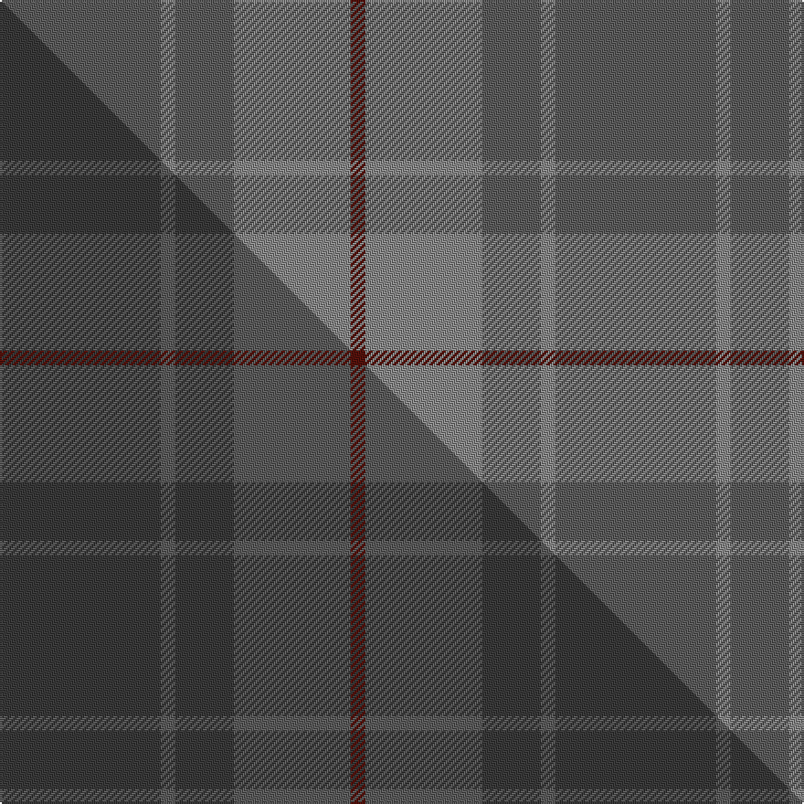

This is one **variant** — a specific cloth: this exact thread count and colourway, with its own
provenance below. It is one weaving of the [sett](/tartans/c/ca/cairns-david/) (the scale-free proportion — the
same cloth at any scale or shade), whose colour order is pattern [BRBRB](/stripes/brbrb/).

Part of the [Cairns, David](/tartans/c/ca/cairns-david/) tartan — the named design grouping this sett with its other cloths.

Sourced from tartans-authority.  It is a [5 stripe tartan](/stripes/stripes5/).

Original link <code>http://www.tartansauthority.com/tartan-ferret/display/10143/</code> — retired · [Internet Archive copy](https://web.archive.org/web/*/http://www.tartansauthority.com/tartan-ferret/display/10143/*)

Dataset <small>— provenance for this record, inherited from the source manifest</small>

<dl class="dataset-prov">
<dt>source</dt><dd><a href="/sources/tartans-authority/">Scottish Tartans Authority</a></dd>
<dt>data captured from</dt><dd><a href="https://github.com/thetartan/tartan-database/blob/master/data/tartans-authority/data.csv">https://github.com/thetartan/tartan-database/blob/master/data/tartans-authority/data.csv</a></dd>
<dt>data date</dt><dd>1st Jan.2010 <small>(this record)</small></dd>
<dt>licence</dt><dd><a href="https://creativecommons.org/licenses/by-nc-nd/4.0/">CC BY-NC-ND 4.0</a></dd>
</dl>

Capture chain <small>— the hands this data passed through, oldest first; each capture carries its own licence</small>

<ol class="capture-chain">
<li><a href="https://www.tartansauthority.com/">Scottish Tartans Authority</a> <small>the heritage body’s archive — its tartan-ferret record browser is retired; dead record links are shown unlinked, with an Internet Archive copy (ITI numbers are not SRT references)</small></li>
<li><a href="https://github.com/thetartan/tartan-database">thetartan/tartan-database</a> <small>2016-2017</small> · <a href="https://creativecommons.org/licenses/by-nc-nd/4.0/">CC BY-NC-ND 4.0</a> <small>Levko Kravets's frozen compilation — the capture we vendored, and where its CC licence text came from</small></li>
<li>this dictionary <small>captured 2026-06-10 · commit 5bf86c7566</small> <small>each re-capture is a git commit to data/sources</small></li>
</ol>

## Register references

External register numbers recorded for this tartan.

- Scottish Register of Tartans: [10143](https://www.tartanregister.gov.uk/tartanDetails?ref=10143)
- Scottish Tartans Authority (ITI): 10143

## Thread count
N/88 O8 N32 O64 DR/8

One full sett is **304 threads**.

## Palette
<table><thead><tr><th>Colour</th><th>Shade</th><th>OKLCh</th></tr></thead><tbody><tr><td>DR</td><td><code style="background-color:#55120C;">#55120C</code> <small style="color:#888">#55120C</small></td><td><small style="color:#888">oklch(30.0% 0.099 29.3)</small></td></tr><tr><td>N</td><td><code style="background-color:#5C5C5C;">#5C5C5C</code> <small style="color:#888">#5C5C5C</small></td><td><small style="color:#888">oklch(47.5% 0.000 89.9)</small></td></tr><tr><td>O</td><td><code style="background-color:#888888;">#888888</code> <small style="color:#888">#888888</small></td><td><small style="color:#888">oklch(62.7% 0.000 89.9)</small></td></tr></tbody></table>

# Sample pattern

## Compared to the master

This cloth is one sett of its design; the master sett (the exemplar the design is anchored on) is below for comparison.

Its **ΔTartan distance** from the master is **0.18** — the same measure the nearest-tartans table ranks by (0 is identical; a re-scale of the same cloth is near 0, a recolour or a different proportion further).

<figure class="master-compare" style="margin:0">

this sett
master sett ★

<figcaption style="color:#888;font-size:smaller">One weave of this sett against the <a href="/setts/do11n1do4n8dr1/">master sett ★</a>, split on the diagonal: a shared proportion runs seamlessly across it with only the shades shifting; a different proportion breaks on it.</figcaption>
</figure>

## Nearest tartan variants

The nearest existing variants by ΔTartan distance, with this cloth at the top so the swatches line up against it.

ΔTartan

Threads

Variant

Sett

—

304

<a href="/variants/s5/n11o1n4o8dr1~x8~n47-o62/">Cairns, David (Personal)</a>

<a href="/ttd/edit/#slug=o52lyi2n24r3ly26n4~x2~o62-lyi8517093-n47-ly6307084&amp;base=n11o1n4o8dr1~x8~n47-o62" title="compare in the TTD">2.32</a>

332

<a href="/variants/s6/o52lyi2n24r3ly26n4~x2~o62-lyi8517093-n47-ly6307084/">Outlander #1</a>

<a href="/ttd/edit/#slug=g5n1g1n12r1~x8&amp;base=n11o1n4o8dr1~x8~n47-o62" title="compare in the TTD">3.12</a>

272

<a href="/variants/s5/g5n1g1n12r1~x8/">Ceredigion (Personal)</a>

<a href="/ttd/edit/#slug=n60g13n9dr8y4~x2&amp;base=n11o1n4o8dr1~x8~n47-o62" title="compare in the TTD">3.70</a>

248

<a href="/variants/s5/n60g13n9dr8y4~x2/">Ballantyne (Personal)</a>

<a href="/ttd/edit/#slug=n60g13n9r8dy4~x2&amp;base=n11o1n4o8dr1~x8~n47-o62" title="compare in the TTD">3.84</a>

248

<a href="/variants/s5/n60g13n9r8dy4~x2/">Ballantyne Personal Tartan</a>

## Neighbour map

Every grey dot is one of 13662 variants placed by the first two principal components of the ΔTartan feature space (42% of its variance). Red is this tartan; blue dots are its nearest — click one to open its page. The map is a flat projection of a many-dimensional space — [how to read it](/posts/neighbourhood-maps/).

<svg viewBox="0 0 640 380" role="img" style="max-width:100%;height:auto;border:1px solid #e0e0e0;border-radius:4px;display:block" xmlns="http://www.w3.org/2000/svg"><image href="/nn/cloud.v1.png" width="640" height="380"/><a href="/variants/s6/o52lyi2n24r3ly26n4~x2~o62-lyi8517093-n47-ly6307084/"><circle cx="500.4" cy="240.6" r="4" fill="#3465a4"><title>Outlander #1</title></circle></a><a href="/variants/s5/g5n1g1n12r1~x8/"><circle cx="570.6" cy="267.0" r="4" fill="#3465a4"><title>Ceredigion (Personal)</title></circle></a><a href="/variants/s5/n60g13n9dr8y4~x2/"><circle cx="626.0" cy="258.0" r="4" fill="#3465a4"><title>Ballantyne (Personal)</title></circle></a><a href="/variants/s5/n60g13n9r8dy4~x2/"><circle cx="594.4" cy="232.3" r="4" fill="#3465a4"><title>Ballantyne Personal Tartan</title></circle></a><circle cx="574.2" cy="307.9" r="5" fill="#c00000"/><text x="320" y="376" text-anchor="middle" font-size="11" fill="#999">ground</text><text x="11" y="190" text-anchor="middle" font-size="11" fill="#999" transform="rotate(-90 11 190)">complexity</text></svg>

ID: /variants/s5/n11o1n4o8dr1~x8~n47-o62/
