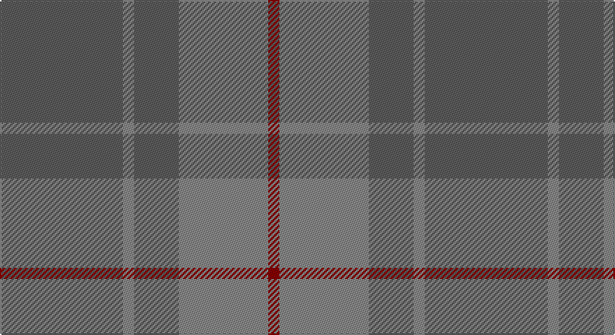

This page is one **sett** — a single exact thread-count. It belongs to the [tartan](/setts/n11o1n4o8r1/)
(the same proportion at any scale), whose colour order is pattern [BRBRR](/stripes/brbrr/).

Sourced from tartans-authority.  It is a [5 stripe tartan](/stripes/stripes5/).

Original link http://www.tartansauthority.com/tartan-ferret/display/10143/

## Register references

External register numbers recorded for this tartan.

- Scottish Register of Tartans: [10143](https://www.tartanregister.gov.uk/tartanDetails?ref=10143)
- Scottish Tartans Authority (ITI): 10143

## Thread count
N/88 Na8 N32 Na64 DR/8

One full sett is **304 threads**.

## Palette

Palette: <strong>Tartan Register</strong> <small style="color:#888">(2 of 3 colours)</small>
<table><thead><tr><th>Colour</th><th>Threads</th><th>Shade</th><th>Base</th><th>OKLCh</th></tr></thead><tbody><tr><td>N/</td><td style="text-align:right;font-variant-numeric:tabular-nums">88</td><td><code style="background-color:#5C5C5C;">#5C5C5C</code> <small style="color:#888">#5C5C5C</small></td><td>B <code style="background-color:#2A418A;">#2A418A</code></td><td><small style="color:#888">oklch(47.5% 0.000 89.9)</small></td></tr><tr><td>Na</td><td style="text-align:right;font-variant-numeric:tabular-nums">8</td><td><code style="background-color:#888888;">#888888</code> <small style="color:#888">#888888</small></td><td>R <code style="background-color:#CC0000;">#CC0000</code></td><td><small style="color:#888">oklch(62.7% 0.000 89.9)</small></td></tr><tr><td>N</td><td style="text-align:right;font-variant-numeric:tabular-nums">32</td><td><code style="background-color:#5C5C5C;">#5C5C5C</code> <small style="color:#888">#5C5C5C</small></td><td>B <code style="background-color:#2A418A;">#2A418A</code></td><td><small style="color:#888">oklch(47.5% 0.000 89.9)</small></td></tr><tr><td>Na</td><td style="text-align:right;font-variant-numeric:tabular-nums">64</td><td><code style="background-color:#888888;">#888888</code> <small style="color:#888">#888888</small></td><td>R <code style="background-color:#CC0000;">#CC0000</code></td><td><small style="color:#888">oklch(62.7% 0.000 89.9)</small></td></tr><tr><td>DR/</td><td style="text-align:right;font-variant-numeric:tabular-nums">8</td><td><code style="background-color:#880000;">#880000</code> <small style="color:#888">#880000</small></td><td>R <code style="background-color:#CC0000;">#CC0000</code></td><td><small style="color:#888">oklch(39.4% 0.162 29.2)</small></td></tr></tbody></table>

# Sample pattern

## Nearest tartans

The nearest existing variants by ΔTartan distance, with this tartan at the top so the swatches line up against it.

ΔTartan

Tartan

Sett

—

<a href="/ttd/edit/#slug=n11o1n4o8r1~x8">Cairns, David (Personal)</a> <a class="nn-out" href="/variants/s5/n11o1n4o8r1~x8/" title="open its dictionary page">↗</a>

1.60

<a href="/ttd/edit/#slug=t4lo15t4lo15t4w2~x2&amp;base=n11o1n4o8r1~x8">Takla Makan #2</a> <a class="nn-out" href="/variants/s6/t4lo15t4lo15t4w2~x2/" title="open its dictionary page">↗</a>

1.80

<a href="/ttd/edit/#slug=do11n1do4n8r1~x8&amp;base=n11o1n4o8r1~x8">Cairns, David (Personal)</a> <a class="nn-out" href="/variants/s5/do11n1do4n8r1~x8/" title="open its dictionary page">↗</a>

1.90

<a href="/ttd/edit/#slug=t48g25t13ly5~x2&amp;base=n11o1n4o8r1~x8">Laurel Park</a> <a class="nn-out" href="/variants/s4/t48g25t13ly5~x2/" title="open its dictionary page">↗</a>

1.96

<a href="/ttd/edit/#slug=y37dy9y3do9dy3~x2&amp;base=n11o1n4o8r1~x8">Glen Boig Trade Tartan</a> <a class="nn-out" href="/variants/s5/y37dy9y3do9dy3~x2/" title="open its dictionary page">↗</a>

2.04

<a href="/ttd/edit/#slug=db5y15o4y4o24y4o4db5&amp;base=n11o1n4o8r1~x8">Daks, (Muted Skye)</a> <a class="nn-out" href="/variants/s8/db5y15o4y4o24y4o4db5/" title="open its dictionary page">↗</a>

2.28

<a href="/ttd/edit/#slug=dg3dy30dg40r3~x2&amp;base=n11o1n4o8r1~x8">Sanix Muted</a> <a class="nn-out" href="/variants/s4/dg3dy30dg40r3~x2/" title="open its dictionary page">↗</a>

2.29

<a href="/ttd/edit/#slug=n16r2n10r14t5~x2&amp;base=n11o1n4o8r1~x8">Mowbray (Personal)</a> <a class="nn-out" href="/variants/s5/n16r2n10r14t5~x2/" title="open its dictionary page">↗</a>

2.34

<a href="/ttd/edit/#slug=y50dy25ly2dp6~x2&amp;base=n11o1n4o8r1~x8">Highland Greenford (Personal)</a> <a class="nn-out" href="/variants/s4/y50dy25ly2dp6~x2/" title="open its dictionary page">↗</a>

2.35

<a href="/ttd/edit/#slug=y9yi52dy15ly4~x2&amp;base=n11o1n4o8r1~x8">McGuigan, Julia (St Monans, Fife) (Personal)</a> <a class="nn-out" href="/variants/s4/y9yi52dy15ly4~x2/" title="open its dictionary page">↗</a>

2.36

<a href="/ttd/edit/#slug=dg4t10y10t1~x4&amp;base=n11o1n4o8r1~x8">Baker City (District)</a> <a class="nn-out" href="/variants/s4/dg4t10y10t1~x4/" title="open its dictionary page">↗</a>

## Neighbour map

Every grey dot is one of 14360 variants placed by the first two principal components of the ΔTartan feature space (44% of its variance). Red is this tartan; blue dots are its nearest — click one to open its page.

<svg viewBox="0 0 640 380" role="img" style="max-width:100%;height:auto;border:1px solid #e0e0e0;border-radius:4px;display:block" xmlns="http://www.w3.org/2000/svg"><image href="/nn/cloud.v1.png" width="640" height="380"/><a href="/variants/s6/t4lo15t4lo15t4w2~x2/"><circle cx="521.0" cy="315.2" r="4" fill="#3465a4"><title>Takla Makan #2</title></circle></a><a href="/variants/s5/do11n1do4n8r1~x8/"><circle cx="545.4" cy="340.3" r="4" fill="#3465a4"><title>Cairns, David (Personal)</title></circle></a><a href="/variants/s4/t48g25t13ly5~x2/"><circle cx="514.8" cy="334.4" r="4" fill="#3465a4"><title>Laurel Park</title></circle></a><a href="/variants/s5/y37dy9y3do9dy3~x2/"><circle cx="554.6" cy="298.1" r="4" fill="#3465a4"><title>Glen Boig Trade Tartan</title></circle></a><a href="/variants/s8/db5y15o4y4o24y4o4db5/"><circle cx="415.1" cy="309.6" r="4" fill="#3465a4"><title>Daks, (Muted Skye)</title></circle></a><a href="/variants/s4/dg3dy30dg40r3~x2/"><circle cx="537.0" cy="335.5" r="4" fill="#3465a4"><title>Sanix Muted</title></circle></a><a href="/variants/s5/n16r2n10r14t5~x2/"><circle cx="397.5" cy="318.7" r="4" fill="#3465a4"><title>Mowbray (Personal)</title></circle></a><a href="/variants/s4/y50dy25ly2dp6~x2/"><circle cx="505.5" cy="261.9" r="4" fill="#3465a4"><title>Highland Greenford (Personal)</title></circle></a><a href="/variants/s4/y9yi52dy15ly4~x2/"><circle cx="537.9" cy="304.1" r="4" fill="#3465a4"><title>McGuigan, Julia (St Monans, Fife) (Personal)</title></circle></a><a href="/variants/s4/dg4t10y10t1~x4/"><circle cx="375.4" cy="339.8" r="4" fill="#3465a4"><title>Baker City (District)</title></circle></a><circle cx="504.6" cy="311.7" r="5" fill="#c00000"/></svg>

ID: /variants/s5/n11o1n4o8r1~x8/
