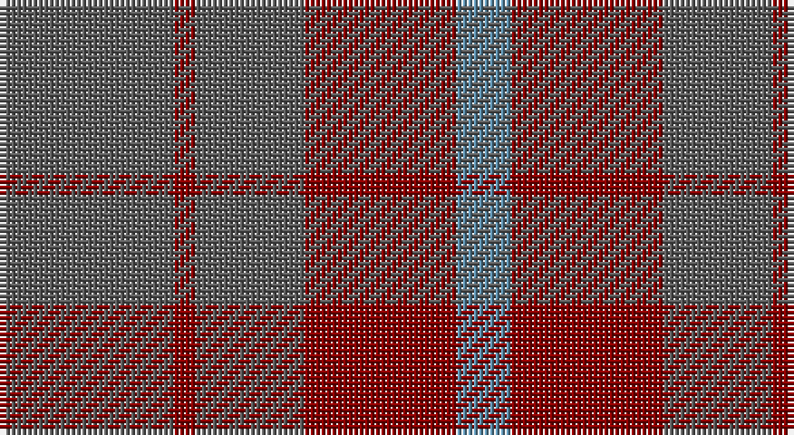

This page is one **sett** — a single exact thread-count. It belongs to the [tartan](/setts/n16r2n10r14t5/)
(the same proportion at any scale), whose colour order is pattern [BRBRB](/stripes/brbrb/).

Part of the [Mowbray](/tartans/mowbray/) tartan — the named design grouping this sett with its other cloths.

Sourced from register-of-tartans.  It is a [5 stripe tartan](/stripes/stripes5/).

Original link https://www.tartanregister.gov.uk/tartanDetails.aspx?ref=3037

## Also known as

This cloth is also recorded under:

- Mowbray,

2 attestations — the source records this cloth was collapsed from (oldest owns this page)

<ul>
<li>01/01/1984 — Mowbray (Personal) (register-of-tartans, <a href="https://www.tartanregister.gov.uk/tartanDetails.aspx?ref=3037">record</a>)</li>
<li>1984 — Mowbray (USA) (Personal) (tartans-authority, <a href="http://www.tartansauthority.com/tartan-ferret/display/565/">record</a>)</li>
</ul>

## Register references

External register numbers recorded for this tartan.

- Scottish Register of Tartans: [3037](https://www.tartanregister.gov.uk/tartanDetails.aspx?ref=3037)
- Scottish Tartans Authority (ITI): 565
- Scottish Tartans World Register: 565

## Thread count
N/32 DR4 N20 DR28 B/10

One full sett is **146 threads**.

## Palette

Palette: <strong>Tartan Register</strong> <small style="color:#888">(2 of 3 colours)</small>
<table><thead><tr><th>Colour</th><th>Threads</th><th>Shade</th><th>Base</th><th>OKLCh</th></tr></thead><tbody><tr><td>N/</td><td style="text-align:right;font-variant-numeric:tabular-nums">32</td><td><code style="background-color:#5C5C5C;">#5C5C5C</code> <small style="color:#888">#5C5C5C</small></td><td>B <code style="background-color:#2A418A;">#2A418A</code></td><td><small style="color:#888">oklch(47.5% 0.000 89.9)</small></td></tr><tr><td>DR</td><td style="text-align:right;font-variant-numeric:tabular-nums">4</td><td><code style="background-color:#880000;">#880000</code> <small style="color:#888">#880000</small></td><td>R <code style="background-color:#CC0000;">#CC0000</code></td><td><small style="color:#888">oklch(39.4% 0.162 29.2)</small></td></tr><tr><td>N</td><td style="text-align:right;font-variant-numeric:tabular-nums">20</td><td><code style="background-color:#5C5C5C;">#5C5C5C</code> <small style="color:#888">#5C5C5C</small></td><td>B <code style="background-color:#2A418A;">#2A418A</code></td><td><small style="color:#888">oklch(47.5% 0.000 89.9)</small></td></tr><tr><td>DR</td><td style="text-align:right;font-variant-numeric:tabular-nums">28</td><td><code style="background-color:#880000;">#880000</code> <small style="color:#888">#880000</small></td><td>R <code style="background-color:#CC0000;">#CC0000</code></td><td><small style="color:#888">oklch(39.4% 0.162 29.2)</small></td></tr><tr><td>B/</td><td style="text-align:right;font-variant-numeric:tabular-nums">10</td><td><code style="background-color:#5C8CA8;">#5C8CA8</code> <small style="color:#888">#5C8CA8</small></td><td>B <code style="background-color:#2A418A;">#2A418A</code></td><td><small style="color:#888">oklch(61.7% 0.067 235.0)</small></td></tr></tbody></table>

# Sample pattern

## Nearest tartans

The nearest existing variants by ΔTartan distance, with this tartan at the top so the swatches line up against it.

ΔTartan

Tartan

Sett

—

<a href="/ttd/edit/#slug=n16r2n10r14t5~x2">Mowbray (Personal)</a> <a class="nn-out" href="/variants/s5/n16r2n10r14t5~x2/" title="open its dictionary page">↗</a>

1.16

<a href="/ttd/edit/#slug=y16r2y10r15t5~x2&amp;base=n16r2n10r14t5~x2">Mowbray, (Moubray)</a> <a class="nn-out" href="/variants/s5/y16r2y10r15t5~x2/" title="open its dictionary page">↗</a>

1.40

<a href="/ttd/edit/#slug=o16r2o10r15t5~x2&amp;base=n16r2n10r14t5~x2">Mowbray (Moubray) Family Tartan</a> <a class="nn-out" href="/variants/s5/o16r2o10r15t5~x2/" title="open its dictionary page">↗</a>

1.47

<a href="/ttd/edit/#slug=db16o2db16o19r4~x3&amp;base=n16r2n10r14t5~x2">Unidentified 17</a> <a class="nn-out" href="/variants/s5/db16o2db16o19r4~x3/" title="open its dictionary page">↗</a>

1.65

<a href="/ttd/edit/#slug=db16dy2db16dy19r4~x3&amp;base=n16r2n10r14t5~x2">Unidentified #24</a> <a class="nn-out" href="/variants/s5/db16dy2db16dy19r4~x3/" title="open its dictionary page">↗</a>

1.86

<a href="/ttd/edit/#slug=dg2dp10dy15dg10dp2~x4&amp;base=n16r2n10r14t5~x2">Harmony 6</a> <a class="nn-out" href="/variants/s5/dg2dp10dy15dg10dp2~x4/" title="open its dictionary page">↗</a>

1.88

<a href="/ttd/edit/#slug=dy4lg11dy14o30r4~x2&amp;base=n16r2n10r14t5~x2">Trinity Bicycles</a> <a class="nn-out" href="/variants/s5/dy4lg11dy14o30r4~x2/" title="open its dictionary page">↗</a>

1.90

<a href="/ttd/edit/#slug=dg15r3n11b2~x2&amp;base=n16r2n10r14t5~x2">MacNab WI 2</a> <a class="nn-out" href="/variants/s4/dg15r3n11b2~x2/" title="open its dictionary page">↗</a>

1.90

<a href="/ttd/edit/#slug=dg15r3n11b2&amp;base=n16r2n10r14t5~x2">MacNab WI2</a> <a class="nn-out" href="/variants/s4/dg15r3n11b2/" title="open its dictionary page">↗</a>

1.96

<a href="/ttd/edit/#slug=o15r5o30db32o4ly3~x2&amp;base=n16r2n10r14t5~x2">Cameron, hunting</a> <a class="nn-out" href="/variants/s6/o15r5o30db32o4ly3~x2/" title="open its dictionary page">↗</a>

2.06

<a href="/ttd/edit/#slug=dg1dr8dg8r1dg8dr8lr1~x4&amp;base=n16r2n10r14t5~x2">MacKinnon Hunting</a> <a class="nn-out" href="/variants/s7/dg1dr8dg8r1dg8dr8lr1~x4/" title="open its dictionary page">↗</a>

## Neighbour map

Every grey dot is one of 14360 variants placed by the first two principal components of the ΔTartan feature space (44% of its variance). Red is this tartan; blue dots are its nearest — click one to open its page.

<svg viewBox="0 0 640 380" role="img" style="max-width:100%;height:auto;border:1px solid #e0e0e0;border-radius:4px;display:block" xmlns="http://www.w3.org/2000/svg"><image href="/nn/cloud.v1.png" width="640" height="380"/><a href="/variants/s5/y16r2y10r15t5~x2/"><circle cx="373.9" cy="299.1" r="4" fill="#3465a4"><title>Mowbray, (Moubray)</title></circle></a><a href="/variants/s5/o16r2o10r15t5~x2/"><circle cx="368.8" cy="295.2" r="4" fill="#3465a4"><title>Mowbray (Moubray) Family Tartan</title></circle></a><a href="/variants/s5/db16o2db16o19r4~x3/"><circle cx="408.0" cy="307.9" r="4" fill="#3465a4"><title>Unidentified 17</title></circle></a><a href="/variants/s5/db16dy2db16dy19r4~x3/"><circle cx="399.2" cy="307.0" r="4" fill="#3465a4"><title>Unidentified #24</title></circle></a><a href="/variants/s5/dg2dp10dy15dg10dp2~x4/"><circle cx="304.8" cy="310.2" r="4" fill="#3465a4"><title>Harmony 6</title></circle></a><a href="/variants/s5/dy4lg11dy14o30r4~x2/"><circle cx="317.1" cy="270.9" r="4" fill="#3465a4"><title>Trinity Bicycles</title></circle></a><a href="/variants/s4/dg15r3n11b2~x2/"><circle cx="335.6" cy="300.6" r="4" fill="#3465a4"><title>MacNab WI 2</title></circle></a><a href="/variants/s4/dg15r3n11b2/"><circle cx="335.6" cy="300.6" r="4" fill="#3465a4"><title>MacNab WI2</title></circle></a><a href="/variants/s6/o15r5o30db32o4ly3~x2/"><circle cx="378.5" cy="245.6" r="4" fill="#3465a4"><title>Cameron, hunting</title></circle></a><a href="/variants/s7/dg1dr8dg8r1dg8dr8lr1~x4/"><circle cx="361.7" cy="282.6" r="4" fill="#3465a4"><title>MacKinnon Hunting</title></circle></a><circle cx="397.5" cy="318.7" r="5" fill="#c00000"/></svg>

ID: /variants/s5/n16r2n10r14t5~x2/
