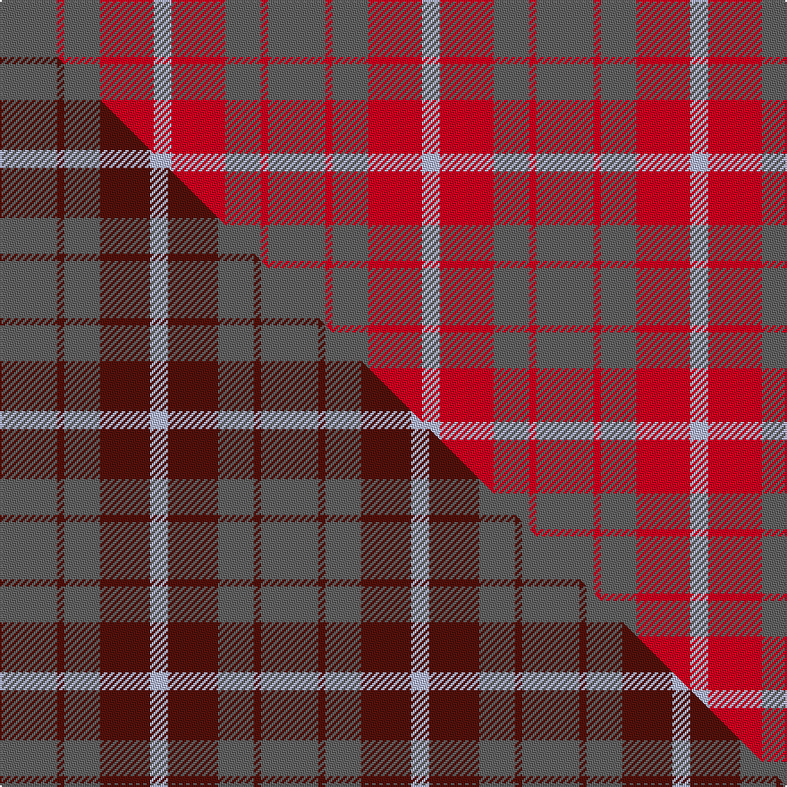

This is one **variant** — a specific cloth: this exact thread count and colourway, with its own
provenance below. It is one weaving of the [sett](/tartans/m/mo/mowbray/) (the scale-free proportion — the
same cloth at any scale or shade), whose colour order is pattern [BRBRW](/stripes/brbrw/).

Part of the [Mowbray](/tartans/m/mo/mowbray/) tartan — the named design grouping this sett with its other cloths.

Sourced from house-of-tartan.  It is a [5 stripe tartan](/stripes/stripes5/).

Original link [http://www.house-of-tartan.scotland.net/house/TartanViewjs.asp?colr=Def&tnam=565](http://www.house-of-tartan.scotland.net/house/TartanViewjs.asp?colr=Def&tnam=565)

## Provenance

Earliest known date: 1983 Designed C.1984 by Peter MacDonald for a Mr Mowbray in the USA. Sometimes woven with green in place of gray, and blue in place of azure.

2 attestations — the source records this cloth was collapsed from (oldest owns this page)

<ul>
<li>1983 — Mowbray (Moubray) Family Tartan (house-of-tartan, <a href="http://www.house-of-tartan.scotland.net/house/TartanViewjs.asp?colr=Def&tnam=565">record</a>) </li>
<li>undated — Mowbray, (Moubray) (weddslist, <a href="http://www.weddslist.com/cgi-bin/tartans/pg.pl?source=sts">record</a>) </li>
</ul>

Dataset <small>— provenance for this record, inherited from the source manifest</small>

<dl class="dataset-prov">
<dt>source</dt><dd><a href="/sources/house-of-tartan/">House of Tartan</a></dd>
<dt>data captured from</dt><dd><a href="https://github.com/thetartan/tartan-database/blob/master/data/house-of-tartan/data.csv">https://github.com/thetartan/tartan-database/blob/master/data/house-of-tartan/data.csv</a></dd>
<dt>data date</dt><dd>1983 <small>(this record)</small></dd>
<dt>licence</dt><dd><a href="https://creativecommons.org/licenses/by-nc-nd/4.0/">CC BY-NC-ND 4.0</a></dd>
</dl>

Capture chain <small>— the hands this data passed through, oldest first; each capture carries its own licence</small>

<ol class="capture-chain">
<li><a href="http://www.house-of-tartan.scotland.net/">House of Tartan</a> <small>the weaver/retailer's database — the site is now offline; the URL is kept as the ultimate source's identity</small></li>
<li><a href="https://github.com/thetartan/tartan-database">thetartan/tartan-database</a> <small>2016-2017</small> · <a href="https://creativecommons.org/licenses/by-nc-nd/4.0/">CC BY-NC-ND 4.0</a> <small>Levko Kravets's frozen compilation — the capture we vendored, and where its CC licence text came from</small></li>
<li>this dictionary <small>captured 2026-06-10 · commit 5bf86c7566</small> <small>each re-capture is a git commit to data/sources</small></li>
</ol>

## Thread count
N/32 R4 N20 R30 LB/10

One full sett is **150 threads**.

## Palette
<table><thead><tr><th>Colour</th><th>Shade</th><th>OKLCh</th></tr></thead><tbody><tr><td>LB</td><td><code style="background-color:#B5BBDE;">#B5BBDE</code> <small style="color:#888">#B5BBDE</small></td><td><small style="color:#888">oklch(79.9% 0.050 277.6)</small></td></tr><tr><td>N</td><td><code style="background-color:#636363;">#636363</code> <small style="color:#888">#636363</small></td><td><small style="color:#888">oklch(50.0% 0.000 89.9)</small></td></tr><tr><td>R</td><td><code style="background-color:#D60020;">#D60020</code> <small style="color:#888">#D60020</small></td><td><small style="color:#888">oklch(55.2% 0.224 25.5)</small></td></tr></tbody></table>

# Sample pattern

## Compared to the master

This cloth is one sett of its design; the master sett (the exemplar the design is anchored on) is below for comparison.

Its **ΔTartan distance** from the master is **0.21** — the same measure the nearest-tartans table ranks by (0 is identical; a re-scale of the same cloth is near 0, a recolour or a different proportion further).

<figure class="master-compare" style="margin:0">

this sett
master sett ★

<figcaption style="color:#888;font-size:smaller">One weave of this sett against the <a href="/setts/n16dr2n10dr14lb5/">master sett ★</a>, split on the diagonal: a shared proportion runs seamlessly across it with only the shades shifting; a different proportion breaks on it.</figcaption>
</figure>

## Nearest tartan variants

The nearest existing variants by ΔTartan distance, with this cloth at the top so the swatches line up against it.

ΔTartan

Threads

Variant

Sett

—

150

<a href="/variants/s5/n16r2n10r15lb5~x2/">Mowbray (Moubray) Family Tartan</a>

<a href="/ttd/edit/#slug=n7r1dt6r8lb1~x8&amp;base=n16r2n10r15lb5~x2" title="compare in the TTD">1.55</a>

304

<a href="/variants/s5/n7r1dt6r8lb1~x8/">Callum (Buchan) (Name)</a>

<a href="/ttd/edit/#slug=dt7r1n6r8lb1~x8&amp;base=n16r2n10r15lb5~x2" title="compare in the TTD">1.63</a>

304

<a href="/variants/s5/dt7r1n6r8lb1~x8/">Callum (Buchan)</a>

<a href="/ttd/edit/#slug=r8lg15t12r29w4~x2&amp;base=n16r2n10r15lb5~x2" title="compare in the TTD">1.78</a>

248

<a href="/variants/s5/r8lg15t12r29w4~x2/">Snowbird (Corporate)</a>

<a href="/ttd/edit/#slug=lb15w2r20w3~x4&amp;base=n16r2n10r15lb5~x2" title="compare in the TTD">1.99</a>

248

<a href="/variants/s4/lb15w2r20w3~x4/">Masai Shuka 24 (Artefact)</a>

<a href="/ttd/edit/#slug=r3g20r25w3~x4&amp;base=n16r2n10r15lb5~x2" title="compare in the TTD">2.20</a>

384

<a href="/variants/s4/r3g20r25w3~x4/">MacKinnon #6</a>

<a href="/ttd/edit/#slug=t6r6w1r6t6y1~x8~r2607041&amp;base=n16r2n10r15lb5~x2" title="compare in the TTD">2.31</a>

360

<a href="/variants/s6/t6r6w1r6t6y1~x8~r2607041/">Unidentified Lindley</a>

<a href="/ttd/edit/#slug=n3dg1n10dg4r10n2~x4&amp;base=n16r2n10r15lb5~x2" title="compare in the TTD">2.67</a>

220

<a href="/variants/s6/n3dg1n10dg4r10n2~x4/">Rob Roy (Film)</a>

<a href="/ttd/edit/#slug=y42b15r28y12b6r20&amp;base=n16r2n10r15lb5~x2" title="compare in the TTD">2.77</a>

184

<a href="/variants/s6/y42b15r28y12b6r20/">Kozlosky, Kilt</a>

<a href="/ttd/edit/#slug=y6r1y4r4db2~x5&amp;base=n16r2n10r15lb5~x2" title="compare in the TTD">2.78</a>

130

<a href="/variants/s5/y6r1y4r4db2~x5/">Sands-Pingot Family, Alabama (Personal)</a>

<a href="/ttd/edit/#slug=o23dr4o23dr32lo4~x2&amp;base=n16r2n10r15lb5~x2" title="compare in the TTD">2.87</a>

290

<a href="/variants/s5/o23dr4o23dr32lo4~x2/">Hamilton, Red (Fashion?)</a>

## Neighbour map

Every grey dot is one of 13656 variants placed by the first two principal components of the ΔTartan feature space (42% of its variance). Red is this tartan; blue dots are its nearest — click one to open its page. The map is a flat projection of a many-dimensional space — [how to read it](/posts/neighbourhood-maps/).

<svg viewBox="0 0 640 380" role="img" style="max-width:100%;height:auto;border:1px solid #e0e0e0;border-radius:4px;display:block" xmlns="http://www.w3.org/2000/svg"><image href="/nn/cloud.v1.png" width="640" height="380"/><a href="/variants/s5/n7r1dt6r8lb1~x8/"><circle cx="255.6" cy="258.8" r="4" fill="#3465a4"><title>Callum (Buchan) (Name)</title></circle></a><a href="/variants/s5/dt7r1n6r8lb1~x8/"><circle cx="249.5" cy="256.8" r="4" fill="#3465a4"><title>Callum (Buchan)</title></circle></a><a href="/variants/s5/r8lg15t12r29w4~x2/"><circle cx="282.2" cy="250.1" r="4" fill="#3465a4"><title>Snowbird (Corporate)</title></circle></a><a href="/variants/s4/lb15w2r20w3~x4/"><circle cx="340.6" cy="252.7" r="4" fill="#3465a4"><title>Masai Shuka 24 (Artefact)</title></circle></a><a href="/variants/s4/r3g20r25w3~x4/"><circle cx="350.5" cy="251.5" r="4" fill="#3465a4"><title>MacKinnon #6</title></circle></a><a href="/variants/s6/t6r6w1r6t6y1~x8~r2607041/"><circle cx="295.5" cy="280.5" r="4" fill="#3465a4"><title>Unidentified Lindley</title></circle></a><a href="/variants/s6/n3dg1n10dg4r10n2~x4/"><circle cx="372.8" cy="258.9" r="4" fill="#3465a4"><title>Rob Roy (Film)</title></circle></a><a href="/variants/s6/y42b15r28y12b6r20/"><circle cx="334.1" cy="291.2" r="4" fill="#3465a4"><title>Kozlosky, Kilt</title></circle></a><a href="/variants/s5/y6r1y4r4db2~x5/"><circle cx="374.7" cy="301.1" r="4" fill="#3465a4"><title>Sands-Pingot Family, Alabama (Personal)</title></circle></a><a href="/variants/s5/o23dr4o23dr32lo4~x2/"><circle cx="395.5" cy="276.3" r="4" fill="#3465a4"><title>Hamilton, Red (Fashion?)</title></circle></a><circle cx="385.7" cy="290.3" r="5" fill="#c00000"/><text x="320" y="376" text-anchor="middle" font-size="11" fill="#999">ground</text><text x="11" y="190" text-anchor="middle" font-size="11" fill="#999" transform="rotate(-90 11 190)">complexity</text></svg>

ID: /variants/s5/n16r2n10r15lb5~x2/
