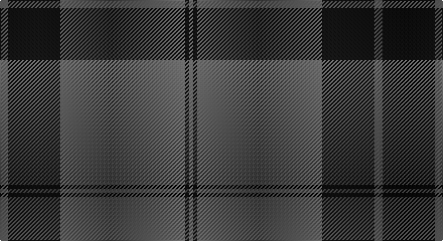

This page is one **sett** — a single exact thread-count. It belongs to the [tartan](/setts/n2k13n31k1n1/)
(the same proportion at any scale), whose colour order is pattern [BKBKB](/stripes/bkbkb/).

Part of the [Silver Mist](/tartans/silver-mist/) tartan — the named design grouping this sett with its other cloths.

Sourced from register-of-tartans.  It is a [5 stripe tartan](/stripes/stripes5/).

Original link https://www.tartanregister.gov.uk/tartanDetails.aspx?ref=3788

## Register references

External register numbers recorded for this tartan.

- Scottish Register of Tartans: [3788](https://www.tartanregister.gov.uk/tartanDetails.aspx?ref=3788)
- Scottish Tartans Authority (ITI): 6927

## Thread count
N/8 K52 N124 K4 N/4

One full sett is **372 threads**.

## Palette

Palette: <strong>Logan (The Scottish Gael, 1831)</strong> <small style="color:#888">(1 of 2 colours)</small>
<table><thead><tr><th>Colour</th><th>Threads</th><th>Shade</th><th>Base</th><th>OKLCh</th></tr></thead><tbody><tr><td>N/</td><td style="text-align:right;font-variant-numeric:tabular-nums">8</td><td><code style="background-color:#5C5C5C;">#5C5C5C</code> <small style="color:#888">#5C5C5C</small></td><td>B <code style="background-color:#2A418A;">#2A418A</code></td><td><small style="color:#888">oklch(47.5% 0.000 89.9)</small></td></tr><tr><td>K</td><td style="text-align:right;font-variant-numeric:tabular-nums">52</td><td><code style="background-color:#101010;">#101010</code> <small style="color:#888">#101010</small></td><td>K <code style="background-color:#000000;">#000000</code></td><td><small style="color:#888">oklch(17.3% 0.000 89.9)</small></td></tr><tr><td>N</td><td style="text-align:right;font-variant-numeric:tabular-nums">124</td><td><code style="background-color:#5C5C5C;">#5C5C5C</code> <small style="color:#888">#5C5C5C</small></td><td>B <code style="background-color:#2A418A;">#2A418A</code></td><td><small style="color:#888">oklch(47.5% 0.000 89.9)</small></td></tr><tr><td>K</td><td style="text-align:right;font-variant-numeric:tabular-nums">4</td><td><code style="background-color:#101010;">#101010</code> <small style="color:#888">#101010</small></td><td>K <code style="background-color:#000000;">#000000</code></td><td><small style="color:#888">oklch(17.3% 0.000 89.9)</small></td></tr><tr><td>N/</td><td style="text-align:right;font-variant-numeric:tabular-nums">4</td><td><code style="background-color:#5C5C5C;">#5C5C5C</code> <small style="color:#888">#5C5C5C</small></td><td>B <code style="background-color:#2A418A;">#2A418A</code></td><td><small style="color:#888">oklch(47.5% 0.000 89.9)</small></td></tr></tbody></table>

# Sample pattern

## Nearest tartans

The nearest existing variants by ΔTartan distance, with this tartan at the top so the swatches line up against it.

ΔTartan

Tartan

Sett

—

<a href="/ttd/edit/#slug=n2k13n31k1n1~x4">Silver Mist</a> <a class="nn-out" href="/variants/s5/n2k13n31k1n1~x4/" title="open its dictionary page">↗</a>

1.46

<a href="/ttd/edit/#slug=n62k30w1k1~x2&amp;base=n2k13n31k1n1~x4">Pride of New Zealand</a> <a class="nn-out" href="/variants/s4/n62k30w1k1~x2/" title="open its dictionary page">↗</a>

1.59

<a href="/ttd/edit/#slug=k13n2k13n31k1n1~x4&amp;base=n2k13n31k1n1~x4">Silver Mist (Corporate)</a> <a class="nn-out" href="/variants/s6/k13n2k13n31k1n1~x4/" title="open its dictionary page">↗</a>

1.65

<a href="/ttd/edit/#slug=db48g14r3g2r3g2~x2&amp;base=n2k13n31k1n1~x4">Wilson</a> <a class="nn-out" href="/variants/s6/db48g14r3g2r3g2~x2/" title="open its dictionary page">↗</a>

1.75

<a href="/ttd/edit/#slug=db64g20r4g3r4g3&amp;base=n2k13n31k1n1~x4">Wilson</a> <a class="nn-out" href="/variants/s6/db64g20r4g3r4g3/" title="open its dictionary page">↗</a>

1.97

<a href="/ttd/edit/#slug=g44db9r2db9g2~x2&amp;base=n2k13n31k1n1~x4">Tyrconnell (Personal)</a> <a class="nn-out" href="/variants/s5/g44db9r2db9g2~x2/" title="open its dictionary page">↗</a>

2.00

<a href="/ttd/edit/#slug=r2n2k2n28k8n9k1lo2~x2&amp;base=n2k13n31k1n1~x4">Highland Autumn (Fashion)</a> <a class="nn-out" href="/variants/s8/r2n2k2n28k8n9k1lo2~x2/" title="open its dictionary page">↗</a>

2.02

<a href="/ttd/edit/#slug=db48dg14r3dg2r3dg2~x2&amp;base=n2k13n31k1n1~x4">Wilson #2</a> <a class="nn-out" href="/variants/s6/db48dg14r3dg2r3dg2~x2/" title="open its dictionary page">↗</a>

2.04

<a href="/variants/s6/n65ki2n4k2n10r24~x2/">Norsemen, The</a>

2.05

<a href="/ttd/edit/#slug=k15n7k6n11k50n4~x2&amp;base=n2k13n31k1n1~x4">Freedom of Scotland</a> <a class="nn-out" href="/variants/s6/k15n7k6n11k50n4~x2/" title="open its dictionary page">↗</a>

2.08

<a href="/ttd/edit/#slug=n6k16n6k16n45k4~x2&amp;base=n2k13n31k1n1~x4">Grey Spirit Fashion Tartan</a> <a class="nn-out" href="/variants/s6/n6k16n6k16n45k4~x2/" title="open its dictionary page">↗</a>

## Neighbour map

Every grey dot is one of 14360 variants placed by the first two principal components of the ΔTartan feature space (44% of its variance). Red is this tartan; blue dots are its nearest — click one to open its page.

<svg viewBox="0 0 640 380" role="img" style="max-width:100%;height:auto;border:1px solid #e0e0e0;border-radius:4px;display:block" xmlns="http://www.w3.org/2000/svg"><image href="/nn/cloud.v1.png" width="640" height="380"/><a href="/variants/s4/n62k30w1k1~x2/"><circle cx="511.9" cy="193.3" r="4" fill="#3465a4"><title>Pride of New Zealand</title></circle></a><a href="/variants/s6/k13n2k13n31k1n1~x4/"><circle cx="462.5" cy="214.1" r="4" fill="#3465a4"><title>Silver Mist (Corporate)</title></circle></a><a href="/variants/s6/db48g14r3g2r3g2~x2/"><circle cx="489.6" cy="188.6" r="4" fill="#3465a4"><title>Wilson</title></circle></a><a href="/variants/s6/db64g20r4g3r4g3/"><circle cx="474.1" cy="193.5" r="4" fill="#3465a4"><title>Wilson</title></circle></a><a href="/variants/s5/g44db9r2db9g2~x2/"><circle cx="512.3" cy="221.4" r="4" fill="#3465a4"><title>Tyrconnell (Personal)</title></circle></a><a href="/variants/s8/r2n2k2n28k8n9k1lo2~x2/"><circle cx="517.4" cy="164.8" r="4" fill="#3465a4"><title>Highland Autumn (Fashion)</title></circle></a><a href="/variants/s6/db48dg14r3dg2r3dg2~x2/"><circle cx="520.3" cy="205.4" r="4" fill="#3465a4"><title>Wilson #2</title></circle></a><a href="/variants/s6/n65ki2n4k2n10r24~x2/"><circle cx="551.6" cy="177.2" r="4" fill="#3465a4"><title>Norsemen, The</title></circle></a><a href="/variants/s6/k15n7k6n11k50n4~x2/"><circle cx="564.5" cy="266.5" r="4" fill="#3465a4"><title>Freedom of Scotland</title></circle></a><a href="/variants/s6/n6k16n6k16n45k4~x2/"><circle cx="460.0" cy="269.0" r="4" fill="#3465a4"><title>Grey Spirit Fashion Tartan</title></circle></a><circle cx="561.9" cy="215.7" r="5" fill="#c00000"/></svg>

ID: /variants/s5/n2k13n31k1n1~x4/
