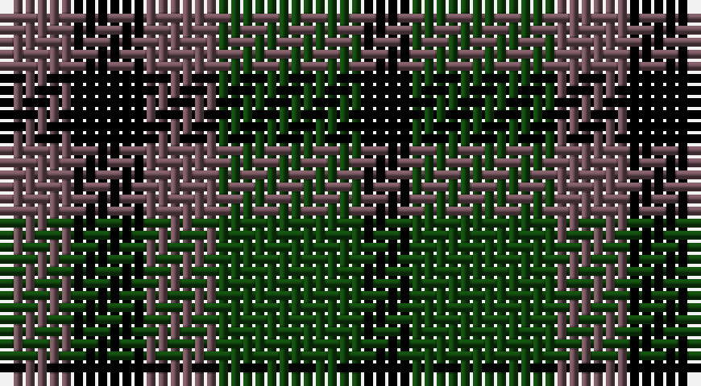

This page is one **sett** — a single exact thread-count. It belongs to the [tartan](/setts/n3k3n3dg6k2/)
(the same proportion at any scale), whose colour order is pattern [BKBGK](/stripes/bkbgk/).

Sourced from weddslist.  It is a [5 stripe tartan](/stripes/stripes5/).

Original link http://www.weddslist.com/cgi-bin/tartans/pg.pl?source=tinsel

## Thread count
N/6 K6 N6 DG12 K/4

One full sett is **58 threads**.

## Palette

Palette: <strong>Ingles Buchan</strong> <small style="color:#888">(1 of 3 colours)</small>
<table><thead><tr><th>Colour</th><th>Threads</th><th>Shade</th><th>Base</th><th>OKLCh</th></tr></thead><tbody><tr><td>N/</td><td style="text-align:right;font-variant-numeric:tabular-nums">6</td><td><code style="background-color:#6E5058;">#6E5058</code> <small style="color:#888">#6E5058</small></td><td>B <code style="background-color:#2A418A;">#2A418A</code></td><td><small style="color:#888">oklch(46.6% 0.042 1.2)</small></td></tr><tr><td>K</td><td style="text-align:right;font-variant-numeric:tabular-nums">6</td><td><code style="background-color:#000000;">#000000</code> <small style="color:#888">#000000</small></td><td>K <code style="background-color:#000000;">#000000</code></td><td><small style="color:#888">oklch(0.0% 0.000 0.0)</small></td></tr><tr><td>N</td><td style="text-align:right;font-variant-numeric:tabular-nums">6</td><td><code style="background-color:#6E5058;">#6E5058</code> <small style="color:#888">#6E5058</small></td><td>B <code style="background-color:#2A418A;">#2A418A</code></td><td><small style="color:#888">oklch(46.6% 0.042 1.2)</small></td></tr><tr><td>DG</td><td style="text-align:right;font-variant-numeric:tabular-nums">12</td><td><code style="background-color:#11450D;">#11450D</code> <small style="color:#888">#11450D</small></td><td>G <code style="background-color:#006100;">#006100</code></td><td><small style="color:#888">oklch(34.4% 0.101 142.1)</small></td></tr><tr><td>K/</td><td style="text-align:right;font-variant-numeric:tabular-nums">4</td><td><code style="background-color:#000000;">#000000</code> <small style="color:#888">#000000</small></td><td>K <code style="background-color:#000000;">#000000</code></td><td><small style="color:#888">oklch(0.0% 0.000 0.0)</small></td></tr></tbody></table>

# Sample pattern

## Nearest tartans

The nearest existing variants by ΔTartan distance, with this tartan at the top so the swatches line up against it.

ΔTartan

Tartan

Sett

—

<a href="/ttd/edit/#slug=n3k3n3dg6k2~x2">Austin WI</a> <a class="nn-out" href="/variants/s5/n3k3n3dg6k2~x2/" title="open its dictionary page">↗</a>

0.00

<a href="/ttd/edit/#slug=n3k3n3dg6k2&amp;base=n3k3n3dg6k2~x2">Austin WI</a> <a class="nn-out" href="/variants/s5/n3k3n3dg6k2/" title="open its dictionary page">↗</a>

1.34

<a href="/ttd/edit/#slug=k1g3k3db3r1~x4&amp;base=n3k3n3dg6k2~x2">Durham District Tartan</a> <a class="nn-out" href="/variants/s5/k1g3k3db3r1~x4/" title="open its dictionary page">↗</a>

1.44

<a href="/ttd/edit/#slug=k1g3k3db3k1db1~x4&amp;base=n3k3n3dg6k2~x2">Sutherland, 42nd</a> <a class="nn-out" href="/variants/s6/k1g3k3db3k1db1~x4/" title="open its dictionary page">↗</a>

1.51

<a href="/ttd/edit/#slug=db12k16g14k5g14k16db12g4~x2&amp;base=n3k3n3dg6k2~x2">Norwich No.064</a> <a class="nn-out" href="/variants/s8/db12k16g14k5g14k16db12g4~x2/" title="open its dictionary page">↗</a>

1.51

<a href="/ttd/edit/#slug=k5g20k18db20r5~x2&amp;base=n3k3n3dg6k2~x2">Denholm (Fashion)</a> <a class="nn-out" href="/variants/s5/k5g20k18db20r5~x2/" title="open its dictionary page">↗</a>

1.55

<a href="/ttd/edit/#slug=k5g14k16db12g4~x2&amp;base=n3k3n3dg6k2~x2">Unnamed 1</a> <a class="nn-out" href="/variants/s5/k5g14k16db12g4~x2/" title="open its dictionary page">↗</a>

1.57

<a href="/ttd/edit/#slug=k9g9w2g9k9db9k3~x2&amp;base=n3k3n3dg6k2~x2">Graham of Montrose - 1850 (Clan)</a> <a class="nn-out" href="/variants/s7/k9g9w2g9k9db9k3~x2/" title="open its dictionary page">↗</a>

1.57

<a href="/ttd/edit/#slug=k2g8k7db8r2~x2&amp;base=n3k3n3dg6k2~x2">Denholme</a> <a class="nn-out" href="/variants/s5/k2g8k7db8r2~x2/" title="open its dictionary page">↗</a>

1.61

<a href="/ttd/edit/#slug=db6k6db18k18g22k5&amp;base=n3k3n3dg6k2~x2">Campbell, the 42nd</a> <a class="nn-out" href="/variants/s6/db6k6db18k18g22k5/" title="open its dictionary page">↗</a>

1.61

<a href="/ttd/edit/#slug=dp3k3dp3dg6ly2~x2&amp;base=n3k3n3dg6k2~x2">Austin (Wilson's No 173)</a> <a class="nn-out" href="/variants/s5/dp3k3dp3dg6ly2~x2/" title="open its dictionary page">↗</a>

## Neighbour map

Every grey dot is one of 14360 variants placed by the first two principal components of the ΔTartan feature space (44% of its variance). Red is this tartan; blue dots are its nearest — click one to open its page.

<svg viewBox="0 0 640 380" role="img" style="max-width:100%;height:auto;border:1px solid #e0e0e0;border-radius:4px;display:block" xmlns="http://www.w3.org/2000/svg"><image href="/nn/cloud.v1.png" width="640" height="380"/><a href="/variants/s5/n3k3n3dg6k2/"><circle cx="140.7" cy="336.3" r="4" fill="#3465a4"><title>Austin WI</title></circle></a><a href="/variants/s5/k1g3k3db3r1~x4/"><circle cx="130.3" cy="319.2" r="4" fill="#3465a4"><title>Durham District Tartan</title></circle></a><a href="/variants/s6/k1g3k3db3k1db1~x4/"><circle cx="148.8" cy="308.6" r="4" fill="#3465a4"><title>Sutherland, 42nd</title></circle></a><a href="/variants/s8/db12k16g14k5g14k16db12g4~x2/"><circle cx="138.0" cy="308.6" r="4" fill="#3465a4"><title>Norwich No.064</title></circle></a><a href="/variants/s5/k5g20k18db20r5~x2/"><circle cx="110.6" cy="286.2" r="4" fill="#3465a4"><title>Denholm (Fashion)</title></circle></a><a href="/variants/s5/k5g14k16db12g4~x2/"><circle cx="157.1" cy="312.6" r="4" fill="#3465a4"><title>Unnamed 1</title></circle></a><a href="/variants/s7/k9g9w2g9k9db9k3~x2/"><circle cx="148.3" cy="290.3" r="4" fill="#3465a4"><title>Graham of Montrose - 1850 (Clan)</title></circle></a><a href="/variants/s5/k2g8k7db8r2~x2/"><circle cx="98.6" cy="281.3" r="4" fill="#3465a4"><title>Denholme</title></circle></a><a href="/variants/s6/db6k6db18k18g22k5/"><circle cx="154.6" cy="287.0" r="4" fill="#3465a4"><title>Campbell, the 42nd</title></circle></a><a href="/variants/s5/dp3k3dp3dg6ly2~x2/"><circle cx="93.5" cy="305.8" r="4" fill="#3465a4"><title>Austin (Wilson's No 173)</title></circle></a><circle cx="140.7" cy="336.3" r="5" fill="#c00000"/></svg>

ID: /variants/s5/n3k3n3dg6k2~x2/
