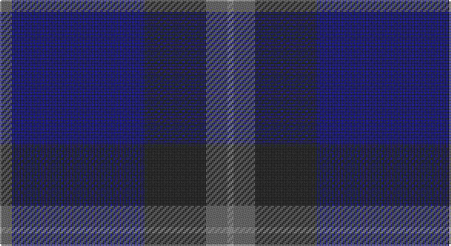

This page is one **sett** — a single exact thread-count. It belongs to the [tartan](/setts/n4db43k20n7o2/)
(the same proportion at any scale), whose colour order is pattern [BBKBR](/stripes/bbkbr/).

Part of the [Deighan](/tartans/deighan/) tartan — the named design grouping this sett with its other cloths.

Sourced from tartans-authority.  It is a [5 stripe tartan](/stripes/stripes5/).

Original link http://www.tartansauthority.com/tartan-ferret/display/10287/

## Register references

External register numbers recorded for this tartan.

- Scottish Register of Tartans: [10287](https://www.tartanregister.gov.uk/tartanDetails?ref=10287)
- Scottish Tartans Authority (ITI): 10287

## Thread count
N/8 DB86 K40 N14 Na/4

One full sett is **292 threads**.

## Palette

Palette: <strong>Tartan Register</strong> <small style="color:#888">(2 of 4 colours)</small>
<table><thead><tr><th>Colour</th><th>Threads</th><th>Shade</th><th>Base</th><th>OKLCh</th></tr></thead><tbody><tr><td>N/</td><td style="text-align:right;font-variant-numeric:tabular-nums">8</td><td><code style="background-color:#5C5C5C;">#5C5C5C</code> <small style="color:#888">#5C5C5C</small></td><td>B <code style="background-color:#2A418A;">#2A418A</code></td><td><small style="color:#888">oklch(47.5% 0.000 89.9)</small></td></tr><tr><td>DB</td><td style="text-align:right;font-variant-numeric:tabular-nums">86</td><td><code style="background-color:#000068;">#000068</code> <small style="color:#888">#000068</small></td><td>B <code style="background-color:#2A418A;">#2A418A</code></td><td><small style="color:#888">oklch(23.4% 0.162 264.1)</small></td></tr><tr><td>K</td><td style="text-align:right;font-variant-numeric:tabular-nums">40</td><td><code style="background-color:#101010;">#101010</code> <small style="color:#888">#101010</small></td><td>K <code style="background-color:#000000;">#000000</code></td><td><small style="color:#888">oklch(17.3% 0.000 89.9)</small></td></tr><tr><td>N</td><td style="text-align:right;font-variant-numeric:tabular-nums">14</td><td><code style="background-color:#5C5C5C;">#5C5C5C</code> <small style="color:#888">#5C5C5C</small></td><td>B <code style="background-color:#2A418A;">#2A418A</code></td><td><small style="color:#888">oklch(47.5% 0.000 89.9)</small></td></tr><tr><td>Na/</td><td style="text-align:right;font-variant-numeric:tabular-nums">4</td><td><code style="background-color:#888888;">#888888</code> <small style="color:#888">#888888</small></td><td>R <code style="background-color:#CC0000;">#CC0000</code></td><td><small style="color:#888">oklch(62.7% 0.000 89.9)</small></td></tr></tbody></table>

# Sample pattern

## Compared to the master

This cloth is one sett of its design; the master sett (the exemplar the design is anchored on) is below for comparison.

<figure style="margin:0"><figcaption style="color:#888;font-size:smaller">this sett</figcaption></figure>
<figure style="margin:0"><figcaption style="color:#888;font-size:smaller"><a href="/setts/dt4k43ki20dt7y2/">master sett →</a></figcaption></figure>

## Nearest tartans

The nearest existing variants by ΔTartan distance, with this tartan at the top so the swatches line up against it.

ΔTartan

Tartan

Sett

—

<a href="/ttd/edit/#slug=n4db43k20n7o2~x2">Deighan (Burham Kent) (Name)</a> <a class="nn-out" href="/variants/s5/n4db43k20n7o2~x2/" title="open its dictionary page">↗</a>

1.18

<a href="/ttd/edit/#slug=k30db6k6db41lt2~x2&amp;base=n4db43k20n7o2~x2">Williams (New York) (Personal)</a> <a class="nn-out" href="/variants/s5/k30db6k6db41lt2~x2/" title="open its dictionary page">↗</a>

1.19

<a href="/ttd/edit/#slug=db80k28dp9k3m5k12~x2&amp;base=n4db43k20n7o2~x2">Earl Blue Marl</a> <a class="nn-out" href="/variants/s6/db80k28dp9k3m5k12~x2/" title="open its dictionary page">↗</a>

1.22

<a href="/ttd/edit/#slug=k4ly1k18db18lb1db4~x4&amp;base=n4db43k20n7o2~x2">Lyndon Prep (School)</a> <a class="nn-out" href="/variants/s6/k4ly1k18db18lb1db4~x4/" title="open its dictionary page">↗</a>

1.32

<a href="/ttd/edit/#slug=k2dg7db2dg7db16r1~x6&amp;base=n4db43k20n7o2~x2">Hutton</a> <a class="nn-out" href="/variants/s6/k2dg7db2dg7db16r1~x6/" title="open its dictionary page">↗</a>

1.38

<a href="/ttd/edit/#slug=t5db30k25t5db30dp2t5~x2&amp;base=n4db43k20n7o2~x2">Van Loo (Personal)</a> <a class="nn-out" href="/variants/s7/t5db30k25t5db30dp2t5~x2/" title="open its dictionary page">↗</a>

1.42

<a href="/ttd/edit/#slug=db26dg6db2dg17dy4w1dy4~x4&amp;base=n4db43k20n7o2~x2">Doral</a> <a class="nn-out" href="/variants/s7/db26dg6db2dg17dy4w1dy4~x4/" title="open its dictionary page">↗</a>

1.47

<a href="/ttd/edit/#slug=dbi104db16w8db66r3db16&amp;base=n4db43k20n7o2~x2">Edzell, U.S. Navy</a> <a class="nn-out" href="/variants/s6/dbi104db16w8db66r3db16/" title="open its dictionary page">↗</a>

1.51

<a href="/ttd/edit/#slug=db8k39db8k39db87r6&amp;base=n4db43k20n7o2~x2">Largan (?)</a> <a class="nn-out" href="/variants/s6/db8k39db8k39db87r6/" title="open its dictionary page">↗</a>

1.54

<a href="/ttd/edit/#slug=db4r1db18n18lr1~x4&amp;base=n4db43k20n7o2~x2">Ardee (Corporate)</a> <a class="nn-out" href="/variants/s5/db4r1db18n18lr1~x4/" title="open its dictionary page">↗</a>

1.56

<a href="/variants/s6/db19ki4dr1ki4dg9k1~x4/">Monarchs Corporate Sport Tartan</a>

## Neighbour map

Every grey dot is one of 14360 variants placed by the first two principal components of the ΔTartan feature space (44% of its variance). Red is this tartan; blue dots are its nearest — click one to open its page.

<svg viewBox="0 0 640 380" role="img" style="max-width:100%;height:auto;border:1px solid #e0e0e0;border-radius:4px;display:block" xmlns="http://www.w3.org/2000/svg"><image href="/nn/cloud.v1.png" width="640" height="380"/><a href="/variants/s5/k30db6k6db41lt2~x2/"><circle cx="436.3" cy="254.2" r="4" fill="#3465a4"><title>Williams (New York) (Personal)</title></circle></a><a href="/variants/s6/db80k28dp9k3m5k12~x2/"><circle cx="453.0" cy="201.0" r="4" fill="#3465a4"><title>Earl Blue Marl</title></circle></a><a href="/variants/s6/k4ly1k18db18lb1db4~x4/"><circle cx="368.2" cy="220.1" r="4" fill="#3465a4"><title>Lyndon Prep (School)</title></circle></a><a href="/variants/s6/k2dg7db2dg7db16r1~x6/"><circle cx="360.6" cy="235.5" r="4" fill="#3465a4"><title>Hutton</title></circle></a><a href="/variants/s7/t5db30k25t5db30dp2t5~x2/"><circle cx="369.8" cy="225.8" r="4" fill="#3465a4"><title>Van Loo (Personal)</title></circle></a><a href="/variants/s7/db26dg6db2dg17dy4w1dy4~x4/"><circle cx="348.9" cy="199.8" r="4" fill="#3465a4"><title>Doral</title></circle></a><a href="/variants/s6/dbi104db16w8db66r3db16/"><circle cx="387.1" cy="186.9" r="4" fill="#3465a4"><title>Edzell, U.S. Navy</title></circle></a><a href="/variants/s6/db8k39db8k39db87r6/"><circle cx="429.8" cy="255.6" r="4" fill="#3465a4"><title>Largan (?)</title></circle></a><a href="/variants/s5/db4r1db18n18lr1~x4/"><circle cx="399.7" cy="228.4" r="4" fill="#3465a4"><title>Ardee (Corporate)</title></circle></a><a href="/variants/s6/db19ki4dr1ki4dg9k1~x4/"><circle cx="351.2" cy="212.4" r="4" fill="#3465a4"><title>Monarchs Corporate Sport Tartan</title></circle></a><circle cx="403.1" cy="226.2" r="5" fill="#c00000"/></svg>

ID: /variants/s5/n4db43k20n7o2~x2/
