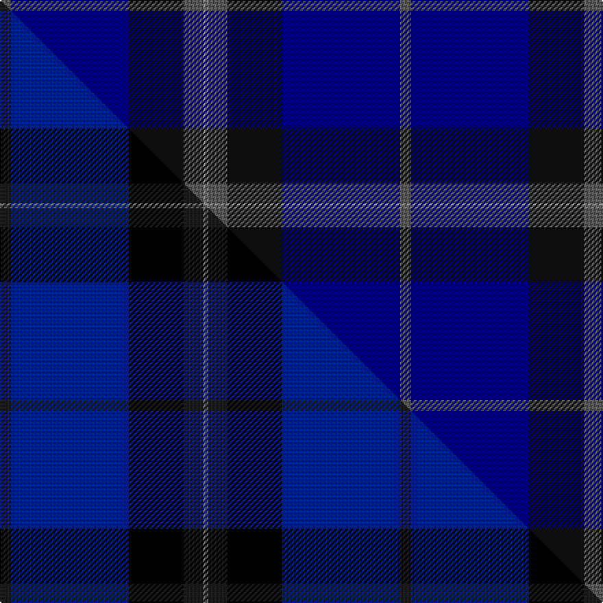

This is one **variant** — a specific cloth: this exact thread count and colourway, with its own
provenance below. It is one weaving of the [sett](/setts/n4db43k20n7o2/) (the scale-free proportion — the
same cloth at any scale or shade), whose colour order is pattern [BBKBR](/stripes/bbkbr/).

Part of the [Deighan](/tartans/deighan/) tartan — the named design grouping this sett with its other cloths.

Sourced from tartans-authority.  It is a [5 stripe tartan](/stripes/stripes5/).

Original link [https://www.tartanregister.gov.uk/tartanDetails.aspx?ref=10287](https://www.tartanregister.gov.uk/tartanDetails.aspx?ref=10287)

Dataset <small>— provenance for this record, inherited from the source manifest</small>

<dl class="dataset-prov">
<dt>source</dt><dd><a href="/sources/tartans-authority/">Scottish Tartans Authority</a></dd>
<dt>data captured from</dt><dd><a href="https://github.com/thetartan/tartan-database/blob/master/data/tartans-authority/data.csv">https://github.com/thetartan/tartan-database/blob/master/data/tartans-authority/data.csv</a></dd>
<dt>data date</dt><dd>18th Sept. 2010 <small>(this record)</small></dd>
<dt>licence</dt><dd><a href="https://creativecommons.org/licenses/by-nc-nd/4.0/">CC BY-NC-ND 4.0</a></dd>
</dl>

Capture chain <small>— the hands this data passed through, oldest first; each capture carries its own licence</small>

<ol class="capture-chain">
<li><a href="https://www.tartansauthority.com/">Scottish Tartans Authority</a> <small>the heritage body's archive — its tartan-ferret record browser is retired (links repaired to the SRT, above)</small></li>
<li><a href="https://github.com/thetartan/tartan-database">thetartan/tartan-database</a> <small>2016-2017</small> · <a href="https://creativecommons.org/licenses/by-nc-nd/4.0/">CC BY-NC-ND 4.0</a> <small>Levko Kravets's frozen compilation — the capture we vendored, and where its CC licence text came from</small></li>
<li>this dictionary <small>captured 2026-06-10 · commit 5bf86c7566</small> <small>each re-capture is a git commit to data/sources</small></li>
</ol>

## Register references

External register numbers recorded for this tartan.

- Scottish Register of Tartans: [10287](https://www.tartanregister.gov.uk/tartanDetails?ref=10287)
- Scottish Tartans Authority (ITI): 10287

## Thread count
N/8 DB86 K40 N14 O/4

One full sett is **292 threads**.

## Palette
<table><thead><tr><th>Colour</th><th>Shade</th><th>OKLCh</th></tr></thead><tbody><tr><td>DB</td><td><code style="background-color:#000068;">#000068</code> <small style="color:#888">#000068</small></td><td><small style="color:#888">oklch(23.4% 0.162 264.1)</small></td></tr><tr><td>K</td><td><code style="background-color:#101010;">#101010</code> <small style="color:#888">#101010</small></td><td><small style="color:#888">oklch(17.3% 0.000 89.9)</small></td></tr><tr><td>N</td><td><code style="background-color:#5C5C5C;">#5C5C5C</code> <small style="color:#888">#5C5C5C</small></td><td><small style="color:#888">oklch(47.5% 0.000 89.9)</small></td></tr><tr><td>O</td><td><code style="background-color:#888888;">#888888</code> <small style="color:#888">#888888</small></td><td><small style="color:#888">oklch(62.7% 0.000 89.9)</small></td></tr></tbody></table>

# Sample pattern

## Compared to the master

This cloth is one sett of its design; the master sett (the exemplar the design is anchored on) is below for comparison.

Its **ΔTartan distance** from the master is **0.18** — the same measure the nearest-tartans table ranks by (0 is identical; a re-scale of the same cloth is near 0, a recolour or a different proportion further).

<figure class="master-compare" style="margin:0">

this sett
master sett ★

<figcaption style="color:#888;font-size:smaller">One weave of this sett against the <a href="/setts/dt4db43k20dt7y2/">master sett ★</a>, split on the diagonal: a shared proportion runs seamlessly across it with only the shades shifting; a different proportion breaks on it.</figcaption>
</figure>

## Nearest tartan variants

The nearest existing variants by ΔTartan distance, with this cloth at the top so the swatches line up against it.

ΔTartan

Threads

Variant

Sett

—

292

<a href="/variants/s5/n4db43k20n7o2~x2~n1900000-db0906265-k0700000-o2500000/">Deighan (Burham Kent) (Name)</a>

<a href="/ttd/edit/#slug=dt4db43k20dt7y2~x2~dt0900000-y2100000&amp;base=n4db43k20n7o2~x2~n1900000-db0906265-k0700000-o2500000" title="compare in the TTD">0.18</a>

292

<a href="/variants/s5/dt4db43k20dt7y2~x2~dt0900000-y2100000/">Deighan (Edinburgh)</a>

<a href="/ttd/edit/#slug=db46k6g9dy9r4&amp;base=n4db43k20n7o2~x2~n1900000-db0906265-k0700000-o2500000" title="compare in the TTD">1.63</a>

98

<a href="/variants/s5/db46k6g9dy9r4/">Ayllu Thuban</a>

<a href="/ttd/edit/#slug=db8dr1k1n1~x10&amp;base=n4db43k20n7o2~x2~n1900000-db0906265-k0700000-o2500000" title="compare in the TTD">1.67</a>

130

<a href="/variants/s4/db8dr1k1n1~x10/">Kucher, Gregory</a>

<a href="/ttd/edit/#slug=k42n2k2n17db8y4~x2~k0800000-n1900000&amp;base=n4db43k20n7o2~x2~n1900000-db0906265-k0700000-o2500000" title="compare in the TTD">2.15</a>

208

<a href="/variants/s6/k42n2k2n17db8y4~x2~k0800000-n1900000/">Connecticut State Police Pipe Band</a>

<a href="/ttd/edit/#slug=db4r1db18n18lb1~x4&amp;base=n4db43k20n7o2~x2~n1900000-db0906265-k0700000-o2500000" title="compare in the TTD">2.29</a>

316

<a href="/variants/s5/db4r1db18n18lb1~x4/">Ardee (Corporate)</a>

<a href="/ttd/edit/#slug=dy2dg44k10r1db16r1~x2&amp;base=n4db43k20n7o2~x2~n1900000-db0906265-k0700000-o2500000" title="compare in the TTD">2.69</a>

290

<a href="/variants/s6/dy2dg44k10r1db16r1~x2/">MacWilliam Hunting</a>

<a href="/ttd/edit/#slug=dy2dg44k10r1db16r2~x2&amp;base=n4db43k20n7o2~x2~n1900000-db0906265-k0700000-o2500000" title="compare in the TTD">2.70</a>

292

<a href="/variants/s6/dy2dg44k10r1db16r2~x2/">MacWilliam Htg</a>

<a href="/ttd/edit/#slug=dp20db25w3k2~x2&amp;base=n4db43k20n7o2~x2~n1900000-db0906265-k0700000-o2500000" title="compare in the TTD">2.71</a>

156

<a href="/variants/s4/dp20db25w3k2~x2/">Murdoch, Ellis (Personal)</a>

<a href="/ttd/edit/#slug=db37dg37n8k3dp5~x2&amp;base=n4db43k20n7o2~x2~n1900000-db0906265-k0700000-o2500000" title="compare in the TTD">2.72</a>

276

<a href="/variants/s5/db37dg37n8k3dp5~x2/">Dallard Personal Tartan</a>

<a href="/ttd/edit/#slug=k37dg37n8ki3dp5~x2~k0504259-ki0700000&amp;base=n4db43k20n7o2~x2~n1900000-db0906265-k0700000-o2500000" title="compare in the TTD">2.73</a>

276

<a href="/variants/s5/k37dg37n8ki3dp5~x2~k0504259-ki0700000/">Dallard (Personal)</a>

## Neighbour map

Every grey dot is one of 13621 variants placed by the first two principal components of the ΔTartan feature space (42% of its variance). Red is this tartan; blue dots are its nearest — click one to open its page.

<svg viewBox="0 0 640 380" role="img" style="max-width:100%;height:auto;border:1px solid #e0e0e0;border-radius:4px;display:block" xmlns="http://www.w3.org/2000/svg"><image href="/nn/cloud.v1.png" width="640" height="380"/><a href="/variants/s5/dt4db43k20dt7y2~x2~dt0900000-y2100000/"><circle cx="387.1" cy="185.8" r="4" fill="#3465a4"><title>Deighan (Edinburgh)</title></circle></a><a href="/variants/s5/db46k6g9dy9r4/"><circle cx="337.8" cy="177.1" r="4" fill="#3465a4"><title>Ayllu Thuban</title></circle></a><a href="/variants/s4/db8dr1k1n1~x10/"><circle cx="486.2" cy="226.7" r="4" fill="#3465a4"><title>Kucher, Gregory</title></circle></a><a href="/variants/s6/k42n2k2n17db8y4~x2~k0800000-n1900000/"><circle cx="410.6" cy="172.9" r="4" fill="#3465a4"><title>Connecticut State Police Pipe Band</title></circle></a><a href="/variants/s5/db4r1db18n18lb1~x4/"><circle cx="416.0" cy="217.3" r="4" fill="#3465a4"><title>Ardee (Corporate)</title></circle></a><a href="/variants/s6/dy2dg44k10r1db16r1~x2/"><circle cx="419.2" cy="127.9" r="4" fill="#3465a4"><title>MacWilliam Hunting</title></circle></a><a href="/variants/s6/dy2dg44k10r1db16r2~x2/"><circle cx="404.4" cy="126.7" r="4" fill="#3465a4"><title>MacWilliam Htg</title></circle></a><a href="/variants/s4/dp20db25w3k2~x2/"><circle cx="327.1" cy="223.1" r="4" fill="#3465a4"><title>Murdoch, Ellis (Personal)</title></circle></a><a href="/variants/s5/db37dg37n8k3dp5~x2/"><circle cx="334.7" cy="230.9" r="4" fill="#3465a4"><title>Dallard Personal Tartan</title></circle></a><a href="/variants/s5/k37dg37n8ki3dp5~x2~k0504259-ki0700000/"><circle cx="314.6" cy="221.8" r="4" fill="#3465a4"><title>Dallard (Personal)</title></circle></a><circle cx="416.0" cy="196.8" r="5" fill="#c00000"/><text x="320" y="376" text-anchor="middle" font-size="11" fill="#999">ground</text><text x="11" y="190" text-anchor="middle" font-size="11" fill="#999" transform="rotate(-90 11 190)">complexity</text></svg>

ID: /variants/s5/n4db43k20n7o2~x2~n1900000-db0906265-k0700000-o2500000/
