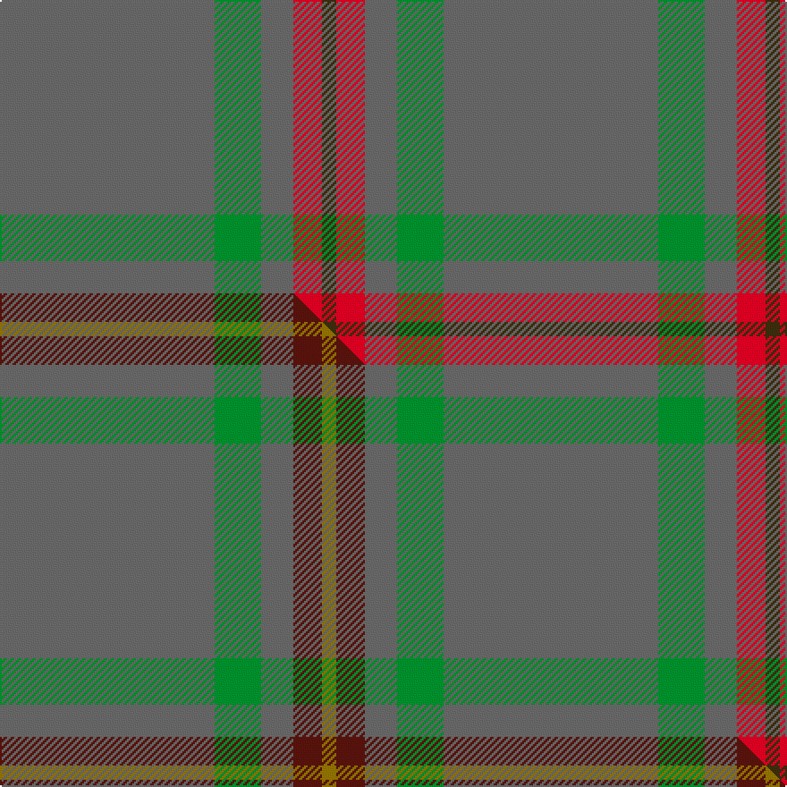

This is one **variant** — a specific cloth: this exact thread count and colourway, with its own
provenance below. It is one weaving of the [sett](/tartans/b/ba/ballantyne/) (the scale-free proportion — the
same cloth at any scale or shade), whose colour order is pattern [BGBRG](/stripes/bgbrg/).

Part of the [Ballantyne](/tartans/b/ba/ballantyne/) tartan — the named design grouping this sett with its other cloths.

Sourced from house-of-tartan.  It is a [5 stripe tartan](/stripes/stripes5/).

Original link [http://www.house-of-tartan.scotland.net/house/TartanViewjs.asp?colr=Def&tnam=7563](http://www.house-of-tartan.scotland.net/house/TartanViewjs.asp?colr=Def&tnam=7563)

## Provenance

Earliest known date: 2007 Andrew Ballantyne said, l finally decided to purchase a tartan of my own design. The first kilt was made for my father and he was very pleased with it. The fabric was designed online at House of Tartan and woven by Edgars, Perth.

Dataset <small>— provenance for this record, inherited from the source manifest</small>

<dl class="dataset-prov">
<dt>source</dt><dd><a href="/sources/house-of-tartan/">House of Tartan</a></dd>
<dt>data captured from</dt><dd><a href="https://github.com/thetartan/tartan-database/blob/master/data/house-of-tartan/data.csv">https://github.com/thetartan/tartan-database/blob/master/data/house-of-tartan/data.csv</a></dd>
<dt>data date</dt><dd>2007 <small>(this record)</small></dd>
<dt>licence</dt><dd><a href="https://creativecommons.org/licenses/by-nc-nd/4.0/">CC BY-NC-ND 4.0</a></dd>
</dl>

Capture chain <small>— the hands this data passed through, oldest first; each capture carries its own licence</small>

<ol class="capture-chain">
<li><a href="http://www.house-of-tartan.scotland.net/">House of Tartan</a> <small>the weaver/retailer's database — the site is now offline; the URL is kept as the ultimate source's identity</small></li>
<li><a href="https://github.com/thetartan/tartan-database">thetartan/tartan-database</a> <small>2016-2017</small> · <a href="https://creativecommons.org/licenses/by-nc-nd/4.0/">CC BY-NC-ND 4.0</a> <small>Levko Kravets's frozen compilation — the capture we vendored, and where its CC licence text came from</small></li>
<li>this dictionary <small>captured 2026-06-10 · commit 5bf86c7566</small> <small>each re-capture is a git commit to data/sources</small></li>
</ol>

## Thread count
N/120 G26 N18 R16 DY/8

One full sett is **248 threads**.

## Palette
<table><thead><tr><th>Colour</th><th>Shade</th><th>OKLCh</th></tr></thead><tbody><tr><td>R</td><td><code style="background-color:#D60020;">#D60020</code> <small style="color:#888">#D60020</small></td><td><small style="color:#888">oklch(55.2% 0.224 25.5)</small></td></tr><tr><td>G</td><td><code style="background-color:#008B2A;">#008B2A</code> <small style="color:#888">#008B2A</small></td><td><small style="color:#888">oklch(55.4% 0.170 145.9)</small></td></tr><tr><td>N</td><td><code style="background-color:#636363;">#636363</code> <small style="color:#888">#636363</small></td><td><small style="color:#888">oklch(50.0% 0.000 89.9)</small></td></tr><tr><td>DY</td><td><code style="background-color:#3A2B0D;">#3A2B0D</code> <small style="color:#888">#3A2B0D</small></td><td><small style="color:#888">oklch(30.0% 0.049 82.0)</small></td></tr></tbody></table>

# Sample pattern

## Compared to the master

This cloth is one sett of its design; the master sett (the exemplar the design is anchored on) is below for comparison.

Its **ΔTartan distance** from the master is **0.07** — the same measure the nearest-tartans table ranks by (0 is identical; a re-scale of the same cloth is near 0, a recolour or a different proportion further).

<figure class="master-compare" style="margin:0">

this sett
master sett ★

<figcaption style="color:#888;font-size:smaller">One weave of this sett against the <a href="/setts/n60g13n9dr8y4/">master sett ★</a>, split on the diagonal: a shared proportion runs seamlessly across it with only the shades shifting; a different proportion breaks on it.</figcaption>
</figure>

## Nearest tartan variants

The nearest existing variants by ΔTartan distance, with this cloth at the top so the swatches line up against it.

ΔTartan

Threads

Variant

Sett

—

248

<a href="/variants/s5/n60g13n9r8dy4~x2/">Ballantyne Personal Tartan</a>

<a href="/ttd/edit/#slug=n60g13n9dr8y4~x2&amp;base=n60g13n9r8dy4~x2" title="compare in the TTD">0.07</a>

248

<a href="/variants/s5/n60g13n9dr8y4~x2/">Ballantyne (Personal)</a>

<a href="/ttd/edit/#slug=n57w5g20n5y10&amp;base=n60g13n9r8dy4~x2" title="compare in the TTD">1.08</a>

127

<a href="/variants/s5/n57w5g20n5y10/">Jahore District Tartan</a>

<a href="/ttd/edit/#slug=n40r2n20g19dt2~dt1204274&amp;base=n60g13n9r8dy4~x2" title="compare in the TTD">1.27</a>

124

<a href="/variants/s5/n40r2n20g19db2~db1204274/">Lloyd of Wales</a>

<a href="/ttd/edit/#slug=n65r27w2n4y5~x2&amp;base=n60g13n9r8dy4~x2" title="compare in the TTD">1.40</a>

272

<a href="/variants/s5/n65r27w2n4y5~x2/">Perry, Arisaid</a>

<a href="/ttd/edit/#slug=g5n1g1n12r1~x8&amp;base=n60g13n9r8dy4~x2" title="compare in the TTD">1.79</a>

272

<a href="/variants/s5/g5n1g1n12r1~x8/">Ceredigion (Personal)</a>

<a href="/ttd/edit/#slug=g56dy13y13n5~x2&amp;base=n60g13n9r8dy4~x2" title="compare in the TTD">1.86</a>

226

<a href="/variants/s4/g56dy13y13n5~x2/">Colonial Marine (Aliens Legacy)</a>

<a href="/ttd/edit/#slug=dg8dr1db1n1~x10&amp;base=n60g13n9r8dy4~x2" title="compare in the TTD">1.88</a>

130

<a href="/variants/s4/dg8dr1db1n1~x10/">Jodi Williams (Personal)</a>

<a href="/ttd/edit/#slug=n44dg12db1r6~x2~r1406028&amp;base=n60g13n9r8dy4~x2" title="compare in the TTD">1.96</a>

152

<a href="/variants/s4/n44dg12db1r6~x2~r1406028/">Heslop, William D Name Tartan</a>

<a href="/ttd/edit/#slug=n44dg12db1r6~x2&amp;base=n60g13n9r8dy4~x2" title="compare in the TTD">1.96</a>

152

<a href="/variants/s4/n44dg12db1r6~x2/">Heslop Lurdenlaw by Kelso</a>

<a href="/ttd/edit/#slug=g9n4dy1~x8&amp;base=n60g13n9r8dy4~x2" title="compare in the TTD">2.01</a>

144

<a href="/variants/s3/g9n4dy1~x8/">Ledford</a>

## Neighbour map

Every grey dot is one of 13656 variants placed by the first two principal components of the ΔTartan feature space (42% of its variance). Red is this tartan; blue dots are its nearest — click one to open its page. The map is a flat projection of a many-dimensional space — [how to read it](/posts/neighbourhood-maps/).

<svg viewBox="0 0 640 380" role="img" style="max-width:100%;height:auto;border:1px solid #e0e0e0;border-radius:4px;display:block" xmlns="http://www.w3.org/2000/svg"><image href="/nn/cloud.v1.png" width="640" height="380"/><a href="/variants/s5/n60g13n9dr8y4~x2/"><circle cx="626.0" cy="257.9" r="4" fill="#3465a4"><title>Ballantyne (Personal)</title></circle></a><a href="/variants/s5/n57w5g20n5y10/"><circle cx="500.0" cy="258.3" r="4" fill="#3465a4"><title>Jahore District Tartan</title></circle></a><a href="/variants/s5/n40r2n20g19db2~db1204274/"><circle cx="610.1" cy="253.5" r="4" fill="#3465a4"><title>Lloyd of Wales</title></circle></a><a href="/variants/s5/n65r27w2n4y5~x2/"><circle cx="554.4" cy="185.5" r="4" fill="#3465a4"><title>Perry, Arisaid</title></circle></a><a href="/variants/s5/g5n1g1n12r1~x8/"><circle cx="570.7" cy="266.9" r="4" fill="#3465a4"><title>Ceredigion (Personal)</title></circle></a><a href="/variants/s4/g56dy13y13n5~x2/"><circle cx="504.8" cy="280.6" r="4" fill="#3465a4"><title>Colonial Marine (Aliens Legacy)</title></circle></a><a href="/variants/s4/dg8dr1db1n1~x10/"><circle cx="622.5" cy="292.4" r="4" fill="#3465a4"><title>Jodi Williams (Personal)</title></circle></a><a href="/variants/s4/n44dg12db1r6~x2~r1406028/"><circle cx="607.0" cy="205.1" r="4" fill="#3465a4"><title>Heslop, William D Name Tartan</title></circle></a><a href="/variants/s4/n44dg12db1r6~x2/"><circle cx="580.6" cy="194.9" r="4" fill="#3465a4"><title>Heslop Lurdenlaw by Kelso</title></circle></a><a href="/variants/s3/g9n4dy1~x8/"><circle cx="544.3" cy="340.9" r="4" fill="#3465a4"><title>Ledford</title></circle></a><circle cx="594.5" cy="232.3" r="5" fill="#c00000"/><text x="320" y="376" text-anchor="middle" font-size="11" fill="#999">ground</text><text x="11" y="190" text-anchor="middle" font-size="11" fill="#999" transform="rotate(-90 11 190)">complexity</text></svg>

ID: /variants/s5/n60g13n9r8dy4~x2/
