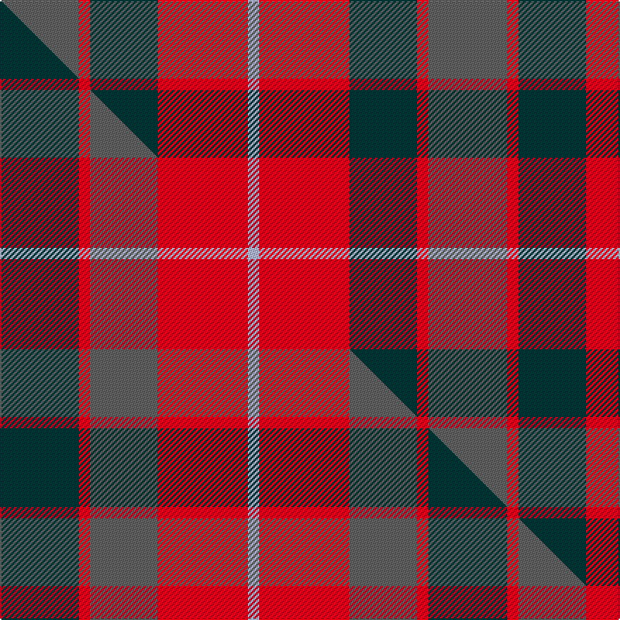

This page is one **sett** — a single exact thread-count. It belongs to the [tartan](/setts/n7r1dt6r8lb1/)
(the same proportion at any scale), whose colour order is pattern [BRBRW](/stripes/brbrw/).

Part of the [Callum](/tartans/callum/) tartan — the named design grouping this sett with its other cloths.

Sourced from tartans-authority.  It is a [5 stripe tartan](/stripes/stripes5/).

Original link http://www.tartansauthority.com/tartan-ferret/display/10322/

## Register references

External register numbers recorded for this tartan.

- Scottish Tartans Authority (ITI): 10322

## Thread count
N/56 R8 DT48 R64 LB/8

One full sett is **304 threads**.

## Palette
<table><thead><tr><th>Colour</th><th>Shade</th><th>OKLCh</th></tr></thead><tbody><tr><td>N</td><td><code style="background-color:#636363;">#636363</code> <small style="color:#888">#636363</small></td><td><small style="color:#888">oklch(50.0% 0.000 89.9)</small></td></tr><tr><td>LB</td><td><code style="background-color:#B5BBDE;">#B5BBDE</code> <small style="color:#888">#B5BBDE</small></td><td><small style="color:#888">oklch(79.9% 0.050 277.6)</small></td></tr><tr><td>DT</td><td><code style="background-color:#023535;">#023535</code> <small style="color:#888">#023535</small></td><td><small style="color:#888">oklch(29.8% 0.050 194.8)</small></td></tr><tr><td>R</td><td><code style="background-color:#D60020;">#D60020</code> <small style="color:#888">#D60020</small></td><td><small style="color:#888">oklch(55.2% 0.224 25.5)</small></td></tr></tbody></table>

# Sample pattern

## Compared to the master

This cloth is one sett of its design; the master sett (the exemplar the design is anchored on) is below for comparison.

Its **ΔTartan distance** from the master is **0.19** — the same measure the nearest-tartans table ranks by (0 is identical; a re-scale of the same cloth is near 0, a recolour or a different proportion further).

<figure class="master-compare" style="margin:0">

this sett
master sett ★

<figcaption style="color:#888;font-size:smaller">One weave of this sett against the <a href="/setts/dt7r1n6r8lb1/">master sett ★</a>, split on the diagonal: a shared proportion runs seamlessly across it with only the shades shifting; a different proportion breaks on it.</figcaption>
</figure>

## Nearest variants

The nearest existing variants by ΔTartan distance, with this cloth at the top so the swatches line up against it.

ΔTartan

Threads

Variant

Sett

—

304

<a href="/variants/s5/n7r1dt6r8lb1~x8/">Callum (Buchan) (Name)</a>

<a href="/ttd/edit/#slug=dt7r1n6r8lb1~x8&amp;base=n7r1dt6r8lb1~x8" title="compare in the TTD">1.22</a>

304

<a href="/variants/s5/dt7r1n6r8lb1~x8/">Callum (Buchan)</a>

<a href="/ttd/edit/#slug=ri8r1g4r1db4~x2~ri2209032-r2208029&amp;base=n7r1dt6r8lb1~x8" title="compare in the TTD">1.98</a>

48

<a href="/variants/s5/ri8r1g4r1db4~x2~ri2209032-r2208029/">Moray of Abercairney #2</a>

<a href="/ttd/edit/#slug=db1n8w1db4r8w1~x6&amp;base=n7r1dt6r8lb1~x8" title="compare in the TTD">2.51</a>

264

<a href="/variants/s6/db1n8w1db4r8w1~x6/">Little's (Corporate)</a>

<a href="/ttd/edit/#slug=dr4r21dr21db24r4~x2&amp;base=n7r1dt6r8lb1~x8" title="compare in the TTD">2.83</a>

280

<a href="/variants/s5/dr4r21dr21db24r4~x2/">Ferguson Britt Red (Corporate)</a>

<a href="/ttd/edit/#slug=g30y3db8r25~x2&amp;base=n7r1dt6r8lb1~x8" title="compare in the TTD">2.91</a>

154

<a href="/variants/s4/g30y3db8r25~x2/">Dohmen Family (Zuid-Nederland)</a>

<a href="/ttd/edit/#slug=y25r10g10db11w2~x2&amp;base=n7r1dt6r8lb1~x8" title="compare in the TTD">2.97</a>

178

<a href="/variants/s5/y25r10g10db11w2~x2/">Samye</a>

<a href="/ttd/edit/#slug=ri8r1g4r1g1lb2~x2~ri2209032-r2208029&amp;base=n7r1dt6r8lb1~x8" title="compare in the TTD">2.97</a>

48

<a href="/variants/s6/ri8r1g4r1g1lb2~x2~ri2209032-r2208029/">Moray of Abercairney</a>

<a href="/ttd/edit/#slug=r1o8r2db8lb1~x2&amp;base=n7r1dt6r8lb1~x8" title="compare in the TTD">2.98</a>

76

<a href="/variants/s5/r1o8r2db8lb1~x2/">Unamed, Riding cloak 1745</a>

<a href="/ttd/edit/#slug=r1dy8r2db8lb1~x2&amp;base=n7r1dt6r8lb1~x8" title="compare in the TTD">2.98</a>

76

<a href="/variants/s5/r1dy8r2db8lb1~x2/">Unamed Riding cloak 1745</a>

## Neighbour map

Every grey dot is one of 13620 variants placed by the first two principal components of the ΔTartan feature space (42% of its variance). Red is this tartan; blue dots are its nearest — click one to open its page.

<svg viewBox="0 0 640 380" role="img" style="max-width:100%;height:auto;border:1px solid #e0e0e0;border-radius:4px;display:block" xmlns="http://www.w3.org/2000/svg"><image href="/nn/cloud.v1.png" width="640" height="380"/><a href="/variants/s5/dt7r1n6r8lb1~x8/"><circle cx="249.5" cy="257.3" r="4" fill="#3465a4"><title>Callum (Buchan)</title></circle></a><a href="/variants/s5/ri8r1g4r1db4~x2~ri2209032-r2208029/"><circle cx="236.6" cy="235.9" r="4" fill="#3465a4"><title>Moray of Abercairney #2</title></circle></a><a href="/variants/s6/db1n8w1db4r8w1~x6/"><circle cx="208.8" cy="226.6" r="4" fill="#3465a4"><title>Little's (Corporate)</title></circle></a><a href="/variants/s5/dr4r21dr21db24r4~x2/"><circle cx="241.1" cy="283.4" r="4" fill="#3465a4"><title>Ferguson Britt Red (Corporate)</title></circle></a><a href="/variants/s4/g30y3db8r25~x2/"><circle cx="272.9" cy="249.2" r="4" fill="#3465a4"><title>Dohmen Family (Zuid-Nederland)</title></circle></a><a href="/variants/s5/y25r10g10db11w2~x2/"><circle cx="226.2" cy="228.0" r="4" fill="#3465a4"><title>Samye</title></circle></a><a href="/variants/s6/ri8r1g4r1g1lb2~x2~ri2209032-r2208029/"><circle cx="289.1" cy="222.1" r="4" fill="#3465a4"><title>Moray of Abercairney</title></circle></a><a href="/variants/s5/r1o8r2db8lb1~x2/"><circle cx="244.0" cy="229.6" r="4" fill="#3465a4"><title>Unamed, Riding cloak 1745</title></circle></a><a href="/variants/s5/r1dy8r2db8lb1~x2/"><circle cx="263.0" cy="239.4" r="4" fill="#3465a4"><title>Unamed Riding cloak 1745</title></circle></a><circle cx="255.5" cy="259.2" r="5" fill="#c00000"/><text x="320" y="376" text-anchor="middle" font-size="11" fill="#999">ground</text><text x="11" y="190" text-anchor="middle" font-size="11" fill="#999" transform="rotate(-90 11 190)">complexity</text></svg>

ID: /variants/s5/n7r1dt6r8lb1~x8/
